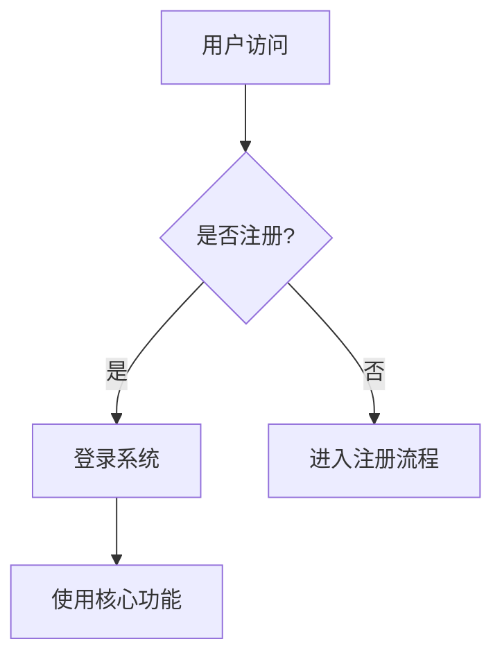

# 业务需求说明书 (BRD) - 结构模板 (AI驱动范式)

**版本：** 1.0
**编写目的:** 本文档模板旨在为“以大模型为核心的智能驱动开发体系”提供一份标准、高效的业务需求说明书（BRD）结构。它将作为整个项目生命周期的起点和最高纲领，其核心读者不仅是人类决策者，更是AI开发代理（AI Agent），旨在为其提供清晰、完整、无歧义的业务意图、目标与约束。

---

## 引言 (Preamble)

在新的AI驱动开发范式下，BRD不再仅仅是一份静态的参考文件，而是项目启动的 **“创世指令”**。它定义了项目的商业价值与核心逻辑，是连接商业目标与技术实现的最重要桥梁。一份高质量的BRD能够让AI开发体系精准理解业务全貌，从而自主、高效地生成后续的PRD、SDD乃至代码。

---

## 第一章：战略意图 (Strategic Intent)

*本章旨在回答“我们为什么要做这件事？”，为AI和所有团队成员提供项目的“北极星”。*

### 1.1 项目愿景 (Vision)
*（用一句话清晰、鼓舞人心地描述项目最终想要达成的理想状态。）*

### 1.2 核心业务问题/机遇 (Core Problem / Opportunity)
*（阐述我们正在解决的、最关键的客户痛点或市场机遇。需包含现状、痛点分析和期望的改变。）*

### 1.3 目标市场与用户画像 (Target Market & Personas)
*（定义产品的目标市场、细分领域以及典型的用户画像。画像应尽可能生动，包含用户的动机、行为和目标，以便AI能够更好地理解用户情境。）*

### 1.4 核心价值主张 (Core Value Proposition)
*（明确指出我们的产品/服务为目标用户提供的独特价值。即“用户为什么选择我们，而不是选择其他方案？”）*

---

## 第二章：业务目标与衡量标准 (Business Objectives & Metrics)

*本章旨在将战略意图量化，为AI提供清晰、可验证的成功信号。*

### 2.1 目标与关键结果 (Objectives and Key Results - OKRs)
*（以OKR形式定义项目的成功标准。Objective应是定性的、鼓舞人心的目标；Key Results必须是定量的、可衡量成果的指标。）*

*   **目标 (Objective) 1:** [例如：提升新用户的激活效率]
    *   **关键结果 (KR) 1.1:** [例如：将新用户首次完成核心操作的比例从20%提升至40%]
    *   **关键结果 (KR) 1.2:** [例如：将用户引导流程的完成时间平均减少3分钟]
*   **目标 (Objective) 2:** ...

### 2.2 成功场景 (Success Scenarios)
*（用故事化的方式，描述几个典型的用户成功使用产品的场景。这为AI提供了定性的、基于用户体验的成功范例。）*
*   **场景一：** [作为一名`[用户画像]`，我想要`[完成某件事]`，通过`[使用我们的产品]`，我能够`[达成的理想结果]`。]

### 2.3 护栏指标/反向指标 (Guardrail / Counter Metrics)
*（定义在追求核心目标时，必须保持稳定或不能恶化的指标，以防止AI产生“副作用”。）*
*   [例如：在提升推荐点击率的同时，用户的人均会话时长不能下降超过5%。]
*   [例如：自动化流程的引入，不能导致用户求助工单量上升。]

---

## 第三章：范围与边界 (Scope & Boundaries)

*本章旨在明确“做什么”和“不做什么”，为AI的工作范围划定清晰的界线。*

### 3.1 核心能力范围 (In-Scope Capabilities)
*（高层次地列出本次迭代必须实现的核心用户能力，应侧重于用户的能力，而非具体功能点。）*
*   能力1：用户应能够...
*   能力2：系统必须提供...

### 3.2 明确排除项 (Out-of-Scope)
*（清晰地列出本次迭代确定不做的事情，以避免范围蔓延和AI的误解。）*
*   本次不包含...
*   ...功能将在未来版本考虑。

### 3.3 关键假设与依赖 (Assumptions & Dependencies)
*（列出支撑本项目成立的关键假设，以及项目成功所依赖的内外部条件。）*
*   **假设:** [例如：我们假设用户具备基础的智能手机使用能力。]
*   **依赖:** [例如：本项目的支付功能强依赖于第三方支付网关的API。]

---

## 第四章：核心业务模型 (Core Business Model)

*本章旨在阐明业务的运转逻辑，为AI提供业务领域的“世界观”。*

### 4.1 业务流程图 (Business Process Flow)
*（使用Mermaid图等形式，可视化地展示核心业务流程、用户旅程或价值流转过程。）*

### 4.2 关键业务实体 (Key Business Entities)
*（定义本业务领域的核心“名词”，即关键的数据实体及其关系。）*
*   **用户 (User):** 系统的使用者。
*   **订单 (Order):** 用户购买服务的记录。
*   **产品 (Product):** 我们提供的服务或商品。

### 4.3 核心业务规则 (Core Business Rules)
*（列出业务中不可违反的、原子性的核心逻辑和约束条件。）*
*   规则1：[例如：一个手机号只能注册一个账号。]
*   规则2：[例如：VIP会员每月可享受3次免运费服务。]

---

## 第五章：运营与合规约束 (Operational & Compliance Constraints)

*本章为AI设定了必须遵守的“红线”和环境限制。*

### 5.1 技术与集成约束 (Technical & Integration Constraints)
*（任何已知的技术栈限制、必须使用的云服务、或必须集成的第三方系统。）*

### 5.2 数据隐私与安全要求 (Data Privacy & Security)
*（明确数据处理规范，如哪些是个人身份信息（PII），必须如何脱敏、存储和传输。）*

### 5.3 法律与合规要求 (Legal & Compliance)
*（项目必须遵守的法律法规或行业标准，如GDPR、等保2.0等。）*

### 5.4 道德伦理护栏 (Ethical Guardrails)
*（为AI的行为设定明确的道德和伦理边界，防止产生偏见、歧视或有害内容。）*
*   **必须：** [例如：在推荐内容时，必须确保多样性和公平性。]
*   **禁止：** [例如：禁止生成任何形式的歧视性或攻击性言论。]
*   **决策边界：** [例如：当用户评分低于3星时，必须由人工客服介入，AI不能自动关闭工单。]

---

## 第六章：利益相关者 (Stakeholders)

*本章定义了项目中的关键角色和职责，确保沟通路径的清晰。*

### 6.1 RACI 矩阵

| 活动/决策点 | 产品负责人 | 业务发起人 | 技术负责人 | 法务 |
| :--- | :---: | :---: | :---: | :---: |
| **BRD审批** | A | R | C | I |
| **项目范围变更**| A | R | C | I |
| **上线决策** | A | R | R | C |

*（R: Responsible-负责, A: Accountable-审批, C: Consulted-咨询, I: Informed-知会）* 