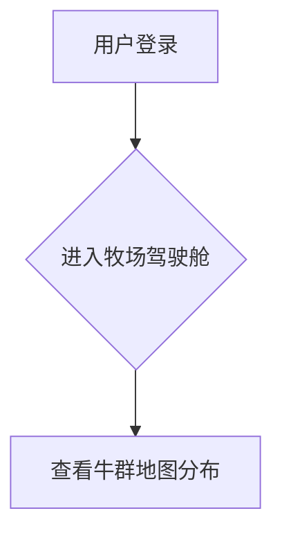

# [模块名称] - 模块级产品需求文档 (PRD)

| 元信息 | 内容 |
| :--- | :--- |
| **版本** | V1.0 |
| **状态** | 草稿 / 评审中 / 已批准 |
| **创建日期** | YYYY-MM-DD |
| **最后更新**| YYYY-MM-DD |
| **产品经理**| [你的名字] |
| **关联系统PRD**| `[链接到系统级PRD]` |

---

## 1. 模块概述与目标 (The Why)

### 1.1 问题陈述
*此部分聚焦于本模块要解决的具体问题。*

在 [**系统名称**] 的整体框架下，我们观察到 [**目标用户/角色**] 在使用 [**相关功能/场景**] 时遇到了 [**什么样的问题或痛点**]。这个问题导致了 [**具体的负面影响**]。

*   **举例:** 在<u>智能畜牧管理系统</u>的日常运营中，我们观察到<u>牧场管理员</u>在<u>每日盘点牛群</u>时，<u>依赖纸笔记录和人工核对，难以快速发现走失或生病的牛只</u>。

### 1.2 模块目标
为解决上述问题，我们计划构建 **[模块名称]** 模块。该模块旨在达成以下核心目标：
*   **用户目标:** (例如：让牧场管理员能在15分钟内完成牛群的健康状态和位置盘点。)
*   **业务目标:** (例如：将因病牛发现不及时导致的损失降低30%。)

### 1.3 上下文与依赖关系 (The Context & Dependencies)
*本模块是 [系统名称] 的一部分，严格遵循其定义的全局规则。*
*   **上游依赖:** 本模块的正常运行，依赖于以下模块提供的数据或服务：
    *   `身份认证中心`: 用于验证当前操作用户的身份和权限。
    *   `设备管理模块`: 用于获取设备的基础信息和实时状态。
*   **下游影响:** 本模块的输出，将被以下模块或服务所消费：
    *   `数据可视化模块`: 将调用本模块的API来展示AI分析结果。
    *   `通知服务`: 本模块将调用平台级通知服务来发送预警。
*   **数据契约:** 本模块将读取 `ah_device` 表，并将结果写入 `ah_alarm_record` 表。

### 1.4 范围界定 (Scope)
*   **范围之内 (In Scope):**
    *   功能点1: (例如：提供一个基于地图的牛群实时位置监控仪表盘)
*   **范围之外 (Out of Scope):**
    *   功能点1: (例如：暂不支持用户自定义告警规则)

## 2. 功能需求 (The What)

### 2.1 核心功能 (Epics & User Stories)
*   **User Story 1.1:** 作为一个 **[角色]**，我想要 **[执行某个操作]**，以便于 **[达成某个目的]**。
    *   **验收标准 (Acceptance Criteria):**
        1.  (场景) GIVEN: ... (前置条件)
        2.  (操作) WHEN: ... (用户执行的操作)
        3.  (结果) THEN: ... (系统应该给出的期望结果)

### 2.2 模块级非功能性需求
*本模块除遵循系统级NFR外，还有以下特殊要求：*
*   **性能:** `AI分析`核心算法的执行时间必须在30秒内完成。此要求高于系统通用API标准。
*   **安全性:** 本模块处理的所有原始生理数据，均被视为最高级别的敏感数据，访问日志需单独存储且不可篡改。

## 3. 设计与交互 (The User Experience)

### 3.1 用户流程图 (User Flow)

### 3.2 界面设计 (Wireframes & Mockups)
*   **低保真线框图:** [链接到Figma线框图]
*   **高保真视觉稿:** [链接到Figma视觉稿]

## 4. 成功指标与数据分析 (Measuring Success)

### 4.1 成功指标 (Key Metrics / KPIs)
| 目标分类 | 核心指标 | 指标定义与计算方式 | 成功标准 |
| :--- | :--- | :--- | :--- |
| **用户活跃度**| 模块日活跃用户数 (DAU) | 每日访问该模块的去重用户数 | 上线后一个月达到 XXX |
| **核心功能使用率**| 告警处理率 | (已处理的告警数 / 总告警数) * 100% | > 80% |

### 4.2 数据埋点 (Data Tracking)
为追踪上述指标，本模块需要在以下关键位置进行数据埋点：
*   **事件名称:** `view_dashboard_page`
*   **事件名称:** `click_animal_icon`

## 5. 发布计划 (Release Plan)

### 5.1 里程碑 (Milestones)
*   **[日期]**: PRD 最终评审完成。
*   **[日期]**: 功能提测。
*   **[日期]**: 正式上线发布。

## 6. 未来规划与开放问题 (Future & Open Questions)

*   **未来迭代方向:** V1.1: 增加用户自定义告警规则的功能。
*   **待讨论问题:** 当地图上的牛只数量超过500时，聚合显示方案具体如何设计？ 