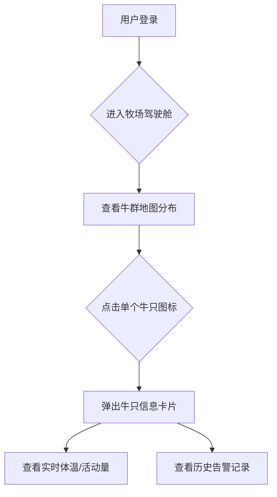

# [模块名称] - 产品需求文档 (PRD)

| 元信息 | 内容 |
| :--- | :--- |
| **版本** | V1.0 |
| **状态** | 草稿 / 评审中 / 已批准 |
| **创建日期** | YYYY-MM-DD |
| **最后更新**| YYYY-MM-DD |
| **产品经理**| [你的名字] |
| **核心干系人**| [产品负责人], [设计负责人], [技术负责人], [测试负责人] |

---

## 1. 背景与目标 (The Why)

*此部分是整个文档的基石，它向团队阐明了我们为什么要做这个功能模块，以及期望达成的商业/用户价值。*

### 1.1 问题陈述 (Problem Statement)

我们观察到 [**目标用户/角色**] 在 [**某种场景**] 下遇到了 [**什么样的问题或痛点**]。这个问题导致了 [**对用户或业务造成的不良影响**]，例如效率低下、成本增加、用户流失等。

*   **举例:** 我们观察到<u>牧场管理员</u>在<u>每日盘点牛群</u>时，<u>依赖纸笔记录和人工核对，难以快速发现走失或生病的牛只</u>。这种方式导致<u>信息滞后，平均需要2小时才能完成盘点，且无法及时发现需要隔离的病牛，增加了疫病传播的风险</u>。

### 1.2 目标与价值 (Goals & Value)

为了解决上述问题，我们计划构建 **[模块名称]** 模块。该模块旨在达成以下核心目标：

*   **用户目标:** (从用户的角度出发，他们能获得什么好处)
    *   **目标1:** 例如：让牧场管理员能在15分钟内完成牛群的健康状态和位置盘点。
    *   **目标2:** 例如：使用户能够提前24小时收到潜在的牛只发情或疾病预警。
*   **业务目标:** (从公司的角度出发，我们能获得什么好处)
    *   **目标1:** 例如：将因病牛发现不及时导致的损失降低30%。
    *   **目标2:** 例如：为我们的平台建立“智能预警”的核心竞争优势，作为新的付费增值点。

### 1.3 范围界定 (Scope)

为确保资源聚焦，本次迭代的范围明确如下：

*   **范围之内 (In Scope):**
    *   功能点1: (例如：提供一个基于地图的牛群实时位置监控仪表盘)
    *   功能点2: (例如：支持根据体温和活动量数据，自动触发高温和不活跃告警)
    *   ...
*   **范围之外 (Out of Scope):**
    *   功能点1: (例如：暂不支持用户自定义告警规则)
    *   功能点2: (例如：暂不提供移动App端的告警推送，仅支持Web端)
    *   ...

## 2. 功能需求 (The What)

*此部分详细描述模块需要具备的功能，通常以用户故事的形式呈现，确保每个需求都围绕用户价值。*

### 2.1 核心功能 (Epics & User Stories)

#### Epic 1: [史诗故事，一个较大的功能集合，如：牲畜健康监控]

*   **User Story 1.1:** 作为一个 **[角色]**，我想要 **[执行某个操作]**，以便于 **[达成某个目的]**。
    *   **验收标准 (Acceptance Criteria):**
        1.  (场景) GIVEN: ... (前置条件)
        2.  (操作) WHEN: ... (用户执行的操作)
        3.  (结果) THEN: ... (系统应该给出的期望结果)
    *   **举例: 作为一个<u>牧场主</u>，我想要<u>在地图上直观地看到所有牛的实时位置</u>，以便于<u>快速掌握牛群的分布情况</u>。**
        *   **验收标准:**
            1.  GIVEN 我登录了系统并打开“牧场驾驶舱”页面
            2.  WHEN 页面加载完成
            3.  THEN 地图会自动缩放到能完整显示我所有牛群的级别
            4.  AND 每头牛在地图上都以一个图标表示
            5.  AND 图标的位置会根据设备上报的最新GPS数据实时更新（误差不超过10秒）

*   **User Story 1.2:** ...

#### Epic 2: [史诗故事，如：AI疾病预警]

*   **User Story 2.1:** ...
*   **User Story 2.2:** ...

### 2.2 非功能性需求 (Non-Functional Requirements)

*   **性能 (Performance):**
    *   地图仪表盘页面首次加载时间必须在3秒以内。
    *   在1000头牛同时在线的情况下，地图拖拽、缩放操作的延迟应低于200毫秒。
*   **安全性 (Security):**
    *   只有“管理员”和“牧场主”角色的用户才能访问此模块。
    *   所有与位置相关的API传输必须使用HTTPS加密。
*   **可靠性 (Reliability):**
    *   系统后端服务可用性需达到99.9%。
    *   数据处理管道必须确保不丢失任何从设备上报的数据。
*   **易用性 & 可访问性 (Usability & Accessibility):**
    *   界面设计应符合[项目设计规范]。
    *   关键操作应有明确的提示和反馈。
    *   (可选) 页面需满足WCAG 2.1 AA标准，支持屏幕阅读器和键盘导航。

## 3. 设计与交互 (The User Experience)

*此部分提供可视化的设计方案，帮助团队直观理解产品形态。*

### 3.1 用户流程图 (User Flow)

*使用 Mermaid 或其他工具绘制核心功能的用户流程图，展示用户完成任务的完整路径。*

### 3.2 界面设计 (Wireframes & Mockups)

*此处嵌入或链接到相关的设计稿（如 Figma, Sketch, Axure）。*

*   **低保真线框图 (Wireframes):** [链接到线框图或嵌入图片]
    *   *用于评审信息架构和核心布局。*
*   **高保真视觉稿 (Mockups):** [链接到视觉稿或嵌入图片]
    *   *用于确认最终的视觉风格、颜色、字体等。*

## 4. 成功指标与数据分析 (Measuring Success)

*此部分定义我们如何衡量该模块是否成功，并指导数据埋点方案。*

### 4.1 成功指标 (Key Metrics / KPIs)

| 目标分类 | 核心指标 | 指标定义与计算方式 | 成功标准 |
| :--- | :--- | :--- | :--- |
| **用户活跃度**| 模块日活跃用户数 (DAU) | 每日访问该模块的去重用户数 | 上线后一个月达到 XXX |
| **核心功能使用率**| 告警处理率 | (已处理的告警数 / 总告警数) * 100% | > 80% |
| **业务价值**| 平均故障发现时间 | 从告警产生到用户标记为“已处理”的平均时长 | 从 X 小时降低到 Y 分钟 |
| **用户满意度**| 用户净推荐值 (NPS) | 通过模块内的问卷收集用户反馈 | > 20 |

### 4.2 数据埋点 (Data Tracking)

为了追踪上述指标，我们需要在以下关键位置进行数据埋点：

*   **事件名称:** `view_dashboard_page`
    *   **触发时机:** 用户成功进入“牧场驾驶舱”页面。
    *   **上报属性:** `user_id`, `farm_id`
*   **事件名称:** `click_animal_icon`
    *   **触发时机:** 用户在地图上点击了牛只图标。
    *   **上报属性:** `user_id`, `animal_id`
*   **事件名称:** `process_alarm`
    *   **触发时机:** 用户在告警中心对一条告警进行了处理操作。
    *   **上报属性:** `user_id`, `alarm_id`, `process_type (resolved/ignored)`

## 5. 发布计划 (Release Plan)

### 5.1 依赖项 (Dependencies)

*   **技术依赖:**
    *   需要等待 `jeecg-iot-gateway` 模块完成数据接入与分发功能。
*   **团队依赖:**
    *   需要 `市场团队` 配合准备上线后的推广文案。

### 5.2 里程碑 (Milestones)

*   **[日期]**: PRD 最终评审完成。
*   **[日期]**: UI/UX 设计稿最终评审完成。
*   **[日期]**: 功能进入开发阶段。
*   **[日期]**: 功能提测。
*   **[日期]**: 正式上线发布。

## 6. 未来规划与开放问题 (Future & Open Questions)

*   **未来迭代方向 (Future Work):**
    *   V1.1: 增加用户自定义告警规则的功能。
    *   V1.2: 开发移动端App，并支持告警的实时推送。
*   **待讨论问题 (Open Questions):**
    *   问题1：当地图上的牛只数量超过500时，聚合显示方案具体如何设计？（待与设计/前端确认）
    *   问题2：告警的优先级如何定义？（待与领域专家确认） 