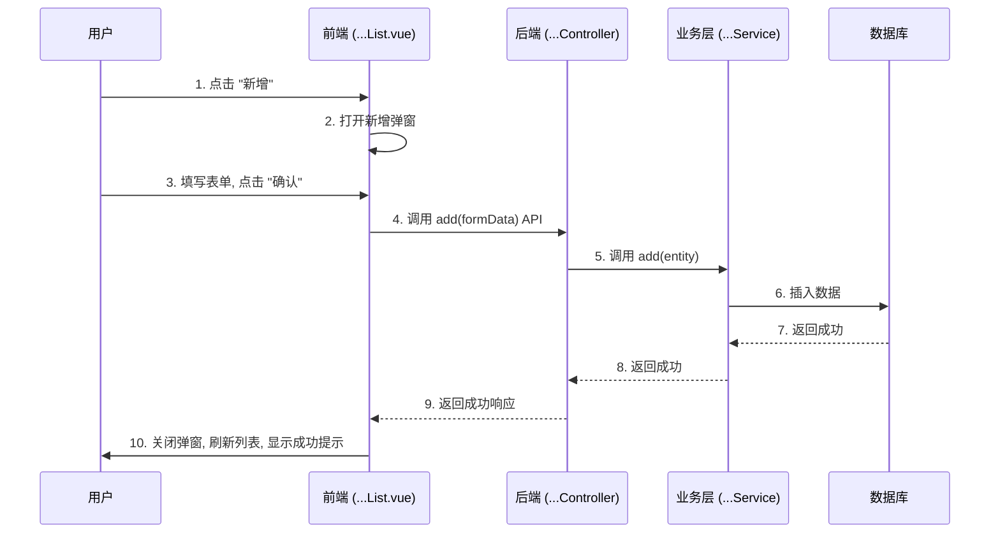

# [功能点名称] - 系统设计文档 (V1.0)

**版本：** 1.0  
**日期：** YYYY-MM-DD  
**核心模块:** `jeecg-boot-module-[模块名称]`  
**前端视图:** `views/[模块名称]/[功能路径]/[组件名称].vue`

**文档说明:** 本文档旨在为 **[功能点中文名称] ([Function English Name])** 提供完整的技术设计方案。它是对 [上级设计文档名称，如“XXX系统设计文档”] 的深化和细化，并与 [关联的原型或流程图文件名] 中定义的操作流程保持一致。

---

## 1. 功能概述与定位

*此部分旨在让产品、开发、测试等所有相关人员快速理解该功能的核心目标和范围。*

### 1.1 功能定位

简要描述该功能在整个系统中的角色和核心价值。明确说明它是用来解决什么问题的，以及它与其他功能的关系和边界。

*   **解决的问题:** (例如：解决设备资产信息不统一、状态不明确的问题。)
*   **核心价值:** (例如：实现设备全生命周期的精细化管理。)
*   **功能边界:** (明确说明“做什么”和“不做什么”。例如：本功能侧重于设备资产管理，不包含实时数据监控。)

### 1.2 核心功能点

使用无序列表，清晰地列出本功能包含的主要操作或特性。

*   **功能点一:** (例如：支持从第三方平台同步设备信息。)
*   **功能点二:** (例如：支持设备与业务对象（如牲畜、车辆）的绑定与解绑。)
*   **功能点三:** (例如：支持手动管理设备的全生命周期状态。)
*   **功能点四:** (例如：提供设备信息的增、删、改、查基础操作。)

## 2. 系统架构与数据流

*此部分用于从宏观上展示功能点所涉及的技术组件以及它们之间的交互关系。*

使用 Mermaid `graph` 图，清晰地描绘出从前端用户操作到后端处理，再到数据库（或其他外部服务）交互的完整数据流。

```mermaid
graph TD
    subgraph "前端展现层 (Vue3)"
        A[页面组件<br>...List.vue]
    end

    subgraph "核心业务中台 (JeecgBoot)"
        B(Controller层<br>...Controller.java)
        C(Service层<br>...ServiceImpl.java)
        D(外部服务接口<br>如 IThingsBoardService)
        E[数据库<br>(相关的核心表)]
    end
    
    subgraph "第三方平台 (可选)"
        F[外部服务<br>如 ThingsBoard]
    end

    A -- "1. 用户发起请求" --> B;
    B -- "2. 调用业务逻辑" --> C;
    C -- "3a. (可选)调用外部服务" --> D;
    D -- "3b. (可选)请求外部平台" --> F;
    F -- "3c. (可选)返回数据" --> D;
    C -- "4. 操作数据库" --> E;
    E -- "5. 返回结果" --> C;
    C -- "6. 返回结果" --> B;
    B -- "7. 返回JSON数据" --> A;
```

## 3. 数据库设计

*此部分定义功能所需的数据模型，是后端实现的基础。*

列出本功能涉及的所有核心数据库表。对于每张表，提供`CREATE TABLE`的SQL语句，并对关键字段进行注释说明。

### 3.1 `table_name_1` (表注释)

```sql
-- DDL语句
CREATE TABLE `table_name_1` (
  `id` varchar(36) NOT NULL,
  -- ... 其他字段
  PRIMARY KEY (`id`)
) ENGINE=InnoDB DEFAULT CHARSET=utf8mb4 COMMENT='表注释';
```
**关键字段说明：**
*   `field_1`: 字段说明，特别是枚举值、状态字段等。
*   `field_2`: 字段说明。

### 3.2 `table_name_2` (表注释)

```sql
-- DDL语句
CREATE TABLE `table_name_2` (
  `id` varchar(36) NOT NULL,
  -- ... 其他字段
  PRIMARY KEY (`id`)
) ENGINE=InnoDB DEFAULT CHARSET=utf8mb4 COMMENT='表注释';
```
**关键字段说明：**
*   ...

## 4. 后端接口设计

*此部分定义前后端交互的契约。*

### 4.1 `...Controller.java`

*   **路径**: `/[模块名]/[功能路径]`
*   **基类**: (例如: `JeecgController<Entity, IService>`)
*   **核心API**:

使用表格清晰地列出所有对外暴露的API接口。

| 方法 (Method) | HTTP | 路径 (Path) | 功能描述 |
| :--- | :--- | :--- | :--- |
| `queryPageList` | GET | `/list` | 标准分页查询，说明支持的筛选条件。 |
| `add` | POST | `/add` | 新增数据。 |
| `edit` | PUT | `/edit` | 编辑数据。 |
| `delete` | DELETE | `/delete` | 删除单条数据。 |
| `deleteBatch` | DELETE | `/deleteBatch` | 批量删除数据。 |
| `customApi` | POST | `/customApi` | **[自定义核心业务]** 如绑定、解绑、同步等。 |

### 4.2 业务逻辑 (`...ServiceImpl.java`)

使用文字和步骤列表，详细描述核心业务方法的内部处理逻辑。

*   **`customApi(参数...)`**:
    1.  **输入校验:** 检查输入参数的合法性。
    2.  **前置条件判断:** 检查业务状态是否满足执行条件（例如，设备是否处于“闲置”状态）。
    3.  **核心处理:** 描述核心的业务操作步骤，如调用了哪些其他服务，更新了哪些数据表。
    4.  **(可选)与外部服务交互:** 如果需要，描述如何调用外部API，并处理其返回结果。
    5.  **状态更新:** 更新相关数据实体的状态。
    6.  **事务管理:** 明确说明此操作需要在一个事务中完成。
    7.  **日志记录:** 记录关键操作日志。
    8.  **返回结果:** 定义成功的返回或失败的异常。

## 5. 前端设计

*此部分描述用户界面的构成和交互细节。*

*   **视图路径**: `jeecgboot-vue3/src/views/[模块]/[功能路径]/`
*   **文件结构**:
    *   `[组件名]List.vue`: 页面主组件。
    *   `[功能名].api.ts`: API请求函数封装。
    *   `[功能名].data.ts`: 表格列、搜索表单等配置。
    *   `components/[组件名]Modal.vue`: (推荐)将弹窗封装为独立组件。

### 5.1 页面与交互

*   **列表页 (`...List.vue`)**:
    *   **表格列:** 列出需要展示的关键字段，并说明需要特殊格式化处理的列（如状态、关联对象）。
    *   **搜索条件:** 列出支持的搜索字段。
    *   **操作按钮:** 描述表格操作列的按钮，并说明按钮的动态显隐逻辑（例如，根据行记录的状态）。

*   **弹窗交互 (`...Modal.vue` / `device_modals_prototype.html`)**:
    *   **新增/编辑弹窗:** 描述弹窗中的表单项及其校验规则。
    *   **自定义业务弹窗 (如绑定):** 描述弹窗的交互流程，例如如何选择关联对象、如何提交等。
    *   **确认对话框:** 对于删除等高危操作，需有二次确认。

## 6. 核心业务流程图

*此部分使用时序图，直观地展示一个或多个核心业务流程中，各个组件的调用顺序和数据传递。*

### 6.1 [核心流程一，如“新增入库”]



## 7. 数据字典详述

*此部分用于定义模块中用到的、需要在系统中维护的枚举值或状态，确保全局统一。*

使用表格列出本模块需要用到的数据字典。

| 字典Code | 字典项文本 | 字典项Value | 备注 |
| :--- | :--- | :--- | :--- |
| `dict_code_1`| 文本A | `VALUE_A` | 字典项说明。 |
| `dict_code_1`| 文本B | `VALUE_B` | 字典项说明。 |
| `dict_code_2`| 状态X | `STATUS_X` | 状态说明。 |
| `dict_code_2`| 状态Y | `STATUS_Y` | 状态说明。 |

## 8. 非功能性需求

*此部分描述除功能需求外的质量属性要求。*

*   **安全性 (Security):**
    *   **权限控制:** 列出所有API接口所需的Shiro权限标识（如 `[功能]:add`, `[功能]:edit`）。
    *   **高危操作防护:** 对删除等操作提出二次确认、详细日志记录等要求。

*   **性能 (Performance):**
    *   **查询响应时间:** 关键查询接口（如列表页）在特定数据量下的响应时间要求。
    *   **数据库索引:** 列出需要添加索引的关键字段以提升查询性能。
    *   **外部调用:** 对外部API的调用需设置合理的超时时间。

*   **易用性 (Usability):**
    *   **错误提示:** 要求所有用户操作失败时，都应返回清晰、可理解的错误信息。
    *   **交互流程:** 强调核心操作流程应顺畅，符合用户习惯。

*   **可靠性 (Reliability):**
    *   **事务一致性:** 明确指出哪些业务操作必须保证事务的原子性。
    *   **日志记录:** 要求所有CUD（创建/更新/删除）操作及与外部系统的交互都必须被详细记录。

## 9. 实施建议 (分阶段)

*此部分为项目经理和开发负责人提供一个推荐的开发落地计划。*

建议将开发过程分为几个阶段，循序渐进。

*   **第一阶段：后端基础与核心逻辑**
    1.  数据库设计与实现。
    2.  使用代码生成器生成基础代码。
    3.  核心业务Service层开发。
    4.  编写单元测试。

*   **第二阶段：前端页面与交互实现**
    1.  搭建列表、表单等基础页面结构。
    2.  开发弹窗组件和核心交互逻辑。
    3.  完成前后端API联调。

*   **第三阶段：联调测试与优化**
    1.  进行端到端的功能测试。
    2.  根据测试结果进行性能优化和体验优化。
    3.  日志审查和代码审查。

--- 