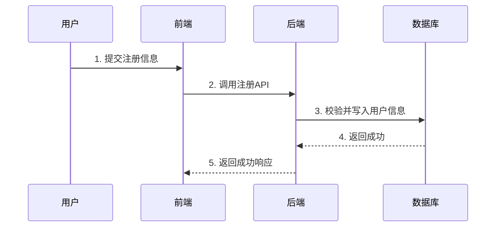

# [模块/系统名称] - 系统设计文档 (SDD)

**版本：** 1.0
**日期：** YYYY-MM-DD

---

## 1. 系统概述

*此部分宏观介绍系统的定位、目标和核心价值。*

本系统旨在构建一个[系统描述，如：基于JeecgBoot平台的XXX管理应用]。系统将整合[技术栈关键词，如：物联网(IoT)、大数据、AI]技术，实现[核心业务目标，如：对XXX的实时监控、分析、预警和可视化管理]。本文档将详细阐述系统的技术架构、数据库设计、模块设计和数据流，以指导后续的开发工作。

## 2. 技术架构

*此部分通过图表和文字，清晰地展示系统的组成部分及其相互关系。*

系统采用[架构风格，如：前后端分离的微服务架构]，以[核心框架，如：JeecgBoot]为核心业务中台，整合[其他关键组件，如：第三方服务、中间件]。

```mermaid
graph TD
    subgraph 基础设施层 (IaaS)
        A[云服务器 / 容器平台]
    end

    subgraph 数据/外部服务层
        B1[数据源1] --> C{数据接入网关};
        B2[外部服务API] --> C;
    end

    subgraph 核心中台层 (PaaS)
        subgraph 核心数据库
            E[关系型数据库<br>如 MySQL]
            F[非关系型数据库<br>如 Redis, MongoDB, 时序数据库]
        end
        C --> G[module-a<br>A模块];
        G --> E & F;
        H[module-b<br>B模块] -- "读写" --> E;
    end
    
    subgraph 展现与交互层 (SaaS)
        I[Web管理后台<br>jeecgboot-vue3] --> G & H;
        J[移动App/小程序] --> G & H;
    end
```

*   **数据/外部服务层:**
    *   **数据源:** 描述主要的数据来源，如设备、用户输入、第三方系统。
    *   **数据存储分离策略 (可选):** 解释为什么使用多种数据库以及它们各自的职责。例如：MySQL存储核心业务数据，Redis用作缓存，时序数据库存储监控指标。

*   **核心中台层 (基于 JeecgBoot):**
    *   `module-a`: 模块A的核心职责。
    *   `module-b`: 模块B的核心职责。
    *   ...

*   **展现与交互层:**
    *   `jeecgboot-vue3`: 前端项目的主要功能划分。
    *   `移动App`: App端的主要功能划分。

## 3. 数据库设计 (MySQL)

*此部分是系统的基石，定义了核心的数据结构。*

数据库设计遵循[设计规范，如：JeecgBoot默认规范]，表名前缀统一为 `[prefix]_`。

### 3.1 核心实体表

*此部分定义代表业务核心名词的表，如用户、商品、订单。*

*   **`[prefix]_entity_1` ([实体1]表):**
    ```sql
    CREATE TABLE `[prefix]_entity_1` (
      `id` varchar(36) NOT NULL COMMENT '主键ID',
      -- ... 字段定义
      `create_by` varchar(50) DEFAULT NULL,
      `create_time` datetime(3) DEFAULT NULL,
      `update_by` varchar(50) DEFAULT NULL,
      `update_time` datetime(3) DEFAULT NULL,
      PRIMARY KEY (`id`)
    ) ENGINE=InnoDB DEFAULT CHARSET=utf8mb4 COMMENT='[实体1]表';
    ```

*   **`[prefix]_entity_2` ([实体2]表):**
    ```sql
    -- ... create table statement
    ```

### 3.2 关联与记录表

*此部分定义用于记录实体间关系或操作历史的表。*

*   **`[prefix]_link_1` ([关系1]表):**
    ```sql
    CREATE TABLE `[prefix]_link_1` (
      `id` varchar(36) NOT NULL COMMENT '主键ID',
      `entity1_id` varchar(36) NOT NULL COMMENT '实体1的ID',
      `entity2_id` varchar(36) NOT NULL COMMENT '实体2的ID',
      -- ... 其他字段
      PRIMARY KEY (`id`)
    ) ENGINE=InnoDB DEFAULT CHARSET=utf8mb4 COMMENT='[关系1]表';
    ```

*   **`[prefix]_log_1` ([日志/记录1]表):**
    ```sql
    -- ... create table statement
    ```

### 3.3 数据字典建议

*此部分建议了需要在系统中预设的字典项，以确保状态和类型的一致性。*

| 字典Code        | 字典项文本     | 字典项Value       | 备注                               |
|-----------------|----------------|-------------------|------------------------------------|
| `dict_code_1`   | 选项A          | `OPTION_A`        | 字典说明                           |
| `dict_code_1`   | 选项B          | `OPTION_B`        |                                    |
| `status_code`   | 状态1          | `STATUS_1`        | 状态说明，可关联前端展示           |
| `status_code`   | 状态2          | `STATUS_2`        |                                    |

## 4. 模块设计

*此部分将技术架构中的模块进行细化，描述其内部结构。*

### 4.1 后端模块

#### 4.1.1 `module-a` ([模块A名称])

*   **Entity:** 列出该模块定义的核心JPA/MyBatis Plus实体。
    *   `Entity1`
    *   `Entity2`
*   **Controller:** 列出该模块对外暴露的API控制器。
    *   `Entity1Controller`: 功能描述。
    *   `DashboardController`: 功能描述。
*   **Service/ServiceImpl:** 描述核心业务逻辑的实现。
    *   `Entity1Service`: 业务逻辑描述。
    *   `DashboardService`: 业务逻辑描述。

#### 4.1.2 `module-b` ([模块B名称] - 可选，如为新建模块)

*   ... (同上)

### 4.2 前端设计 (基于 jeecgboot-vue3)

*   **视图 (View):** 列出核心的前端页面。
    *   `views/[module]/dashboard/index.vue`: **[页面名称]**，功能描述。
    *   `views/[module]/management/List.vue`: **[页面名称]**，功能描述。
*   **组件 (Component):** 列出可复用的关键组件。
    *   `SharedComponent.vue`: 组件功能描述。
*   **API 调用:**
    *   在 `views/[module]/` 各模块下创建对应的 `*.api.ts` 文件，遵循项目规范。
*   **状态管理 (Pinia):**
    *   描述是否需要创建新的`store`，以及该`store`负责管理的数据。

## 5. 核心数据流设计

*此部分通过流程描述和时序图，展示关键业务场景下的数据流转过程。*

### 5.1 [核心流程一，如：用户注册与登录]

1.  **步骤1:** ...
2.  **步骤2:** ...



### 5.2 [核心流程二，如：核心业务操作]

*   ... (同上)

## 6. 外部系统集成策略 (可选)

*如果系统需要与外部第三方服务（如支付、短信、地图服务等）深度集成，在此处详细说明。*

*   **使用[外部服务名称]服务端API:**
    *   **场景:** 描述在什么业务场景下需要调用。
    *   **核心API:** 列出需要调用的关键API及其作用。
    *   **认证方式:** 说明如何进行认证（如API Key, OAuth2）。
    *   **价值:** 描述集成的价值和目的。

## 7. 开发实施建议

*此部分为项目落地提供一个分阶段的、可执行的路径。*

1.  **数据库先行:** 根据本文档完成数据库表和基础数据的创建。
2.  **代码生成:** 使用代码生成器生成核心实体的后端基础代码。
3.  **分步实施:**
    *   **第一步 (基础框架与核心功能):**
        *   完成后端模块A的CRUD和核心业务。
        *   完成前端对应的列表和表单页面的联调。
    *   **第二步 (扩展功能):**
        *   开发模块B或与外部系统集成。
        *   开发前端对应的复杂页面或可视化图表。
    *   **第三步 (智能化与优化):**
        *   开发AI、大数据分析等高级功能。
        *   进行性能测试与优化、完善日志和监控。 