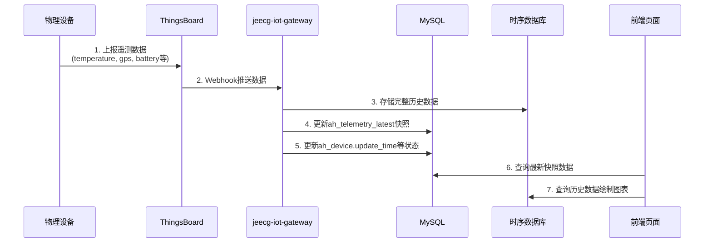

# 遥测数据查看 - API接口说明

## 📊 遥测数据在系统中的查看位置和接口

### 1. 牲畜档案详情页 - 查看牲畜相关的遥测数据

#### **接口1：获取牲畜详情（包含最新遥测快照）**
```http
GET /animal_husbandry/animal/queryById?id=ANIMAL-001
```

**响应示例：**
```json
{
  "code": 200,
  "message": "操作成功",
  "result": {
    "id": "ANIMAL-001",
    "earTagId": "EAR-001", 
    "name": "大壮",
    // 从绑定设备的 ah_telemetry_latest 中提取的最新值
    "latestTemperature": 38.6,    // 来自瘤胃胶囊
    "latestActivity": 8200,       // 来自瘤胃胶囊  
    "latestSteps": 15000,         // 来自追踪器
    "lastLocationLon": 119.758,   // 来自追踪器
    "lastLocationLat": 49.217,    // 来自追踪器
    
    // 绑定的设备列表
    "boundDevices": [
      {
        "id": "DEV-CAP-001",
        "name": "瘤胃胶囊C001",
        "deviceType": "CAPSULE",
        "batteryLevel": 95,
        "rssi": -88,
        "snr": 7.5,
        // 从 ah_telemetry_latest 解析的实时设备状态
        "sensorStatus": "Normal",
        "lastUpdateTime": "2024-08-23 14:05:10"
      },
      {
        "id": "DEV-TRK-001", 
        "name": "追踪器T001",
        "deviceType": "TRACKER",
        "batteryLevel": 100,
        "rssi": -95,
        "snr": 7.0,
        "sensorStatus": "Normal",
        "lastUpdateTime": "2024-08-23 14:03:25"
      }
    ]
  }
}
```

#### **接口2：获取牲畜历史遥测数据（用于绘制图表）**
```http
GET /animal_husbandry/animal/getTelemetryHistory
?animalId=ANIMAL-001
&telemetryKey=temperature
&startTime=2024-08-20T00:00:00
&endTime=2024-08-23T23:59:59
&interval=1h
```

**响应示例：**
```json
{
  "code": 200,
  "message": "操作成功", 
  "result": {
    "telemetryKey": "temperature",
    "unit": "℃",
    "dataPoints": [
      {"timestamp": "2024-08-20T08:00:00", "value": 38.2},
      {"timestamp": "2024-08-20T09:00:00", "value": 38.4},
      {"timestamp": "2024-08-20T10:00:00", "value": 38.6},
      // ... 更多数据点
    ]
  }
}
```

**支持的telemetryKey：**
- `temperature` - 体温（瘤胃胶囊）
- `activity` - 活动量（瘤胃胶囊）
- `ph` - pH值（瘤胃胶囊）
- `steps` - 步数（追踪器）
- `location` - 位置轨迹（追踪器，返回经纬度数组）

### 2. 设备监控仪表盘 - 查看设备运行状态数据

#### **接口3：获取设备历史遥测数据（用于设备诊断）**
```http
GET /animal_husbandry/deviceMonitor/getTelemetryHistory
?deviceId=DEV-CAP-001
&telemetryKey=battery
&startTime=2024-08-20T00:00:00
&endTime=2024-08-23T23:59:59
&interval=1h
```

**响应示例：**
```json
{
  "code": 200,
  "message": "操作成功",
  "result": {
    "telemetryKey": "battery",
    "unit": "%", 
    "dataPoints": [
      {"timestamp": "2024-08-20T08:00:00", "value": 98},
      {"timestamp": "2024-08-20T12:00:00", "value": 97},
      {"timestamp": "2024-08-20T16:00:00", "value": 96},
      {"timestamp": "2024-08-20T20:00:00", "value": 95}
    ]
  }
}
```

**支持的telemetryKey：**
- `battery` - 电量百分比
- `rssi` - 信号强度
- `snr` - 信噪比
- `temperature` - 设备内部温度（可选）

#### **接口4：获取问题设备列表**
```http
GET /animal_husbandry/deviceMonitor/problematicList?pageNo=1&pageSize=10
```

**响应示例：**
```json
{
  "code": 200,
  "message": "操作成功",
  "result": {
    "records": [
      {
        "id": "DEV-CAP-002",
        "name": "瘤胃胶囊C002", 
        "deviceType": "CAPSULE",
        "devEui": "EUI-CAP-002",
        "batteryLevel": 15,           // 低电量问题
        "updateTime": "2024-08-23 12:00:00",
        "boundAnimal": "EAR-003",     // 绑定的牲畜
        "problemType": "低电量",
        // 最新遥测数据摘要
        "latestTelemetry": {
          "temperature": 40.2,        // 瘤胃胶囊当前测量值
          "activity": 2100,
          "rssi": -88,
          "snr": 8.2
        }
      }
    ],
    "total": 5,
    "size": 10,
    "current": 1
  }
}
```

### 3. 牧场驾驶舱 - 查看地图位置数据

#### **接口5：获取地图数据（牲畜位置）**
```http
GET /animal_husbandry/dashboard/mapData
```

**响应示例：**
```json
{
  "code": 200,
  "message": "操作成功",
  "result": {
    "animals": [
      {
        "id": "ANIMAL-001",
        "earTagId": "EAR-001",
        "name": "大壮",
        "longitude": 119.758,        // 从追踪器获取
        "latitude": 49.217,          // 从追踪器获取  
        "healthStatus": "HEALTHY",
        "lastUpdateTime": "2024-08-23 14:03:25"
      }
    ]
  }
}
```

## 💾 数据流转和存储时机

### 遥测数据的实时更新流程：



### 数据更新频率：

- **瘤胃胶囊：** 每15分钟上报一次（体温、活动量、pH值）
- **追踪器：** 每5分钟上报一次（GPS位置、步数）
- **电量和信号：** 每次上报都包含

## 🖼️ 前端展示组件

### 牲畜详情页的图表组件：
```vue
<!-- AnimalDetailModal.vue -->
<template>
  <div class="telemetry-charts">
    <!-- 体温历史曲线 -->
    <TelemetryChart 
      :animalId="animalId"
      telemetryKey="temperature"
      title="体温历史趋势"
      unit="℃"
      :timeRange="7" />
      
    <!-- 活动量历史曲线 -->  
    <TelemetryChart
      :animalId="animalId" 
      telemetryKey="activity"
      title="活动量历史趋势"
      unit="次/小时"
      :timeRange="7" />
      
    <!-- GPS轨迹地图 -->
    <LocationTrackMap 
      :animalId="animalId"
      :timeRange="1" />
  </div>
</template>
```

### 设备监控页的图表组件：
```vue
<!-- DeviceTelemetryModal.vue -->
<template>
  <div class="device-charts">
    <!-- 电量衰减曲线 -->
    <TelemetryChart
      :deviceId="deviceId"
      telemetryKey="battery" 
      title="电量历史曲线"
      unit="%"
      :timeRange="30" />
      
    <!-- 信号强度波动图 -->
    <TelemetryChart
      :deviceId="deviceId"
      telemetryKey="rssi"
      title="信号强度历史"
      unit="dBm" 
      :timeRange="7" />
  </div>
</template>
```

这样，你就可以在不同的页面中查看到所有相关的遥测数据了！ 