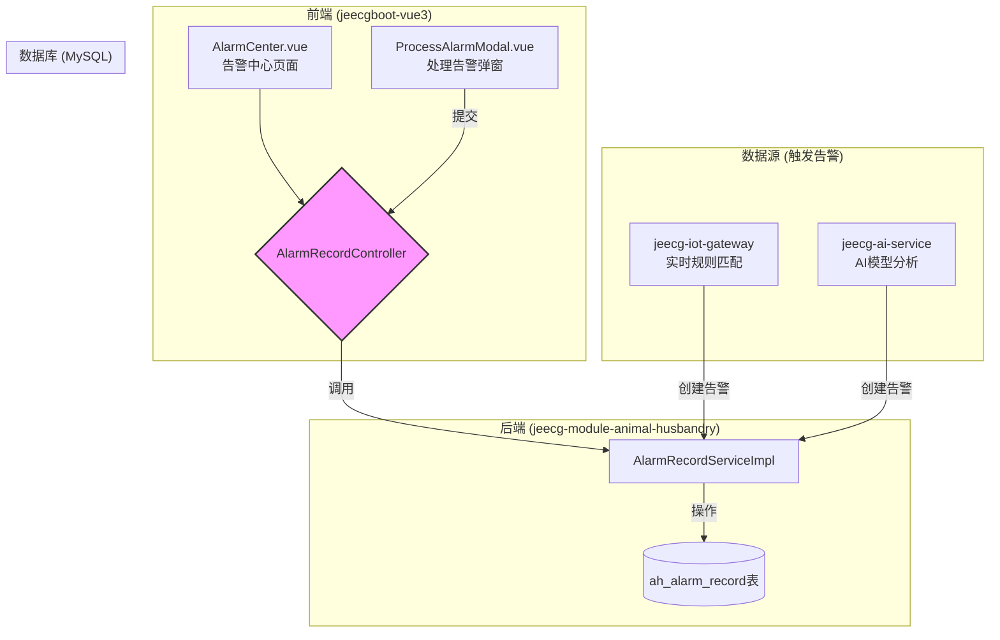
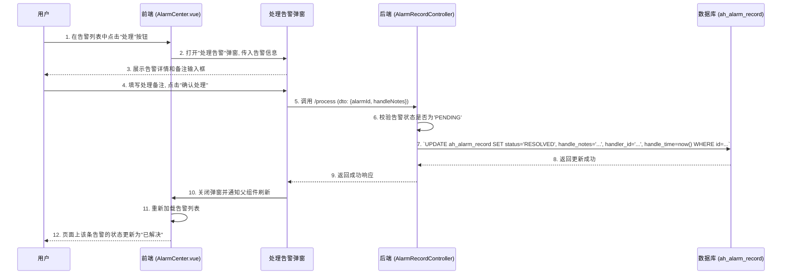

# AI预警中心 - 系统设计文档 (V1.0)

**版本：** 1.0  
**日期：** 2024-08-23  
**核心模块:** `jeecg-module-animal-husbandry`  
**前端视图:** `views/animal_husbandry/alarm/AlarmCenter.vue`

**文档说明:** 本文档是《智能畜牧管理系统_SDD.md》中关于 **AI预警中心 (AI Alarm Center)** 功能的深化设计。它旨在为告警的统一展示、处理和管理提供完整的技术实现方案，并与 `animal_husbandry_prototype.html` 中定义的原型保持一致。

---

## 1. 功能概述与定位

### 1.1 功能定位

**AI预警中心**是系统的“神经网络末梢”，是所有潜在风险和异常事件的汇集点和处置平台。其核心定位是：

*   **集中呈现:** 统一展示由物联网网关的实时规则引擎和AI分析服务产生的所有告警事件。
*   **闭环管理:** 提供对告警从“发生”到“处理/解决/忽略”的全生命周期管理能力，形成业务闭环。
*   **决策支持:** 通过告警数据，帮助管理人员快速识别问题、定位源头，并采取行动。

它与“牧场驾驶舱”中的实时告警流形成互补：驾驶舱提供即时概览，而预警中心提供深度管理和追溯。

### 1.2 核心功能点

*   **告警列表查询:** 分页展示所有告警记录，并支持多维度筛选（如按告警级别、处理状态、告警类型、时间范围等）。
*   **告警处理:** 为“待处理”的告警提供“处理”操作。处理时可以记录处理意见和备注，并将告警状态变更为“已解决”。
*   **告警忽略:** 为“待处理”的告警提供“忽略”操作，适用于确认为误报或无需处理的事件。
*   **告警详情查看:** 查看告警的完整信息，包括关联的牲畜、发生时间、详细内容以及处理历史。
*   **告警规则管理:** (关联功能) 提供对 `ah_alarm_rule` 表的可视化管理界面，允许用户配置和调整告警触发的规则和阈值。

## 2. 系统架构与数据流

本模块是标准的JeecgBoot业务模块，遵循前后端分离架构。


**数据流说明:**
1.  **告警生成:** `jeecg-iot-gateway` 或 `jeecg-ai-service` 在满足触发条件时，会调用 `AlarmRecordService` 的 `createAlarm` 方法，在 `ah_alarm_record` 表中插入一条新记录，初始状态为 `PENDING` (待处理)。
2.  **告警查询:** 前端 `AlarmCenter.vue` 页面通过 `AlarmRecordController` 的 `/list` 接口分页查询告警记录。
3.  **告警处理:** 用户在前端点击“处理”或“忽略”，前端调用后端的相应API，`AlarmRecordService` 负责更新 `ah_alarm_record` 表中对应记录的 `status`, `handler_id`, `handle_time`, `handle_notes` 等字段。

## 3. 数据库设计

本模块的核心是 `ah_alarm_record` 表，其设计已在主SDD中定义，此处为关键字段回顾：

```sql
CREATE TABLE `ah_alarm_record` (
  `id` varchar(36) NOT NULL,
  `animal_id` varchar(36) NOT NULL,
  `alarm_type` varchar(50) NOT NULL COMMENT '告警类型 (字典: alarm_type)',
  `alarm_level` varchar(20) NOT NULL DEFAULT 'WARN' COMMENT '告警级别 (字典: alarm_level)',
  `alarm_content` varchar(500) NOT NULL,
  `alarm_time` datetime(3) NOT NULL,
  `status` varchar(20) NOT NULL DEFAULT 'PENDING' COMMENT '处理状态 (字典: process_status, PENDING, RESOLVED, IGNORED)',
  `handler_id` varchar(36) DEFAULT NULL COMMENT '处理人ID',
  `handle_time` datetime(3) DEFAULT NULL COMMENT '处理时间',
  `handle_notes` text COMMENT '处理备注',
  `create_time` datetime(3) DEFAULT NULL,
  PRIMARY KEY (`id`),
  KEY `idx_animal_id_time` (`animal_id`, `alarm_time`)
) COMMENT='告警记录表';
```
**核心字段 `status`**: 该字段是本模块管理的核心，其状态流转由业务操作驱动。

## 4. 后端接口设计

### 4.1 `AlarmRecordController.java`

*   **路径**: `/animal_husbandry/alarm`
*   **基类**: `JeecgController<AlarmRecord, IAlarmRecordService>`
*   **核心API**:

| 方法 | HTTP | 路径 | 功能描述 |
| :--- | :--- | :--- | :--- |
| `queryPageList` | GET | `/list` | 标准分页查询，支持按状态、级别、类型、时间等筛选。 |
| `queryById` | GET | `/queryById` | 获取单条告警的完整信息。 |
| `processAlarm` | POST | `/process` | **[核心]** 处理一条告警。 |
| `ignoreAlarm` | POST | `/ignore` | **[核心]** 忽略一条告警。 |

### 4.2 核心DTO定义

*   **`AlarmProcessDto.java`**: 用于处理和忽略告警时的数据传输。
    ```java
    @Data
    public class AlarmProcessDto {
        @NotNull
        private String alarmId; // 目标告警记录ID
        
        private String handleNotes; // 处理或忽略时填写的备注
    }
    ```

### 4.3 业务逻辑 (`IAlarmRecordService.java`)

*   **`processAlarm(AlarmProcessDto dto)`**:
    1.  开启事务。
    2.  根据 `dto.getAlarmId()` 查询 `AlarmRecord` 实体。
    3.  校验告警是否存在且状态为 `PENDING`。若不是，则返回错误。
    4.  设置告警状态: `record.setStatus("RESOLVED")`。
    5.  填充处理信息: `record.setHandlerId(ShiroUtils.getUserId())`, `record.setHandleTime(new Date())`, `record.setHandleNotes(dto.getHandleNotes())`。
    6.  更新实体到数据库。
    7.  提交事务。

*   **`ignoreAlarm(AlarmProcessDto dto)`**:
    1.  逻辑与 `processAlarm` 类似，但状态设置为 `record.setStatus("IGNORED")`。

## 5. 前端设计

*   **视图路径**: `jeecgboot-vue3/src/views/animal_husbandry/alarm/`
*   **文件结构**:
    *   `AlarmCenter.vue`: 页面主组件，使用 `BasicTable`。
    *   `alarm.api.ts`: 定义与后端 `AlarmRecordController` 交互的API。
    *   `alarm.data.ts`: 定义表格列和搜索表单。
    *   `components/ProcessAlarmModal.vue`: 封装“处理告警”的表单弹窗。

### 5.1 页面与交互

*   **列表页 (`AlarmCenter.vue`)**:
    *   **表格列**: 参照原型，包含告警对象(牲畜耳标)、告警类型、告警级别、告警内容、发生时间、处理状态、操作。
    *   **`处理状态`列**: 需格式化，使用不同颜色的标签（如：待处理-红色，已解决-绿色，已忽略-灰色）。
    *   **操作列**: 根据告警的`status`字段动态显示按钮：
        *   当 `status` 为 `PENDING` 时，显示 **“处理”** 和 **“忽略”** 按钮。
        *   当 `status` 为 `RESOLVED` 或 `IGNORED` 时，只显示 **“详情”** 按钮。

*   **弹窗交互 (`animal_husbandry_prototype.html` 的实现)**:
    *   **处理告警**:
        1.  点击“处理”按钮，打开“处理告警”弹窗 (`ProcessAlarmModal`)。
        2.  弹窗内显示告警的关键信息（只读），并提供一个文本域（`textarea`）供用户输入处理备注。
        3.  用户填写备注后点击“确认处理”，前端调用 `/process` API，并将 `alarmId` 和 `handleNotes` 作为参数提交。
    *   **忽略告警**:
        1.  点击“忽略”按钮，弹出一个确认对话框 (`useModal` 的 `createConfirm` 方法)。
        2.  对话框提示“您确定要忽略此条告警吗？”。
        3.  用户确认后，前端调用 `/ignore` API，提交 `alarmId`。

## 6. 核心业务流程图

### 6.1 处理一条告警的流程



## 7. 非功能性需求

*   **性能:** 告警记录表 (`ah_alarm_record`) 可能会增长得非常快。`alarm_time` 和 `status` 字段必须建立索引，以保证列表页的查询性能。
*   **可靠性:** 告警处理和忽略是关键业务操作，后端必须使用事务确保数据更新的一致性。
*   **实时性:** 为提升用户体验，可以考虑在告警中心页面集成WebSocket。当有新告警产生时，后端可以主动推送消息，前端收到后可以播放提示音并自动刷新列表或显示一个“有N条新告警”的提示条。

--- 