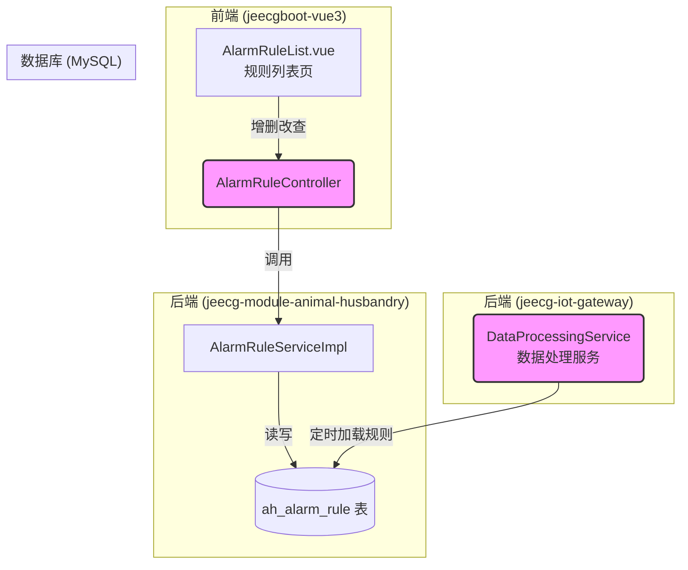

# 告警规则配置 - 系统设计文档 (V1.0)

**版本：** 1.0  
**日期：** 2024-08-23  
**核心模块:** `jeecg-module-animal-husbandry`  
**前端视图:** `views/animal_husbandry/rule/AlarmRuleList.vue`

---

## 1. 功能概述与定位

### 1.1 系统定位

**告警规则配置**是整个智能畜牧预警系统的“大脑”。它允许管理员和高级用户根据业务需求，灵活定义触发告警的条件。此功能模块将遥测数据（如体温、活动量）与业务逻辑（如何时告警）解耦，使得系统能够适应不同设备、不同健康状况下的多样化监控需求，是实现从“固定告警”到“智能预警”转变的核心。

### 1.2 核心功能点

*   **规则创建与编辑:** 提供图形化界面，用于创建和修改告警规则。
*   **动态条件配置:** 支持选择不同设备类型、不同的遥测监控项，并设置比较操作符和阈值。
*   **时间窗支持:** 支持配置告警触发必须持续的时间（如：体温持续高于39.5度超过10分钟）。
*   **规则启停:** 支持一键启用或禁用某条规则，方便进行规则的测试和管理。
*   **规则查询与删除:** 提供规则的列表查询和删除功能。

## 2. 系统架构与数据流

本模块作为`jeecg-module-animal-husbandry`的一部分，其核心是`ah_alarm_rule`表的管理，并为物联网网关模块提供规则依据。


**数据流说明:**
1.  **配置流:** 用户通过前端`AlarmRuleList.vue`页面对告警规则进行增删改查，请求通过`AlarmRuleController`写入`ah_alarm_rule`表。
2.  **应用流:** `jeecg-iot-gateway`模块中的`DataProcessingService`会定时（或在启动时）从`ah_alarm_rule`表中加载所有**已启用**的规则到内存中。当新的遥测数据到达时，该服务会遍历规则，与数据进行匹配，若满足条件，则创建一条`ah_alarm_record`告警记录。

## 3. 数据库设计

本模块的核心数据表已在《智能畜牧管理系统_SDD.md》中定义，此处再次引用以明确。

*   **`ah_alarm_rule` (告警规则配置表):**
    ```sql
    CREATE TABLE `ah_alarm_rule` (
      `id` varchar(36) NOT NULL COMMENT '主键ID',
      `name` varchar(100) NOT NULL COMMENT '规则名称 (如: 高温告警)',
      `alarm_type` varchar(50) NOT NULL COMMENT '关联的告警类型 (字典: alarm_type)',
      `device_type` varchar(20) NOT NULL COMMENT '适用的设备类型 (字典: device_type)',
      `telemetry_key` varchar(50) NOT NULL COMMENT '监控的遥测数据字段名',
      `operator` varchar(10) NOT NULL COMMENT '比较操作符 (>, <, =)',
      `threshold_value` varchar(50) NOT NULL COMMENT '阈值',
      `duration_seconds` int(11) DEFAULT '0' COMMENT '持续时间(秒, 0表示瞬时触发)',
      `is_enabled` tinyint(1) NOT NULL DEFAULT '1' COMMENT '是否启用 (1-是, 0-否)',
      `create_by` varchar(50) DEFAULT NULL,
      `create_time` datetime(3) DEFAULT NULL,
      `update_by` varchar(50) DEFAULT NULL,
      `update_time` datetime(3) DEFAULT NULL,
      PRIMARY KEY (`id`)
    ) ENGINE=InnoDB DEFAULT CHARSET=utf8mb4 COMMENT='告警规则配置表';
    ```

## 4. 后端接口设计

遵循`JeecgBoot项目核心要素分析文档.md`的最佳实践，采用"继承+复写"的Controller模式。

### 4.1 `AlarmRuleController.java`

*   **路径**: `/animal_husbandry/alarmRule`
*   **基类**: `JeecgController<AlarmRule, IAlarmRuleService>`

```java
@Api(tags="告警规则配置")
@RestController
@RequestMapping("/animal_husbandry/alarmRule")
@Slf4j
public class AlarmRuleController extends JeecgController<AlarmRule, IAlarmRuleService> {

    @ApiOperation(value="告警规则-分页列表查询", notes="告警规则-分页列表查询")
    @GetMapping(value = "/list")
    public Result<IPage<AlarmRule>> queryPageList(AlarmRule alarmRule,
                                                  @RequestParam(name="pageNo", defaultValue="1") Integer pageNo,
                                                  @RequestParam(name="pageSize", defaultValue="10") Integer pageSize,
                                                  HttpServletRequest req) {
        return super.queryPageList(alarmRule, pageNo, pageSize, req);
    }

    @ApiOperation(value="告警规则-添加", notes="告警规则-添加")
    @PostMapping(value = "/add")
    public Result<AlarmRule> add(@RequestBody AlarmRule alarmRule) {
        return super.add(alarmRule);
    }

    @ApiOperation(value="告警规则-编辑", notes="告警规则-编辑")
    @RequestMapping(value = "/edit", method = {RequestMethod.PUT, RequestMethod.POST})
    public Result<AlarmRule> edit(@RequestBody AlarmRule alarmRule) {
        // 在Service层处理is_enabled字段的转换
        return super.edit(alarmRule);
    }
    
    @ApiOperation(value="获取指定设备类型的遥测监控项列表", notes="用于前端新增/编辑规则时，动态加载监控项下拉框")
    @GetMapping(value = "/queryTelemetryKeys")
    public Result<List<DictModel>> queryTelemetryKeys(@RequestParam(name="deviceType", required = true) String deviceType) {
        // 此处为设计增强，建议实现一个service方法，根据设备类型返回可用的遥测字段
        // 例如，如果 deviceType == 'CAPSULE', 返回 [ {text:'体温', value:'Temperature'}, {text:'活动量', value:'Gastric_momentum'} ]
        // 这些映射关系可以硬编码，也可以存放在一个新的字典或配置表中
        List<DictModel> keys = service.getTelemetryKeysByDeviceType(deviceType);
        return Result.OK(keys);
    }
}
```

## 5. 前端设计

*   **页面路径**: `jeecgboot-vue3/src/views/animal_husbandry/rule/`
*   **文件结构**:
    *   `AlarmRuleList.vue`: 页面主组件。
    *   `rule.api.ts`: 定义与后端 `AlarmRuleController` 交互的API函数。
    *   `rule.data.ts`: 定义表格列(columns)和搜索表单配置。
    *   `components/AlarmRuleModal.vue`: 封装“新增/编辑”规则的表单弹窗。

### 5.1 列表页 (`AlarmRuleList.vue`)

*   **表格列**: 规则名称, 适用设备类型, 监控项, 触发条件, 持续时间, 关联告警类型, 状态, 创建时间, 操作。
*   **操作按钮**:
    *   **新增规则**: 点击弹出 `AlarmRuleModal.vue`。
    *   **编辑**: 点击弹出 `AlarmRuleModal.vue`，并回填数据。
    *   **启用/禁用**: 调用 `edit` 接口，仅修改 `is_enabled` 状态。
    *   **删除**: 调用 `delete` 接口。

### 5.2 新增/编辑弹窗 (`AlarmRuleModal.vue`)

该弹窗是本模块交互的核心，其表单设计应清晰、智能。

*   **表单字段**:
    *   `规则名称` (`name`): 必填，Input。
    *   `适用设备类型` (`device_type`): 必填，Select 组件，数据源为字典 `device_type`。
    *   `监控项` (`telemetry_key`): 必填，Select 组件。**此下拉框的选项应根据“适用设备类型”的所选项，通过调用后端的 `/queryTelemetryKeys` 接口动态加载**。
    *   `触发条件`:
        *   `操作符` (`operator`): Select 组件，选项为 `>`(大于), `<`(小于), `=`(等于)。
        *   `阈值` (`threshold_value`): InputNumber 组件。
    *   `持续时间(秒)` (`duration_seconds`): 非必填，InputNumber，默认为0，表示瞬时触发。
    *   `关联告警类型` (`alarm_type`): 必填，Select 组件，数据源为字典 `alarm_type`。用于指定规则触发后，生成的告警记录属于哪种类型。
    *   `是否启用` (`is_enabled`): Switch 组件，默认为是。

## 6. 数据字典与遥测项配置

### 6.1 数据字典 (`alarm_type`)

`alarm_type` 字典（在 `ah_alarm_record` 表中使用）是规则与告警记录的关联纽带。建议在JeecgBoot后台预置好，例如：

| 字典Code | 字典项文本 | 字典项Value |
| :--- | :--- | :--- |
| `alarm_type` | 高温告警 | `a_temp_high` |
| `alarm_type` | 低温告警 | `a_temp_low` |
| `alarm_type` | 活动量过低 | `a_inactive` |
| `alarm_type` | 疑似发情 | `a_possible_estrus`|
| `alarm_type` | 越界告警 | `g_cross_border` |

### 6.2 遥测监控项 (`telemetry_key`)

为了实现前端“监控项”下拉框的动态加载，建议在 `IAlarmRuleService` 中实现 `getTelemetryKeysByDeviceType` 方法。其映射关系来源于《瘤胃胶囊动物追踪器接口.md》。

**映射关系示例:**

*   **当 `deviceType` = `CAPSULE` (瘤胃胶囊) 时，返回:**
    *   `{ text: "体温", value: "Temperature" }`
    *   `{ text: "活动量", value: "Gastric_momentum" }`
    *   `{ text: "信号强度", value: "rssi" }`

*   **当 `deviceType` = `TRACKER` (动物追踪器) 时，返回:**
    *   `{ text: "电量", value: "battery" }`
    *   `{ text: "步数", value: "step" }`
    *   `{ text: "经度", value: "longitude" }`
    *   `{ text: "纬度", value: "latitude" }`

通过此设计，当前端选择“瘤胃胶囊”时，监控项下拉框就只会显示“体温”、“活动量”等相关选项，极大地提升了用户体验和配置的准确性。

--- 