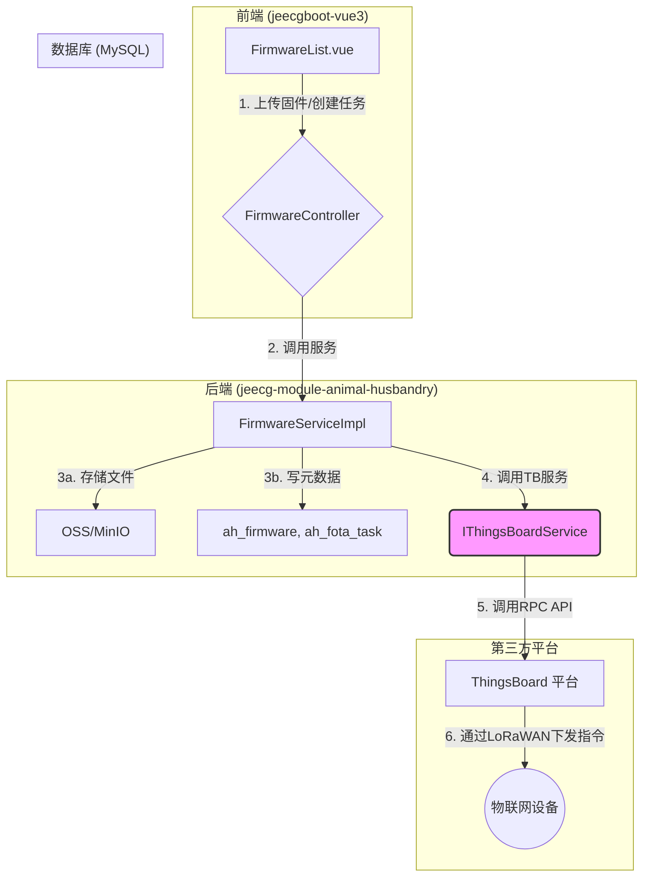
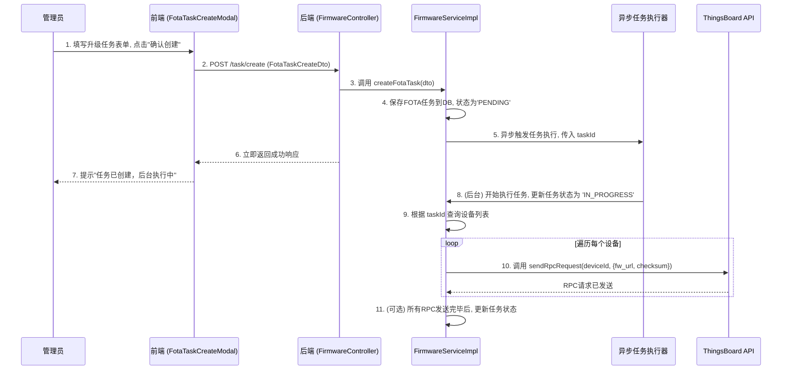

# 固件管理与升级 (FOTA) - 系统设计文档 (V1.0)

**版本：** 1.0
**日期：** 2024-08-23
**核心模块:** `jeecg-module-animal-husbandry`
**前端视图:** `views/animal_husbandry/fota/FirmwareList.vue`
**关联文档:** `智能畜牧管理系统_SDD.md`

---

## 1. 功能概述与定位

### 1.1 功能定位

**固件管理与升级 (Firmware-Over-the-Air, FOTA)** 模块是保障物联网设备生态系统健康、安全和持续进化的核心功能。它为平台提供了对现场设备进行远程软件维护和功能增强的能力。本模块的定位是：

*   **固件版本库:** 作为一个中央存储库，安全地管理适用于不同设备类型（瘤胃胶囊、追踪器）的所有固件版本。
*   **升级任务调度器:** 提供一个灵活的任务创建和管理界面，允许管理员向单个设备、特定畜群或所有设备批量推送升级指令。
*   **设备生命周期保障:** 通过远程修复缺陷和更新功能，延长设备的使用寿命，降低现场维护成本。

### 1.2 核心功能点

*   **固件上传:** 支持管理员上传新的固件文件，并记录版本号、适用设备类型、更新日志等关键信息。
*   **固件版本管理:** 以列表形式展示所有固件版本，支持查看详情和删除。
*   **FOTA升级任务创建:** 创建升级任务，可灵活选择目标固件版本和升级的设备范围（全部设备、按设备ID、按畜群）。
*   **FOTA任务监控:** (规划中) 查看升级任务的执行状态，包括已成功、待升级、失败的设备列表。

## 2. 系统架构与数据流

FOTA功能的核心在于 **本平台作为业务指令的发起方，ThingsBoard作为设备指令的下发通道**。本平台不直接与设备进行LoRaWAN通信，而是通过调用ThingsBoard的API来间接触达设备。


**数据流说明:**

1.  **固件上传:** 管理员在前端上传固件文件。后端 `FirmwareController` 接收文件，`FirmwareService` 将文件存储到对象存储（如MinIO）中，并将固件的元信息（版本、URL、大小等）写入 `ah_firmware` 表。
2.  **创建升级任务:** 管理员在前端选择目标固件和升级范围，创建一个FOTA任务。`FirmwareService` 将任务信息存入 `ah_fota_task` 表。
3.  **指令下发:**
    *   `FirmwareService` 解析任务，获取需要升级的设备列表及其对应的 `tb_device_id`。
    *   遍历设备列表，调用封装好的 `IThingsBoardService.sendRpcRequest()` 方法。
    *   `IThingsBoardService` 负责向ThingsBoard的RPC API发送一个标准化的指令，指令内容通常包含固件的下载地址（`file_url`）、校验和（`checksum`）等。
4.  **设备端执行:** ThingsBoard平台负责将RPC请求转换为具体的下行链路协议（如LoRaWAN Downlink），发送给目标设备。设备接收到指令后，自行从指定的URL下载固件并执行升级流程。
5.  **状态反馈 (高级):** (V2.0规划) 设备升级成功或失败后，会上报一个特定的遥测消息。ThingsBoard接收到此消息后，可通过规则引擎Webhook通知本平台，本平台据此更新 `ah_fota_task` 的执行状态。

## 3. 数据库设计

本模块的核心表已在主SDD中定义，此处为回顾。

*   **`ah_firmware` (固件版本管理表):**
    ```sql
    CREATE TABLE `ah_firmware` (
      `id` varchar(36) NOT NULL,
      `device_type` varchar(20) NOT NULL COMMENT '适用的设备类型',
      `version` varchar(50) NOT NULL COMMENT '固件版本号',
      `file_url` varchar(255) NOT NULL COMMENT '固件文件存储地址',
      `file_size` bigint(20) DEFAULT NULL,
      `checksum` varchar(100) DEFAULT NULL COMMENT '文件校验和 (MD5/SHA256)',
      `description` text COMMENT '版本更新说明',
      `upload_time` datetime(3) NOT NULL,
      `create_by` varchar(50) DEFAULT NULL,
      PRIMARY KEY (`id`)
    ) COMMENT='固件版本管理表';
    ```

*   **`ah_fota_task` (固件升级任务表):**
    ```sql
    CREATE TABLE `ah_fota_task` (
      `id` varchar(36) NOT NULL,
      `firmware_id` varchar(36) NOT NULL COMMENT '目标固件ID',
      `task_name` varchar(100) DEFAULT NULL,
      `target_selection_type` varchar(20) NOT NULL COMMENT '升级目标类型 (ALL, BY_DEVICE, BY_HERD)',
      `target_ids_json` json DEFAULT NULL COMMENT '升级目标的ID列表 (JSON数组)',
      `status` varchar(20) NOT NULL DEFAULT 'PENDING' COMMENT '任务状态 (PENDING, IN_PROGRESS, COMPLETED, FAILED, CANCELED)',
      `scheduled_time` datetime(3) DEFAULT NULL,
      `completion_time` datetime(3) DEFAULT NULL,
      `create_by` varchar(50) DEFAULT NULL,
      `create_time` datetime(3) DEFAULT NULL,
      PRIMARY KEY (`id`)
    ) COMMENT='固件升级任务表';
    ```

## 4. 后端接口设计

### 4.1 `FirmwareController.java`

*   **路径**: `/animal_husbandry/fota`
*   **设计模式**: 自定义Controller，专注于FOTA业务。

| 方法 | HTTP | 路径 | 功能描述 |
| :--- | :--- | :--- | :--- |
| `listFirmwares` | GET | `/firmware/list` | 分页查询已上传的固件列表。 |
| `uploadFirmware`| POST | `/firmware/upload` | 上传新的固件文件。 |
| `deleteFirmware`| DELETE| `/firmware/delete` | 删除一个固件版本。 |
| `createFotaTask`| POST | `/task/create` | 创建一个新的FOTA升级任务。 |
| `listFotaTasks` | GET | `/task/list` | 分页查询FOTA任务列表。 |

### 4.2 核心DTO定义

*   **`FirmwareUploadDto.java`**:
    ```java
    @Data
    public class FirmwareUploadDto {
        private MultipartFile file; // 上传的固件文件
        private String deviceType;
        private String version;
        private String description;
    }
    ```

*   **`FotaTaskCreateDto.java`**:
    ```java
    @Data
    public class FotaTaskCreateDto {
        @NotNull
        private String firmwareId;
        private String taskName;
        @NotNull
        private String targetSelectionType; // "ALL", "BY_DEVICE", "BY_HERD"
        private List<String> targetIds; // 设备ID列表或畜群ID列表
    }
    ```

### 4.3 业务逻辑 (`IFirmwareService.java`)

*   **`uploadFirmware(FirmwareUploadDto dto)`**:
    1.  调用公共文件上传服务，将 `dto.getFile()` 存入对象存储，获取 `file_url`, `file_size`, `checksum`。
    2.  将这些信息连同 `dto` 中的其他元数据，组装成 `Firmware` 实体并存入 `ah_firmware` 表。

*   **`createFotaTask(FotaTaskCreateDto dto)`**:
    1.  将 DTO 转换为 `FotaTask` 实体并存入数据库，状态为 `PENDING`。
    2.  **异步执行任务**: 启动一个异步线程 (`@Async`) 或将任务ID推送到消息队列中，由后台任务消费者处理，以避免阻塞API。
    3.  **任务执行逻辑**:
        a. 根据 `targetSelectionType` 和 `targetIds` 查询出所有需要升级的 `Device` 实体列表。
        b. 从 `ah_firmware` 表中查出固件的 `file_url` 和 `checksum`。
        c. 遍历设备列表，对每个设备调用 `IThingsBoardService.sendRpcRequest(device.getTbDeviceId(), rpcPayload)`。`rpcPayload` 是一个包含 `file_url` 等信息的JSON对象，格式需与设备端固件程序约定。
        d. 更新 `ah_fota_task` 状态为 `IN_PROGRESS`。

## 5. 前端设计

*   **视图路径**: `jeecgboot-vue3/src/views/animal_husbandry/fota/`
*   **文件结构**:
    *   `FirmwareList.vue`: 主页面，使用Tabs切换“固件版本管理”和“升级任务历史”。
    *   `fota.api.ts`: API定义。
    *   `components/FirmwareUploadModal.vue`: 封装上传固件的弹窗。
    *   `components/FotaTaskCreateModal.vue`: 封装创建升级任务的弹窗。

### 5.1 页面与交互

*   **固件版本管理 Tab**:
    *   显示 `ah_firmware` 的列表，与原型一致。
    *   **“上传新固件”按钮**: 点击打开 `FirmwareUploadModal`。该弹窗包含文件选择框和版本信息输入框。
    *   **“创建升级任务”按钮**: 点击打开 `FotaTaskCreateModal`，并自动填充当前固件。
    *   **“删除”按钮**: 危险操作，需二次确认。

*   **升级任务历史 Tab**:
    *   显示 `ah_fota_task` 的列表。
    *   表格列包括：任务名称、目标固件版本、目标范围、任务状态、创建时间、完成时间。
    *   提供查看任务详情的功能，可以进一步展示任务中包含的设备列表及其各自的升级状态（V2.0规划）。

*   **创建升级任务弹窗 (`FotaTaskCreateModal`)**:
    1.  弹窗分为三步或在一个表单内完成。
    2.  **第一步**: 确认目标固件版本（通常从列表页带入，只读）。
    3.  **第二步**: 选择升级范围：
        *   单选框：所有设备 / 按畜群 / 按设备。
        *   如果选择“按畜群”或“按设备”，则显示一个支持搜索和多选的下拉框（`ApiSelect` 组件）来选择目标。
    4.  **第三步**: 填写任务名称（可选），点击“确认创建”。前端调用 `/task/create` API。

## 6. 核心业务流程图

### 6.1 创建并执行FOTA任务流程

