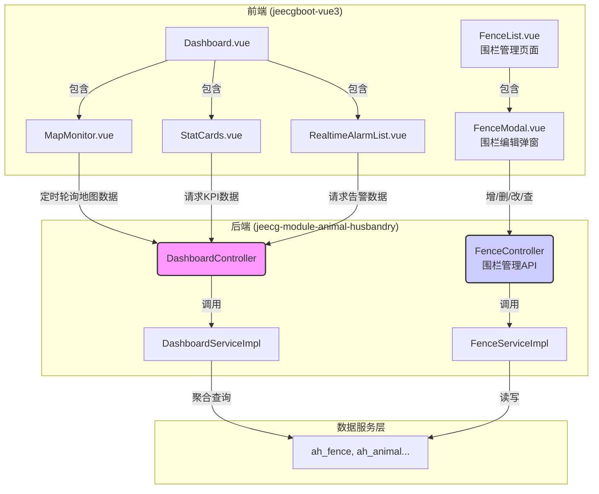
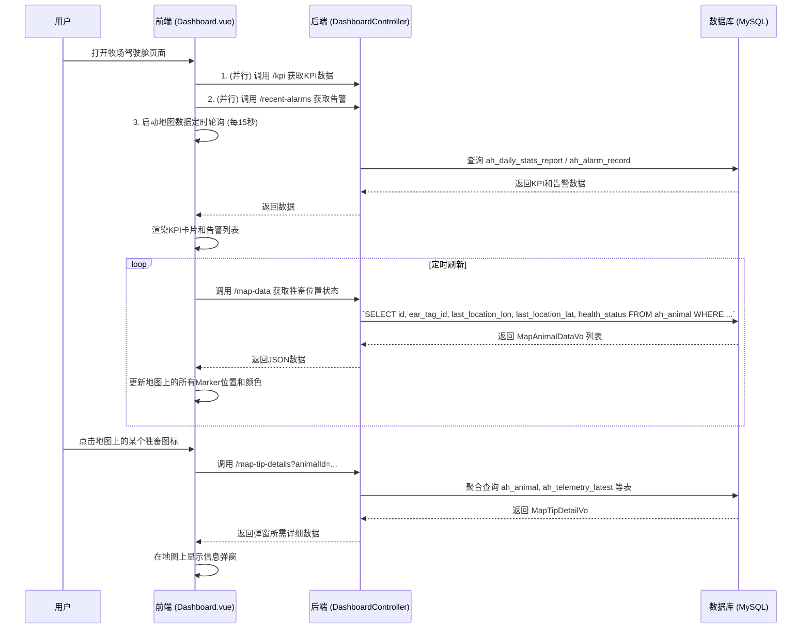
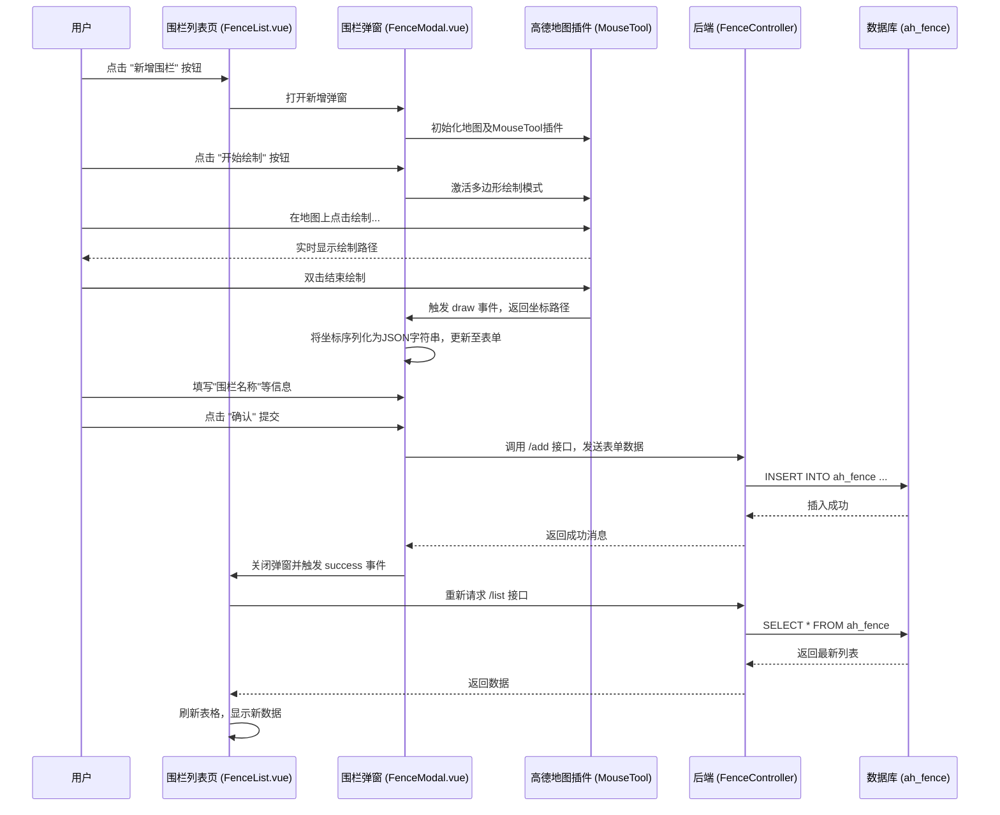

# 牧场驾驶舱 - 系统设计文档 (V1.0)

**版本：** 1.0  
**日期：** 2024-08-23  
**核心模块:** `jeecg-module-animal-husbandry`  
**前端视图:** `views/animal_husbandry/dashboard/index.vue`

**文档说明:** 本文档是《智能畜牧管理系统_SDD.md》中关于 **牧场驾驶舱 (Ranch Dashboard)** 功能的深化和细化设计。它旨在为这个以GIS地图为核心的可视化监控中心提供完整的技术实现方案，并与 `animal_husbandry_prototype.html` 中定义的原型保持一致。

---

## 1. 功能概述与定位

### 1.1 功能定位

**牧场驾驶舱**是整个智能畜牧管理平台的 **指挥与控制中心 (Command & Control Center)**。其核心定位是为牧场管理者提供一个全局的、实时的、可视化的运营态势感知界面。它不处理具体的资产入库或档案编辑工作，而是专注于回答以下关键问题：

*   **全局态势:** 我的牧场整体运营是否健康？牲畜和设备的总量及实时状态如何？
*   **空间分布:** 此刻我的牛群在哪里？它们的分布是否正常？
*   **实时健康:** 每一头牛的健康状况如何？（通过地图上图标的颜色直观体现）
*   **风险预警:** 当前有哪些紧急告警需要我立即关注？

### 1.2 核心功能点

*   **宏观数据统计 (KPIs):** 在页面顶部展示核心运营指标，如牲畜总数、设备在线率、健康状态分布（健康/亚健康/告警）、今日新增告警数等。
*   **GIS地图监控:**
    *   在地图上实时渲染所有在线牲畜的位置点。
    *   牲畜的图标根据其 `health_status` (健康/亚健康/告警) 呈现不同颜色，一目了然。
    *   支持地图缩放、平移、聚合点等基本操作。
    *   点击单个牲畜图标，弹出信息摘要卡片（`AnimalInfoCard`），显示耳标号、健康状态、最新体温等关键信息。
*   **实时告警流:** 在页面一侧展示最新的N条告警记录，并能点击快速定位到地图上的告警牲畜。
*   **快速搜索与定位:** 提供按耳标号搜索功能，快速在地图上定位并高亮显示特定牲畜。
*   **电子围栏展示:** 在地图上叠加显示预设的电子围栏区域。

## 1.3. 电子围栏功能扩展 (V1.1)

*   **围栏管理**: 提供独立的管理界面，允许用户通过在地图上交互式绘制来创建、编辑、查看和删除多边形电子围栏。
*   **越界告警 (当前实现)**: 驾驶舱前端通过**定时轮询**一个专门的后端API (`/out-of-bounds-alarms`)，来**实时查询**当前有哪些牲畜的位置处于所有已启用围栏之外。
    *   **注意**: 此功能目前为**纯展示性质**，用于在驾驶舱右侧面板实时呈现越界牲畜列表。它**不会**在 `ah_alarm_record` 表中创建持久化的“越界告警”记录，这与健康告警机制不同。真正的事件驱动、持久化越界告警是后续的优化方向。

## 2. 系统架构与数据流

驾驶舱是一个典型的数据聚合与可视化应用，其前端高度依赖后端专门提供的聚合API，以实现高效的数据加载和渲染。


**核心数据流:** 驾驶舱页面的数据获取遵循“按需、分流”的原则。
1.  **KPI数据**: 页面加载时，通过 `DashboardController` 的API一次性获取。
2.  **地图牲畜数据与告警数据**: `Dashboard.vue` 组件加载后，会启动一个定时器（如每15秒），定期调用API刷新所有牲畜在地图上的位置和状态。这是保证“实时性”的关键。
3.  **告警数据**: 驾驶舱会通过轮询并行获取以下几类告警数据：
    *   **健康告警**: 调用 `/recent-alarms` 获取最新的N条健康相关告警。
    *   **越界告警**: 调用 `/out-of-bounds-alarms` 获取当前所有越界的牲畜列表。
4.  **围栏数据**:
    *   **驾驶舱加载**: `Dashboard.vue` 在加载和轮询时，通过 `DashboardController` 的 `/fences` 接口获取所有启用的围栏数据，并传递给地图组件进行渲染。
    *   **管理页面操作**: `FenceList.vue` 通过 `FenceController` 提供的标准RESTful接口对围栏进行增删改查。

## 3. 数据库设计

本模块不创建新表，而是作为核心数据表的 **主要消费者**。所有数据均来自 `智能畜牧管理系统_SDD.md` 中定义的表。

*   **`ah_daily_stats_report`**: **KPI数据的主要来源。** 后台定时任务每日生成的统计快照，为驾驶舱提供了极高性能的宏观数据查询，避免了实时聚合大量数据。
*   **`ah_animal`**: **地图数据的核心来源。** `last_location_lon`, `last_location_lat`, `health_status`, `ear_tag_id`, `name` 等字段是地图渲染的必备数据。
*   **`ah_alarm_record`**: **实时告警列表的数据来源。** 按 `alarm_time` 降序查询，获取最新告警。
*   **`ah_telemetry_latest`**: **地图弹窗数据的补充来源。** 当用户点击地图上的牲畜时，可通过此表获取其最新的遥测读数（如体温、活动量），丰富弹窗信息。

### 3.1. 新增表：`ah_fence` (电子围栏表)

为支持电子围栏功能，新增 `ah_fence` 表。

| 字段名 | 类型 | 长度/值 | 主键 | 非空 | 注释 |
| :--- | :--- | :--- | :--- | :--- | :--- |
| id | `varchar` | 36 | PK | Y | 主键ID (UUID) |
| name | `varchar` | 100 | | Y | 围栏名称 |
| description | `varchar` | 255 | | | 描述信息 |
| **points** | `json` | | | Y | **核心字段**。存储围栏的多边形顶点坐标，采用 GeoJSON 的 `Polygon` 格式。 |
| status | `int` | 1 | | Y | 状态 (1: 启用, 0: 禁用) |
| create_by | `varchar` | 50 | | | 创建人 |
| create_time | `datetime`| 3 | | | 创建时间 |
| update_by | `varchar` | 50 | | | 更新人 |
| update_time | `datetime`| 3 | | | 更新时间 |
| sys_org_code | `varchar`| 64 | | | 所属部门 |

**设计考量:**
*   `points` 字段选用 `json` 类型，可以直接存储结构化的坐标数组 `[[lng1, lat1], [lng2, lat2], ...]`，便于后端处理和前端解析，比用逗号分隔的字符串更健壮。

## 4. 后端接口设计

为驾驶舱专门设计一个`DashboardController`，提供高度聚合和优化的数据接口，避免前端进行多次、零散的API调用。

### 4.1 `DashboardController.java`

*   **路径**: `/animal_husbandry/dashboard`
*   **API列表**:

| 方法 | HTTP | 路径 | 功能描述 | 性能要求 |
| :--- | :--- | :--- | :--- |:--- |
| `getKpiData` | GET | `/kpi` | 获取页面顶部的核心KPI统计数据。 | 高 (应直接查询统计快照表) |
| `getMapAnimalData` | GET | `/map-data` | **[核心]** 获取所有需要在地图上显示的牲畜数据列表。 | **极高** (毫秒级响应) |
| `getRecentAlarms` | GET | `/recent-alarms`| 获取最新的N条**健康告警**记录。 | 高 |
| `getFences` | GET | `/fences`| **[新增]** 获取所有状态为“启用”的电子围栏。 | 高 |
| `getOutOfBoundsAlarms`| GET | `/out-of-bounds-alarms`| **[新增]** 获取当前所有越界的牲畜列表 (用于驾驶舱实时展示)。 | 中 |
| `getAllHealthAlarms`| GET | `/all-health-alarms`| **[新增]** 获取**所有**健康告警记录 (用于“更多”弹窗)。 | 中 |
| `getAnimalDetailsForMapTip` | GET | `/map-tip-details` | **[优化]** 获取单个牲畜的弹窗摘要信息。| 高 |

### 4.2. `FenceController.java`

*   **路径**: `/animalhusbandry/ahFence`
*   **功能**: 提供对电子围栏资源的 **标准CRUD** 操作。
*   **API列表**:

| 方法 | HTTP | 路径 | 功能描述 |
| :--- | :--- | :--- | :--- |
| `queryPageList` | GET | `/list` | 分页查询电子围栏列表。 |
| `add` | POST | `/add` | 新增一个电子围栏。 |
| `edit`| PUT/POST | `/edit`| 编辑一个已有的电子围栏。 |
| `delete` | DELETE | `/delete` | 根据ID删除一个电子围栏。 |
| `deleteBatch` | DELETE | `/deleteBatch`| 批量删除电子围栏。 |

### 4.3 核心DTO/VO定义

*   **`DashboardKpiVo.java`**: `/kpi` 接口的返回对象。
    ```java
    @Data
    public class DashboardKpiVo {
        private int totalAnimals; // 牲畜总数
        private int onlineDevices; // 设备在线数
        private int healthyCount; // 健康数量
        private int subHealthyCount; // 亚健康数量
        private int alarmCount; // 告警数量
        private int newAlarmsToday; // 今日新增告警
    }
    ```

*   **`MapAnimalDataVo.java`**: `/map-data` 接口返回的列表元素，仅包含地图渲染必需的最少字段，以减小Payload。
    ```java
    @Data
    public class MapAnimalDataVo {
        private String animalId;
        private String earTagId;
        private Double lon; // 经度
        private Double lat; // 纬度
        private String healthStatus; // 健康状态 (HEALTHY, SUB_HEALTHY, ALARM)
    }
    ```

*   **`RecentAlarmVo.java`**: `/recent-alarms`, `/out-of-bounds-alarms`, `/all-health-alarms` 接口的返回对象。
    ```java
    @Data
    public class RecentAlarmVo {
        private String animalId;
        private String earTagId;
        private String alarmContent;
        private String alarmLevel; // "WARN" | "CRITICAL"
        private String alarmTime;
    }
    ```

*   **`AhFence.java` (Entity, 同时作为VO)**: `/fences` 接口和 `FenceController` 相关接口的返回对象。
    ```java
    @Data
    @TableName("ah_fence")
    public class AhFence {
        private String id;
        private String name;
        private String description;
        private String points; // 后端使用String接收和返回JSON，简化处理
        private Integer status;
        // ... standard fields
    }
    ```

*   **`MapTipDetailVo.java`**: `/map-tip-details` 接口的返回对象，用于地图弹窗。
    ```java
    @Data
    public class MapTipDetailVo {
        private String animalId;
        private String earTagId;
        private String name;
        private String healthStatus;
        private Integer healthScore;
        private String aiConclusion;
        private Double latestTemperature; // 最新体温
        private Integer latestActivity; // 最新活动量
        private Integer batteryLevel; // 绑定设备的电量
        private String lastSeenTime; // 最后上报时间
    }
    ```

## 5. 前端设计

*   **视图路径**: `jeecgboot-vue3/src/views/animal_husbandry/dashboard/index.vue`
*   **设计要点**:
    *   **布局**: 采用上-中-右的经典驾驶舱布局。顶部为KPI卡片区，中间为地图主区域，右侧为告警列表和搜索区。
    *   **状态管理 (Pinia)**: 建议创建一个 `dashboardStore`，用于缓存地图数据 (`mapAnimalData`)，便于其他组件（如搜索框）能快速访问和筛选，而无需重新请求API。
    *   **地图组件封装 (`MapMonitor.vue`)**: 这是驾驶舱技术核心。
        *   应封装对第三方地图库（如高德、百度地图JS API）的初始化和操作。
        *   负责接收 `MapAnimalDataVo` 数组，并高效地在地图上渲染/更新大量的 `Marker`。应使用地图库提供的 `Marker` 批量操作或自定义图层能力来保证性能。
        *   **[新增]** 负责接收 `FenceVo` 数组，并在地图上渲染/更新 `Polygon` (多边形)。
        *   负责根据 `healthStatus` 为 `Marker` 设置不同的图标样式。
        *   为 `Marker` 绑定点击事件，触发显示信息弹窗。
    *   **数据轮询**: 在 `Dashboard.vue` 的 `onMounted` 生命周期钩子中启动定时器，定期调用 `getMapAnimalData`、`getRecentAlarms`、 `getFences` 和 `getOutOfBoundsAlarms` API，并在 `onUnmounted` 中清除定时器，防止内存泄漏。

### 5.1. 新增前端视图 (电子围栏管理)

*   **列表视图**: `jeecgboot-vue3/src/views/animal_husbandry/fence/FenceList.vue`
*   **弹窗视图**: `jeecgboot-vue3/src/views/animal_husbandry/fence/components/FenceModal.vue`
*   **设计要点**:
    *   **布局**: 采用 Jeecg-Boot 标准的列表页 + 弹窗模式。
    *   **地图绘制交互**: `FenceModal.vue` 是前端的技术核心。
        *   弹窗内嵌一个可交互的高德地图。
        *   引入高德地图官方的 `AMap.MouseTool` 插件，用于鼠标绘制多边形。
        *   提供“开始绘制”、“清除绘制”等操作按钮。
        *   监听 `MouseTool` 的 `draw` 事件，在绘制结束后，获取多边形的顶点坐标数组。
        *   将坐标数组 `[[lng, lat], ...]` 序列化为JSON字符串，并回填到表单的 `points` 字段中。
        *   在编辑模式下，能将 `points` 字段的JSON字符串反序列化，并在地图上回显已绘制的多边形。

## 6. 核心业务流程图

### 6.1 驾驶舱页面加载与实时刷新流程



### 6.2. 新增/编辑电子围栏流程



## 7. 非功能性需求

*   **性能 (Performance):**
    *   **API响应**: `/map-data` 接口是性能瓶颈，必须保证在牲畜数量过万时，响应时间仍在1秒以内。后端需要对 `ah_animal` 表的 `last_location` 和 `health_status` 字段建立复合索引。
    *   **前端渲染**: 地图上渲染大量点位时，必须采用地图库提供的点聚合（Marker Clustering）或海量点（Mass Marks）方案，避免浏览器因DOM元素过多而卡顿。
*   **可用性 (Availability):**
    *   如果后端API或地图服务加载失败，前端页面应有优雅的降级提示（如"地图加载失败，请刷新重试"），而不是白屏或崩溃。
*   **可维护性 (Maintainability):**
    *   地图相关逻辑应高度封装在 `MapMonitor.vue` 组件中，与业务逻辑解耦，便于未来更换地图供应商或升级地图库。

--- 