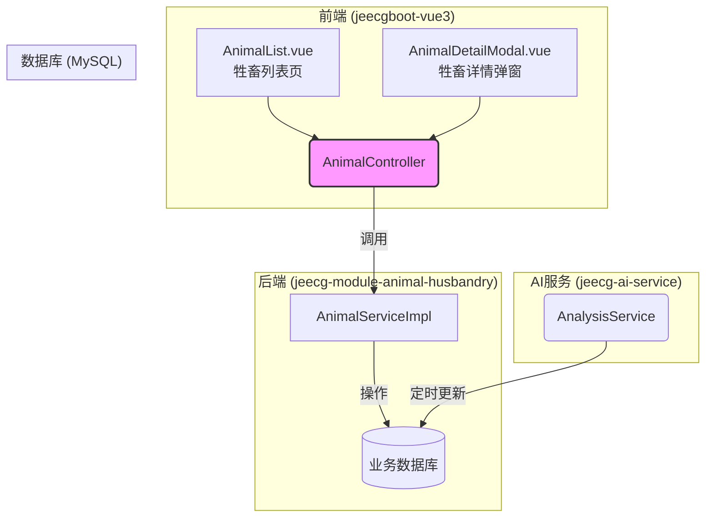
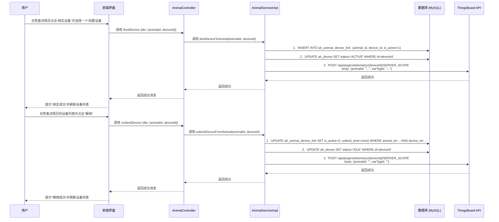
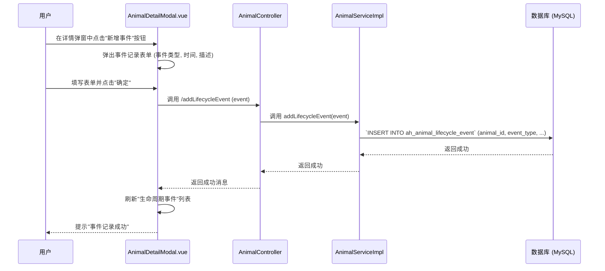

# 牲畜档案管理系统 - 设计文档

**版本：** 1.0
**日期：** 2024-08-22
**关联模块:** `jeecg-boot-module-animal-husbandry`
**前端实现:** `jeecgboot-vue3/src/views/animal_husbandry/animal/`

---

## 1. 功能概述与定位

### 1.1 系统定位

牲畜档案是整个智能畜牧平台的核心业务实体。**“一畜一档”** 的设计理念将所有与单个牲畜相关的数据（基础信息、健康状态、AI分析结论、关联设备、历史告警、生命周期事件）汇集于一处，为精细化管理、精准AI分析和全生命周期追踪提供统一的数据视图。此模块是连接设备数据和上层业务应用（如驾驶舱、AI预警）的关键枢纽。

### 1.2 核心功能

-   **牲畜档案管理：** 实现牲畜档案的增、删、改、查，包括其基本属性（耳标号、类型、性别、出生日期等）。
-   **设备关联管理：** 支持将一个或多个物联网设备（瘤胃胶囊、追踪器）与牲畜档案进行绑定或解绑。
-   **健康状态展示：** 在详情页中直观展示由AI服务分析得出的牲畜健康状态、健康评分和最新结论。
-   **多维数据聚合视图：** 在详情页中，聚合展示该牲畜关联的设备信息、遥测数据图表、历史告警记录等。

## 2. 系统架构与数据流

牲畜档案管理作为核心业务功能，其交互遵循JeecgBoot的标准前后端分离架构。数据主要在业务数据库(MySQL)中流转，并通过AI服务进行丰富。



**数据流说明:**

1.  **查询流程：** 前端页面通过 `AnimalController` 请求数据。`AnimalService` 从 `ah_animal` 表及关联表中查询信息，返回给前端展示。
2.  **操作流程：** 用户在前端进行增、删、改、绑定设备等操作，请求通过 `AnimalController` 调用 `AnimalService`，完成对数据库的事务性操作。
3.  **AI数据注入：** 后台的 `jeecg-ai-service` 模块会定时从时序数据库和业务库拉取数据进行分析，并将健康评分、AI结论等结果 **直接更新** 到 `ah_animal` 表中。前端只需查询此表，即可获得最新AI成果，实现了业务与AI的解耦。

## 3. 数据库设计

相关核心表已在《智能畜牧管理系统_SDD.md》中定义，此处引用关键表结构以供参考。

*   **`ah_animal` (牲畜档案表):** 存储牲畜所有核心信息。
    ```sql
    CREATE TABLE `ah_animal` (
      `id` varchar(36) NOT NULL,
      `ear_tag_id` varchar(50) DEFAULT NULL COMMENT '耳标号 (唯一)',
      `name` varchar(100) DEFAULT NULL COMMENT '牲畜昵称',
      `type` varchar(36) DEFAULT NULL COMMENT '牲畜类型 (字典: animal_type)',
      `herd_id` varchar(36) DEFAULT NULL COMMENT '所属畜群ID',
      `gender` varchar(10) DEFAULT NULL COMMENT '性别 (字典: sex)',
      `birth_date` date DEFAULT NULL COMMENT '出生日期',
      `health_status` varchar(20) DEFAULT 'HEALTHY' COMMENT '健康状态 (字典: health_status)',
      `health_score` int(11) DEFAULT '100' COMMENT '健康评分 (0-100)',
      `ai_conclusion` varchar(255) DEFAULT '一切正常' COMMENT '最新AI分析结论',
      `last_location_lon` decimal(10,7) DEFAULT NULL COMMENT '最后更新经度',
      `last_location_lat` decimal(10,7) DEFAULT NULL COMMENT '最后更新纬度',
      -- ... 其他字段 ...
      PRIMARY KEY (`id`),
      UNIQUE KEY `uk_ear_tag_id` (`ear_tag_id`)
    ) COMMENT='牲畜档案表';
    ```

*   **`ah_animal_device_link` (牲畜设备关联表):** 记录牲畜与设备的绑定历史。
    ```sql
    CREATE TABLE `ah_animal_device_link` (
      `id` varchar(36) NOT NULL,
      `animal_id` varchar(36) NOT NULL COMMENT '牲畜ID',
      `device_id` varchar(36) NOT NULL COMMENT '设备ID',
      `bind_time` datetime(3) NOT NULL COMMENT '绑定时间',
      `unbind_time` datetime(3) DEFAULT NULL COMMENT '解绑时间',
      `is_active` tinyint(1) NOT NULL DEFAULT '1' COMMENT '是否当前有效 (1-是, 0-否)',
      PRIMARY KEY (`id`)
    ) COMMENT='牲畜设备关联表';
    ```

*   **`ah_animal_lifecycle_event` (生命周期事件表):** - **新增**
    ```sql
    CREATE TABLE `ah_animal_lifecycle_event` (
      `id` varchar(36) NOT NULL,
      `animal_id` varchar(36) NOT NULL COMMENT '关联的牲畜ID',
      `event_type` varchar(50) NOT NULL COMMENT '事件类型 (字典: animal_event_type)',
      `event_time` datetime(3) NOT NULL COMMENT '事件发生时间',
      `description` text COMMENT '事件详细描述 (如药品名称、配种公牛编号等)',
      `create_by` varchar(50) DEFAULT NULL,
      `create_time` datetime(3) DEFAULT NULL,
      PRIMARY KEY (`id`),
      KEY `idx_animal_id` (`animal_id`)
    ) ENGINE=InnoDB DEFAULT CHARSET=utf8mb4 COMMENT='牲畜生命周期事件表';
    ```

### 4. 后端接口设计

### 4.1 控制器 (`AnimalController.java`)

-   **路径**: `/animal_husbandry/animal`
-   **设计模式**: 遵循JeecgBoot最佳实践，继承 `JeecgController<Animal, IAnimalService>` 并对核心方法进行复写，确保路由稳定和文档清晰。

```java
@Api(tags="牲畜档案管理")
@RestController
@RequestMapping("/animal_husbandry/animal")
public class AnimalController extends JeecgController<Animal, IAnimalService> {
    // 采用继承+复写模式
    // 仅列出核心或需特殊处理的接口

    @ApiOperation(value="牲畜档案-分页列表查询", notes="牲畜档案-分页列表查询")
    @GetMapping(value = "/list")
    public Result<IPage<Animal>> queryPageList(Animal animal, /*... othe params ...*/) {
        return super.queryPageList(animal, pageNo, pageSize, req);
    }
    
    @ApiOperation(value="牲畜档案-添加", notes="牲畜档案-添加")
    @PostMapping(value = "/add")
    public Result<Animal> add(@RequestBody Animal animal) {
        return super.add(animal);
    }

    @ApiOperation(value="牲畜档案-通过id查询", notes="获取牲畜完整档案信息，用于详情页展示")
    @GetMapping(value = "/queryById")
    public Result<AnimalVo> queryById(@RequestParam(name="id",required=true) String id) {
        // 此处应返回一个VO (Value Object)，而不仅仅是Animal实体
        // AnimalVo应包含：
        // 1. Animal自身所有信息
        // 2. 当前绑定的设备列表 (List<DeviceVo>) - DeviceVo中包含来自ah_telemetry_latest的最新遥测
        // 3. (可选) 最近的告警记录 (List<AlarmRecord>)
        // 4. (可选) 所有生命周期事件 (List<LifecycleEvent>)
        // 历史遥测数据(用于绘制图表)应通过单独的API从时序数据库查询，不在此接口一次性返回
        AnimalVo animalVo = animalService.getAnimalDetailById(id);
        if(animalVo==null) {
            return Result.error("未找到对应数据");
        }
        return Result.OK(animalVo);
    }

    @ApiOperation(value="为牲畜绑定设备", notes="在牲畜档案中发起设备绑定操作")
    @PostMapping(value = "/bindDevice")
    public Result<?> bindDevice(@RequestBody BindDeviceDto dto) {
        // dto 包含 animalId 和 deviceId
        // 调用 IAnimalDeviceLinkService 服务
        // 核心逻辑：
        // 1. 创建一条新的 ah_animal_device_link 记录, is_active=1
        // 2. 更新 ah_device 表中对应设备的状态为 'ACTIVE'
        // 3. (重要) 调用ThingsBoard API，更新设备的服务端属性，写入animalId, earTagId等业务信息
        return animalService.bindDeviceToAnimal(dto.getAnimalId(), dto.getDeviceId());
    }
    
    @ApiOperation(value="为牲畜解绑设备", notes="在牲畜档案中发起设备解绑操作")
    @PostMapping(value = "/unbindDevice")
    public Result<?> unbindDevice(@RequestBody BindDeviceDto dto) {
        // dto 包含 animalId 和 deviceId, 或者更精确的 linkId
        // 核心逻辑：
        // 1. 更新 ah_animal_device_link 记录, 设置 is_active=0, unbind_time=now()
        // 2. 更新 ah_device 表中对应设备的状态为 'IDLE'
        // 3. (重要) 调用ThingsBoard API，清空或更新设备的服务端业务属性
        return animalService.unbindDeviceFromAnimal(dto.getAnimalId(), dto.getDeviceId());
    }

    @ApiOperation(value="记录一次新的生命周期事件", notes="为指定牲畜添加一条生命周期事件记录")
    @PostMapping(value = "/addLifecycleEvent")
    public Result<?> addLifecycleEvent(@RequestBody LifecycleEvent event) {
        // Service层负责将event存入 ah_animal_lifecycle_event 表
        return animalService.addLifecycleEvent(event);
    }

    // ... 其他标准CRUD接口 ...
}
```

### 4.2 核心DTO/VO定义

-   **`AnimalVo.java` (牲畜详情视图对象):**
    用于 `queryById` 接口返回，聚合了所有详情页所需信息。
    ```java
    @Data
    public class AnimalVo extends Animal {
        // 实时指标，由Service层从 ah_telemetry_latest 表中解析并填充
        private Double latestTemperature;
        private Integer latestActivity;
        
        // 当前绑定的设备列表
        private List<DeviceVo> boundDevices;
        
        // 最近的N条告警记录
        private List<AlarmRecord> recentAlarms;

        // 该牲畜的所有生命周期事件
        private List<LifecycleEvent> lifecycleEvents;
        
        // 注意：历史遥测数据不在此VO中。应由前端根据需要，另行调用专用API从时序数据库(TDengine)中获取。
        // private Map<String, List<TelemetryDataPoint>> telemetryHistory;
    }
    ```

-   **`DeviceVo.java` (设备视图对象):** - **新增**
    用于在牲畜详情中展示设备信息，是 `ah_device` 表和一个设备最新遥测数据的聚合。
    ```java
    @Data
    public class DeviceVo extends Device {
        // 从 ah_telemetry_latest 表解析的实时设备状态数据
        private Integer rssi;
        private Double snr;
        private String sensorStatus; // 如 Reboot, Normal 等
    }
    ```

-   **`BindDeviceDto.java` (绑定/解绑数据传输对象):**
    ```java
    @Data
    public class BindDeviceDto {
        private String animalId; // 目标牲畜ID
        private String deviceId; // 目标设备ID
        // private String linkId; // 用于解绑时更精确的定位
    }
    ```

## 5. 前端设计

-   **页面路径**: `jeecgboot-vue3/src/views/animal_husbandry/animal/`
-   **文件结构**:
    -   `AnimalList.vue`: 页面主组件，负责列表展示与交互。
    -   `animal.api.ts`: 定义与后端 `AnimalController` 交互的API函数。
    -   `animal.data.ts`: 定义表格列(columns)和搜索表单配置。
    -   `components/AnimalModal.vue`: 封装“新增/编辑”牲畜档案的表单弹窗。
    -   `components/AnimalDetailModal.vue`: 封装复杂详情页的弹窗，对应原型中的 `modal-animal-details`。

### 5.1 列表页 (`AnimalList.vue`)

-   **表格列**: 参照原型，包含耳标号、名称、类型、畜群、健康状态、健康评分、最新AI结论等。
-   **查询条件**: 支持按耳标号、健康状态等进行筛选。
-   **操作按钮**:
    -   **新增牲畜**: 点击弹出 `AnimalModal.vue` 进行新增。
    -   **详情**: 点击弹出 `AnimalDetailModal.vue`，并传入牲畜ID。
    -   **绑定设备**: 点击弹出设备选择弹窗（复用或新建一个设备选择组件），选择可用设备后调用后端的 `/bindDevice` 接口。
    -   **解绑设备**: (新增逻辑) 在详情弹窗的“绑定设备列表”中，为每一行设备增加“解绑”按钮，点击后调用 `/unbindDevice` 接口。

### 5.2 详情弹窗 (`AnimalDetailModal.vue`)

这是模块最核心的前端组件，负责全面展示"一畜一档"信息。

-   **数据获取**: 弹窗打开时，根据传入的 `animalId` 调用后端的 `/queryById` 接口，一次性获取所有需要聚合展示的数据 (`AnimalVo`)。
-   **组件布局**: 采用多区块、多Tab页的复杂布局，清晰地组织信息。
    -   **基本信息区**: 展示 `ah_animal` 表中的基础字段，如耳标号、类型、以及根据`last_location`更新的**最后位置**。
    -   **健康概览区**: 突出展示 `health_status`, `health_score`, `ai_conclusion`，并补充展示**最新体温**和**最新活动量**的实时值。
    -   **绑定设备区**: 以列表形式展示 `AnimalVo` 中的设备列表。表格列应包括设备类型、名称、状态、电量、**RSSI/SNR**、**传感器状态**和最后上报时间。
    -   **数据可视化区**:
        -   使用图表组件（如`ECharts`）渲染**体温**、**活动量**和**步数**的历史曲线图。
    -   **关联记录区**:
        -   使用Tabs组件切换展示 `AnimalVo` 中的告警历史和生命周期事件列表。
        -   (新增逻辑) 在"生命周期事件"的Tab页中，应有一个"新增事件"按钮，点击后弹出用于记录新事件的表单。

## 6. 核心业务流程

### 6.1 查看牲畜详情流程

```mermaid
sequenceDiagram
    participant User as 用户
    participant AnimalList as AnimalList.vue
    participant DetailModal as AnimalDetailModal.vue
    participant Controller as AnimalController
    participant Service as AnimalServiceImpl
    participant DB as 数据库 (MySQL)
    participant TSDB as 时序数据库 (TDengine)

    User->>AnimalList: 点击“详情”按钮
    AnimalList->>DetailModal: 打开详情弹窗，传入animalId
    DetailModal->>Controller: 调用 /queryById?id={animalId}
    Controller->>Service: 调用 getAnimalDetailById(animalId)
    Service->>DB: 1. 查询 ah_animal 表获取主信息
    Service->>DB: 2. 根据 animalId 在 ah_animal_device_link 中找到有效的 deviceId 列表
    Service->>DB: 3. 根据 deviceId 列表查询 ah_device 表获取设备基础信息
    Service->>DB: 4. 根据 deviceId 列表查询 ah_telemetry_latest 表获取每个设备的最新遥测数据 (JSON)
    Service->>DB: 5. 根据 animalId 查询 ah_alarm_record 获取告警历史
    Service->>DB: 6. 根据 animalId 查询 ah_animal_lifecycle_event 获取所有生命周期事件
    DB-->>Service: 返回所有查询结果
    Service->>Service: 组装数据：<br/> - 将设备基础信息和最新遥测数据合并成 List&lt;DeviceVo&gt; <br/> - 提取关键遥测值(体温/活动量)到顶层 <br/> - 将所有信息组装成一个完整的 AnimalVo 对象
    Service-->>Controller: 返回 AnimalVo
    Controller-->>DetailModal: 返回 Result.OK(AnimalVo)
    DetailModal->>DetailModal: 渲染弹窗内所有区块的数据
    DetailModal-->>User: 展示完整的牲畜档案详情
    
    User->>DetailModal: (与图表交互)
    DetailModal->>Controller: 调用 /getTelemetryHistory?deviceId=...&range=...
    Controller->>Service: 调用 getHistory(deviceId, range)
    Service->>TSDB: `SELECT ts, temp FROM ... WHERE device_id=...`
    TSDB-->>Service: 返回时序数据
    Service-->>Controller: 返回时序数据
    Controller-->>DetailModal: 返回图表数据
    DetailModal->>DetailModal: 渲染历史曲线图
```

### 6.2 设备绑定与解绑流程



### 6.3 业务规则约束

-   **删除约束**:
    -   为了保证数据完整性和避免孤儿数据，**不允许删除已绑定过任何设备的牲畜档案**。
    -   在业务逻辑层面，执行删除操作前，必须检查 `ah_animal_device_link` 表中是否存在与该 `animal_id` 相关的记录。如果存在，应拒绝删除并向前端返回明确的提示信息：“该牲畜有关联的设备使用历史，无法删除”。
    -   仅允许删除从未绑定过设备的、信息录入错误的牲畜档案。
-   **绑定约束**:
    -   一个设备在同一时间只能被绑定到一个牲畜上。发起绑定时，必须校验所选设备的状态为 `IN_STOCK` (库存中) 或 `IDLE` (闲置)。 

### 6.4 (新增) 记录生命周期事件流程

