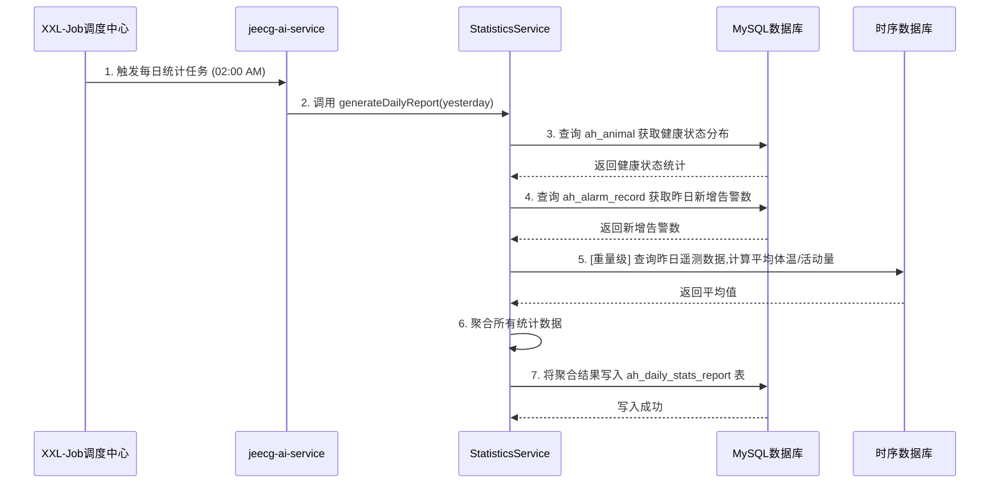

# 统计报表分析 - 系统设计文档 (V1.0)

**版本：** 1.0
**日期：** 2024-08-23
**关联模块:** `jeecg-ai-service`, `jeecg-module-animal-husbandry`
**前端实现:** `jeecgboot-vue3/src/views/animal_husbandry/report/DailyStats.vue`

---

## 1. 功能概述与定位

### 1.1 系统定位

统计报表分析模块是牧场管理决策的数据支撑中心。它旨在将海量的、原始的遥测数据和业务数据进行提炼、聚合与可视化，为管理者提供直观、易懂的运营洞察。本模块的核心挑战在于 **性能**，即如何在不影响核心业务系统性能的前提下，对可能达到亿级别的时间序列数据进行高效的统计分析。

### 1.2 核心功能

*   **健康趋势分析:** 以图表形式展示全场或特定畜群的牲畜健康状态（健康、亚健康、告警）随时间变化的分布与趋势。
*   **告警统计分析:** 按告警类型、告警级别进行分类统计，帮助管理者快速定位主要风险点。
*   **生理指标概览:** 展示关键生理指标（如平均体温、平均活动量）的日/月度趋势变化。
*   **数据导出:** 支持将报表数据导出为Excel文件，以供离线分析。

## 2. 架构设计与性能考量

直接在前端请求时对海量的历史遥测数据（存储于TDengine）进行实时聚合查询，将是极其缓慢且消耗资源的，这会严重影响用户体验和系统稳定性。

因此，本模块采用 **“批处理预聚合” (Batch Pre-aggregation)** 的核心设计模式。

```mermaid
graph TD
    subgraph "时序数据库"
        A[TDengine/InfluxDB<br>存储所有历史遥测数据]
    end
    
    subgraph "业务数据库 (MySQL)"
        B[ah_animal, ah_alarm_record<br>业务数据]
        C[ah_daily_stats_report<br>每日运营统计结果表]
    end

    subgraph "AI与数据服务层 (jeecg-ai-service)"
        D{XXL-Job<br>每日定时任务 (如 02:00 AM)} --> E(StatisticsService);
        E -- "1. 查询昨日数据" --> A;
        E -- "2. 查询昨日数据" --> B;
        E -- "3. 聚合计算" --> E;
        E -- "4. 将结果写入" --> C;
    end

    subgraph "前端展现层 (jeecgboot-vue3)"
        F[DailyStats.vue] --> G{ReportController};
    end
    
    subgraph "业务接口层 (jeecg-module-animal-husbandry)"
        G -- "直接查询预聚合结果" --> C;
    end
    
    style E fill:#f9f,stroke:#333,stroke-width:2px
    style C fill:#cff,stroke:#333,stroke-width:2px
```

**设计思想:**

1.  **牺牲微量实时性，换取极致查询性能:** 报表数据通常不需要秒级更新。我们通过一个每日执行的定时任务，提前完成一天中绝大部分复杂的计算和聚合工作。
2.  **创建专用结果表:** 在 `智能畜牧管理系统_SDD.md` 中已定义了 `ah_daily_stats_report` 表。这张表就是预聚合结果的“物化视图”，其数据量小、结构清晰，极易查询。
3.  **权责分离:**
    *   `jeecg-ai-service` 模块中的 `StatisticsService` 负责 **“算”**。它在凌晨低峰期执行重量级的计算任务。
    *   `jeecg-module-animal-husbandry` 模块中的 `ReportController` 负责 **“查”**。它提供给前端的API接口，只需对 `ah_daily_stats_report` 这张小表进行简单的查询，响应速度极快。
4.  **例外处理:** 对于某些无法完全预聚合或对实时性有一定要求的图表（如“告警类型分布”），可以采用直接查询业务主表（如`ah_alarm_record`）并附加时间范围条件的方式，只要做好了数据库索引，性能也是可接受的。

## 3. 数据库设计

本模块的核心是 `ah_daily_stats_report` 表，该表已在主SDD中定义，此处再次引用作为参考。

*   **`ah_daily_stats_report` (每日运营统计报表):**
    ```sql
    CREATE TABLE `ah_daily_stats_report` (
      `id` varchar(36) NOT NULL,
      `report_date` date NOT NULL COMMENT '统计日期',
      `farm_id` varchar(36) DEFAULT NULL,
      `herd_id` varchar(36) DEFAULT NULL,
      `total_animals` int(11) DEFAULT '0' COMMENT '牲畜总数',
      `healthy_count` int(11) DEFAULT '0' COMMENT '健康数量',
      `sub_healthy_count` int(11) DEFAULT '0' COMMENT '亚健康数量',
      `alarm_count` int(11) DEFAULT '0' COMMENT '告警数量',
      `new_alarms_count` int(11) DEFAULT '0' COMMENT '当日新增告警数',
      `avg_temperature` decimal(5,2) DEFAULT NULL COMMENT '平均体温',
      `avg_activity` decimal(10,2) DEFAULT NULL COMMENT '平均活动量',
      `create_time` datetime(3) DEFAULT NULL,
      PRIMARY KEY (`id`),
      UNIQUE KEY `uk_farm_herd_date` (`farm_id`, `herd_id`, `report_date`)
    ) COMMENT='每日运营统计报表';
    ```

## 4. 后端接口设计

### 4.1 定时任务与服务 (`jeecg-ai-service`)

*   **`StatisticsService.java`**:
    *   `generateDailyReport(LocalDate date)`:
        1.  删除 `ah_daily_stats_report` 表中 `report_date` = `date` 的旧数据，确保任务可重复执行。
        2.  **统计牲畜健康分布:**
           `SELECT health_status, COUNT(*) FROM ah_animal GROUP BY health_status;`
           将查询结果填充到 `healthy_count`, `sub_healthy_count`, `alarm_count` 字段。
        3.  **统计当日新增告警:**
           `SELECT COUNT(*) FROM ah_alarm_record WHERE alarm_time BETWEEN date_start AND date_end;`
           填充 `new_alarms_count` 字段。
        4.  **统计平均生理指标 (重量级查询):**
           `SELECT AVG(CAST(json_extract(telemetry_data, '$.Temperature') AS DECIMAL(5,2))) AS avg_temp, ... FROM ah_telemetry_latest;` (简化示例)
           *注意：* 更精确的日平均值应从时序数据库（TDengine）中计算，这会是一个非常耗时的操作，正是需要定时任务来处理的原因。
           `SELECT AVG(temperature), AVG(activity) FROM ... WHERE time >= date_start AND time < date_end;`
        5.  将聚合后的数据组装成 `DailyStatsReport` 实体，并批量存入 `ah_daily_stats_report` 表。

### 4.2 API控制器 (`jeecg-module-animal-husbandry`)

*   **`ReportController.java`**:
    *   **路径**: `/animal_husbandry/report`
    *   **设计模式**: 遵循JeecgBoot最佳实践，创建一个新的、独立的Controller。

```java
@Api(tags="统计报表分析")
@RestController
@RequestMapping("/animal_husbandry/report")
public class ReportController {

    @Autowired
    private IReportService reportService;

    @ApiOperation(value="获取健康状态分布趋势", notes="用于渲染健康状态分布饼图和历史趋势折线图")
    @GetMapping("/healthTrend")
    public Result<List<HealthTrendVo>> getHealthTrend(@RequestParam String startDate, @RequestParam String endDate) {
        // Service层直接查询 ah_daily_stats_report 表
        List<HealthTrendVo> trendData = reportService.queryHealthTrend(startDate, endDate);
        return Result.OK(trendData);
    }

    @ApiOperation(value="获取告警类型分布", notes="用于渲染告警类型分布饼图")
    @GetMapping("/alarmDistribution")
    public Result<List<AlarmDistributionVo>> getAlarmDistribution(@RequestParam String startDate, @RequestParam String endDate) {
        // 此接口不查询预聚合表，而是实时查询告警记录表
        List<AlarmDistributionVo> distributionData = reportService.queryAlarmDistribution(startDate, endDate);
        return Result.OK(distributionData);
    }
    
    // ... 其他报表接口 ...
}
```

### 4.3 核心DTO/VO定义

*   **`HealthTrendVo.java` (健康趋势视图对象):**
    为ECharts图表量身定制的数据结构。
    ```java
    @Data
    public class HealthTrendVo {
        private String reportDate; // 统计日期, e.g., "2024-08-23"
        private Integer healthyCount;
        private Integer subHealthyCount;
        private Integer alarmCount;
    }
    ```

*   **`AlarmDistributionVo.java` (告警分布视图对象):**
    ```java
    @Data
    public class AlarmDistributionVo {
        private String alarmType; // 告警类型 (字典文本, 如 "高温告警")
        private Integer count;    // 数量
    }
    ```

## 5. 前端设计

*   **页面路径**: `jeecgboot-vue3/src/views/animal_husbandry/report/DailyStats.vue`
*   **交互设计**:
    1.  页面顶部提供一个全局的 **日期范围选择器**，作为所有图表的数据查询时间区间。
    2.  页面主体由多个`Card`组件构成，每个`Card`承载一个独立的分析图表。
    3.  每个`Card`的标题旁可以有一个独立的刷新按钮，或由全局日期选择器驱动刷新。

### 5.1 组件布局

```vue
<!-- DailyStats.vue -->
<template>
  <div class="p-4">
    <!-- 1. 全局筛选面板 -->
    <a-card class="!mb-4">
      <a-form layout="inline">
        <a-form-item label="查询日期">
          <a-range-picker v-model:value="dateRange" />
        </a-form-item>
        <a-form-item>
          <a-button type="primary" @click="handleQuery">查询</a-button>
        </a-form-item>
      </a-form>
    </a-card>

    <!-- 2. 图表展示区 -->
    <a-row :gutter="16">
      <a-col :span="12">
        <a-card title="牲畜健康状态趋势">
          <!-- 折线图，数据源: /report/healthTrend -->
          <ECharts :option="healthTrendChartOption" />
        </a-card>
      </a-col>
      <a-col :span="12">
        <a-card title="最新健康状态分布">
          <!-- 饼图，数据源: healthTrend接口的最后一天数据 -->
          <ECharts :option="healthDistributionPieOption" />
        </a-card>
      </a-col>
    </a-row>
    
    <a-row :gutter="16" class="!mt-4">
      <a-col :span="12">
        <a-card title="告警类型分布">
          <!-- 饼图, 数据源: /report/alarmDistribution -->
          <ECharts :option="alarmDistributionPieOption" />
        </a-card>
      </a-col>
       <a-col :span="12">
        <!-- 预留给其他图表 -->
      </a-col>
    </a-row>
  </div>
</template>
```

### 5.2 API调用 (`report.api.ts`)

```typescript
// report.api.ts
import { defHttp } from '/@/utils/http/axios';

enum Api {
  HealthTrend = '/animal_husbandry/report/healthTrend',
  AlarmDistribution = '/animal_husbandry/report/alarmDistribution',
}

export const getHealthTrend = (params) => defHttp.get({ url: Api.HealthTrend, params });
export const getAlarmDistribution = (params) => defHttp.get({ url: Api.AlarmDistribution, params });
```

## 6. 核心业务流程

### 每日统计数据生成流程

