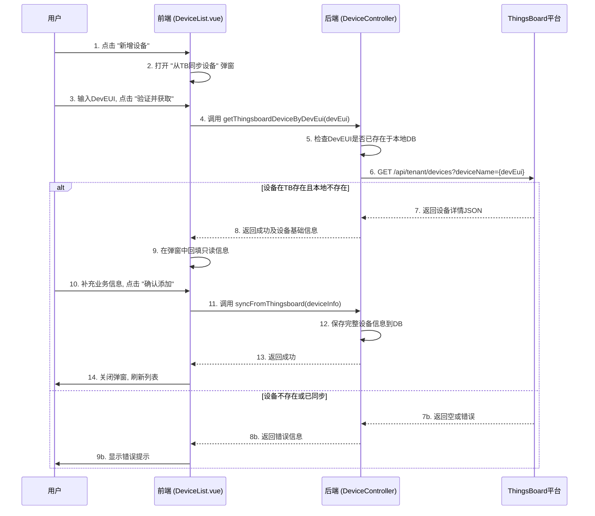
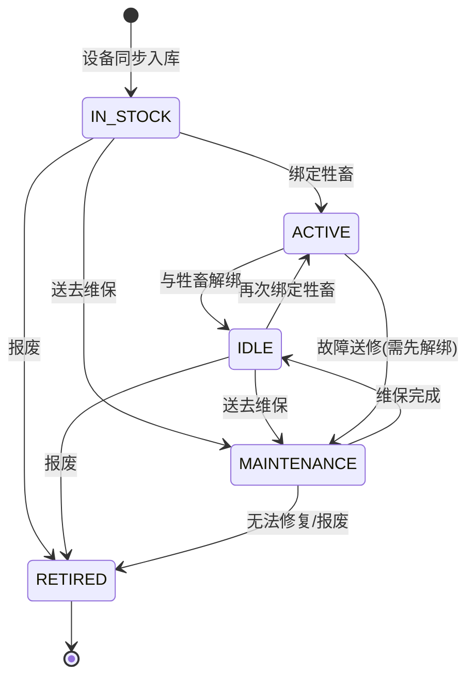

好的，我已经仔细阅读并分析了您提供的所有背景资料，包括PRD、SDD、现有代码结构、原型以及相关的设计文档。基于这些信息，我将为您编写一份详细且符合项目当前阶段目标的《设备台账管理系统设计文档》。

这份文档将明确区分“设备台账管理”与“设备实时监控”，专注于设备作为一种“资产”的全生命周期管理，并确保设计方案与您现有的JeecgBoot技术栈和开发规范深度融合。

---

# 设备台账管理 - 系统设计文档 (V1.1)

**版本：** 1.1  
**日期：** 2024-08-23  
**核心模块:** `jeecg-module-animal-husbandry`  
**前端视图:** `views/animal_husbandry/device/DeviceList.vue`

**文档说明:** 本文档是《智能畜牧管理系统_SDD.md》中关于设备管理的深化和细化，旨在为 **设备台账管理 (Device Ledger Management)** 功能提供完整的技术设计方案。它将与 `device_modals_prototype.html` 中定义的操作流程保持一致。

---

## 1. 功能概述与定位

### 1.1 功能定位

**设备台账管理** 的核心定位是管理物联网设备（瘤胃胶囊、动物追踪器）的 **物理资产全生命周期**。它区别于实时监控设备上下线状态或遥测数据的“设备监控仪表盘”，更侧重于以下几个方面：

*   **资产记录 (Asset Record):** 从设备进入库存开始，记录其物理信息、采购信息和核心标识符。
*   **生命周期跟踪 (Lifecycle Tracking):** 精确管理设备从“库存中” -> “在用” -> “闲置” -> “维保中” -> “已报废”的每一个状态变更。
*   **业务关系管理 (Business Relationship):** 管理设备与牲畜档案的绑定与解绑历史。
*   **信息查询中心 (Information Hub):** 为运维人员和管理人员提供一个统一、准确的设备信息查询入口。

### 1.2 核心功能点

*   **设备同步入库:** 从ThingsBoard平台按`DevEUI`同步已注册的设备信息，作为设备入库的唯一方式。
*   **设备信息维护:** 查看设备详细信息，并维护平台特有的业务属性（如别名、采购日期）。
*   **设备绑定/解绑:** 实现设备与牲畜档案的关联与分离操作，并自动更新设备生命周期状态。
*   **设备状态变更:** 手动更改设备状态（如将“闲置”设备置为“维保中”或“已报废”）。
*   **设备删除:** 提供删除操作，并附带严格的使用说明（仅用于错误录入的设备）。

## 2. 系统架构与数据流

本模块是 `jeecg-module-animal-husbandry` 的核心组成部分，其数据流严格遵循以 **ThingsBoard为设备身份源头** 的原则。

```mermaid
graph TD
    subgraph "第三方平台"
        A[ThingsBoard<br>设备注册与数据接入]
    end

    subgraph "核心业务中台 (JeecgBoot)"
        B(DeviceController<br>设备台账API)
        C(DeviceServiceImpl<br>核心业务逻辑)
        D(IThingsBoardService<br>ThingsBoard API封装)
        E[MySQL数据库<br>(ah_device, ah_animal_device_link)]
        F[时序数据库<br>(可选读, 用于补充状态)]
    end
    
    subgraph "前端展现层 (Vue3)"
        G[DeviceList.vue<br>设备台账页面]
        H[device_modals_prototype<br>增删改查弹窗]
    end

    G -- "1. 用户发起操作(如同步/绑定)" --> B;
    B -- "2. 调用业务逻辑" --> C;
    C -- "3a. 同步时,调用服务" --> D;
    D -- "3b. 请求TB API" --> A;
    A -- "3c. 返回设备信息" --> D;
    C -- "4. 操作MySQL数据库" --> E;
    E -- "5. 返回结果" --> C;
    C -- "6. 返回结果" --> B;
    B -- "7. 返回结果" --> G;
    H -- "承载交互" --> G;

    style A fill:#ff9,stroke:#333,stroke-width:2px
    style E fill:#cff,stroke:#333,stroke-width:2px
```

## 3. 数据库设计

本模块的核心数据存储依赖于`智能畜牧管理系统_SDD.md`中定义的`ah_device`和`ah_animal_device_link`表。

### 3.1 `ah_device` (设备信息表)

这是设备台账的核心表，存储了设备的静态信息、业务属性和部分状态快照。

```sql
CREATE TABLE `ah_device` (
  `id` varchar(36) NOT NULL COMMENT '主键ID',
  `name` varchar(100) NOT NULL COMMENT '设备名称 (别名, 优先使用用户在本平台的命名)',
  `device_type` varchar(20) NOT NULL COMMENT '设备类型 (字典: device_type, CAPSULE, TRACKER)',
  `dev_eui` varchar(50) DEFAULT NULL COMMENT 'LoRaWAN DevEUI (唯一)',
  `tb_device_id` varchar(50) DEFAULT NULL COMMENT 'ThingsBoard平台设备ID (唯一, 同步时写入)',
  `model` varchar(100) DEFAULT NULL COMMENT '设备型号',
  `purchase_date` date DEFAULT NULL COMMENT '采购日期',
  `status` varchar(20) NOT NULL DEFAULT 'IN_STOCK' COMMENT '设备生命周期状态 (字典: device_lifecycle_status)',
  `last_signal_rssi` int(11) DEFAULT NULL COMMENT '最后一次的信号强度RSSI',
  `battery_level` int(11) DEFAULT NULL COMMENT '电量百分比',
  `firmware_version` varchar(50) DEFAULT NULL COMMENT '固件版本',
  `create_by` varchar(50) DEFAULT NULL,
  `create_time` datetime(3) DEFAULT NULL,
  `update_by` varchar(50) DEFAULT NULL,
  `update_time` datetime(3) DEFAULT NULL,
  PRIMARY KEY (`id`),
  UNIQUE KEY `uk_dev_eui` (`dev_eui`),
  UNIQUE KEY `uk_tb_device_id` (`tb_device_id`)
) ENGINE=InnoDB DEFAULT CHARSET=utf8mb4 COMMENT='设备信息表';
```
**关键字段说明：**
*   `status`: 设备的生命周期状态，由数据字典 `device_lifecycle_status` 管理，包含 `IN_STOCK` (库存中), `ACTIVE` (在用), `IDLE` (闲置), `MAINTENANCE` (维保中), `RETIRED` (已报废)。这是本模块的核心管理字段。

### 3.2 `ah_animal_device_link` (牲畜设备关联表)

该表记录了设备与牲畜的每一次绑定历史。

```sql
CREATE TABLE `ah_animal_device_link` (
  `id` varchar(36) NOT NULL COMMENT '主键ID',
  `animal_id` varchar(36) NOT NULL COMMENT '牲畜ID',
  `device_id` varchar(36) NOT NULL COMMENT '设备ID',
  `bind_time` datetime(3) NOT NULL COMMENT '绑定时间',
  `unbind_time` datetime(3) DEFAULT NULL COMMENT '解绑时间',
  `is_active` tinyint(1) NOT NULL DEFAULT '1' COMMENT '是否当前有效 (1-是, 0-否)',
  PRIMARY KEY (`id`),
  KEY `idx_animal_id` (`animal_id`),
  KEY `idx_device_id` (`device_id`)
) ENGINE=InnoDB DEFAULT CHARSET=utf8mb4 COMMENT='牲畜设备关联表';
```

## 4. 后端接口设计

遵循`JeecgBoot项目核心要素分析文档.md`的最佳实践，采用"继承+复写"的Controller模式。

### 4.1 `DeviceController.java`

*   **路径**: `/animal_husbandry/device`
*   **基类**: `JeecgController<Device, IDeviceService>`
*   **核心API**:

| 方法 | HTTP | 路径 | 功能描述 |
| :--- | :--- | :--- | :--- |
| `queryPageList` | GET | `/list` | 标准分页查询，支持按设备名称、类型、状态、DevEUI等筛选。 |
| `queryById` | GET | `/queryById` | 获取单个设备的完整详细信息。 |
| `edit` | PUT | `/edit` | 编辑设备业务信息（如名称、采购日期等）。 |
| `delete` | DELETE | `/delete` | 删除设备记录（**高危操作**）。 |
| `deleteBatch` | DELETE | `/deleteBatch` | 批量删除设备记录（**高危操作**）。 |
| `syncFromThingsboard` | POST | `/syncFromThingsboard` | **[核心]** 根据DevEUI从TB同步设备信息，创建新设备记录。 |
| `bindDeviceToAnimal` | POST | `/bind` | 将设备绑定到牲畜。 |
| `unbindDeviceFromAnimal`| POST | `/unbind` | 将设备从牲畜解绑。 |
| `changeStatus` | POST | `/changeStatus` | **[优化]** 手动变更设备生命周期状态（如维保中、已报废）。 |

### 4.2 业务逻辑 (`IDeviceService.java`)

*   **`syncFromThingsboard(String devEui, Device supplementaryInfo)`**:
    1.  检查 `ah_device` 表，确认该 `devEui` 是否已存在，若存在则返回错误。
    2.  调用 `IThingsBoardService.getDeviceDetailsByDevEUI(devEui)`。
    3.  若TB返回成功，则将返回信息（`tb_device_id`, `name`, `deviceProfileName`等）与 `supplementaryInfo` 中的补充业务信息（`model`, `purchase_date`）合并填充到新的 `Device` 实体中。
    4.  设置 `status` 为 `IN_STOCK` (库存中)，并保存到数据库。

*   **`bindDeviceToAnimal(String deviceId, String animalId)`**:
    1.  开启事务。
    2.  查询 `Device` 和 `Animal` 实体是否存在且状态合法（如设备需为 `IDLE` 或 `IN_STOCK`）。
    3.  检查该 `deviceId` 是否有未解绑的有效关联，若有则报错。
    4.  **[核心增强]** 调用 `IThingsBoardService.updateDeviceAttributes(tbDeviceId, attributes)`，将绑定的牲畜信息（如 `{ "animalId": "xxx", "animalEarTag": "yyy", "platformBindStatus": "BOUND" }`）作为服务端属性写入ThingsBoard，提升运维效率。
    5.  更新 `ah_device` 表，将 `status` 设为 `ACTIVE` (在用)。
    6.  在 `ah_animal_device_link` 表中创建一条新的有效记录 (`is_active = 1`)。
    7.  提交事务。

*   **`unbindDeviceFromAnimal(String deviceId)`**:
    1.  开启事务。
    2.  找到 `deviceId` 对应的当前有效（`is_active = 1`）的关联记录。
    3.  **[核心增强]** 调用 `IThingsBoardService.updateDeviceAttributes(...)`，将ThingsBoard上关联的服务端属性清空或更新为解绑状态（如 `{ "platformBindStatus": "UNBOUND" }`）。
    4.  更新该关联记录，设置 `is_active = 0` 和 `unbind_time`。
    5.  更新 `ah_device` 表，将 `status` 设为 `IDLE` (闲置)。
    6.  提交事务。

## 5. 前端设计

设计完全遵循 `animal_husbandry_prototype.html` 的布局和交互逻辑。

*   **视图路径**: `jeecgboot-vue3/src/views/animal_husbandry/device/`
*   **文件结构**:
    *   `DeviceList.vue`: 页面主组件，使用 `BasicTable` 和 `useTable` 钩子。
    *   `device.api.ts`: 定义与后端 `DeviceController` 交互的API函数。
    *   `device.data.ts`: 定义表格列(columns)、搜索表单(searchFormSchema)配置。
    *   `components/DeviceModal.vue`: (推荐)将新增/编辑的弹窗逻辑封装为独立组件。

### 5.1 页面与交互

*   **列表页 (`DeviceList.vue`)**:
    *   表格列与优化后的原型一致：设备名称, 设备类型, DevEUI, 生命周期状态, 设备型号, 采购日期, 绑定牲畜, 固件版本, 操作。
    *   `生命周期状态` 和 `绑定牲畜` 列需进行格式化：状态使用不同颜色的标签；绑定信息需显示牲畜的耳标号或名称。
    *   操作列根据设备状态动态显示按钮：
        *   `在用`状态显示：详情、解绑。
        *   `闲置`状态显示：详情、绑定。
        *   `库存中`状态显示：详情、绑定、删除。
        *   `维保中`/`已报废`状态显示：详情。

*   **弹窗交互 (`device_modals_prototype.html` 的实现)**:
    *   **新增(同步)设备**:
        1.  点击"新增设备"，打开"从ThingsBoard同步设备"弹窗。
        2.  用户输入DevEUI后，点击"验证并获取"，前端将DevEUI传给后端。
        3.  后端通过TB API验证DevEUI有效性，并将TB返回的基础信息（如tb_device_id, name）返回给前端。
        4.  前端在弹窗中回填只读信息，用户补充业务信息（设备型号、采购日期等）后，点击"确认添加"。
        5.  前端将完整的设备信息（包含补充信息）通过 `syncFromThingsboard` API提交给后端创建记录。
    *   **绑定设备**:
        1.  打开"将设备绑定到牲畜"弹窗。
        2.  提供牲畜搜索功能（`JPopup`组件或`ApiSelect`组件）。
        3.  选择牲畜后，点击"确认绑定"，调用 `bindDeviceToAnimal` API。
    *   **解绑/删除设备**:
        1.  弹出确认对话框 (`useModal` 的 `createConfirm` 方法)。
        2.  用户确认后，调用相应的后端API。

## 6. 核心业务流程图

### 6.1 新设备入库同步流程



### 6.2 设备生命周期状态流转




## 7. 数据字典详述

为确保模块内部和系统范围内的一致性，本模块将使用以下在JeecgBoot`系统管理 -> 数据字典`中定义的核心字典项。

| 字典Code | 字典项文本 | 字典项Value | 备注 |
| :--- | :--- | :--- | :--- |
| `device_type` | 瘤胃胶囊 | `CAPSULE` | 设备的物理类型。 |
| `device_type` | 动物追踪器 | `TRACKER` | |
| `device_lifecycle_status`| 库存中 | `IN_STOCK` | 设备已同步至本平台，但未绑定任何牲畜，可随时启用。 |
| `device_lifecycle_status`| 在用 | `ACTIVE` | 设备已绑定牲畜，并正在 actively 上报数据。 |
| `device_lifecycle_status`| 闲置 | `IDLE` | 设备从牲畜解绑后，功能正常，可再次绑定使用。 |
| `device_lifecycle_status`| 维保中 | `MAINTENANCE` | 设备故障或充电中，暂时不可用。这是一个手动设置的状态。 |
| `device_lifecycle_status`| 已报废 | `RETIRED` | 设备已损坏或寿命终结，无法再使用。这是一个最终状态。 |

## 8. 非功能性需求

*   **安全性 (Security):**
    *   **权限控制:** 所有 `DeviceController` 的API接口都必须使用Shiro的 `@RequiresPermissions` 注解进行严格的权限控制（如 `device:add`, `device:edit`, `device:delete`）。
    *   **高危操作防护:** 删除设备 (`/delete`, `/deleteBatch`) 是高危操作，前端必须有二次强确认弹窗，后端需记录详细的操作日志。

*   **性能 (Performance):**
    *   **列表查询:** `/list` 接口必须支持分页，即使在设备数量达到数万级别时，也应在2秒内响应。数据库的 `dev_eui`, `status`, `device_type` 等常用查询字段需要建立索引。
    *   **外部API调用:** `syncFromThingsboard` 接口中对ThingsBoard的API调用必须设置合理的超时时间（建议5-10秒），以防止长时间等待导致前端请求超时。

*   **易用性 (Usability):**
    *   **清晰的错误提示:** 所有交互流程中的失败操作都应返回用户能理解的错误信息。例如：“验证失败：此DevEUI在ThingsBoard中未找到或网络错误”、“绑定失败：该牲畜已被其他同类型设备绑定”。
    *   **流畅的工作流:** 设备同步、绑定、解绑等核心操作应符合 `device_modals_prototype.html` 中设计的流畅交互，减少用户点击和输入。

*   **可靠性 (Reliability):**
    *   **事务一致性:** 设备的绑定/解绑操作涉及多张表的更新，必须在Service层使用 `@Transactional` 注解保证事务的原子性。
    *   **日志记录:** 所有对设备台账的CUD（创建/更新/删除）操作，以及所有对ThingsBoard的API调用，都必须记录详细的日志，便于问题排查和审计。

## 9. 实施建议 (分阶段)

为确保模块能够平稳、高质量地开发上线，建议采用以下分步实施策略：

*   **第一阶段：后端基础与核心逻辑**
    1.  **数据库先行:** 根据设计文档，在数据库中创建或确认 `ah_device` 和 `ah_animal_device_link` 表结构。
    2.  **代码生成:** 使用JeecgBoot代码生成器，一键生成 `Device` 实体的后端基础代码。
    3.  **服务层开发:** 重点实现 `DeviceServiceImpl` 中的核心业务逻辑：`syncFromThingsboard`, `bindDeviceToAnimal`, `unbindDeviceFromAnimal`，并确保事务管理正确无误。
    4.  **TB服务封装:** 开发 `IThingsBoardService`，封装对ThingsBoard的API调用，并做好配置化管理（URL, Token等）。
    5.  **单元测试:** 为Service层的核心业务逻辑编写单元测试，验证状态流转和数据一致性。

*   **第二阶段：前端页面与交互实现**
    1.  **页面搭建:** 创建 `views/animal_husbandry/device/` 目录及相关文件 (`DeviceList.vue`, `device.api.ts`, `device.data.ts`)。使用 `BasicTable` 快速搭建列表页面。
    2.  **弹窗组件开发:** 依据 `device_modals_prototype.html`，开发用于“同步”、“绑定”、“解绑”、“删除”的弹窗组件。
    3.  **API联调:** 将前端页面和弹窗与后端API进行联调，确保整个CRUD和业务流程完全打通。
    4.  **状态渲染:** 对“生命周期状态”等字段进行格式化，使用不同颜色的标签展示，并根据状态动态控制“操作”列的按钮显隐。

*   **第三阶段：联调测试与优化**
    1.  **端到端测试:** 在真实或模拟的ThingsBoard环境下，进行完整的端到端流程测试。
    2.  **校验与优化:** 完善所有前端输入的校验规则。根据测试结果，优化API性能和数据库索引。
    3.  **日志审查:** 检查系统日志，确保所有关键操作和异常都已按要求被正确记录。

---

