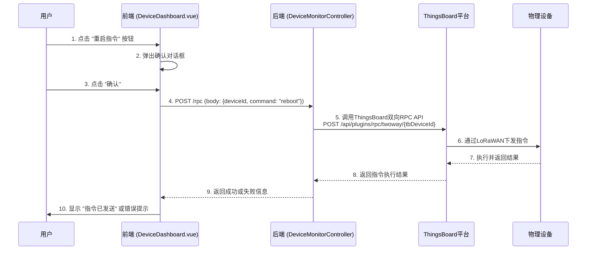
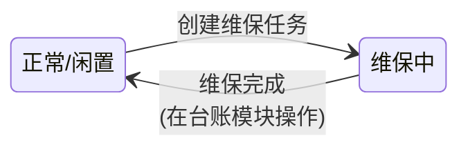

# 设备监控系统 - 系统设计文档 (V1.0)

**版本：** 1.0  
**日期：** 2024-08-23  
**核心模块:** `jeecg-module-animal-husbandry`  
**前端视图:** `views/animal_husbandry/device/DeviceDashboard.vue`

**文档说明:** 本文档是《智能畜牧管理系统_SDD.md》中关于设备管理的补充，旨在为 **设备监控 (Device Monitoring)** 功能提供完整的技术设计方案。它将与 `animal_husbandry_prototype.html` 中定义的设备监控仪表盘功能保持一致，并与《设备台账管理系统设计文档》的功能范围进行明确区分。

---

## 1. 功能概述与定位

### 1.1 功能定位

**设备监控**的核心定位是管理物联网设备的 **实时运行时状态 (Runtime Status)** 与 **操作健康度 (Operational Health)**。它与侧重物理资产管理的“设备台账”形成互补，共同构成了完整的设备管理体系。

本模块不关心设备的采购日期或物理型号，而是专注于回答以下问题：
*   **全局态势:** 当前所有设备中有多少在线？多少离线？多少低电量？
*   **问题发现:** 哪些设备当前处于“有问题”的状态（如长时间离线、电量即将耗尽）？
*   **深度诊断:** 单个设备的历史遥测数据是怎样的？（如电量衰减曲线、信号强度波动图）。
*   **远程控制:** 我能否向设备下发指令（如重启、参数配置）？
*   **运维闭环:** 如何将一个有问题的设备转入维保流程？

### 1.2 核心功能点

*   **全局状态概览:** 以KPI卡片形式实时展示设备总数、在线数、离线数、低电量设备数。
*   **问题设备列表:** 自动筛选并展示所有“有问题”的设备，供运维人员快速聚焦。
*   **遥测历史可视化:** 提供查看单个设备关键指标（如电量、信号强度）历史数据曲线图的功能。
*   **远程指令下发 (RPC):** 提供向下游设备发送远程指令的能力（如重启设备）。
*   **创建维保任务:** 将一个有问题的设备置为“维保中”状态，并（在未来）与工单系统联动。

## 2. 系统架构与数据流

设备监控模块的数据主要来源于对 **MySQL业务库中状态快照的读取** 和对 **ThingsBoard远程控制接口的调用**。

```mermaid
graph TD
    subgraph "外部平台"
        A[ThingsBoard] -- "RPC指令<br>(如:重启)" --> Z[物理设备]
        Z -- "遥测数据" --> A
        A -- "Webhook<br>更新遥测" --> IOT_GW
    end

    subgraph "核心业务中台 (JeecgBoot)"
        IOT_GW(jeecg-iot-gateway) -- "更新状态" --> E
        
        B(DeviceMonitorController<br>设备监控API)
        C(DeviceMonitorServiceImpl<br>核心业务逻辑)
        D(IThingsBoardService<br>ThingsBoard API封装)
        E[MySQL数据库<br>(读: ah_device)]
        F[时序数据库<br>(读: 历史遥测)]
    end
    
    subgraph "前端展现层 (Vue3)"
        G[DeviceDashboard.vue<br>设备监控仪表盘]
        H[MonitorModals<br>详情/重启/维保弹窗]
    end

    G -- "1. 请求KPI和问题设备列表" --> B;
    B -- "2. 调用服务" --> C;
    C -- "3a. 从MySQL查询" --> E;
    E -- "3b. 返回设备快照数据" --> C;
    C -- "4. 返回聚合数据" --> B;
    B -- "5. 响应前端" --> G;
    
    G -- "6. 用户发起操作(如重启)" --> H;
    H -- "7. 调用RPC接口" --> B;
    B -- "8. 调用服务" --> C;
    C -- "9. 调用TB服务" --> D;
    D -- "10. 调用TB RPC API" --> A;

    G -- "11. 用户查看历史数据" --> H;
    H -- "12. 请求历史遥测API" --> B;
    B -- "13. 调用服务查询" --> F;
    F -- "14. 返回时序数据" --> B;
    B -- "15. 返回给前端" --> G;

    style A fill:#ff9,stroke:#333,stroke-width:2px
    style E fill:#cff,stroke:#333,stroke-width:2px
    style F fill:#cff,stroke:#333,stroke-width:2px
```

## 3. 数据库设计

本模块 **无需新建数据表**，而是作为现有核心表的消费者，主要依赖以下表的特定字段：

*   **`ah_device` (设备信息表):**
    *   `battery_level`: 用于判断低电量。
    *   `last_signal_rssi`: 用于展示信号质量。
    *   `update_time`: 可作为“最后在线时间”的近似判断依据（需由`iot-gateway`在每次收到数据时更新）。
    *   `status`: 生命周期状态，本模块可将其变更为 `MAINTENANCE` (维保中)。
*   **`ah_animal_device_link` (牲畜设备关联表):**
    *   用于在问题设备列表中反向查询其当前绑定的牲畜信息。
*   **时序数据库 (TDengine/InfluxDB):**
    *   用于提供设备详情中的历史遥测数据图表。

## 4. 后端接口设计

### 4.1 `DeviceMonitorController.java`

*   **路径**: `/animal_husbandry/deviceMonitor`
*   **核心API**:

| 方法 | HTTP | 路径 | 功能描述 |
| :--- | :--- | :--- | :--- |
| `getKpis` | GET | `/kpis` | 获取设备监控仪表盘顶部的核心指标（总数、在线、离线、低电量）。 |
| `queryProblematicDevices` | GET | `/problematicList` | 分页查询所有“有问题”的设备列表（如离线>12小时或电量<20%）。 |
| `getTelemetryHistory` | GET | `/telemetryHistory` | 获取单个设备指定key的历史遥测数据，用于绘制图表。 |
| `sendRpcCommand` | POST | `/rpc` | **[核心]** 向指定设备发送一个远程指令（RPC）。 |
| `createMaintenanceTask`| POST | `/createMaintenanceTask`| 为设备创建维保任务，并将其状态变更为“维保中”。|

### 4.2 业务逻辑 (`IDeviceMonitorService.java`)

*   **`getKpis()`**:
    *   执行多条SQL查询：`SELECT count(*) FROM ah_device` 获取总数；`SELECT count(*) FROM ah_device WHERE update_time > NOW() - INTERVAL 12 HOUR` (示例) 获取在线数；`SELECT count(*) FROM ah_device WHERE battery_level < 20` 获取低电量数。
    *   将结果聚合后返回。

*   **`queryProblematicDevices(Pageable page)`**:
    *   构造一个复杂的查询，`WHERE (update_time < NOW() - INTERVAL 12 HOUR) OR (battery_level < 20)`。
    *   联查 `ah_animal_device_link` 和 `ah_animal` 以获取绑定的牲畜耳标号。
    *   返回分页结果。

*   **`sendRpcCommand(String deviceId, RpcCommandDto dto)`**:
    1.  根据 `deviceId` 查询 `ah_device` 表获取其 `tb_device_id`。
    2.  调用 `IThingsBoardService.sendRpc(tbDeviceId, dto)`。
    3.  `IThingsBoardService` 内部将调用ThingsBoard的`POST /api/plugins/rpc/oneway/{deviceId}` 或 `twoway` 接口。
    4.  记录操作日志。

*   **`createMaintenanceTask(MaintenanceTaskDto dto)`**:
    1.  开启事务。
    2.  根据 `dto.getDeviceId()` 查询设备，并校验其状态不是“已报废”。
    3.  更新 `ah_device` 表，将 `status` 设为 `MAINTENANCE`。
    4.  （远期）在 `ah_maintenance_task` 表中创建一条新的维保任务记录。
    5.  提交事务。

## 5. 前端设计

设计完全遵循 `animal_husbandry_prototype.html` 中 “设备监控” 页面的布局。

*   **视图路径**: `jeecgboot-vue3/src/views/animal_husbandry/device/DeviceDashboard.vue`
*   **文件结构**:
    *   `DeviceDashboard.vue`: 页面主组件。
    *   `deviceMonitor.api.ts`: 定义与后端 `DeviceMonitorController` 交互的API。
    *   `deviceMonitor.data.ts`: (如果列表复杂)定义表格列配置。
    *   `components/DeviceTelemetryModal.vue`: (新增) “详情”弹窗，用于展示历史遥测图表。
    *   `components/CreateMaintenanceModal.vue`: (新增) “创建维保任务”弹窗。

### 5.1 页面与交互

*   **KPI卡片**: 页面加载时调用 `getKpis` 接口并填充数据。
*   **问题设备列表**: 使用`BasicTable`组件，API指向 `queryProblematicDevices`。
*   **操作按钮**:
    *   **详情**: 点击打开 `DeviceTelemetryModal`，并传入设备ID。该弹窗内部会调用 `getTelemetryHistory` 接口拉取数据并使用ECharts等图表库渲染。
    *   **重启指令**: 点击弹出一个简单的确认框 (`createConfirm`)。确认后，调用 `sendRpcCommand` API。
    *   **创建维保任务**: 点击打开 `CreateMaintenanceModal`，填写表单后，调用 `createMaintenanceTask` API，成功后刷新列表（该设备应从问题列表中消失）。

## 6. 核心业务流程图

### 6.1 下发RPC指令（如重启）流程



### 6.2 创建维保任务流程



--- 