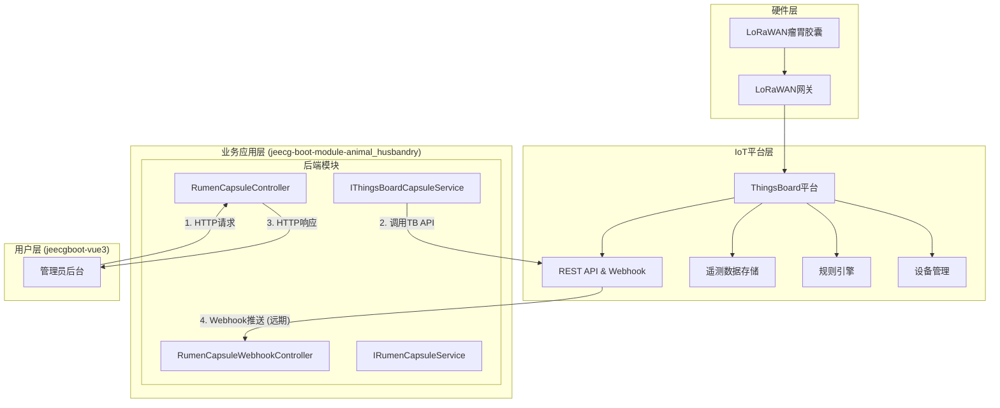
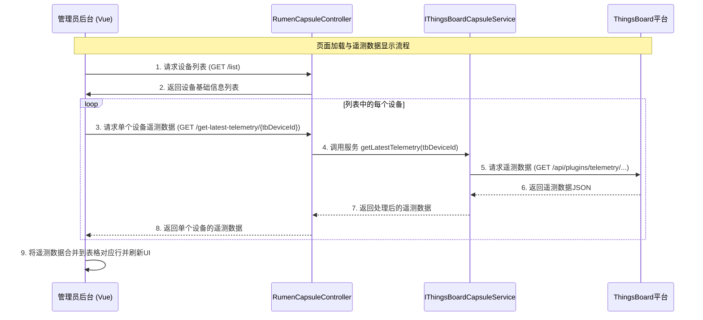

# 基于ThingsBoard平台的瘤胃胶囊管理系统设计文档 (V1.0)

**文档版本:** 1.0  
**更新日期:** 2024-08-10
**关联模块:** `jeecg-boot-module-animal_husbandry`  
**前端实现:** `jeecgboot-vue3/src/views/animal_husbandry/rumen_capsule`

---

## 1. 功能概述

本文档旨在为 **基于ThingsBoard平台的LoRaWAN瘤胃胶囊管理系统** 提供一套完整的技术架构设计与实施方案。该系统利用ThingsBoard作为核心物联网平台，对部署在牲畜体内的瘤胃胶囊设备进行生命周期管理、数据采集与状态监控，并通过JeecgBoot业务平台向上层应用提供数据支撑。

### 1.1 系统定位
- **IoT平台**: ThingsBoard作为设备管理、数据处理和遥测数据存储中心。
- **通信协议**: LoRaWAN低功耗广域网。
- **业务平台**: JeecgBoot智慧畜牧模块 (`jeecg-boot-module-animal_husbandry`)。
- **设备类型**: 支持LoRaWAN的电池供电型瘤胃胶囊。

### 1.2 核心功能
- 瘤胃胶囊设备信息的增、删、改、查。
- 准实时监控设备状态，包括体温、活动量、信号强度、设备电量等。
- 设备与牲畜的绑定/解绑管理。
- (远期) 设备异常告警推送与处理。
- (远期) 历史遥测数据的可视化分析与报表。

## 2. 系统架构设计

### 2.1 整体架构图



### 2.2 数据流向图 (主动拉取模式)



## 3. ThingsBoard集成架构

### 3.1 设备模型设计

#### 3.1.1 设备属性 (Attributes)
- **服务器属性 (Server-side)**: `bindAnimalId`, `farmId` (所属牧场ID), `firmwareVersion`等业务管理属性。
- **共享属性 (Shared)**: `telemetryUploadInterval` (遥测上报间隔), `heartbeatInterval` (心跳间隔)等可由云端配置的参数。

#### 3.1.2 遥测数据 (Telemetry)
基于提供的 **接口六** 数据，设备上报的关键遥测数据Key包括：
- `Temperature`: 体温
- `Temperature_1` 到 `Temperature_6`: 多点温度/历史温度
- `Gastric_momentum`: 胃动量/活动量
- `rssi`: 接收信号强度指示
- `loRaSNR`: LoRa信噪比
- `sensorStatus`: 传感器状态 (如: `Reboot`)
- `batteryLevel`: 电池电量 (需设备上报，当前接口未体现，但为核心指标)

### 3.2 规则引擎与Webhook (远期规划)
- **规则链**:
    1.  **数据解析**: 解析LoRaWAN原始报文，转换为遥测数据JSON。
    2.  **告警生成**: 当`Temperature`超出阈值或`batteryLevel`低于20%时，创建并推送告警。
    3.  **Webhook推送**: 将解析后的遥测数据或生成的告警，通过HTTP POST推送到JeecgBoot的Webhook接口。
- **Webhook配置**:
    - **URL**: `http://<jeecg-boot-host>:<port>/jeecg-boot/animal_husbandry/rumenCapsule/webhook`
    - **Method**: `POST`
    - **Body**: `${data}` (JSON格式)

## 4. 数据库设计

### 4.1 瘤胃胶囊设备表 (`ah_rumen_capsule`)
该表结构根据 **接口四** 和 **接口六** 的数据进行精确设计，用于存储设备的基础信息和最新的遥测数据快照。

```sql
CREATE TABLE `ah_rumen_capsule` (
  `id` varchar(36) NOT NULL COMMENT '主键 (UUID)',
  `create_by` varchar(50) DEFAULT NULL COMMENT '创建人',
  `create_time` datetime DEFAULT NULL COMMENT '创建日期',
  `update_by` varchar(50) DEFAULT NULL COMMENT '更新人',
  `update_time` datetime DEFAULT NULL COMMENT '更新日期',

  -- === 业务核心字段 ===
  `capsule_name` varchar(255) DEFAULT NULL COMMENT '胶囊名称 (来自ThingsBoard设备的Label, 用户可自定义)',
  `bind_animal_id` varchar(36) DEFAULT NULL COMMENT '绑定牲畜ID (业务系统内部关联)',
  
  -- === ThingsBoard 设备基础信息 (来自接口四) ===
  `tb_device_id` varchar(255) NOT NULL COMMENT 'ThingsBoard设备ID (来自接口四返回的 id.id)',
  `dev_eui` varchar(255) DEFAULT NULL COMMENT 'LoRaWAN DevEUI (来自接口四返回的 name)',
  `device_profile_name` varchar(255) DEFAULT NULL COMMENT '设备配置文件名称 (来自接口四返回的 deviceProfileName)',

  -- === LoRaWAN 配置信息 (通常在设备激活时手动录入) ===
  `app_eui` varchar(255) DEFAULT NULL COMMENT 'LoRaWAN AppEUI (需手动录入)',
  `app_key` varchar(255) DEFAULT NULL COMMENT 'LoRaWAN AppKey (需手动录入, 敏感信息建议加密存储)',
  
  -- === 最新遥测数据 (来自接口六, 由后端服务或Webhook实时更新) ===
  `temperature` decimal(5,2) DEFAULT NULL COMMENT '最新温度 (来自接口六遥测数据 Temperature)',
  `gastric_momentum` int(11) DEFAULT NULL COMMENT '胃动量 (来自接口六遥测数据 Gastric_momentum)',
  `rssi` int(11) DEFAULT NULL COMMENT '信号强度 (来自接口六遥测数据 rssi)',
  `snr` decimal(4,1) DEFAULT NULL COMMENT '信噪比 (来自接口六遥测数据 loRaSNR)',
  `battery_level` int(11) DEFAULT NULL COMMENT '电池电量 (需设备上报, 本次接口数据未体现, 预留字段)',
  
  -- === 设备状态与心跳 ===
  `status` varchar(50) DEFAULT 'INACTIVE' COMMENT '设备状态 (INACTIVE-未激活, NORMAL-正常, FAULTY-故障, OFFLINE-离线)',
  `last_sensor_status` varchar(100) DEFAULT NULL COMMENT '传感器最后状态 (来自接口六遥测数据 sensorStatus)',
  `last_heartbeat_time` datetime DEFAULT NULL COMMENT '最后心跳时间 (取接口六遥测数据中最新的ts)',
  
  PRIMARY KEY (`id`),
  UNIQUE KEY `uk_tb_device_id` (`tb_device_id`),
  UNIQUE KEY `uk_dev_eui` (`dev_eui`)
) ENGINE=InnoDB DEFAULT CHARSET=utf8mb4 COMMENT='瘤胃胶囊设备表';
```
## 5. 后端接口设计

### 5.1 设备管理控制器 (`RumenCapsuleController.java`)
- **路径**: `/animal_husbandry/rumenCapsule`
- **职责**: 提供对瘤胃胶囊设备的基础CRUD操作，并增加一个用于获取实时遥测数据的接口。

```java
@Tag(name="瘤胃胶囊设备管理")
@RestController
@RequestMapping("/animal_husbandry/rumenCapsule")
@Slf4j
public class RumenCapsuleController extends JeecgController<RumenCapsule, IRumenCapsuleService> {

    @Autowired
    private IThingsBoardCapsuleService thingsBoardCapsuleService;

    /**
     * 分页列表查询
     */
    @Operation(summary="分页列表查询")
    @GetMapping(value = "/list")
    public Result<IPage<RumenCapsule>> queryPageList(/*...*/) {
        return super.queryPageList(rumenCapsule, pageNo, pageSize, req);
    }
    
    /**
     * 根据ThingsBoard设备ID获取最新遥测数据
     */
    @Operation(summary="获取设备最新遥测数据")
    @GetMapping("/get-latest-telemetry/{tbDeviceId}")
    public Result<?> getLatestTelemetry(@PathVariable("tbDeviceId") String tbDeviceId) {
        if (tbDeviceId == null || "null".equals(tbDeviceId)) {
            return Result.error("设备ID为空，无法查询遥测数据");
        }
        return thingsBoardCapsuleService.getLatestTelemetry(tbDeviceId);
    }
    
    // ... 其他标准CRUD接口由 JeecgController 基类和代码生成器提供 ...
}
```

### 5.2 ThingsBoard服务接口 (`IThingsBoardCapsuleService.java`)
- **职责**: 封装与ThingsBoard平台的所有API交互，将业务逻辑与平台API实现解耦。

```java
public interface IThingsBoardCapsuleService {
    /**
     * 从ThingsBoard获取指定设备的最新遥测数据
     * @param tbDeviceId ThingsBoard设备ID
     * @return Result<Map<String, Object>> 返回一个包含遥测键值的Map
     */
    Result<Map<String, Object>> getLatestTelemetry(String tbDeviceId);
}

@Service
@Slf4j
public class ThingsBoardCapsuleServiceImpl implements IThingsBoardCapsuleService {
    
    @Value("${thingsboard.api.url}") // 从配置文件读取TB地址
    private String thingsboardApiUrl;
    
    @Value("${thingsboard.api.token}") // 从配置文件读取认证Token
    private String thingsboardApiToken;
    
    @Autowired
    private RestTemplate restTemplate;

    @Override
    public Result<Map<String, Object>> getLatestTelemetry(String tbDeviceId) {
        String url = thingsboardApiUrl + "/api/plugins/telemetry/DEVICE/" + tbDeviceId + "/values/timeseries";
        
        // 设置请求头
        HttpHeaders headers = new HttpHeaders();
        headers.set("X-Authorization", "Bearer " + thingsboardApiToken);
        HttpEntity<String> entity = new HttpEntity<>(headers);

        try {
            ResponseEntity<String> response = restTemplate.exchange(url, HttpMethod.GET, entity, String.class);
            // ... 此处添加JSON解析逻辑，提取每个遥测key的最新值 ...
            // 解析逻辑：遍历返回的JSON对象，对每个key(如Temperature, rssi)，取其数组中第一个元素(最新)的value。
            Map<String, Object> latestTelemetry = new HashMap<>();
            // ...
            // latestTelemetry.put("Temperature", 27.8);
            // latestTelemetry.put("gastricMomentum", 814512);
            // latestTelemetry.put("rssi", -88);
            return Result.OK(latestTelemetry);
        } catch (HttpClientErrorException e) {
            log.error("请求ThingsBoard遥测数据失败，设备ID: {}, 状态码: {}", tbDeviceId, e.getStatusCode());
            return Result.error("请求物联网平台失败：" + e.getMessage());
        }
    }
}
```

## 6. 前端交互分析

- **页面路径**: `jeecgboot-vue3/src/views/animal_husbandry/rumen_capsule/`
- **文件结构**:
    - `index.vue`: 页面主组件，负责UI渲染和业务逻辑调度。
    - `capsule.api.ts`: 定义与后端交互的API函数。
    - `capsule.data.ts`: 定义表格列(columns)和搜索表单配置。

### 6.1 核心交互流程
1.  **加载列表**: 页面加载时，`useTable`钩子自动调用`getList`方法，从后端获取设备的基础信息列表（不含实时遥测数据）。
2.  **异步获取遥测数据**:
    -   `useTable`的`afterFetch`回调函数被触发，它接收到基础数据列表。
    -   该回调函数会遍历列表，对每一条含有`tbDeviceId`的记录，异步调用`getLatestTelemetry`接口。
3.  **数据合并与渲染**:
    -   使用`Promise.all`并发处理所有遥测数据请求，以提升性能。
    -   每个遥测请求成功后，将其返回的键值对 (`{ "Temperature": 27.8, ... }`) 通过`Object.assign`合并到表格数据源的对应行记录中。
    -   所有请求完成后，手动调用`setTableData`刷新表格，UI上即可显示出获取到的最新遥测数据。对于请求失败的行，可以显示"获取失败"等提示信息。

```typescript
// index.vue 关键逻辑
import { getLatestTelemetry } from './capsule.api';

const [registerTable, { getDataSource, setTableData }] = useTable({
  //...
  afterFetch: (data) => {
    // 如果列表有数据，则触发遥测数据获取
    if (data && data.length > 0) {
      fetchTelemetryForAll(data);
    }
  }
});

async function fetchTelemetryForAll(tableData) {
  const dataSource = getDataSource();
  const promises = dataSource.map(async (record, index) => {
    if (record.tbDeviceId) {
      try {
        const res = await getLatestTelemetry(record.tbDeviceId);
        // 合并数据
        Object.assign(dataSource[index], res);
      } catch (e) {
        // 异常处理
        dataSource[index].temperature = 'N/A';
        dataSource[index].gastricMomentum = 'N/A';
      }
    }
  });
  await Promise.all(promises);
  // 刷新视图
  setTableData(dataSource);
}
```
This design ensures a fast initial page load and provides a responsive user experience by progressively enhancing the displayed data. 