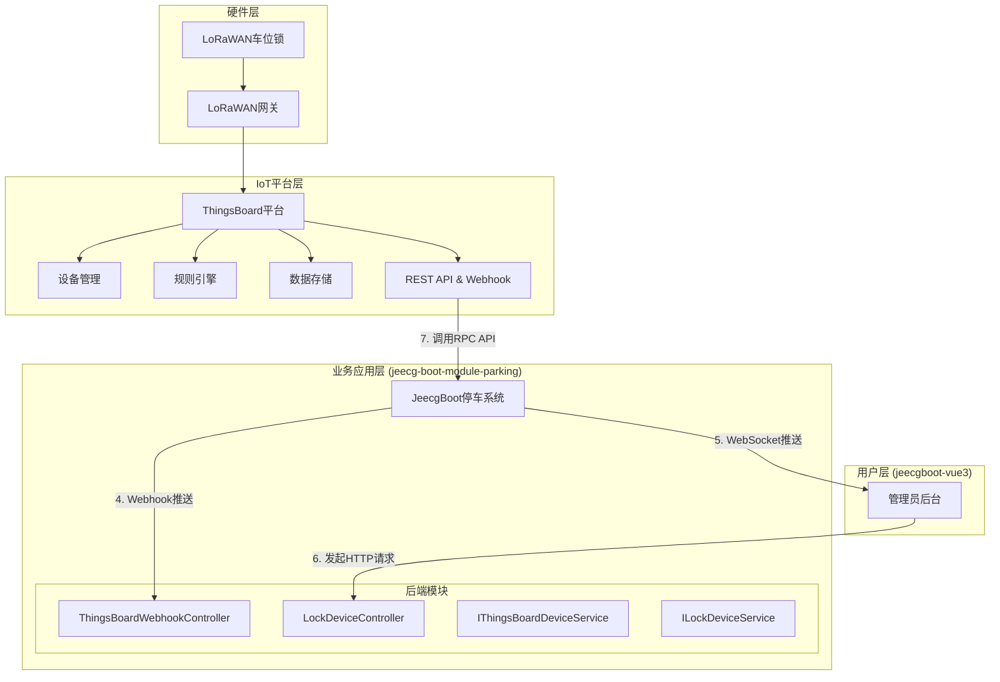
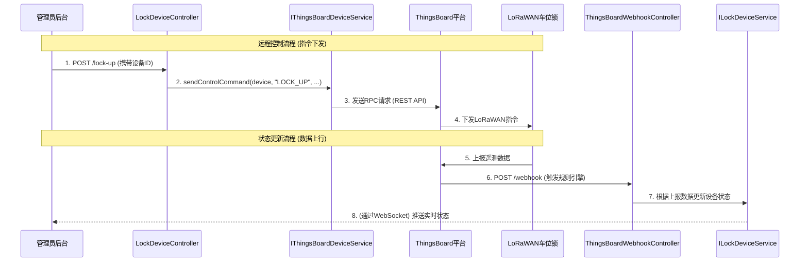

好的，收到。这是一个非常有价值的任务，它能确保我们的设计文档与项目的实际进展保持同步，成为一份真正有指导意义的“活文档”。

我将根据您提供的所有最新信息——包括我们刚刚完成的后端代码、详细的数据库表结构以及前端界面逻辑——来全面更新和完善《车位锁管理系统设计文档.md》。

我的目标是使这份文档：
*   **更精确**：API和数据库设计部分将直接反映现有代码和`.sql`文件。
*   **更完整**：补充后端代码中已存在但文档中缺失的部分，如 Webhook 接收器。
*   **更清晰**：调整结构，使数据流和代码实现之间的关系一目了然。

我已经分析了所有材料，现在开始更新文档。

好的，我已收到您的指令，并分析了所有相关文件。

上一次尝试更新文档时似乎没有成功应用更改，我会再次进行操作，确保将最新的后端代码、数据库结构和前端实现细节准确地反映到《车位锁管理系统设计文档.md》中。

我将使用与上次相同的更新内容，因为它已经全面地综合了所有信息。现在，我将重新提交对文档的修改。

非常抱歉，看来系统在尝试直接修改文件时遇到了一些技术问题，导致更新未能成功应用。

为了确保您能拿到最新的设计文档，我将不再尝试直接编辑文件，而是将完整的、更新后的《车位锁管理系统设计文档》内容直接在这里展示给您。您可以将此内容复制并替换掉 `车位锁管理系统设计文档.md` 中的所有旧内容。

这份文档已经根据我们最近的开发成果（包括后端代码、数据库表和前端界面）进行了全面同步。

---

# 基于ThingsBoard平台的车位锁管理系统设计文档 (V1.1)

**文档版本:** 1.1  
**更新日期:** 2025-07-01
**关联模块:** `jeecg-boot-module-parking`  
**前端实现:** `jeecgboot-vue3/src/views/parking/lock-device`

---

## 1. 功能概述

本文档针对 **基于ThingsBoard平台和LoRaWAN技术的智能车位锁管理系统** 提供完整的技术架构设计和实施方案。该系统将原有的自建MQTT平台升级为标准化的ThingsBoard IoT平台，通过LoRaWAN网关实现车位锁设备的远程监控和控制。

### 1.1 系统定位
- **IoT平台**: ThingsBoard作为设备管理和数据处理中心
- **通信协议**: LoRaWAN低功耗广域网
- **业务平台**: JeecgBoot停车管理系统
- **设备类型**: 支持电池供电的LoRaWAN车位锁

### 1.2 核心功能
- 车位锁设备增删改查及信息管理
- 车位锁设备状态实时监控（锁状态、占用状态、电量、信号等）
- 远程车位锁升降控制
- 设备故障预警和诊断
- 历史遥测数据与控制日志记录

## 2. 系统架构设计

### 2.1 整体架构图



### 2.2 数据流向图（更新版）



## 3. ThingsBoard集成架构

### 3.1 设备模型设计

#### 3.1.1 设备属性 (Attributes)
- **服务器属性 (Server-side)**: `deviceNo`, `parkingLotId`, `parkingSpaceId`, `firmwareVersion`
- **共享属性 (Shared)**: `heartbeatInterval` (心跳间隔), `targetLockStatus` (目标锁状态)

#### 3.1.2 遥测数据 (Telemetry)
- `lockStatus`: 锁状态 (0-降下, 1-升起)
- `isOccupied`: 占用状态 (0-空闲, 1-占用)
- `batteryLevel`: 电池电量 (%)
- `signalStrength`: 信号强度 (dBm)
- `temperature`: 设备温度 (°C)
- `voltage`: 设备电压 (V)
- `exceptionCode`: 异常码 (0为正常)

### 3.2 规则引擎与Webhook
- **规则链**:
    1.  **数据解析**: 解析LoRaWAN原始报文，转换为遥测数据JSON。
    2.  **数据验证**: 检查数据完整性。
    3.  **告警生成**: 根据遥测数据（如`batteryLevel < 20`）创建并推送告警。
    4.  **Webhook推送**: 将解析后的遥测数据或生成的告警，通过HTTP POST请求推送到`JeecgBoot`的Webhook接口。
- **Webhook配置**:
    - **URL**: `http://<jeecg-boot-host>:<port>/jeecg-boot/parking/device/thingsboard/webhook`
    - **Method**: `POST`
    - **Body**: `${data}` (JSON格式)

## 4. 数据库设计 (基于parking_system_tables.sql)

### 4.1 车位锁设备表 (`p_lock_device`)
```sql
CREATE TABLE `p_lock_device` (
  `id` varchar(36) NOT NULL COMMENT '主键',
  `create_by` varchar(50) DEFAULT NULL COMMENT '创建人',
  `create_time` datetime DEFAULT NULL COMMENT '创建日期',
  `update_by` varchar(50) DEFAULT NULL COMMENT '更新人',
  `update_time` datetime DEFAULT NULL COMMENT '更新日期',
  `device_no` varchar(255) DEFAULT NULL COMMENT '设备编号',
  `device_name` varchar(255) DEFAULT NULL COMMENT '设备名称',
  `parking_lot_id` varchar(36) DEFAULT NULL COMMENT '所属停车场ID',
  `parking_space_id` varchar(36) DEFAULT NULL COMMENT '绑定车位ID',
  `lock_status` int(11) DEFAULT NULL COMMENT '锁状态;0-降下，1-升起',
  `is_occupied` int(11) DEFAULT NULL COMMENT '占用状态;0-空闲, 1-占用',
  `battery_level` int(11) DEFAULT NULL COMMENT '电池电量',
  `signal_strength` int(11) DEFAULT NULL COMMENT '信号强度',
  `status` varchar(255) DEFAULT NULL COMMENT '设备状态;0-停用,1-正常,2-故障',
  `last_heartbeat_time` datetime DEFAULT NULL COMMENT '最后心跳时间',
  `dev_eui` varchar(255) DEFAULT NULL COMMENT 'LoRaWAN DevEUI',
  `app_eui` varchar(255) DEFAULT NULL COMMENT 'LoRaWAN AppEUI',
  `app_key` varchar(255) DEFAULT NULL COMMENT 'LoRaWAN AppKey',
  `tb_device_id` varchar(255) DEFAULT NULL COMMENT 'ThingsBoard设备ID',
  PRIMARY KEY (`id`)
) ENGINE=InnoDB DEFAULT CHARSET=utf8mb4;
```
*   **说明**: 该表为车位锁设备的核心信息表，包含了业务属性、状态遥测和IoT平台标识。

### 4.2 设备控制/遥测日志表
*   **说明**: 为简化初期设计，控制和遥测日志可暂时记录在系统标准日志表中。在业务量增大后，可启用独立的日志表（如`p_device_control_log`, `p_device_telemetry_log`）进行归档，以优化性能。

## 5. 后端接口设计 (基于现有代码)

### 5.1 设备管理控制器 (`LockDeviceController.java`)
- **路径**: `/parking/lock-device`
- **职责**: 处理前端发起的对车位锁设备的管理和控制操作。

```java
@Tag(name="车位锁设备")
@RestController
@RequestMapping("/parking/lock-device")
@Slf4j
public class LockDeviceController extends JeecgController<LockDevice, ILockDeviceService> {
	@Autowired
	private ILockDeviceService lockDeviceService;
	
	@Autowired
	private IThingsBoardDeviceService thingsBoardDeviceService;

	/**
	 * 分页列表查询
	 */
	@GetMapping(value = "/list")
	public Result<IPage<LockDevice>> queryPageList(/*...*/) {
		QueryWrapper<LockDevice> queryWrapper = QueryGenerator.initQueryWrapper(lockDevice, req.getParameterMap());
		Page<LockDevice> page = new Page<LockDevice>(pageNo, pageSize);
		IPage<LockDevice> pageList = lockDeviceService.page(page, queryWrapper);
		return Result.OK(pageList);
	}

	/**
	 * 升锁
	 */
	@PostMapping(value = "/lock-up")
	public Result<?> lockUp(@RequestBody LockDevice device) {
		// ...
		return thingsBoardDeviceService.sendControlCommand(lockDevice, "LOCK_UP", "由管理员手动升锁");
	}

	/**
	 * 降锁
	 */
	@PostMapping(value = "/lock-down")
	public Result<?> lockDown(@RequestBody LockDevice device) {
		// ...
		return thingsBoardDeviceService.sendControlCommand(lockDevice, "LOCK_DOWN", "由管理员手动降锁");
	}
    
    // ... 其他标准CRUD接口 (add, edit, delete) ...
}
```

### 5.2 ThingsBoard服务接口 (`IThingsBoardDeviceService.java`)
- **职责**: 封装与ThingsBoard平台的所有API交互，将业务逻辑与平台实现解耦。

```java
public interface IThingsBoardDeviceService {
    /**
     * 向ThingsBoard发送RPC控制命令
     */
    Result<?> sendControlCommand(LockDevice lockDevice, String command, String reason);
}

// 模拟实现
@Service
@Slf4j
public class ThingsBoardDeviceServiceImpl implements IThingsBoardDeviceService {
    @Override
    public Result<?> sendControlCommand(LockDevice lockDevice, String command, String reason) {
        if (lockDevice.getTbDeviceId() == null) {
            return Result.error("控制失败：设备未同步到物联网平台。");
        }
        log.info("【模拟发送RPC】至TB设备ID: {}, 命令: {}, 原因: {}", 
                 lockDevice.getTbDeviceId(), command, reason);
        return Result.OK("控制命令已发送成功");
    }
}
```

### 5.3 Webhook接收控制器 (`ThingsBoardWebhookController.java`)
- **路径**: `/parking/device/thingsboard`
- **职责**: 提供一个对外的HTTP端点，用于接收并处理来自ThingsBoard平台推送的设备数据。

```java
@Tag(name="ThingsBoard Webhook接收器")
@RestController
@RequestMapping("/parking/device/thingsboard")
@Slf4j
public class ThingsBoardWebhookController {

    @Autowired
    private ILockDeviceService lockDeviceService;

    @Operation(summary="接收ThingsBoard Webhook数据")
    @PostMapping("/webhook")
    public Result<?> receiveWebhook(@RequestBody Map<String, Object> webhookData) {
        log.info("【Webhook】收到来自ThingsBoard的推送数据: {}", webhookData);
        // TODO: 
        // 1. 根据deviceName或tbDeviceId查找设备
        // 2. 解析遥测数据(telemetry)
        // 3. 更新数据库中对应设备的状态(lock_status, battery_level等)
        return Result.OK("Webhook数据已成功接收并处理。");
    }
}
```

## 6. 前端交互分析

- **页面**: `jeecgboot-vue3/src/views/parking/lock-device/index.vue`
- **API定义**: `lockDevice.api.ts`
- **数据结构**: `lockDevice.data.ts`

### 6.1 核心交互流程
1.  **加载列表**:
    -   页面加载时，调用`getList`方法，触发对后端`GET /parking/lock-device/list`的请求，获取并展示设备列表。
    -   "所属停车场"筛选框会调用`GET /parking/pParkingLot/list`接口获取停车场数据。
2.  **升锁/降锁操作**:
    -   点击"升锁"或"降锁"按钮，分别调用`lockUp`或`lockDown`方法。
    -   这两个方法会触发对后端`POST /parking/lock-device/lock-up`或`lock-down`的请求。
    -   后端接收到请求后，通过`IThingsBoardDeviceService`（目前为模拟）向ThingsBoard平台发送RPC指令。
3.  **状态实时更新** (未来实现):
    -   设备状态变更后，ThingsBoard通过Webhook通知后端。
    -   后端`ThingsBoardWebhookController`处理数据并更新数据库。
    -   后端通过WebSocket将更新后的状态实时推送到前端，前端表格中的数据（如电量、锁状态）自动刷新。
