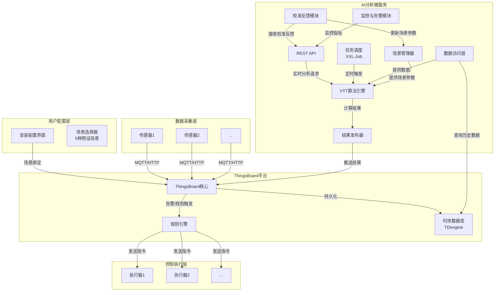
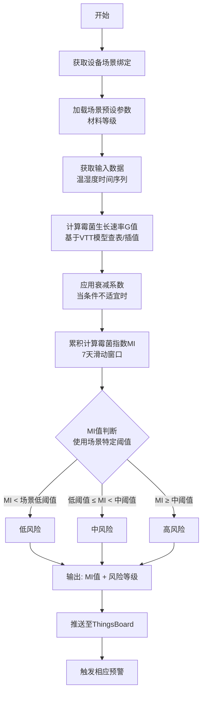

# 霉菌风险预测 AI 分析模块架构方案

# 方案一 (基于 ThingsBoard) ：

## 1. 方案概述

### 1.1 目标

本方案设计并实现一个独立的、可扩展的AI微服务模块，用于**基于工程简化版VTT算法**，将环境传感器数据转化为霉菌风险指标，并实现智能控制闭环。通过**场景化预设**机制，将专业材料科学判断封装成用户易懂的生活场景选择。

### 1.2 核心价值

*   **数据价值转化**：将原始温湿度数据转化为业务可理解的霉菌生长指数(MI)和风险等级
    
*   **智能预警联动**：基于风险指标自动触发预警和设备控制
    
*   **架构解耦**：AI分析独立于物联网平台，支持独立迭代升级
    
*   **场景化智能**：通过预设场景实现高可用性、高可靠性的风险预测
    
*   **持续优化能力**：支持通过现场核查反馈迭代算法参数
    

---

## 2. 核心业务流程

1.  **场景配置**：安装人员在设备配置时选择预设场景（如"木质家具内"、"标准墙面"等）
    
2.  **数据采集**：传感器上报温湿度数据至ThingsBoard
    
3.  **数据持久化**：ThingsBoard将数据存入时序数据库(cassandra、TDengine等)
    
4.  **定时分析**：AI模块按配置频率(如每小时)触发风险计算
    
5.  **数据获取**：AI模块查询过去一段时间(如24小时)的温湿度时间序列
    
6.  **场景参数匹配**：根据设备绑定的场景ID加载对应预设参数
    
7.  **VTT计算**：基于工程简化版VTT算法，结合场景参数计算霉菌生长指数
    
8.  **结果反馈**：将MI值和风险等级推送回ThingsBoard
    
9.  **智能联动**：根据配置模式触发设备控制
    

---

## 3. 系统架构设计

### 3.1 架构图



### 3.2 模块详细设计

#### 3.2.1 API与配置层

*   **REST API**：提供健康检查、实时分析、手动触发、场景管理接口
    
*   **配置中心**：Spring Cloud Config + Git，支持动态配置更新
    
*   **安全认证**：JWT Token认证，API密钥管理
    

#### 3.2.2 任务调度模块

*   **调度器**：XXL-Job分布式调度，支持故障转移
    
*   **任务管理**：支持按设备组、优先级调度
    
*   **监控告警**：任务执行失败自动告警
    

#### 3.2.3 数据访问层（保留原设计）

```java
// 抽象数据访问接口
public interface TimeSeriesDataRepository {
    List<SensorDataPoint> findDataPoints(String deviceId, Instant startTime, Instant endTime);
    Map<String, List<SensorDataPoint>> batchFindDataPoints(List<String> deviceIds, Instant startTime, Instant endTime);
}

// TDengine实现
@Component
@Primary
public class TDengineRepositoryImpl implements TimeSeriesDataRepository {
    // 使用连接池，支持批量查询
}

// 缓存层 - 减少频繁查询
@Component
@ConditionalOnProperty(name = "cache.enabled", havingValue = "true")
public class DataCacheManager {
    // Caffeine缓存，缓存最近查询结果
}

```

#### 3.2.4 场景管理器（简化版）

```java
@Component
public class SceneManager {
    
    // 预设场景库
    private Map<String, PresetScene> presetScenes;
    
    /**
     * 初始化预设场景库
     */
    @PostConstruct
    public void initPresetScenes() {
        presetScenes = Map.of(
            "wall", new PresetScene("墙面/天花板", "标准墙面场景", 3.0),
            "wood_furniture", new PresetScene("木质家具内", "高风险材料区域", 4.0),
            "high_humidity", new PresetScene("高湿功能区", "卫生间/厨房", 3.5),
            "window_corner", new PresetScene("窗台/外墙角", "冷桥区域", 3.5),
            "equipment_area", new PresetScene("设备区/管道间", "最高风险区域", 4.0)
        );
    }
    
    /**
     * 获取设备对应的场景参数
     */
    public SceneParameter getSceneForDevice(String deviceId) {
        String sceneId = deviceSceneMapping.getOrDefault(deviceId, "wall");
        PresetScene preset = presetScenes.get(sceneId);
        
        return SceneParameter.builder()
            .sceneId(sceneId)
            .sceneName(preset.getName())
            .materialLevel(preset.getMaterialLevel())
            .riskThreshold(getDefaultThreshold(sceneId))
            .version("1.0")
            .build();
    }
    
    /**
     * 更新设备场景绑定
     */
    public void bindDeviceToScene(String deviceId, String sceneId) {
        deviceSceneMapping.put(deviceId, sceneId);
        // 记录到数据库
        saveDeviceSceneBinding(deviceId, sceneId);
    }
}

```

#### 3.2.5 VTT算法引擎（输入简化版）

```java
@Component
public class VTTAlgorithmEngine {
    
    // 场景管理器
    private SceneManager sceneManager;
    
    // 数据预处理器
    private DataPreprocessor dataPreprocessor;
    
    // G值计算器
    private GValueCalculator gValueCalculator;
    
    // MI值累积器
    private MIAccumulator miAccumulator;
    
    /**
     * 计算霉菌风险（简化输入）
     */
    public RiskAnalysisResult calculateRisk(String deviceId, 
                                            List<SensorDataPoint> dataPoints) {
        // 1. 获取设备对应的场景参数（内部获取，不是输入参数）
        SceneParameter sceneParam = sceneManager.getSceneForDevice(deviceId);
        
        // 2. 数据预处理
        ProcessedData processed = dataPreprocessor.process(dataPoints);
        
        // 3. 计算每小时G值（仅使用materialLevel）
        List<Double> gValues = gValueCalculator.calculateHourlyGValues(
            processed, sceneParam.getMaterialLevel());
        
        // 4. 计算累积MI值（考虑衰减）
        double miValue = miAccumulator.calculateMI(gValues);
        
        // 5. 转换为风险概率和等级
        return convertToRiskResult(deviceId, miValue, sceneParam);
    }
}

```

#### 3.2.6 校准反馈模块（保留原设计）

```java
@Component
public class CalibrationFeedbackModule {
    
    // 现场核查结果接收
    @PostMapping("/api/calibration/feedback")
    public void receiveFeedback(@RequestBody CalibrationFeedback feedback) {
        // 1. 验证反馈数据
        validateFeedback(feedback);
        
        // 2. 获取设备对应场景
        String sceneId = getDeviceScene(feedback.getDeviceId());
        
        // 3. 更新场景统计
        updateSceneStatistics(sceneId, feedback);
        
        // 4. 判断是否需要参数优化
        if (shouldOptimize(sceneId)) {
            optimizeSceneParameters(sceneId);
        }
        
        // 5. 记录校准历史
        saveCalibrationHistory(feedback);
    }
    
    /**
     * 自动优化场景参数
     */
    private void optimizeSceneParameters(String sceneId) {
        // 基于历史反馈数据，调整materialLevel
        // 获取当前参数
        PresetScene currentScene = presetScenes.get(sceneId);
        
        // 计算新参数（基于统计结果）
        Double newMaterialLevel = calculateOptimalMaterialLevel(sceneId);
        
        // 创建新版本参数
        PresetScene newScene = currentScene.clone();
        newScene.setBaseMaterialLevel(newMaterialLevel);
        newScene.setVersion(generateNewVersion());
        
        // 执行A/B测试
        startAbTest(sceneId, currentScene, newScene);
    }
    
    // 参数版本管理
    public void updateSceneParameter(String sceneId, 
                                     PresetScene newScene, 
                                     String version) {
        // 支持多版本参数管理
        // A/B测试支持
    }
}

```

#### 3.2.7 监控与告警模块（保留原设计）

```java
@Component
public class MonitoringModule {
    
    // Prometheus指标
    private final MeterRegistry meterRegistry;
    
    // 关键指标
    private final Counter analysisCounter;
    private final Timer analysisTimer;
    private final Gauge riskLevelGauge;
    
    // 场景相关指标
    private final Map<String, Counter> sceneAnalysisCounters;
    
    // 业务告警
    public void triggerBusinessAlert(String deviceId, 
                                     RiskLevel level, 
                                     String message) {
        // 发送到钉钉/企业微信/邮件
    }
    
    /**
     * 记录场景分析统计
     */
    public void recordSceneAnalysis(String sceneId, RiskLevel riskLevel) {
        String counterName = "mold.scene.analysis.count";
        Counter counter = sceneAnalysisCounters.computeIfAbsent(sceneId, 
            id -> Counter.builder(counterName)
                .tag("scene", id)
                .tag("riskLevel", riskLevel.name())
                .register(meterRegistry));
        counter.increment();
    }
}

```
---

## 4. 技术栈选型

| 模块 | 技术选型 | 说明 |
| --- | --- | --- |
| **后端框架** | Spring Boot 3.x + Spring Cloud | 微服务生态完善 |
| **任务调度** | XXL-Job 2.4.0 | 分布式任务调度 |
| **数据访问** | Spring Data JDBC + HikariCP | 轻量级，高性能连接池 |
| **VTT算法** | 自定义Java实现 + JJScience（科学计算） | 工程简化版算法 |
| **缓存** | Caffeine 3.x | 内存缓存，减少DB查询 |
| **配置中心** | Spring Cloud Config + Git | 动态配置管理 |
| **监控** | Micrometer + Prometheus + Grafana | 全方位监控 |
| **日志** | Logback + ELK Stack | 日志聚合分析 |
| **安全** | Spring Security + JWT | API安全认证 |
| **容器化** | Docker + Docker Compose | 开发环境 |
| **生产编排** | Kubernetes + Helm | 生产部署 |

---

## 5. 工程简化版VTT算法实现

### 5.1 算法流程图



### 5.2 核心算法组件（简化版）

```java
/**
 * G值计算器 - 基于VTT模型（简化版）
 */
@Component
public class GValueCalculator {
    
    // VTT模型查表（工程简化版）
    private static final Map<TempHumidityPair, Double> G_VALUE_TABLE = loadGValueTable();
    
    /**
     * 根据温湿度计算G值
     */
    public double calculateGValue(double temperature, double humidity, 
                                  double materialLevel) {
        // 1. 基础G值查表
        double baseG = lookupGValue(temperature, humidity);
        
        // 2. 应用材料修正系数（从场景参数获取）
        double materialFactor = getMaterialFactor(materialLevel);
        
        return baseG * materialFactor;
    }
    
    /**
     * 计算每小时G值序列
     */
    public List<Double> calculateHourlyGValues(List<SensorDataPoint> hourlyData,
                                               double materialLevel) {
        return hourlyData.stream()
            .map(data -> calculateGValue(data.getTemperature(), 
                                         data.getHumidity(), materialLevel))
            .collect(Collectors.toList());
    }
}

/**
 * MI值累积计算器
 */
@Component
public class MIAccumulator {
    
    // 衰减系数（当G≤0时）
    private static final double DECAY_FACTOR = 0.95;
    
    /**
     * 计算7天累积MI值
     */
    public double calculateMI(List<Double> gValues) {
        double mi = 0.0;
        
        for (Double g : gValues) {
            if (g > 0) {
                mi += g;  // 生长累积
            } else {
                mi *= DECAY_FACTOR;  // 衰减
                mi = Math.max(mi, 0);  // 不低于0
            }
        }
        
        // 限制在0-6范围内
        return Math.min(Math.max(mi, 0), 6);
    }
}

```
---

## 6. 数据模型设计

### 6.1 核心领域对象（简化输入，保留完整业务对象）

```java
// 传感器数据点（API输入简化版）
@Data
public class SensorDataPoint {
    @NotNull
    private Instant timestamp;     // 时间戳
    
    @Min(-50) @Max(100)
    private Double temperature;    // 温度
    
    @Min(0) @Max(100)
    private Double humidity;       // 湿度
}

// 实时分析请求（最小输入）
@Data
public class RealtimeAnalysisRequest {
    @NotNull
    private String deviceId;            // 设备ID
    
    @NotNull
    private String sceneId;             // 场景标识
    
    @NotNull
    @Size(min = 1)
    private List<SensorDataPoint> dataPoints;  // 温湿度数据点
    
    // 可选：增量计算标识
    private Boolean incremental = false;
}

// 预设场景定义（保留完整业务对象）
@Data
public class PresetScene {
    private String sceneId;           // wall, wood_furniture等
    private String sceneName;         // 显示名称
    private String description;       // 场景描述
    private Double baseMaterialLevel; // 基准材料等级
    private RiskThreshold threshold;  // 场景特定阈值
    private String icon;              // UI图标
    private Integer usageCount;       // 使用次数统计
    private Double accuracyScore;     // 准确率评分
    private String version;           // 参数版本
    private Boolean isActive;         // 是否激活
}

// 场景参数（运行时使用）
@Data
public class SceneParameter {
    private String sceneId;           // 场景标识，如"wall", "wood_furniture"
    private String sceneName;         // 场景名称，如"标准墙面"
    private Double materialLevel;     // 材料等级，3.0, 4.0等
    private RiskThreshold threshold;  // 风险阈值配置
    private String version;           // 参数版本
}

// 风险分析结果（保留完整）
@Data
public class RiskAnalysisResult {
    private String deviceId;
    private Instant analysisTime;
    
    // VTT算法输出
    private Double moldIndex;           // MI值，0-6
    private Double moldRiskProbability; // 风险概率，0.0-1.0
    private RiskLevel riskLevel;        // 风险等级
    
    // 场景信息
    private String sceneId;
    private String sceneName;
    private Integer dataPointsCount;    // 使用的数据点数
}

// 校准反馈（保留完整）
@Data
public class CalibrationFeedback {
    private String deviceId;
    private String sceneId;
    private Instant checkTime;
    private Boolean moldFound;          // 是否发现霉斑
    private MoldSeverity severity;      // 严重程度
    private Double predictedMI;         // 预测的MI值
    private Double actualMI;            // 实际评估值
    private String checker;             // 核查人员
    private String comments;            // 备注
    private List<String> photoUrls;     // 现场照片
}

// 设备-场景绑定（保留完整）
@Data
public class DeviceSceneBinding {
    private String deviceId;
    private String sceneId;
    private String presetVersion;     // 预设参数版本
    private Instant bindTime;
    private String installer;         // 安装人员
    private String locationNote;      // 位置备注
}

```

### 6.2 数据库设计（保留完整）

```sql
-- 预设场景表
CREATE TABLE preset_scenes (
    scene_id VARCHAR(50) PRIMARY KEY,
    scene_name VARCHAR(100),
    description VARCHAR(500),
    base_material_level DECIMAL(3,1),
    low_threshold DECIMAL(3,1),
    medium_threshold DECIMAL(3,1),
    high_threshold DECIMAL(3,1),
    icon_url VARCHAR(200),
    usage_count INT DEFAULT 0,
    accuracy_score DECIMAL(4,3),
    current_version VARCHAR(20),
    is_active BOOLEAN DEFAULT true,
    created_time TIMESTAMP,
    updated_time TIMESTAMP
);

-- 设备场景绑定表
CREATE TABLE device_scene_bindings (
    id BIGINT AUTO_INCREMENT PRIMARY KEY,
    device_id VARCHAR(50) UNIQUE,
    scene_id VARCHAR(50),
    preset_version VARCHAR(20),
    bind_time TIMESTAMP,
    installer VARCHAR(100),
    location_note TEXT,
    created_time TIMESTAMP DEFAULT CURRENT_TIMESTAMP,
    INDEX idx_device (device_id),
    FOREIGN KEY (scene_id) REFERENCES preset_scenes(scene_id)
);

-- 风险计算结果表（本地缓存）
CREATE TABLE risk_results (
    id BIGINT AUTO_INCREMENT PRIMARY KEY,
    device_id VARCHAR(50),
    scene_id VARCHAR(50),
    analysis_time TIMESTAMP,
    mold_index DECIMAL(4,2),
    risk_probability DECIMAL(3,2),
    risk_level VARCHAR(20),
    data_points_count INT,
    created_time TIMESTAMP DEFAULT CURRENT_TIMESTAMP,
    INDEX idx_device_time (device_id, analysis_time),
    INDEX idx_scene_time (scene_id, analysis_time)
);

-- 校准反馈表
CREATE TABLE calibration_feedbacks (
    id BIGINT AUTO_INCREMENT PRIMARY KEY,
    device_id VARCHAR(50),
    scene_id VARCHAR(50),
    check_time TIMESTAMP,
    mold_found BOOLEAN,
    severity VARCHAR(20),
    predicted_mi DECIMAL(4,2),
    actual_mi DECIMAL(4,2),
    feedback_type VARCHAR(20), -- 'false_positive', 'false_negative', 'correct'
    checker VARCHAR(50),
    comments TEXT,
    created_time TIMESTAMP DEFAULT CURRENT_TIMESTAMP,
    INDEX idx_scene_feedback (scene_id, check_time)
);

-- 场景反馈统计表（用于参数优化）
CREATE TABLE scene_feedback_stats (
    scene_id VARCHAR(50),
    feedback_date DATE,
    total_checks INT DEFAULT 0,
    true_positives INT DEFAULT 0,
    false_positives INT DEFAULT 0,
    false_negatives INT DEFAULT 0,
    accuracy DECIMAL(5,4),
    PRIMARY KEY (scene_id, feedback_date),
    FOREIGN KEY (scene_id) REFERENCES preset_scenes(scene_id)
);

```
---

## 7. API接口设计（优化版）

### 7.1 核心分析API（简化输入）

```yaml
# 实时分析API（最小输入）
POST /api/analyze/realtime
Body: {
  "deviceId": "sensor_001",
  "sceneId": "wood_furniture",
  "dataPoints": [
    {
      "timestamp": "2024-01-20T10:00:00Z",
      "temperature": 22.5,
      "humidity": 65.0
    }
    // ... 更多数据点
  ],
  "incremental": false
}

# 手动触发分析API
POST /api/analyze/manual
Body: {
  "deviceId": "sensor_001",
  "startTime": "2024-01-01T00:00:00Z",  # 可选
  "endTime": "2024-01-01T23:59:59Z"     # 可选
}

# 批量分析API
POST /api/analyze/batch
Body: {
  "deviceIds": ["sensor1", "sensor2"],
  "startTime": "2024-01-01T00:00:00Z",
  "endTime": "2024-01-01T23:59:59Z"
}

```

### 7.2 管理API（保留原设计）

```yaml
# 健康检查
GET /actuator/health

# 预设场景管理
GET    /api/scenes/presets               # 获取所有预设场景
POST   /api/scenes/presets               # 创建新预设场景
PUT    /api/scenes/presets/{sceneId}     # 更新预设场景
DELETE /api/scenes/presets/{sceneId}     # 删除预设场景

# 设备-场景绑定管理
GET    /api/devices/{deviceId}/scene     # 获取设备绑定的场景
POST   /api/devices/{deviceId}/bind-scene # 绑定设备到场景
Body: {
  "sceneId": "wood_furniture",
  "installer": "张三",
  "locationNote": "主卧衣柜内部"
}

# 场景统计信息
GET    /api/scenes/{sceneId}/statistics  # 获取场景统计信息
GET    /api/scenes/usage-report          # 场景使用情况报告

# 校准反馈
POST /api/calibration/feedback
Body: CalibrationFeedback对象

# 场景优化建议
GET /api/scenes/{sceneId}/optimization-suggestions

```

### 7.3 ThingsBoard接口（保留原设计）

```java
// 遥测数据推送
POST http://{thingsboard_host}/api/v1/{ACCESS_TOKEN}/telemetry
Body: {
  "ts": 1672531200000,
  "values": {
    "moldIndex": 3.2,
    "riskProbability": 0.65,
    "riskLevel": "MEDIUM",
    "sceneId": "wood_furniture",
    "sceneName": "木质家具内"
  }
}

// 场景绑定信息推送
POST http://{thingsboard_host}/api/v1/{ACCESS_TOKEN}/attributes
Body: {
  "sceneId": "wood_furniture",
  "sceneName": "木质家具内",
  "sceneBindTime": "2024-01-20T10:30:00Z"
}

// RPC命令发送（模式C使用）
POST http://{thingsboard_host}/api/rpc/oneway/{deviceId}
Body: {
  "method": "turnOn",
  "params": {
    "duration": 300
  }
}

```
---

## 8. 三种联动控制模式实现（保留原设计）

### 8.1 模式A：规则引擎（推荐）

```javascript
// ThingsBoard规则链配置示例（场景化增强版）
// 1. 接收moldIndex遥测数据
// 2. 获取设备场景属性
// 3. 根据场景使用不同的阈值判断条件
// 4. 查找关联设备
// 5. 发送RPC命令

// 示例规则：不同场景使用不同阈值
var sceneId = metadata.sceneId;
var threshold = 3.0; // 默认阈值

if (sceneId === 'wood_furniture') {
    threshold = 2.5; // 木质家具使用更敏感阈值
} else if (sceneId === 'equipment_area') {
    threshold = 2.0; // 设备区使用最敏感阈值
}

if (msg.moldIndex > threshold) {
    // 触发告警
    return {msg: msg, metadata: metadata, msgType: msgType};
}

```

### 8.2 模式B：设备Profile告警（场景化）

```javascript
// ThingsBoard告警规则配置（场景化阈值）
{
  "alarmRules": {
    "moldRiskHigh": {
      "condition": {
        "condition": [
          {
            "key": {
              "key": "moldIndex",
              "type": "TIME_SERIES"
            },
            "predicate": {
              "type": "NUMERIC",
              "operation": "GREATER",
              "value": {
                "type": "ATTRIBUTE",
                "key": "sceneThreshold", // 从设备属性获取阈值
                "defaultValue": 3.0
              }
            }
          }
        ]
      },
      "schedule": null,
      "alarmDetails": "霉菌指数超标 - 场景: ${sceneName}"
    }
  }
}

```

### 8.3 模式C：直接RPC调用（场景化）

```java
@Component
public class DirectRpcController {
    
    @Autowired
    private ThingsBoardClient tbClient;
    
    @Autowired
    private SceneManager sceneManager;
    
    @Scheduled(fixedRate = 300000) // 每5分钟
    public void checkAndControl() {
        List<RiskAnalysisResult> results = // 获取风险结果
        
        results.forEach(this::controlDeviceByScene);
    }
    
    private void controlDeviceByScene(RiskAnalysisResult result) {
        // 1. 获取设备场景
        SceneParameter sceneParam = sceneManager.getSceneForDevice(result.getDeviceId());
        
        // 2. 根据场景确定控制策略
        ControlStrategy strategy = getControlStrategy(sceneParam.getSceneId(), 
                                                     result.getRiskLevel());
        
        // 3. 查找关联设备
        String fanDeviceId = findAssociatedFan(result.getDeviceId());
        
        // 4. 发送控制指令
        if (strategy.shouldControl()) {
            tbClient.sendRpcCommand(fanDeviceId, "turnOn", 
                Map.of("duration", strategy.getDuration(),
                       "reason", "mold_risk_" + result.getRiskLevel(),
                       "scene", sceneParam.getSceneId()));
        }
    }
    
    private ControlStrategy getControlStrategy(String sceneId, RiskLevel riskLevel) {
        // 不同场景采用不同控制策略
        if ("equipment_area".equals(sceneId) && riskLevel == RiskLevel.MEDIUM) {
            return new ControlStrategy(true, 900); // 设备区中等风险就控制15分钟
        } else if (riskLevel == RiskLevel.HIGH) {
            return new ControlStrategy(true, 600); // 高风险控制10分钟
        } else if ("wood_furniture".equals(sceneId) && riskLevel == RiskLevel.MEDIUM) {
            return new ControlStrategy(true, 300); // 木质家具中等风险控制5分钟
        }
        return new ControlStrategy(false, 0);
    }
}

```
---

## 9. 错误处理与容错机制（保留原设计）

### 9.1 重试策略

```java
@Configuration
public class RetryConfig {
    
    @Bean
    public RetryTemplate retryTemplate() {
        return RetryTemplate.builder()
            .maxAttempts(3)
            .exponentialBackoff(1000, 2, 10000)
            .retryOn(DataAccessException.class)
            .retryOn(HttpClientErrorException.class)
            .retryOn(SceneNotFoundException.class) // 新增场景相关异常
            .build();
    }
}

// 使用示例
@Service
public class ThingsBoardPublisher {
    
    @Autowired
    private RetryTemplate retryTemplate;
    
    public void publishTelemetry(String deviceToken, TelemetryData data) {
        retryTemplate.execute(context -> {
            // 发布逻辑
            return tbRestClient.postTelemetry(deviceToken, data);
        });
    }
}

```

### 9.2 熔断器配置（场景化增强）

```yaml
# application.yml
resilience4j:
  circuitbreaker:
    instances:
      tbApi:
        failure-rate-threshold: 50
        sliding-window-size: 10
        minimum-number-of-calls: 5
        wait-duration-in-open-state: 10s
      sceneService:
        failure-rate-threshold: 40
        sliding-window-size: 20
        minimum-number-of-calls: 10
        wait-duration-in-open-state: 30s
  retry:
    instances:
      dataAccess:
        max-attempts: 3
        wait-duration: 500ms
      sceneData:
        max-attempts: 5
        wait-duration: 1s

```

### 9.3 场景回退机制

```java
@Component
public class SceneFallbackHandler {
    
    private static final String DEFAULT_SCENE_ID = "wall";
    private static final Double DEFAULT_MATERIAL_LEVEL = 3.0;
    
    /**
     * 获取场景参数（带回退机制）
     */
    public SceneParameter getSceneWithFallback(String deviceId) {
        try {
            return sceneManager.getSceneForDevice(deviceId);
        } catch (SceneNotFoundException e) {
            log.warn("未找到设备{}的场景绑定，使用默认场景", deviceId);
            return createDefaultScene();
        } catch (Exception e) {
            log.error("获取场景参数失败: {}", e.getMessage());
            return createDefaultScene();
        }
    }
    
    private SceneParameter createDefaultScene() {
        return SceneParameter.builder()
            .sceneId(DEFAULT_SCENE_ID)
            .sceneName("默认墙面场景")
            .materialLevel(DEFAULT_MATERIAL_LEVEL)
            .version("fallback-1.0")
            .build();
    }
}

```
---

## 10. 监控与告警（保留原设计）

### 10.1 监控指标（场景化增强）

```java
@Component
public class MetricsCollector {
    
    // 业务指标
    @MeterBinder
    public MeterBinder businessMetrics() {
        return new MeterBinder() {
            @Override
            public void bindTo(MeterRegistry registry) {
                // 总体指标
                Gauge.builder("mold.risk.level", 
                    () -> getCurrentRiskLevel())
                    .tag("application", "mold-ai-service")
                    .register(registry);
                    
                Counter.builder("mold.analysis.count")
                    .description("总分析次数")
                    .register(registry);
                    
                Timer.builder("mold.analysis.duration")
                    .description("分析耗时")
                    .publishPercentiles(0.5, 0.95, 0.99)
                    .register(registry);
                
                // 场景相关指标
                Gauge.builder("mold.scene.usage", 
                    () -> getActiveSceneCount())
                    .description("活跃场景数量")
                    .register(registry);
                    
                Counter.builder("mold.scene.analysis.count")
                    .description("按场景分析次数")
                    .tag("scene", "") // 动态标签
                    .register(registry);
                    
                // 准确性指标
                Gauge.builder("mold.scene.accuracy", 
                    () -> getSceneAccuracy("wall"))
                    .tag("scene", "wall")
                    .description("场景预测准确率")
                    .register(registry);
            }
        };
    }
}

```

### 10.2 告警规则（场景化）

```yaml
# prometheus/rules.yml
groups:
  - name: mold_ai_service
    rules:
      - alert: HighFailureRate
        expr: rate(http_server_requests_seconds_count{status="500"}[5m]) > 0.1
        for: 2m
        labels:
          severity: warning
        annotations:
          summary: "高失败率告警"
          
      - alert: TaskExecutionFailed
        expr: xxl_job_task_failure_total > 0
        for: 1m
        labels:
          severity: critical
        annotations:
          summary: "任务执行失败"
          
      - alert: SceneAccuracyLow
        expr: mold_scene_accuracy < 0.7
        for: 1h
        labels:
          severity: warning
        annotations:
          summary: "场景{{ $labels.scene }}准确率过低"
          description: "场景{{ $labels.scene }}准确率为{{ $value }}，低于阈值0.7"
          
      - alert: SceneUsageImbalance
        expr: stddev(mold_scene_usage_count) / avg(mold_scene_usage_count) > 0.5
        for: 30m
        labels:
          severity: info
        annotations:
          summary: "场景使用不均衡"
          description: "各场景使用量差异过大，可能存在配置问题"

```
---

## 11. 安全设计（保留原设计）

### 11.1 API安全

```java
@Configuration
@EnableWebSecurity
public class SecurityConfig extends WebSecurityConfigurerAdapter {
    
    @Override
    protected void configure(HttpSecurity http) throws Exception {
        http
            .csrf().disable()
            .authorizeRequests()
            .antMatchers("/actuator/health").permitAll()
            .antMatchers("/actuator/metrics").hasRole("MONITOR")
            .antMatchers("/api/scenes/**").hasRole("ADMIN") // 场景管理需要管理员权限
            .antMatchers("/api/calibration/**").hasRole("MAINTENANCE") // 校准需要维护权限
            .antMatchers("/api/analytics/**").hasRole("SERVICE")
            .antMatchers("/api/devices/**").hasAnyRole("SERVICE", "INSTALLER") // 安装人员可绑定场景
            .anyRequest().authenticated()
            .and()
            .httpBasic()
            .and()
            .sessionManagement()
            .sessionCreationPolicy(SessionCreationPolicy.STATELESS);
    }
}

```

### 11.2 配置安全

```yaml
# bootstrap.yml
spring:
  cloud:
    config:
      uri: http://config-server:8888
      fail-fast: true
      username: ${CONFIG_SERVER_USERNAME}
      password: ${CONFIG_SERVER_PASSWORD}
      
encrypt:
  key: ${ENCRYPT_KEY:default-key}

# 场景参数加密
scene:
  encryption:
    enabled: true
    algorithm: AES/CBC/PKCS5Padding
    key: ${SCENE_ENCRYPT_KEY}

```
---

## 12. 部署架构（保留原设计）

### 12.1 Docker部署

```dockerfile
# Dockerfile
FROM openjdk:17-jdk-slim
WORKDIR /app

# 安装必要的工具
RUN apt-get update && apt-get install -y curl gnupg && \
    apt-get clean && rm -rf /var/lib/apt/lists/*

# 创建非root用户
RUN groupadd -r spring && useradd -r -g spring spring
USER spring:spring

COPY target/mold-ai-service.jar app.jar

# 健康检查
HEALTHCHECK --interval=30s --timeout=3s \
  CMD curl -f http://localhost:8080/actuator/health || exit 1

EXPOSE 8080

# 默认场景配置文件
COPY config/preset-scenes.json /app/config/preset-scenes.json

ENTRYPOINT ["java", "-jar", "app.jar", \
            "--spring.config.additional-location=/app/config/"]

```

### 12.2 Kubernetes部署

```yaml
# deployment.yaml
apiVersion: apps/v1
kind: Deployment
metadata:
  name: mold-ai-service
  namespace: mold-monitoring
  labels:
    app: mold-ai-service
    version: v2.0-scene
spec:
  replicas: 2
  selector:
    matchLabels:
      app: mold-ai-service
  template:
    metadata:
      labels:
        app: mold-ai-service
        version: v2.0-scene
      annotations:
        prometheus.io/scrape: "true"
        prometheus.io/port: "8080"
        prometheus.io/path: "/actuator/prometheus"
    spec:
      serviceAccountName: mold-ai-service-account
      containers:
      - name: mold-ai-service
        image: mold-ai-service:2.0.0
        imagePullPolicy: IfNotPresent
        ports:
        - containerPort: 8080
          name: http
        env:
        - name: SPRING_PROFILES_ACTIVE
          value: "prod"
        - name: SCENE_CONFIG_PATH
          value: "/app/config/preset-scenes.json"
        - name: ENCRYPT_KEY
          valueFrom:
            secretKeyRef:
              name: mold-ai-secrets
              key: encrypt-key
        resources:
          requests:
            memory: "512Mi"
            cpu: "250m"
          limits:
            memory: "1Gi"
            cpu: "500m"
        volumeMounts:
        - name: config-volume
          mountPath: /app/config
          readOnly: true
        livenessProbe:
          httpGet:
            path: /actuator/health/liveness
            port: 8080
          initialDelaySeconds: 60
          periodSeconds: 10
          failureThreshold: 3
        readinessProbe:
          httpGet:
            path: /actuator/health/readiness
            port: 8080
          initialDelaySeconds: 30
          periodSeconds: 5
          successThreshold: 1
          failureThreshold: 3
      volumes:
      - name: config-volume
        configMap:
          name: mold-ai-scene-config
          items:
          - key: preset-scenes
            path: preset-scenes.json

---
# service.yaml
apiVersion: v1
kind: Service
metadata:
  name: mold-ai-service
  namespace: mold-monitoring
spec:
  selector:
    app: mold-ai-service
  ports:
  - port: 8080
    targetPort: 8080
    name: http
  type: ClusterIP

---
# configmap.yaml
apiVersion: v1
kind: ConfigMap
metadata:
  name: mold-ai-scene-config
  namespace: mold-monitoring
data:
  preset-scenes.json: |
    {
      "scenes": [
        {
          "sceneId": "wall",
          "sceneName": "标准墙面/天花板",
          "description": "客厅、卧室等普通墙面",
          "baseMaterialLevel": 3.0,
          "lowThreshold": 2.0,
          "mediumThreshold": 3.0,
          "highThreshold": 4.0
        },
        {
          "sceneId": "wood_furniture",
          "sceneName": "木质家具内",
          "description": "衣柜、橱柜等木制家具内部",
          "baseMaterialLevel": 4.0,
          "lowThreshold": 1.5,
          "mediumThreshold": 2.5,
          "highThreshold": 3.5
        }
      ]
    }

```
---

## 13. 实施路线图（保留原设计）

### 阶段1：MVP实现（场景化基础）

1.  **项目框架搭建**：Spring Boot + Spring Cloud基础框架
    
2.  **预设场景库实现**：5个预设场景定义与加载
    
3.  **VTT算法核心实现**：工程简化版算法，支持场景参数
    
4.  **设备-场景绑定**：绑定接口与存储
    
5.  **数据访问层与TDengine集成**
    
6.  **ThingsBoard API对接**：遥测数据推送
    
7.  **基础监控配置**
    

### 阶段2：功能完善（场景化增强）

1.  **场景管理系统**：场景CRUD、版本管理
    
2.  **校准反馈机制**：场景级反馈收集与分析
    
3.  **设备-场景映射管理**：批量绑定、导入导出
    
4.  **场景化规则引擎**：不同场景使用不同阈值
    
5.  **增强的错误处理**：场景回退机制
    
6.  **性能优化**：场景参数缓存、批量分析
    

### 阶段3：生产化（场景化运营）

1.  **容器化部署**：Docker镜像与编排
    
2.  **Kubernetes编排**：生产环境部署
    
3.  **监控告警完善**：场景级监控指标
    
4.  **安全加固**：场景数据加密、权限控制
    
5.  **压力测试**：多场景并发测试
    
6.  **场景使用分析仪表板**
    

### 阶段4：持续迭代（场景化优化）

1.  **算法参数优化**：基于反馈数据的场景参数自动优化
    
2.  **A/B测试框架**：场景参数A/B测试
    
3.  **场景推荐系统**：基于安装位置自动推荐场景
    
4.  **机器学习模型集成**：用于场景参数优化
    
5.  **多租户支持**：不同客户可自定义场景库
    
6.  **第三方场景库扩展**：开放API支持第三方场景
    

---

## 14. 风险评估与缓解（保留原设计）

| 风险 | 可能性 | 影响 | 缓解措施 |
| --- | --- | --- | --- |
| 传感器数据质量问题 | 中 | 高 | 数据清洗、异常值检测、数据质量监控 |
| 预设场景选择错误 | 中 | 高 | 清晰的UI说明、安装培训、场景推荐、选择确认机制 |
| 场景参数不准确 | 中 | 高 | 校准反馈机制、参数版本管理、A/B测试 |
| ThingsBoard连接中断 | 低 | 中 | 重试机制、本地缓存、熔断器 |
| 数据库性能瓶颈 | 低 | 中 | 查询优化、缓存策略、场景数据分片 |
| 算法计算性能问题 | 低 | 低 | 异步计算、批量处理、性能监控 |
| 场景覆盖不全 | 低 | 中 | 场景建议收集、自定义场景支持、异常检测 |

---

## 15. 成功指标（保留原设计）

### 15.1 系统性能指标

*   平均分析延迟 < 2秒
    
*   系统可用性 > 99.5%
    
*   数据准确率 > 85%
    
*   场景参数加载时间 < 100ms
    

### 15.2 业务效果指标

*   各场景高风险点位识别准确率 > 90%
    
*   场景预警准确率 > 85%
    
*   预警响应时间 < 5分钟
    
*   霉菌问题发生率下降 > 50%
    
*   场景选择准确率 > 95%
    

### 15.3 用户体验指标

*   场景选择平均时间 < 30秒
    
*   用户满意度评分 > 4.5/5
    
*   安装人员培训时间 < 1小时
    

### 15.4 运维指标

*   平均故障恢复时间 < 15分钟
    
*   监控覆盖率 100%
    
*   自动化部署率 > 95%
    
*   场景参数更新成功率 > 99%
    

---

## 16. 方案总结与优化点

### 16.1 主要优化点

1.  **输入简化**：AI分析模块仅需`deviceId`、`sceneId`和温湿度数据点作为输入
    
2.  **参数精简**：去除`correction_factor`，仅保留`material_level`作为核心计算参数
    
3.  **职责清晰**：上次计算结果、场景参数等由模块内部管理，不暴露给调用方
    
4.  **混合模式**：支持实时推送和定时拉取两种数据获取方式
    

### 16.2 预设场景定义（优化版）

| 预设场景 | 典型位置举例 | 材料等级 | 风险阈值（MI值） | 设计逻辑 |
| --- | --- | --- | --- | --- |
| **标准墙面/天花板** | 客厅、卧室、办公室的墙体或吊顶 | **3.0** | MI<2:低, 2≤MI<3:中, MI≥3:高 | 覆盖面积最大的标准建材 |
| **木质家具/储物区** | 衣柜、橱柜、木制书柜内部 | **4.0** | MI<1.5:低, 1.5≤MI<2.5:中, MI≥2.5:高 | 针对敏感度高的材料 |
| **高湿功能区** | 卫生间、厨房、茶水间 | **3.5** | MI<2.5:低, 2.5≤MI<3.5:中, MI≥3.5:高 | 环境湿度波动大区域 |
| **窗户/外墙角** | 窗台下方、建筑外墙内角 | **3.5** | MI<2.2:低, 2.2≤MI<3.2:中, MI≥3.2:高 | 针对易冷凝区域 |
| **设备区/管道间** | 空调下方、水管附近 | **4.0** | MI<1.8:低, 1.8≤MI<2.8:中, MI≥2.8:高 | 按最坏情况设置预警 |

### 16.3 方案优势

1.  **简单可靠**：输入参数最小化，降低系统复杂度
    
2.  **用户友好**：安装人员只需选择场景，无需专业知识
    
3.  **性能优异**：支持增量计算，减少重复计算
    
4.  **扩展灵活**：场景参数可动态更新，支持A/B测试
    
5.  **运维简单**：完整的监控、告警、安全机制
    

### 16.4 部署建议

**建议采用分阶段部署策略：**

1.  **第一阶段**：部署基础功能，使用默认墙面场景
    
2.  **第二阶段**：引入多场景选择，收集反馈数据
    
3.  **第三阶段**：基于实际数据优化场景参数
    
4.  **第四阶段**：引入机器学习优化算法参数
    

# 方案二 (基于 自研物联网平台) ：

## 一、总体架构

### 1.1 架构概述

```plaintext
┌─────────────────────────────────────────────────────────────────────────────┐
│                             霉菌风险预测AI分析系统                             │
├─────────────────────────────────────────────────────────────────────────────┤
│ 数据采集层     数据中继层     数据分析层     业务服务层     控制执行层          │
│ 传感器设备 → 自研物联网平台 → AI分析引擎 → 规则服务 → 执行器设备              │
└─────────────────────────────────────────────────────────────────────────────┘

```

### 1.2 架构图

```mermaid
graph TB
    subgraph "数据采集层"
        S1[温湿度传感器1]
        S2[温湿度传感器2]
        S3[其他环境传感器]
    end
    
    subgraph "自研物联网平台层"
        GW[接入网关]
        AUTH[认证授权服务]
        DM[设备管理服务]
        TSDB[时序数据服务]
        RE[规则引擎服务]
        MSG[消息总线]
        API[API网关]
    end
    
    subgraph "AI分析服务层"
        AS[分析调度服务]
        AE[算法引擎服务]
        PM[参数管理服务]
        CM[校准反馈服务]
    end
    
    subgraph "业务服务层"
        RS[规则服务]
        ASVC[告警服务]
        VS[可视化服务]
        US[用户服务]
    end
    
    subgraph "控制执行层"
        AC1[空调控制器]
        AC2[除湿机控制器]
        AC3[通风控制器]
    end
    
    subgraph "存储层"
        SQL[关系数据库]
        TS[时序数据库]
        CACHE[缓存数据库]
        OBJ[对象存储]
    end
    
    %% 数据流
    S1 -->|MQTT/CoAP| GW
    S2 -->|MQTT/CoAP| GW
    S3 -->|MQTT/CoAP| GW
    
    GW -->|设备数据| MSG
    MSG -->|数据分发| TSDB
    MSG -->|实时数据| RE
    
    AS -->|定时任务| API
    API -->|查询数据| TSDB
    AE -->|计算结果| AS
    AS -->|推送结果| API
    API -->|存储结果| SQL
    API -->|触发告警| ASVC
    
    RE -->|规则匹配| RS
    RS -->|控制指令| AC1
    RS -->|控制指令| AC2
    RS -->|控制指令| AC3
    
    CM -->|反馈数据| PM
    PM -->|参数更新| AE
    
    %% 存储
    DM -->|设备数据| SQL
    TSDB -->|时序数据| TS
    AS -->|缓存数据| CACHE
    CM -->|校准数据| SQL
    
    %% 用户访问
    US -->|权限控制| API
    VS -->|数据查询| API

```



## 二、自研物联网平台功能规范

### 2.1 核心功能要求

#### 2.1.1 设备接入管理

```yaml
功能要求:
  1. 设备注册与鉴权
    - 支持设备ID/密钥认证
    - 支持X.509证书认证
    - 支持设备分组管理
    
  2. 协议支持
    - MQTT 3.1.1/5.0
    - HTTP/HTTPS REST API
    - CoAP（可选）
    - Modbus TCP/RTU（可选）
    
  3. 数据格式
    - JSON格式遥测数据
    - 二进制数据支持
    - 自定义数据格式插件

```

#### 2.1.2 数据服务

```yaml
功能要求:
  1. 时序数据存储
    - 高并发写入支持
    - 高效时间范围查询
    - 数据压缩与归档
    
  2. 实时数据流
    - 实时数据分发
    - 数据质量监控
    - 异常数据检测
    
  3. 数据查询API
    - 时间范围查询
    - 聚合查询
    - 多设备批量查询

```

#### 2.1.3 规则引擎

```yaml
功能要求:
  1. 条件规则
    - 基于数据点的条件判断
    - 复合条件支持
    - 时间窗口条件
    
  2. 动作执行
    - 设备控制指令
    - 告警触发
    - Webhook调用
    
  3. 规则管理
    - 规则可视化配置
    - 规则版本管理
    - 规则测试与调试

```

### 2.2 平台API规范

#### 2.2.1 设备管理API

```java
/**
 * 设备管理接口定义
 */
public interface DeviceManagementAPI {
    
    /**
     * 创建设备
     */
    @POST("/api/v1/devices")
    DeviceInfo createDevice(@Body CreateDeviceRequest request);
    
    /**
     * 查询设备信息
     */
    @GET("/api/v1/devices/{deviceId}")
    DeviceInfo getDevice(@Path("deviceId") String deviceId);
    
    /**
     * 查询设备列表
     */
    @GET("/api/v1/devices")
    PageResult<DeviceInfo> listDevices(@Query Map<String, Object> filters);
    
    /**
     * 更新设备信息
     */
    @PUT("/api/v1/devices/{deviceId}")
    DeviceInfo updateDevice(@Path("deviceId") String deviceId, 
                           @Body UpdateDeviceRequest request);
    
    /**
     * 删除设备
     */
    @DELETE("/api/v1/devices/{deviceId}")
    void deleteDevice(@Path("deviceId") String deviceId);
}

@Data
class DeviceInfo {
    private String deviceId;
    private String deviceName;
    private String deviceType;
    private String model;
    private String manufacturer;
    private String location;          // 位置信息
    private Map<String, Object> attributes; // 自定义属性
    private String tenantId;          // 租户ID
    private String status;           // 在线状态
    private Instant lastActiveTime;  // 最后活跃时间
    private Instant createdTime;
    private Instant updatedTime;
}

```

#### 2.2.2 数据查询API

```java
/**
 * 时序数据查询接口
 */
public interface TelemetryDataAPI {
    
    /**
     * 查询设备遥测数据
     */
    @GET("/api/v1/devices/{deviceId}/telemetry")
    TelemetryDataPage queryDeviceTelemetry(
        @Path("deviceId") String deviceId,
        @Query("startTime") Instant startTime,
        @Query("endTime") Instant endTime,
        @Query("keys") List<String> keys,
        @Query("limit") Integer limit,
        @Query("order") String order
    );
    
    /**
     * 批量查询设备遥测数据
     */
    @POST("/api/v1/telemetry/batch-query")
    Map<String, TelemetryDataPage> batchQueryTelemetry(
        @Body BatchTelemetryQueryRequest request
    );
    
    /**
     * 查询最新数据点
     */
    @GET("/api/v1/devices/{deviceId}/telemetry/latest")
    Map<String, TelemetryValue> getLatestTelemetry(
        @Path("deviceId") String deviceId,
        @Query("keys") List<String> keys
    );
}

@Data
class TelemetryDataPage {
    private List<TelemetryDataPoint> data;
    private boolean hasNext;
    private String nextPageToken;
    private Long totalCount;
}

@Data
class TelemetryDataPoint {
    private Long timestamp;
    private Map<String, Object> values;
}

@Data
class BatchTelemetryQueryRequest {
    private List<DeviceQuery> queries;
    private Instant startTime;
    private Instant endTime;
    private List<String> keys;
}

@Data
class DeviceQuery {
    private String deviceId;
    private Map<String, Object> filters;
}

```

#### 2.2.3 数据上报API

```java
/**
 * 数据上报接口
 */
public interface TelemetryReportingAPI {
    
    /**
     * 上报设备遥测数据
     */
    @POST("/api/v1/devices/{deviceId}/telemetry")
    void reportTelemetry(
        @Path("deviceId") String deviceId,
        @Body TelemetryReportRequest request
    );
    
    /**
     * 批量上报设备遥测数据
     */
    @POST("/api/v1/telemetry/batch-report")
    void batchReportTelemetry(@Body BatchTelemetryReportRequest request);
}

@Data
class TelemetryReportRequest {
    private Long timestamp;          // 可选，默认当前时间
    private Map<String, Object> values;
}

@Data
class BatchTelemetryReportRequest {
    private List<DeviceTelemetry> deviceTelemetries;
}

@Data
class DeviceTelemetry {
    private String deviceId;
    private Long timestamp;
    private Map<String, Object> values;
}

```

#### 2.2.4 设备控制API

```java
/**
 * 设备控制接口
 */
public interface DeviceControlAPI {
    
    /**
     * 发送设备控制指令
     */
    @POST("/api/v1/devices/{deviceId}/commands")
    CommandResult sendCommand(
        @Path("deviceId") String deviceId,
        @Body DeviceCommand command
    );
    
    /**
     * 查询命令执行状态
     */
    @GET("/api/v1/commands/{commandId}")
    CommandStatus getCommandStatus(@Path("commandId") String commandId);
    
    /**
     * 取消未执行命令
     */
    @DELETE("/api/v1/commands/{commandId}")
    void cancelCommand(@Path("commandId") String commandId);
}

@Data
class DeviceCommand {
    private String commandId;        // 命令ID，可选
    private String method;           // 命令方法，如"turnOn", "setValue"
    private Map<String, Object> params;
    private Integer timeout;         // 超时时间（秒）
    private Long expireTime;         // 过期时间
    private Integer priority;        // 优先级，0-99
}

@Data
class CommandResult {
    private String commandId;
    private String status;           // ACCEPTED, EXECUTING, COMPLETED, FAILED
    private String message;
    private Map<String, Object> result;
    private Instant submitTime;
    private Instant completeTime;
}

```

## 三、AI分析服务详细设计

### 3.1 服务架构

```java
/**
 * AI分析服务模块划分
 */
@SpringBootApplication
@EnableDiscoveryClient
@EnableFeignClients
@EnableScheduling
@EnableCaching
public class MoldRiskAnalysisApplication {

    public static void main(String[ ] args) {

        SpringApplication.run(MoldRiskAnalysisApplication.class, args);
    }
}

/**
 * 核心模块依赖关系
 */
@Configuration
public class ModuleConfig {
    @Bean
    public AnalysisScheduler analysisScheduler() {
        return new AnalysisScheduler();
    }
    
    @Bean
    public VTTAlgorithmEngine vttAlgorithmEngine() {
        return new VTTAlgorithmEngine();
    }
    
    @Bean
    public SceneParameterManager sceneParameterManager() {
        return new SceneParameterManager();
    }
    
    @Bean
    public IoTCoreClient iotCoreClient() {
        return new IoTCoreClient();
    }
    
    @Bean
    public RuleService ruleService() {
        return new RuleService();
    }
}

```

### 3.2 数据访问适配器

```java
/**
 * 物联网平台客户端
 */
@Component
@Slf4j
public class IoTCoreClient {
    
    @Value("${iot.platform.base-url}")
    private String baseUrl;
    
    @Autowired
    private RestTemplate restTemplate;
    
    @Autowired
    private MeterRegistry meterRegistry;
    
    private final Counter queryCounter;
    private final Timer queryTimer;
    
    public IoTCoreClient() {
        this.queryCounter = Counter.builder("iot.query.count")
            .description("IoT平台查询次数")
            .register(meterRegistry);
            
        this.queryTimer = Timer.builder("iot.query.duration")
            .description("IoT平台查询耗时")
            .publishPercentiles(0.5, 0.95, 0.99)
            .register(meterRegistry);
    }
    
    /**
     * 查询设备历史数据
     */
    public List<SensorDataPoint> queryHistoricalData(
            String deviceId, 
            Instant startTime, 
            Instant endTime,
            List<String> keys) {
        
        return queryTimer.record(() -> {
            try {
                queryCounter.increment();
                
                String url = String.format("%s/api/v1/devices/%s/telemetry", 
                    baseUrl, deviceId);
                
                UriComponentsBuilder builder = UriComponentsBuilder.fromUriString(url)
                    .queryParam("startTime", startTime.toString())
                    .queryParam("endTime", endTime.toString());
                
                if (keys != null && !keys.isEmpty()) {
                    builder.queryParam("keys", String.join(",", keys));
                }
                
                ResponseEntity<TelemetryDataPage> response = restTemplate.exchange(
                    builder.build().toUri(),
                    HttpMethod.GET,
                    null,
                    TelemetryDataPage.class
                );
                
                if (response.getStatusCode().is2xxSuccessful() && response.getBody() != null) {
                    return convertToDataPoints(deviceId, response.getBody().getData());
                }
                
                log.warn("查询设备{}数据失败: {}", deviceId, response.getStatusCode());
                return Collections.emptyList();
                
            } catch (Exception e) {
                log.error("查询设备{}数据异常", deviceId, e);
                throw new DataQueryException("IoT平台查询失败", e);
            }
        });
    }
    
    /**
     * 批量查询设备数据
     */
    public Map<String, List<SensorDataPoint>> batchQueryHistoricalData(
            List<String> deviceIds,
            Instant startTime,
            Instant endTime) {
        
        Map<String, List<SensorDataPoint>> result = new ConcurrentHashMap<>();
        
        // 并行查询提高效率
        List<CompletableFuture<Void>> futures = deviceIds.stream()
            .map(deviceId -> CompletableFuture.runAsync(() -> {
                List<SensorDataPoint> data = queryHistoricalData(deviceId, startTime, endTime, 
                    Arrays.asList("temperature", "humidity"));
                result.put(deviceId, data);
            }))
            .collect(Collectors.toList());
        
        // 等待所有查询完成
        CompletableFuture.allOf(futures.toArray(new CompletableFuture[0]))
            .join();
        
        return result;
    }
    
    /**
     * 上报分析结果
     */
    public boolean reportAnalysisResult(String deviceId, RiskAnalysisResult result) {
        try {
            String url = String.format("%s/api/v1/devices/%s/telemetry", baseUrl, deviceId);
            
            Map<String, Object> telemetryData = new HashMap<>();
            telemetryData.put("moldIndex", result.getMoldIndex());
            telemetryData.put("riskProbability", result.getMoldRiskProbability());
            telemetryData.put("riskLevel", result.getRiskLevel().toString());
            telemetryData.put("analysisTime", result.getAnalysisTime().toEpochMilli());
            telemetryData.put("dataPointsCount", result.getDataPointsCount());
            
            TelemetryReportRequest request = new TelemetryReportRequest();
            request.setTimestamp(System.currentTimeMillis());
            request.setValues(telemetryData);
            
            ResponseEntity<Void> response = restTemplate.postForEntity(
                url, request, Void.class);
            
            return response.getStatusCode().is2xxSuccessful();
            
        } catch (Exception e) {
            log.error("上报分析结果失败: deviceId={}", deviceId, e);
            return false;
        }
    }
    
    /**
     * 发送设备控制指令
     */
    public boolean sendControlCommand(String deviceId, ControlCommand command) {
        try {
            String url = String.format("%s/api/v1/devices/%s/commands", baseUrl, deviceId);
            
            DeviceCommand deviceCommand = new DeviceCommand();
            deviceCommand.setMethod(command.getMethod());
            deviceCommand.setParams(command.getParams());
            deviceCommand.setTimeout(command.getTimeout());
            deviceCommand.setPriority(50); // 中等优先级
            
            ResponseEntity<CommandResult> response = restTemplate.postForEntity(
                url, deviceCommand, CommandResult.class);
            
            return response.getStatusCode().is2xxSuccessful() 
                && response.getBody() != null 
                && "ACCEPTED".equals(response.getBody().getStatus());
            
        } catch (Exception e) {
            log.error("发送控制指令失败: deviceId={}, command={}", deviceId, command, e);
            return false;
        }
    }
    
    /**
     * 转换数据格式
     */
    private List<SensorDataPoint> convertToDataPoints(String deviceId, 
                                                     List<TelemetryDataPoint> telemetryData) {
        return telemetryData.stream()
            .map(point -> {
                SensorDataPoint dataPoint = new SensorDataPoint();
                dataPoint.setDeviceId(deviceId);
                dataPoint.setTimestamp(Instant.ofEpochMilli(point.getTimestamp()));
                
                Map<String, Object> values = point.getValues();
                if (values.containsKey("temperature")) {
                    dataPoint.setTemperature(convertToDouble(values.get("temperature")));
                }
                if (values.containsKey("humidity")) {
                    dataPoint.setHumidity(convertToDouble(values.get("humidity")));
                }
                
                return dataPoint;
            })
            .filter(p -> p.getTemperature() != null && p.getHumidity() != null)
            .collect(Collectors.toList());
    }
    
    private Double convertToDouble(Object value) {
        if (value instanceof Number) {
            return ((Number) value).doubleValue();
        } else if (value instanceof String) {
            try {
                return Double.parseDouble((String) value);
            } catch (NumberFormatException e) {
                return null;
            }
        }
        return null;
    }
}

```

### 3.3 分析调度服务

```java
/**
 * 分析调度服务
 */
@Service
@Slf4j
public class AnalysisScheduler {
    
    @Autowired
    private IoTCoreClient iotCoreClient;
    
    @Autowired
    private VTTAlgorithmEngine algorithmEngine;
    
    @Autowired
    private SceneParameterManager parameterManager;
    
    @Autowired
    private DeviceSceneService deviceSceneService;
    
    @Autowired
    private TaskResultRepository resultRepository;
    
    @Autowired
    private AlertService alertService;
    
    @Autowired
    private RuleService ruleService;
    
    /**
     * 每小时执行的风险分析任务
     */
    @Scheduled(cron = "0 0 * * * *") // 每小时整点执行
    @Async("analysisExecutor")
    public void hourlyRiskAnalysis() {
        log.info("开始执行每小时风险分析任务");
        
        Instant endTime = Instant.now();
        Instant startTime = endTime.minus(24, ChronoUnit.HOURS);
        
        // 1. 获取所有需要分析的设备
        List<DeviceAnalysisTask> tasks = deviceSceneService.getActiveAnalysisTasks();
        
        // 2. 分批处理设备
        batchProcessTasks(tasks, startTime, endTime);
        
        log.info("每小时风险分析任务完成，处理设备数: {}", tasks.size());
    }
    
    /**
     * 实时数据分析（可选）
     */
    @EventListener
    public void handleRealTimeData(TelemetryDataEvent event) {
        // 对于高风险设备，可以进行实时分析
        if (isHighRiskDevice(event.getDeviceId())) {
            performRealTimeAnalysis(event);
        }
    }
    
    /**
     * 批量处理分析任务
     */
    private void batchProcessTasks(List<DeviceAnalysisTask> tasks, 
                                  Instant startTime, 
                                  Instant endTime) {
        
        int batchSize = 20;
        List<List<DeviceAnalysisTask>> batches = Lists.partition(tasks, batchSize);
        
        for (List<DeviceAnalysisTask> batch : batches) {
            try {
                processBatch(batch, startTime, endTime);
                Thread.sleep(100); // 避免对IoT平台造成过大压力
            } catch (Exception e) {
                log.error("批量处理任务失败", e);
            }
        }
    }
    
    /**
     * 处理单个批次
     */
    private void processBatch(List<DeviceAnalysisTask> batch, 
                             Instant startTime, 
                             Instant endTime) {
        
        // 1. 批量查询设备数据
        List<String> deviceIds = batch.stream()
            .map(DeviceAnalysisTask::getDeviceId)
            .collect(Collectors.toList());
        
        Map<String, List<SensorDataPoint>> deviceData = 
            iotCoreClient.batchQueryHistoricalData(deviceIds, startTime, endTime);
        
        // 2. 并行分析每个设备
        List<CompletableFuture<Void>> futures = batch.stream()
            .map(task -> CompletableFuture.runAsync(() -> {
                try {
                    processSingleDevice(task, deviceData.get(task.getDeviceId()), endTime);
                } catch (Exception e) {
                    log.error("处理设备{}分析失败", task.getDeviceId(), e);
                }
            }))
            .collect(Collectors.toList());
        
        // 3. 等待所有分析完成
        CompletableFuture.allOf(futures.toArray(new CompletableFuture[0]))
            .join();
    }
    
    /**
     * 处理单个设备
     */
    private void processSingleDevice(DeviceAnalysisTask task, 
                                    List<SensorDataPoint> dataPoints,
                                    Instant analysisTime) {
        
        if (dataPoints == null || dataPoints.isEmpty()) {
            log.warn("设备{}无有效数据，跳过分析", task.getDeviceId());
            return;
        }
        
        try {
            // 1. 获取场景参数
            SceneParameter sceneParam = parameterManager.getSceneParameter(
                task.getSceneId(), task.getParameterVersion());
            
            // 2. 执行VTT算法
            RiskAnalysisResult result = algorithmEngine.calculateRisk(
                task.getDeviceId(), dataPoints, sceneParam);
            
            result.setAnalysisTime(analysisTime);
            result.setDataPointsCount(dataPoints.size());
            
            // 3. 保存结果
            resultRepository.save(result);
            
            // 4. 上报到IoT平台
            boolean reportSuccess = iotCoreClient.reportAnalysisResult(
                task.getDeviceId(), result);
            
            if (!reportSuccess) {
                log.warn("设备{}分析结果上报失败，将重试", task.getDeviceId());
                // 重试逻辑
                retryReport(task.getDeviceId(), result);
            }
            
            // 5. 触发后续处理
            handleAnalysisResult(task, result);
            
        } catch (Exception e) {
            log.error("设备{}风险分析异常", task.getDeviceId(), e);
            // 记录失败日志
            recordAnalysisFailure(task.getDeviceId(), e);
        }
    }
    
    /**
     * 处理分析结果
     */
    private void handleAnalysisResult(DeviceAnalysisTask task, RiskAnalysisResult result) {
        // 1. 检查是否需要告警
        if (result.getRiskLevel() == RiskLevel.HIGH || 
            result.getRiskLevel() == RiskLevel.MEDIUM) {
            
            alertService.sendRiskAlert(task.getDeviceId(), result);
        }
        
        // 2. 检查是否需要设备控制
        if (task.isAutoControlEnabled()) {
            ruleService.evaluateControlRules(task, result);
        }
        
        // 3. 更新设备风险状态
        deviceSceneService.updateDeviceRiskStatus(task.getDeviceId(), result.getRiskLevel());
        
        // 4. 记录分析历史
        recordAnalysisHistory(task, result);
    }
}

```

### 3.4 算法引擎实现

```java
/**
 * VTT算法引擎（增强版）
 */
@Service
@Slf4j
public class VTTAlgorithmEngine {
    
    @Autowired
    private GValueCalculator gValueCalculator;
    
    @Autowired
    private MIAccumulator miAccumulator;
    
    @Autowired
    private DataPreprocessor dataPreprocessor;
    
    @Autowired
    private RiskLevelEvaluator riskLevelEvaluator;
    
    @Autowired
    private ModelCalibrator modelCalibrator;
    
    /**
     * 计算霉菌风险
     */
    public RiskAnalysisResult calculateRisk(String deviceId,
                                          List<SensorDataPoint> dataPoints,
                                          SceneParameter sceneParam) {
        
        // 1. 数据预处理
        ProcessedData processedData = dataPreprocessor.process(dataPoints);
        
        if (!processedData.isValid()) {
            return createInvalidResult(deviceId, "数据无效或不足");
        }
        
        // 2. 计算G值序列
        List<GValueResult> gValues = gValueCalculator.calculateGValues(
            processedData, sceneParam);
        
        // 3. 计算累积MI值
        MIResult miResult = miAccumulator.calculateMI(gValues, sceneParam);
        
        // 4. 应用校准修正
        if (sceneParam.isCalibrated()) {
            miResult = modelCalibrator.applyCalibration(miResult, sceneParam);
        }
        
        // 5. 评估风险等级
        RiskAssessment assessment = riskLevelEvaluator.evaluateRisk(
            miResult, sceneParam.getThresholds());
        
        // 6. 生成结果
        return buildAnalysisResult(deviceId, miResult, assessment, sceneParam);
    }
    
    /**
     * 批量计算（性能优化）
     */
    public Map<String, RiskAnalysisResult> batchCalculateRisk(
            Map<String, List<SensorDataPoint>> deviceData,
            Map<String, SceneParameter> sceneParams) {
        
        Map<String, RiskAnalysisResult> results = new ConcurrentHashMap<>();
        
        deviceData.entrySet().parallelStream().forEach(entry -> {
            String deviceId = entry.getKey();
            SceneParameter param = sceneParams.get(deviceId);
            
            if (param != null) {
                RiskAnalysisResult result = calculateRisk(deviceId, entry.getValue(), param);
                results.put(deviceId, result);
            }
        });
        
        return results;
    }
    
    /**
     * 构建分析结果
     */
    private RiskAnalysisResult buildAnalysisResult(String deviceId,
                                                  MIResult miResult,
                                                  RiskAssessment assessment,
                                                  SceneParameter sceneParam) {
        
        RiskAnalysisResult result = new RiskAnalysisResult();
        result.setDeviceId(deviceId);
        result.setAnalysisTime(Instant.now());
        result.setSceneId(sceneParam.getSceneId());
        result.setSceneParam(sceneParam);
        
        result.setMoldIndex(miResult.getMiValue());
        result.setMoldRiskProbability(assessment.getProbability());
        result.setRiskLevel(assessment.getLevel());
        
        // 附加信息
        result.setGValueTrend(miResult.getTrend());
        result.setMaxGValue(miResult.getMaxGValue());
        result.setRiskFactors(assessment.getFactors());
        result.setConfidenceScore(calculateConfidence(miResult, assessment));
        
        return result;
    }
}

/**
 * G值计算器（优化版）
 */
@Service
public class GValueCalculator {
    
    private static final Map<Integer, Double> MATERIAL_FACTORS = Map.of(
        1, 0.2,   // 抗霉材料
        2, 0.5,   // 一般材料
        3, 1.0,   // 普通材料
        4, 1.5,   // 易霉材料
        5, 2.0,   // 极易霉材料
        6, 3.0    // 最易霉材料
    );
    
    // 插值查找表

    private final double[ ][ ] gValueTable;

    
    public GValueCalculator() {
        // 加载VTT模型数据
        this.gValueTable = loadVTTModelTable();
    }
    
    /**
     * 计算G值序列
     */
    public List<GValueResult> calculateGValues(ProcessedData processedData,
                                              SceneParameter sceneParam) {
        
        return processedData.getHourlyData().stream()
            .map(hourlyData -> {
                double gValue = calculateSingleGValue(
                    hourlyData.getAvgTemperature(),
                    hourlyData.getAvgHumidity(),
                    sceneParam
                );
                
                return new GValueResult(
                    hourlyData.getHour(),
                    gValue,
                    calculateGValueConfidence(hourlyData)
                );
            })
            .collect(Collectors.toList());
    }
    
    /**
     * 计算单小时G值
     */
    private double calculateSingleGValue(double temperature, 
                                        double humidity,
                                        SceneParameter sceneParam) {
        
        // 1. 基础查表
        double baseG = interpolateGValue(temperature, humidity);
        
        // 2. 应用材料系数
        double materialFactor = MATERIAL_FACTORS.getOrDefault(
            sceneParam.getMaterialLevel(), 1.0);
        
        // 3. 应用位置修正
        double positionFactor = sceneParam.getPositionCorrection();
        
        // 4. 应用表面修正（如果适用）
        double surfaceFactor = 1.0;
        if (sceneParam.getSurfaceType() != null) {
            surfaceFactor = getSurfaceFactor(sceneParam.getSurfaceType());
        }
        
        // 5. 应用环境修正
        double environmentFactor = getEnvironmentFactor(sceneParam.getEnvironmentType());
        
        return baseG * materialFactor * positionFactor * surfaceFactor * environmentFactor;
    }
    
    /**
     * 双线性插值
     */
    private double interpolateGValue(double temperature, double humidity) {
        // 实现双线性插值算法
        int tIdx = findIndex(temperature, TEMPERATURE_RANGE);
        int hIdx = findIndex(humidity, HUMIDITY_RANGE);
        
        // 边界检查
        if (tIdx < 0 || tIdx >= TEMPERATURE_RANGE.length - 1 ||
            hIdx < 0 || hIdx >= HUMIDITY_RANGE.length - 1) {
            return 0.0; // 边界外返回0
        }
        
        // 获取四个相邻点
        double g00 = gValueTable[tIdx][hIdx];
        double g01 = gValueTable[tIdx][hIdx + 1];
        double g10 = gValueTable[tIdx + 1][hIdx];
        double g11 = gValueTable[tIdx + 1][hIdx + 1];
        
        // 插值计算
        double tRatio = (temperature - TEMPERATURE_RANGE[tIdx]) / 
                       (TEMPERATURE_RANGE[tIdx + 1] - TEMPERATURE_RANGE[tIdx]);
        double hRatio = (humidity - HUMIDITY_RANGE[hIdx]) / 
                       (HUMIDITY_RANGE[hIdx + 1] - HUMIDITY_RANGE[hIdx]);
        
        double g0 = g00 * (1 - hRatio) + g01 * hRatio;
        double g1 = g10 * (1 - hRatio) + g11 * hRatio;
        
        return g0 * (1 - tRatio) + g1 * tRatio;
    }
}

```

## 四、规则服务设计

### 4.1 规则引擎实现

```java
/**
 * 规则引擎服务
 */
@Service
public class RuleService {
    
    @Autowired
    private RuleRepository ruleRepository;
    
    @Autowired
    private IoTCoreClient iotCoreClient;
    
    @Autowired
    private DeviceAssociationService deviceAssociationService;
    
    /**
     * 评估控制规则
     */
    public void evaluateControlRules(DeviceAnalysisTask task, 
                                    RiskAnalysisResult result) {
        
        // 1. 获取设备相关的控制规则
        List<ControlRule> rules = ruleRepository.findByDeviceIdAndEnabled(
            task.getDeviceId(), true);
        
        // 2. 按优先级排序
        rules.sort(Comparator.comparingInt(ControlRule::getPriority).reversed());
        
        // 3. 评估每条规则
        for (ControlRule rule : rules) {
            if (evaluateRuleCondition(rule, result)) {
                executeRuleAction(rule, result);
                
                // 高优先级规则执行后，可跳过低优先级规则
                if (rule.isStopOnMatch()) {
                    break;
                }
            }
        }
    }
    
    /**
     * 评估规则条件
     */
    private boolean evaluateRuleCondition(ControlRule rule, 
                                         RiskAnalysisResult result) {
        
        RuleCondition condition = rule.getCondition();
        
        switch (condition.getType()) {
            case RISK_LEVEL:
                return evaluateRiskLevelCondition(condition, result.getRiskLevel());
                
            case MI_VALUE:
                return evaluateMIValueCondition(condition, result.getMoldIndex());
                
            case COMPOSITE:
                return evaluateCompositeCondition(condition, result);
                
            case TIME_BASED:
                return evaluateTimeBasedCondition(condition);
                
            default:
                return false;
        }
    }
    
    /**
     * 执行规则动作
     */
    private void executeRuleAction(ControlRule rule, RiskAnalysisResult result) {
        RuleAction action = rule.getAction();
        
        switch (action.getType()) {
            case CONTROL_DEVICE:
                executeDeviceControl(action, result);
                break;
                
            case SEND_NOTIFICATION:
                sendNotification(action, result);
                break;
                
            case EXECUTE_SCRIPT:
                executeScript(action, result);
                break;
                
            case CALL_WEBHOOK:
                callWebhook(action, result);
                break;
        }
        
        // 记录规则执行日志
        recordRuleExecution(rule, result, action);
    }
    
    /**
     * 执行设备控制
     */
    private void executeDeviceControl(RuleAction action, 
                                     RiskAnalysisResult result) {
        
        // 1. 获取关联设备
        List<String> targetDevices = deviceAssociationService.getAssociatedDevices(
            result.getDeviceId(), action.getDeviceType());
        
        if (targetDevices.isEmpty()) {
            log.warn("未找到关联设备: deviceId={}, deviceType={}", 
                result.getDeviceId(), action.getDeviceType());
            return;
        }
        
        // 2. 构建控制命令
        ControlCommand command = buildControlCommand(action, result);
        
        // 3. 发送控制命令
        for (String deviceId : targetDevices) {
            boolean success = iotCoreClient.sendControlCommand(deviceId, command);
            
            if (!success) {
                log.error("设备控制失败: deviceId={}, command={}", deviceId, command);
                // 可加入重试机制
            }
        }
    }
    
    /**
     * 构建控制命令
     */
    private ControlCommand buildControlCommand(RuleAction action, 
                                              RiskAnalysisResult result) {
        
        ControlCommand command = new ControlCommand();
        command.setMethod(action.getControlMethod());
        
        Map<String, Object> params = new HashMap<>();
        
        // 根据风险等级调整控制参数
        switch (result.getRiskLevel()) {
            case HIGH:
                params.put("duration", 1800); // 30分钟
                params.put("power", "high");
                break;
            case MEDIUM:
                params.put("duration", 900);  // 15分钟
                params.put("power", "medium");
                break;
            case LOW:
                params.put("duration", 300);  // 5分钟
                params.put("power", "low");
                break;
        }
        
        // 添加动作特定参数
        if (action.getParams() != null) {
            params.putAll(action.getParams());
        }
        
        command.setParams(params);
        command.setTimeout(30); // 30秒超时
        
        return command;
    }
}

/**
 * 规则定义
 */
@Data
@Entity
@Table(name = "control_rules")
public class ControlRule {
    @Id
    @GeneratedValue(strategy = GenerationType.IDENTITY)
    private Long id;
    
    @Column(name = "rule_name")
    private String name;
    
    @Column(name = "description")
    private String description;
    
    @Column(name = "device_id")
    private String deviceId;
    
    @Column(name = "scene_id")
    private String sceneId;
    
    @Column(name = "condition_type")
    @Enumerated(EnumType.STRING)
    private ConditionType conditionType;
    
    @Column(name = "condition_config", columnDefinition = "json")
    @Convert(converter = JsonConditionConverter.class)
    private RuleCondition condition;
    
    @Column(name = "action_type")
    @Enumerated(EnumType.STRING)
    private ActionType actionType;
    
    @Column(name = "action_config", columnDefinition = "json")
    @Convert(converter = JsonActionConverter.class)
    private RuleAction action;
    
    @Column(name = "priority")
    private Integer priority = 50;
    
    @Column(name = "enabled")
    private boolean enabled = true;
    
    @Column(name = "stop_on_match")
    private boolean stopOnMatch = false;
    
    @Column(name = "effective_start")
    private LocalTime effectiveStart;
    
    @Column(name = "effective_end")
    private LocalTime effectiveEnd;
    
    @Column(name = "created_time")
    private Instant createdTime;
    
    @Column(name = "updated_time")
    private Instant updatedTime;
}

/**
 * 规则条件
 */
@Data
public class RuleCondition {
    private ConditionType type;
    
    // 风险等级条件
    private RiskLevel minRiskLevel;
    private RiskLevel maxRiskLevel;
    
    // MI值条件
    private Double minMIValue;
    private Double maxMIValue;
    
    // 时间条件
    private List<DayOfWeek> weekdays;
    private LocalTime startTime;
    private LocalTime endTime;
    
    // 复合条件
    private List<RuleCondition> subConditions;
    private LogicalOperator operator = LogicalOperator.AND;
    
    // 持续时间条件
    private Duration minDuration;
}

/**
 * 规则动作
 */
@Data
public class RuleAction {
    private ActionType type;
    
    // 设备控制动作
    private String deviceType;
    private String controlMethod;
    private Map<String, Object> params;
    
    // 通知动作
    private List<String> notifyChannels;
    private String templateId;
    private Map<String, Object> templateVars;
    
    // 脚本动作
    private String scriptName;
    private Map<String, Object> scriptParams;
    
    // Webhook动作
    private String webhookUrl;
    private Map<String, String> headers;
    private String payloadTemplate;
}

```

## 五、校准反馈系统

### 5.1 校准数据管理

```java
/**
 * 校准反馈服务
 */
@Service
@Slf4j
public class CalibrationService {
    
    @Autowired
    private CalibrationRepository calibrationRepository;
    
    @Autowired
    private SceneParameterManager parameterManager;
    
    @Autowired
    private ModelCalibrator modelCalibrator;
    
    @Autowired
    private AlertService alertService;
    
    /**
     * 接收现场核查反馈
     */
    @Transactional
    public CalibrationResult processFieldCheck(FieldCheckFeedback feedback) {
        log.info("处理现场核查反馈: {}", feedback);
        
        // 1. 验证反馈数据
        ValidationResult validation = validateFeedback(feedback);
        if (!validation.isValid()) {
            return CalibrationResult.failed(validation.getErrorMessage());
        }
        
        // 2. 获取当前分析结果
        Optional<RiskAnalysisResult> currentResult = 
            calibrationRepository.findLatestResult(feedback.getDeviceId());
        
        if (currentResult.isEmpty()) {
            return CalibrationResult.failed("未找到该设备的分析结果");
        }
        
        // 3. 计算偏差
        CalibrationDeviation deviation = calculateDeviation(
            feedback, currentResult.get());
        
        // 4. 保存校准记录
        CalibrationRecord record = saveCalibrationRecord(feedback, deviation);
        
        // 5. 评估是否需要参数调整
        if (shouldAdjustParameters(deviation)) {
            ParameterAdjustment adjustment = adjustParameters(record);
            
            // 6. 应用参数调整
            if (adjustment.isApplied()) {
                applyParameterAdjustment(adjustment);
                
                // 7. 发送校准完成通知
                sendCalibrationNotification(record, adjustment);
                
                return CalibrationResult.success(record, adjustment);
            }
        }
        
        return CalibrationResult.success(record, null);
    }
    
    /**
     * 计算模型偏差
     */
    private CalibrationDeviation calculateDeviation(FieldCheckFeedback feedback,
                                                   RiskAnalysisResult currentResult) {
        
        CalibrationDeviation deviation = new CalibrationDeviation();
        
        // 计算MI值偏差
        double predictedMI = currentResult.getMoldIndex();
        double actualMI = calculateActualMI(feedback);
        
        deviation.setMiDeviation(actualMI - predictedMI);
        deviation.setMiDeviationPercent(
            (actualMI - predictedMI) / Math.max(predictedMI, 0.1) * 100);
        
        // 计算风险等级偏差
        RiskLevel predictedLevel = currentResult.getRiskLevel();
        RiskLevel actualLevel = determineActualRiskLevel(feedback);
        
        deviation.setRiskLevelDeviation(
            actualLevel.ordinal() - predictedLevel.ordinal());
        
        // 计算置信度
        deviation.setConfidence(calculateDeviationConfidence(feedback));
        
        return deviation;
    }
    
    /**
     * 调整场景参数
     */
    private ParameterAdjustment adjustParameters(CalibrationRecord record) {
        ParameterAdjustment adjustment = new ParameterAdjustment();
        
        // 获取当前参数
        SceneParameter currentParam = parameterManager.getSceneParameter(
            record.getSceneId(), record.getParameterVersion());
        
        // 基于偏差计算调整
        Map<String, Double> adjustments = calculateParameterAdjustments(
            record.getDeviation(), currentParam);
        
        // 创建新版本参数
        SceneParameter newParam = createAdjustedParameter(currentParam, adjustments);
        
        // 验证调整效果
        if (validateAdjustment(newParam, record)) {
            adjustment.setOldParameter(currentParam);
            adjustment.setNewParameter(newParam);
            adjustment.setAdjustments(adjustments);
            adjustment.setApplied(true);
            
            // 保存参数版本
            parameterManager.saveParameterVersion(newParam);
        }
        
        return adjustment;
    }
    
    /**
     * 批量校准分析
     */
    public BatchCalibrationResult batchCalibrationAnalysis(
            List<FieldCheckFeedback> feedbacks) {
        
        BatchCalibrationResult result = new BatchCalibrationResult();
        
        Map<String, List<FieldCheckFeedback>> groupedFeedbacks = 
            feedbacks.stream().collect(Collectors.groupingBy(FieldCheckFeedback::getSceneId));
        
        // 按场景分组处理
        for (Map.Entry<String, List<FieldCheckFeedback>> entry : groupedFeedbacks.entrySet()) {
            String sceneId = entry.getKey();
            List<FieldCheckFeedback> sceneFeedbacks = entry.getValue();
            
            if (sceneFeedbacks.size() >= MIN_CALIBRATION_SAMPLES) {
                SceneCalibrationResult sceneResult = 
                    performSceneCalibration(sceneId, sceneFeedbacks);
                result.addSceneResult(sceneResult);
            }
        }
        
        // 生成校准报告
        result.generateReport();
        
        return result;
    }
    
    /**
     * 校准效果评估
     */
    public CalibrationEffect evaluateCalibrationEffect(String sceneId,
                                                      Instant startTime,
                                                      Instant endTime) {
        
        // 获取校准前后的数据
        List<CalibrationRecord> records = calibrationRepository.findBySceneIdAndTimeRange(
            sceneId, startTime, endTime);
        
        if (records.isEmpty()) {
            return null;
        }
        
        CalibrationEffect effect = new CalibrationEffect();
        
        // 计算平均偏差变化
        double avgDeviationBefore = records.stream()
            .filter(r -> r.getParameterVersion().equals("before"))
            .mapToDouble(r -> r.getDeviation().getMiDeviation())
            .average()
            .orElse(0.0);
        
        double avgDeviationAfter = records.stream()
            .filter(r -> r.getParameterVersion().equals("after"))
            .mapToDouble(r -> r.getDeviation().getMiDeviation())
            .average()
            .orElse(0.0);
        
        effect.setImprovementRate(
            (Math.abs(avgDeviationBefore) - Math.abs(avgDeviationAfter)) / 
            Math.abs(avgDeviationBefore) * 100);
        
        // 计算准确率提升
        long correctBefore = records.stream()
            .filter(r -> r.getParameterVersion().equals("before"))
            .filter(r -> Math.abs(r.getDeviation().getMiDeviation()) < ACCEPTABLE_DEVIATION)
            .count();
        
        long correctAfter = records.stream()
            .filter(r -> r.getParameterVersion().equals("after"))
            .filter(r -> Math.abs(r.getDeviation().getMiDeviation()) < ACCEPTABLE_DEVIATION)
            .count();
        
        effect.setAccuracyImprovement(
            (double) correctAfter / records.size() * 100 - 
            (double) correctBefore / records.size() * 100);
        
        return effect;
    }
}

```

## 六、监控与告警系统

### 6.1 监控指标收集

```java
/**
 * 监控指标服务
 */
@Component
public class MetricsService {
    
    @Autowired
    private MeterRegistry meterRegistry;
    
    // 业务指标
    private final Counter analysisCounter;
    private final Timer analysisTimer;
    private final DistributionSummary miValueDistribution;
    private final Gauge riskLevelGauge;
    
    // 系统指标
    private final Counter errorCounter;
    private final Gauge queueSizeGauge;
    
    public MetricsService() {
        // 业务指标
        this.analysisCounter = Counter.builder("mold.analysis.count")
            .description("风险分析总次数")
            .tag("application", "mold-ai-service")
            .register(meterRegistry);
        
        this.analysisTimer = Timer.builder("mold.analysis.duration")
            .description("风险分析耗时")
            .publishPercentiles(0.5, 0.9, 0.95, 0.99)
            .register(meterRegistry);
        
        this.miValueDistribution = DistributionSummary.builder("mold.mi.value")
            .description("MI值分布")
            .publishPercentiles(0.5, 0.9, 0.95)
            .register(meterRegistry);
        
        this.riskLevelGauge = Gauge.builder("mold.risk.level", this::getCurrentRiskStats)
            .description("当前风险等级统计")
            .register(meterRegistry);
        
        // 系统指标
        this.errorCounter = Counter.builder("system.error.count")
            .description("系统错误次数")
            .tag("type", "analysis")
            .register(meterRegistry);
    }
    
    /**
     * 记录分析指标
     */
    public void recordAnalysisMetrics(String deviceId, 
                                     RiskAnalysisResult result, 
                                     long duration) {
        
        analysisCounter.increment();
        analysisTimer.record(duration, TimeUnit.MILLISECONDS);
        
        miValueDistribution.record(result.getMoldIndex());
        
        // 按风险等级计数
        Counter.builder("mold.risk.level.count")
            .tag("level", result.getRiskLevel().toString())
            .tag("deviceId", deviceId)
            .register(meterRegistry)
            .increment();
        
        // 记录历史趋势
        recordHistoricalTrend(deviceId, result);
    }
    
    /**
     * 记录IoT平台调用指标
     */
    public void recordIoTCallMetrics(String operation, 
                                    boolean success, 
                                    long duration) {
        
        String status = success ? "success" : "failure";
        
        Counter.builder("iot.call.count")
            .tag("operation", operation)
            .tag("status", status)
            .register(meterRegistry)
            .increment();
        
        Timer.builder("iot.call.duration")
            .tag("operation", operation)
            .register(meterRegistry)
            .record(duration, TimeUnit.MILLISECONDS);
    }
    
    /**
     * 获取当前风险统计
     */
    private Map<RiskLevel, Long> getCurrentRiskStats() {
        // 从缓存或数据库获取当前风险统计
        return riskStatisticsCache.getCurrentStats();
    }
    
    /**
     * 生成业务报告
     */
    public BusinessReport generateBusinessReport(Instant startTime, Instant endTime) {
        BusinessReport report = new BusinessReport();
        
        // 收集关键指标
        report.setTotalAnalyses(analysisCounter.count());
        report.setAverageAnalysisTime(getAverageAnalysisTime());
        report.setRiskDistribution(getRiskDistribution(startTime, endTime));
        report.setDeviceCoverage(getDeviceCoverage());
        report.setCalibrationAccuracy(getCalibrationAccuracy());
        
        // 计算业务KPI
        report.setKpis(calculateKPIs(startTime, endTime));
        
        return report;
    }
}

/**
 * 告警服务
 */
@Service
public class AlertService {
    
    @Autowired
    private AlertRuleRepository alertRuleRepository;
    
    @Autowired
    private NotificationService notificationService;
    
    @Autowired
    private EscalationPolicyService escalationService;
    
    /**
     * 发送风险告警
     */
    public void sendRiskAlert(String deviceId, RiskAnalysisResult result) {
        log.info("发送风险告警: deviceId={}, riskLevel={}", 
            deviceId, result.getRiskLevel());
        
        // 1. 获取告警规则
        List<AlertRule> rules = alertRuleRepository.findByDeviceIdAndEnabled(
            deviceId, true);
        
        // 2. 匹配规则
        for (AlertRule rule : rules) {
            if (matchesAlertRule(rule, result)) {
                // 3. 创建告警
                Alert alert = createAlert(rule, result);
                
                // 4. 发送通知
                sendAlertNotifications(alert);
                
                // 5. 记录告警
                saveAlertRecord(alert);
                
                // 6. 检查是否需要升级
                checkEscalation(alert);
                
                break; // 只触发一个告警规则
            }
        }
    }
    
    /**
     * 创建告警
     */
    private Alert createAlert(AlertRule rule, RiskAnalysisResult result) {
        Alert alert = new Alert();
        alert.setAlertId(UUID.randomUUID().toString());
        alert.setRuleId(rule.getId());
        alert.setDeviceId(result.getDeviceId());
        alert.setSceneId(result.getSceneId());
        alert.setRiskLevel(result.getRiskLevel());
        alert.setMoldIndex(result.getMoldIndex());
        alert.setTitle(generateAlertTitle(rule, result));
        alert.setMessage(generateAlertMessage(rule, result));
        alert.setSeverity(rule.getSeverity());
        alert.setStatus(AlertStatus.ACTIVE);
        alert.setCreatedTime(Instant.now());
        
        // 设置告警元数据
        alert.setMetadata(Map.of(
            "analysisTime", result.getAnalysisTime().toString(),
            "riskProbability", result.getMoldRiskProbability(),
            "confidenceScore", result.getConfidenceScore()
        ));
        
        return alert;
    }
    
    /**
     * 发送告警通知
     */
    private void sendAlertNotifications(Alert alert) {
        AlertRule rule = alertRuleRepository.findById(alert.getRuleId()).orElse(null);
        if (rule == null) return;
        
        // 获取通知渠道
        List<NotificationChannel> channels = rule.getNotificationChannels();
        
        for (NotificationChannel channel : channels) {
            try {
                switch (channel.getType()) {
                    case EMAIL:
                        sendEmailAlert(alert, channel);
                        break;
                    case SMS:
                        sendSmsAlert(alert, channel);
                        break;
                    case PUSH:
                        sendPushAlert(alert, channel);
                        break;
                    case WEBHOOK:
                        sendWebhookAlert(alert, channel);
                        break;
                    case DINGTALK:
                        sendDingTalkAlert(alert, channel);
                        break;
                    case WECHAT:
                        sendWeChatAlert(alert, channel);
                        break;
                }
                
                // 记录通知发送
                recordNotificationSent(alert, channel, true);
                
            } catch (Exception e) {
                log.error("发送告警通知失败: channel={}, alertId={}", 
                    channel.getType(), alert.getAlertId(), e);
                recordNotificationSent(alert, channel, false);
            }
        }
    }
    
    /**
     * 告警升级检查
     */
    private void checkEscalation(Alert alert) {
        // 检查是否满足升级条件
        if (shouldEscalate(alert)) {
            EscalationPolicy policy = escalationService.getEscalationPolicy(alert);
            if (policy != null) {
                escalateAlert(alert, policy);
            }
        }
    }
    
    /**
     * 告警确认与关闭
     */
    public void acknowledgeAlert(String alertId, String userId, String comment) {
        Optional<Alert> alertOpt = alertRepository.findById(alertId);
        if (alertOpt.isPresent()) {
            Alert alert = alertOpt.get();
            alert.setStatus(AlertStatus.ACKNOWLEDGED);
            alert.setAcknowledgedBy(userId);
            alert.setAcknowledgedTime(Instant.now());
            alert.setAcknowledgedComment(comment);
            
            alertRepository.save(alert);
            
            // 发送确认通知
            sendAcknowledgmentNotification(alert);
        }
    }
    
    public void resolveAlert(String alertId, String userId, String resolution) {
        Optional<Alert> alertOpt = alertRepository.findById(alertId);
        if (alertOpt.isPresent()) {
            Alert alert = alertOpt.get();
            alert.setStatus(AlertStatus.RESOLVED);
            alert.setResolvedBy(userId);
            alert.setResolvedTime(Instant.now());
            alert.setResolution(resolution);
            
            alertRepository.save(alert);
            
            // 发送解决通知
            sendResolutionNotification(alert);
        }
    }
}

```

## 七、部署与运维

### 7.1 Docker部署配置

```yaml
# docker-compose.yml
version: '3.8'

services:
  # 自研物联网平台
  iot-platform:
    image: iot-platform:2.1.0
    container_name: iot-platform
    ports:
      - "1883:1883"      # MQTT
      - "8883:8883"      # MQTT over SSL
      - "8080:8080"      # HTTP API
      - "8083:8083"      # WebSocket
    environment:
      - SPRING_PROFILES_ACTIVE=prod
      - DB_HOST=mysql
      - DB_PORT=3306
      - DB_NAME=iot_platform
      - DB_USER=${DB_USER}
      - DB_PASSWORD=${DB_PASSWORD}
      - REDIS_HOST=redis
      - REDIS_PORT=6379
      - RABBITMQ_HOST=rabbitmq
      - RABBITMQ_PORT=5672
    volumes:
      - iot-data:/data
      - ./config/iot-platform:/app/config
    networks:
      - iot-network
    depends_on:
      - mysql
      - redis
      - rabbitmq
    restart: unless-stopped

  # AI分析服务
  mold-ai-service:
    image: mold-ai-service:1.0.0
    container_name: mold-ai-service
    ports:
      - "8081:8080"
    environment:
      - SPRING_PROFILES_ACTIVE=prod
      - IOT_PLATFORM_URL=http://iot-platform:8080
      - IOT_PLATFORM_TOKEN=${IOT_PLATFORM_TOKEN}
      - DB_HOST=mysql
      - DB_PORT=3306
      - DB_NAME=mold_analysis
      - DB_USER=${DB_USER}
      - DB_PASSWORD=${DB_PASSWORD}
      - REDIS_HOST=redis
      - REDIS_PORT=6379
      - RABBITMQ_HOST=rabbitmq
      - RABBITMQ_PORT=5672
    volumes:
      - ./config/ai-service:/app/config
      - ai-logs:/app/logs
    networks:
      - iot-network
    depends_on:
      - iot-platform
      - mysql
      - redis
      - rabbitmq
    restart: unless-stopped
    healthcheck:
      test: ["CMD", "curl", "-f", "http://localhost:8080/actuator/health"]
      interval: 30s
      timeout: 10s
      retries: 3

  # MySQL数据库
  mysql:
    image: mysql:8.0
    container_name: mysql
    environment:
      - MYSQL_ROOT_PASSWORD=${MYSQL_ROOT_PASSWORD}
      - MYSQL_DATABASE=iot_system
      - MYSQL_USER=${MYSQL_USER}
      - MYSQL_PASSWORD=${MYSQL_PASSWORD}
    volumes:
      - mysql-data:/var/lib/mysql
      - ./config/mysql/my.cnf:/etc/mysql/conf.d/my.cnf
    ports:
      - "3306:3306"
    networks:
      - iot-network
    restart: unless-stopped

  # Redis缓存
  redis:
    image: redis:7-alpine
    container_name: redis
    ports:
      - "6379:6379"
    volumes:
      - redis-data:/data
      - ./config/redis/redis.conf:/usr/local/etc/redis/redis.conf
    command: redis-server /usr/local/etc/redis/redis.conf
    networks:
      - iot-network
    restart: unless-stopped

  # RabbitMQ消息队列
  rabbitmq:
    image: rabbitmq:3.11-management
    container_name: rabbitmq
    ports:
      - "5672:5672"
      - "15672:15672"
    environment:
      - RABBITMQ_DEFAULT_USER=${RABBITMQ_USER}
      - RABBITMQ_DEFAULT_PASS=${RABBITMQ_PASSWORD}
    volumes:
      - rabbitmq-data:/var/lib/rabbitmq
    networks:
      - iot-network
    restart: unless-stopped

  # Prometheus监控
  prometheus:
    image: prom/prometheus:latest
    container_name: prometheus
    ports:
      - "9090:9090"
    volumes:
      - ./config/prometheus/prometheus.yml:/etc/prometheus/prometheus.yml
      - prometheus-data:/prometheus
    command:
      - '--config.file=/etc/prometheus/prometheus.yml'
      - '--storage.tsdb.path=/prometheus'
      - '--web.console.libraries=/etc/prometheus/console_libraries'
      - '--web.console.templates=/etc/prometheus/consoles'
      - '--storage.tsdb.retention.time=200h'
      - '--web.enable-lifecycle'
    networks:
      - iot-network
    restart: unless-stopped

  # Grafana可视化
  grafana:
    image: grafana/grafana:latest
    container_name: grafana
    ports:
      - "3000:3000"
    environment:
      - GF_SECURITY_ADMIN_PASSWORD=${GRAFANA_PASSWORD}
    volumes:
      - grafana-data:/var/lib/grafana
      - ./config/grafana/dashboards:/etc/grafana/provisioning/dashboards
      - ./config/grafana/datasources:/etc/grafana/provisioning/datasources
    networks:
      - iot-network
    restart: unless-stopped

  # Nginx反向代理
  nginx:
    image: nginx:alpine
    container_name: nginx
    ports:
      - "80:80"
      - "443:443"
    volumes:
      - ./config/nginx/nginx.conf:/etc/nginx/nginx.conf
      - ./config/nginx/conf.d:/etc/nginx/conf.d
      - ./ssl:/etc/nginx/ssl
    networks:
      - iot-network
    depends_on:
      - iot-platform
      - mold-ai-service
      - grafana
    restart: unless-stopped

volumes:
  iot-data:
  ai-logs:
  mysql-data:
  redis-data:
  rabbitmq-data:
  prometheus-data:
  grafana-data:

networks:
  iot-network:
    driver: bridge

```

### 7.2 Kubernetes部署配置

```yaml
# mold-ai-service-deployment.yaml
apiVersion: apps/v1
kind: Deployment
metadata:
  name: mold-ai-service
  namespace: iot-system
  labels:
    app: mold-ai-service
    component: ai-analysis
spec:
  replicas: 2
  revisionHistoryLimit: 3
  selector:
    matchLabels:
      app: mold-ai-service
  strategy:
    type: RollingUpdate
    rollingUpdate:
      maxSurge: 1
      maxUnavailable: 0
  template:
    metadata:
      labels:
        app: mold-ai-service
        version: v1.0.0
      annotations:
        prometheus.io/scrape: "true"
        prometheus.io/port: "8080"
        prometheus.io/path: "/actuator/prometheus"
    spec:
      serviceAccountName: ai-service-account
      imagePullSecrets:
        - name: docker-registry-secret
      containers:
      - name: mold-ai-service
        image: registry.example.com/mold-ai-service:1.0.0
        imagePullPolicy: IfNotPresent
        ports:
        - containerPort: 8080
          name: http
        env:
        - name: SPRING_PROFILES_ACTIVE
          value: "prod"
        - name: IOT_PLATFORM_URL
          valueFrom:
            configMapKeyRef:
              name: iot-config
              key: platform.url
        - name: IOT_PLATFORM_TOKEN
          valueFrom:
            secretKeyRef:
              name: iot-secrets
              key: platform.token
        - name: DB_HOST
          valueFrom:
            configMapKeyRef:
              name: db-config
              key: host
        - name: DB_NAME
          value: "mold_analysis"
        - name: DB_USER
          valueFrom:
            secretKeyRef:
              name: db-secrets
              key: username
        - name: DB_PASSWORD
          valueFrom:
            secretKeyRef:
              name: db-secrets
              key: password
        - name: REDIS_HOST
          valueFrom:
            configMapKeyRef:
              name: redis-config
              key: host
        - name: JAVA_OPTS
          value: "-Xms512m -Xmx1024m -XX:+UseG1GC -XX:MaxGCPauseMillis=200"
        resources:
          requests:
            memory: "512Mi"
            cpu: "250m"
          limits:
            memory: "1Gi"
            cpu: "500m"
        livenessProbe:
          httpGet:
            path: /actuator/health/liveness
            port: 8080
          initialDelaySeconds: 60
          periodSeconds: 10
          timeoutSeconds: 5
          failureThreshold: 3
        readinessProbe:
          httpGet:
            path: /actuator/health/readiness
            port: 8080
          initialDelaySeconds: 30
          periodSeconds: 5
          timeoutSeconds: 3
          failureThreshold: 3
        volumeMounts:
        - name: config-volume
          mountPath: /app/config
        - name: logs-volume
          mountPath: /app/logs
      volumes:
      - name: config-volume
        configMap:
          name: ai-service-config
      - name: logs-volume
        emptyDir: {}
      affinity:
        podAntiAffinity:
          preferredDuringSchedulingIgnoredDuringExecution:
          - weight: 100
            podAffinityTerm:
              labelSelector:
                matchExpressions:
                - key: app
                  operator: In
                  values:
                  - mold-ai-service
              topologyKey: kubernetes.io/hostname
      tolerations:
      - key: "dedicated"
        operator: "Equal"
        value: "ai-service"
        effect: "NoSchedule"
---
# Service配置
apiVersion: v1
kind: Service
metadata:
  name: mold-ai-service
  namespace: iot-system
  labels:
    app: mold-ai-service
spec:
  selector:
    app: mold-ai-service
  ports:
  - name: http
    port: 80
    targetPort: 8080
    protocol: TCP
  type: ClusterIP
---
# Horizontal Pod Autoscaler
apiVersion: autoscaling/v2
kind: HorizontalPodAutoscaler
metadata:
  name: mold-ai-service-hpa
  namespace: iot-system
spec:
  scaleTargetRef:
    apiVersion: apps/v1
    kind: Deployment
    name: mold-ai-service
  minReplicas: 2
  maxReplicas: 10
  metrics:
  - type: Resource
    resource:
      name: cpu
      target:
        type: Utilization
        averageUtilization: 70
  - type: Resource
    resource:
      name: memory
      target:
        type: Utilization
        averageUtilization: 80
  - type: Pods
    pods:
      metric:
        name: queue_length_per_pod
      target:
        type: AverageValue
        averageValue: 100

```

## 八、安全设计

### 8.1 安全架构

```java
/**
 * 安全配置
 */
@Configuration
@EnableWebSecurity
@EnableGlobalMethodSecurity(prePostEnabled = true)
public class SecurityConfig extends WebSecurityConfigurerAdapter {
    
    @Autowired
    private JwtTokenProvider jwtTokenProvider;
    
    @Autowired
    private CustomUserDetailsService userDetailsService;
    
    @Override
    protected void configure(HttpSecurity http) throws Exception {
        http
            .csrf().disable()
            .sessionManagement().sessionCreationPolicy(SessionCreationPolicy.STATELESS)
            .and()
            .authorizeRequests()
            // 公共接口
            .antMatchers("/actuator/health").permitAll()
            .antMatchers("/api/v1/auth/**").permitAll()
            .antMatchers("/api/v1/public/**").permitAll()
            
            // 需要认证的接口
            .antMatchers("/api/v1/analytics/**").hasAnyRole("ANALYST", "ADMIN")
            .antMatchers("/api/v1/devices/**").hasAnyRole("OPERATOR", "ADMIN")
            .antMatchers("/api/v1/alerts/**").hasAnyRole("OPERATOR", "ADMIN")
            .antMatchers("/api/v1/rules/**").hasAnyRole("ENGINEER", "ADMIN")
            .antMatchers("/api/v1/admin/**").hasRole("ADMIN")
            
            // 其他接口需要认证
            .anyRequest().authenticated()
            .and()
            .addFilterBefore(new JwtTokenFilter(jwtTokenProvider), 
                UsernamePasswordAuthenticationFilter.class)
            .exceptionHandling()
            .authenticationEntryPoint(new JwtAuthenticationEntryPoint())
            .accessDeniedHandler(new JwtAccessDeniedHandler());
    }
    
    @Override
    protected void configure(AuthenticationManagerBuilder auth) throws Exception {
        auth.userDetailsService(userDetailsService)
            .passwordEncoder(passwordEncoder());
    }
    
    @Bean
    public PasswordEncoder passwordEncoder() {
        return new BCryptPasswordEncoder();
    }
    
    @Bean
    @Override
    public AuthenticationManager authenticationManagerBean() throws Exception {
        return super.authenticationManagerBean();
    }
}

/**
 * API接口访问控制
 */
@Component
@Aspect
public class ApiAccessControlAspect {
    
    @Autowired
    private DevicePermissionService permissionService;
    
    @Before("@annotation(RequireDeviceAccess)")
    public void checkDeviceAccess(JoinPoint joinPoint) {
        MethodSignature signature = (MethodSignature) joinPoint.getSignature();
        Method method = signature.getMethod();
        RequireDeviceAccess annotation = method.getAnnotation(RequireDeviceAccess.class);
        
        String deviceId = extractDeviceId(joinPoint.getArgs());
        String userId = SecurityContextHolder.getContext().getAuthentication().getName();
        
        if (!permissionService.hasDeviceAccess(userId, deviceId, annotation.permission())) {
            throw new AccessDeniedException("无权访问该设备");
        }
    }
    
    @Before("@annotation(RequireTenantAccess)")
    public void checkTenantAccess(JoinPoint joinPoint) {
        String tenantId = extractTenantId(joinPoint.getArgs());
        String userTenantId = getCurrentUserTenantId();
        
        if (!userTenantId.equals(tenantId)) {
            throw new AccessDeniedException("跨租户访问被拒绝");
        }
    }
}

/**
 * 数据加密
 */
@Component
public class DataEncryptionService {
    
    @Value("${encryption.key}")
    private String encryptionKey;
    
    /**
     * 加密敏感数据
     */
    public String encrypt(String plaintext) {
        try {
            Cipher cipher = Cipher.getInstance("AES/GCM/NoPadding");
            SecretKeySpec keySpec = new SecretKeySpec(
                encryptionKey.getBytes(StandardCharsets.UTF_8), "AES");
            

            byte[ ] iv = new byte[12];

            SecureRandom random = new SecureRandom();
            random.nextBytes(iv);
            
            GCMParameterSpec gcmParameterSpec = new GCMParameterSpec(128, iv);
            cipher.init(Cipher.ENCRYPT_MODE, keySpec, gcmParameterSpec);
            

            byte[ ] ciphertext = cipher.doFinal(plaintext.getBytes(StandardCharsets.UTF_8));


            byte[ ] encrypted = new byte[iv.length + ciphertext.length];

            System.arraycopy(iv, 0, encrypted, 0, iv.length);
            System.arraycopy(ciphertext, 0, encrypted, iv.length, ciphertext.length);
            
            return Base64.getEncoder().encodeToString(encrypted);
            
        } catch (Exception e) {
            throw new EncryptionException("数据加密失败", e);
        }
    }
    
    /**
     * 解密数据
     */
    public String decrypt(String encryptedText) {
        try {

            byte[ ] decoded = Base64.getDecoder().decode(encryptedText);

            
            Cipher cipher = Cipher.getInstance("AES/GCM/NoPadding");
            SecretKeySpec keySpec = new SecretKeySpec(
                encryptionKey.getBytes(StandardCharsets.UTF_8), "AES");
            

            byte[ ] iv = Arrays.copyOfRange(decoded, 0, 12);


            byte[ ] ciphertext = Arrays.copyOfRange(decoded, 12, decoded.length);

            
            GCMParameterSpec gcmParameterSpec = new GCMParameterSpec(128, iv);
            cipher.init(Cipher.DECRYPT_MODE, keySpec, gcmParameterSpec);
            

            byte[ ] plaintext = cipher.doFinal(ciphertext);

            return new String(plaintext, StandardCharsets.UTF_8);
            
        } catch (Exception e) {
            throw new EncryptionException("数据解密失败", e);
        }
    }
}

```