# 霉菌风险预测 AI 分析模块架构方案（细化）

# 一、项目概述与目标定位

## 1.1 项目背景与业务价值

### 项目背景

在建筑环境健康管理中，霉菌生长是一个普遍而严重的问题，它不仅损害建筑结构，更直接影响人体健康。传统的霉菌预防主要依赖人工巡检和经验判断，存在响应滞后、专业门槛高、无法量化评估等痛点。

本项目旨在将材料科学中的VTT霉菌生长模型工程化、智能化，构建一个基于物联网环境数据的霉菌风险预测系统。通过AI算法将温湿度等传感器数据转化为可量化的风险指标，并实现从风险感知到自动干预的智能闭环。

### 核心业务价值

1.  **数据价值转化**：将原始的温湿度数据转化为业务可理解的霉菌生长指数(MI)和风险等级，实现从"数据"到"决策"的价值跃迁。
    
2.  **智能预警联动**：基于风险指标自动触发预警和设备控制，形成"感知-分析-响应"的完整闭环，将事后处理转变为事前预防。
    
3.  **架构解耦**：AI分析模块独立于物联网平台设计，支持独立迭代升级，避免平台绑定风险，提高系统灵活性和可维护性。
    
4.  **场景化智能**：通过预设场景机制，将复杂的材料科学判断封装为用户易懂的生活场景选择（如"木质家具内"、"标准墙面"），降低使用门槛，提高系统可用性。
    
5.  **持续优化能力**：支持通过现场核查反馈迭代算法参数，系统具备自我学习和持续优化的能力，预测精度随时间不断提升。
    
6.  **渐进式控制**：针对不同风险等级和场景类型，实施分阶段、差异化的控制策略，避免过度干预，平衡能耗与效果。
    

## 1.2 核心目标与成功指标

### 核心目标

1.  **技术实现目标**：
    
    *   设计并实现独立的、可扩展的AI微服务模块
        
    *   基于工程简化版VTT算法，实现温湿度数据到霉菌风险指标的准确转化
        
    *   支持与主流物联网平台（ThingsBoard及自研平台）的灵活对接
        
    *   建立完整的场景化管理体系，预设5种典型应用场景
        
2.  **业务应用目标**：
    
    *   实现从设备安装、数据采集、风险分析到智能联动的全流程自动化
        
    *   提供清晰的用户界面和操作流程，安装人员可在30分钟内完成配置
        
    *   支持多模式联动控制，包括规则引擎、设备Profile告警和直接RPC调用
        
    *   建立校准反馈机制，通过现场核查持续优化算法参数
        

### 成功指标体系

#### 系统性能指标

| 指标 | 目标值 | 说明 |
| --- | --- | --- |
| 平均分析延迟 | < 2秒 | 从数据查询到结果反馈的总耗时 |
| 系统可用性 | \> 99.5% | 全年停机时间不超过43.8小时 |
| 数据准确率 | \> 85% | 预测结果与实际风险的匹配度 |
| 场景参数加载时间 | < 100ms | 从请求到返回场景参数的时间 |

#### 业务效果指标

| 指标 | 目标值 | 说明 |
| --- | --- | --- |
| 高风险点位识别准确率 | \> 90% | 对高风险区域的正确识别比例 |
| 场景预警准确率 | \> 85% | 基于场景化阈值的预警准确率 |
| 预警响应时间 | < 5分钟 | 从风险发生到系统响应的时间 |
| 霉菌问题发生率下降 | \> 50% | 相比传统管理方式的改善效果 |
| 场景选择准确率 | \> 95% | 安装人员正确选择场景的比例 |

#### 用户体验指标

| 指标 | 目标值 | 说明 |
| --- | --- | --- |
| 场景选择平均时间 | < 30秒 | 安装人员完成场景配置的时间 |
| 用户满意度评分 | \> 4.5/5 | 基于NPS的用户满意度 |
| 安装人员培训时间 | < 1小时 | 新安装人员的上手时间 |
| 误报率 | < 10% | 错误预警的比例 |

#### 运维效率指标

| 指标 | 目标值 | 说明 |
| --- | --- | --- |
| 平均故障恢复时间 | < 15分钟 | 从故障发生到恢复的时间 |
| 监控覆盖率 | 100% | 关键组件和接口的监控覆盖 |
| 自动化部署率 | \> 95% | 通过自动化流程部署的比例 |
| 场景参数更新成功率 | \> 99% | 参数更新操作的成功率 |

## 1.3 架构设计原则

### 原则一：解耦与模块化

**核心理念**：关注点分离，降低系统复杂性

**具体实践**：

1.  **AI分析独立化**：将VTT算法实现为独立微服务，与物联网平台通过标准化接口交互
    
2.  **职责边界清晰**：
    
    *   AI模块：专注于风险计算，返回核心风险指标
        
    *   物联网平台：负责设备管理、规则执行、联动控制
        
    *   用户界面：提供场景配置、数据展示和手动干预
        
3.  **接口最小化**：定义最简接口集合，每个接口职责单一，每个字段都有明确的下游用途
    

### 原则二：场景化与用户友好

**核心理念**：隐藏复杂性，提供直观的操作体验

**具体实践**：

1.  **预设场景库**：提供5种典型应用场景，覆盖90%以上的实际应用需求：
    
    *   标准墙面/天花板（材料等级：3.0）
        
    *   木质家具/储物区（材料等级：4.0）
        
    *   高湿功能区（材料等级：3.5）
        
    *   窗户/外墙角（材料等级：3.5）
        
    *   设备区/管道间（材料等级：4.0）
        
2.  **渐进式呈现**：
    
    *   安装阶段：只需选择场景类型
        
    *   运维阶段：可查看详细参数和调整建议
        
    *   专家模式：支持参数微调和自定义场景
        
3.  **智能默认值**：基于场景类型自动配置风险阈值、控制策略等参数
    

### 原则三：持续优化与自我学习

**核心理念**：系统应随时间不断改进，适应实际环境

**具体实践**：

1.  **校准反馈闭环**：
    
    ```plaintext
    预测风险 → 现场核查 → 反馈数据 → 参数优化 → 改进预测
    
    ```
    
2.  **多版本参数管理**：
    
    *   支持参数A/B测试
        
    *   保留历史版本便于回滚
        
    *   基于统计效果自动推荐最优参数
        
3.  **效果量化评估**：
    
    *   建立场景准确性评分体系
        
    *   跟踪误报率、漏报率等关键指标
        
    *   定期生成优化建议报告
        

### 原则四：渐进式智能控制

**核心理念**：平衡自动化与人工干预，避免过度控制

**具体实践**：

1.  **风险分级响应**：
    
    *   低风险：仅记录日志
        
    *   中风险：发送告警通知
        
    *   高风险：自动触发设备控制
        
2.  **多阶段控制策略**：
    
    *   第一阶段：温和干预（如通风）
        
    *   第二阶段：强化干预（如加热、除湿）
        
    *   第三阶段：人工干预升级
        
3.  **效果检查与调整**：每个控制阶段后评估效果，决定下一步行动
    

### 原则五：可观测性与可维护性

**核心理念**：系统状态透明，问题易于定位和修复

**具体实践**：

1.  **全方位监控**：
    
    *   应用性能指标（响应时间、错误率）
        
    *   业务指标（风险分布、预警统计）
        
    *   系统资源指标（CPU、内存、存储）
        
2.  **结构化日志**：
    
    *   统一日志格式和级别
        
    *   关键操作审计追踪
        
    *   便于问题排查和分析
        
3.  **健康检查与自愈**：
    
    *   多层级健康检查（应用、服务、依赖）
        
    *   自动故障转移和恢复
        
    *   容量预警和自动扩容
        

通过这些设计原则的贯彻，系统不仅能够满足当前的技术需求，更能适应未来的业务发展和变化，构建一个可持续演进的环境健康管理智能平台。

# 二、用户旅程与业务流程全景

## 2.1 角色定义与职责

### 安装人员

**职责**：

*   部署和安装温湿度传感器设备
    
*   在物联网平台创建设备档案并获取访问令牌
    
*   根据安装位置选择合适的预设场景（5种标准场景）
    
*   配置关联的控制设备（排风扇、除湿机、加热器等）
    
*   完成设备调试和初始测试
    

**关键交互界面**：

*   ThingsBoard/自研平台设备管理界面
    
*   场景选择器（5种预设场景的可视化选择）
    
*   设备关联配置界面
    

### 最终用户

**职责**：

*   接收风险告警和通知（邮件、短信、APP推送）
    
*   通过仪表板查看实时风险状态和历史趋势
    
*   在必要时手动干预控制策略
    
*   查看系统已采取的控制措施和效果
    

**关键交互界面**：

*   风险仪表板（实时风险等级、MI值、风险概率）
    
*   历史趋势图表（7天/30天风险变化）
    
*   告警通知中心
    
*   手动控制面板
    

### 维护人员

**职责**：

*   响应高风险告警，进行现场核查
    
*   记录现场实际情况（是否发现霉斑、严重程度）
    
*   提交校准反馈数据
    
*   评估系统预测准确性
    
*   基于反馈数据调整场景参数（可选手动调整）
    

**关键交互界面**：

*   现场核查任务列表
    
*   校准反馈提交表单（含照片上传）
    
*   预测准确性分析报告
    
*   参数调整建议界面
    

### 系统组件角色

**物联网平台（ThingsBoard/自研平台）**：

*   设备接入和管理
    
*   数据采集和存储
    
*   规则引擎执行
    
*   设备联动控制
    
*   告警生成和分发
    

**AI分析模块**：

*   历史数据查询和处理
    
*   场景参数加载
    
*   VTT算法计算
    
*   风险指标生成
    
*   结果反馈推送
    

**规则引擎**：

*   条件规则匹配
    
*   控制策略执行
    
*   定时任务管理
    
*   效果评估检查
    

## 2.2 全流程时间线（7阶段闭环）

### 系统全流程时序图

以下时序图清晰地展示了从设备安装到持续优化的完整7个阶段流程：

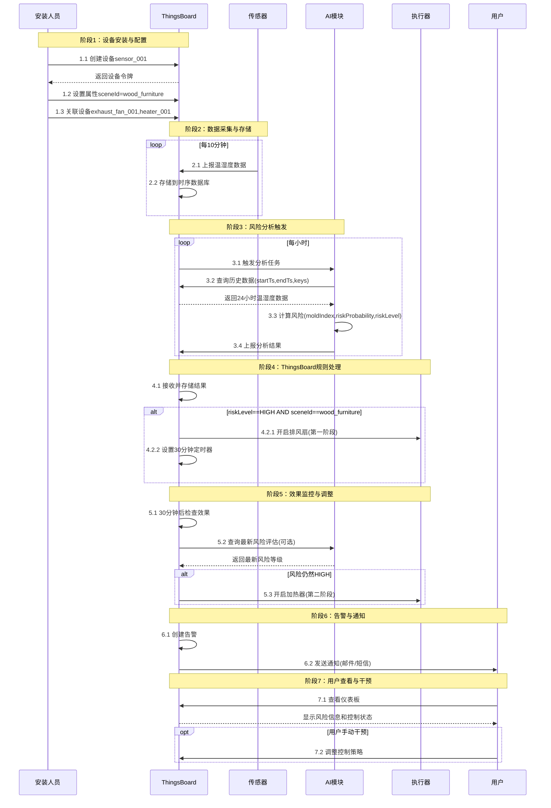
```mermaid
sequenceDiagram
    participant 安装人员
    participant ThingsBoard
    participant 传感器
    participant AI模块
    participant 执行器
    participant 用户

    %% 阶段1：设备安装与配置
    Note over 安装人员,ThingsBoard: 阶段1：设备安装与配置
    安装人员->>ThingsBoard: 1.1 创建设备sensor_001
    ThingsBoard-->>安装人员: 返回设备令牌
    安装人员->>ThingsBoard: 1.2 设置属性sceneId=wood_furniture
    安装人员->>ThingsBoard: 1.3 关联设备exhaust_fan_001,heater_001
    
    %% 阶段2：数据采集与存储
    Note over 传感器,ThingsBoard: 阶段2：数据采集与存储
    loop 每10分钟
        传感器->>ThingsBoard: 2.1 上报温湿度数据
        ThingsBoard->>ThingsBoard: 2.2 存储到时序数据库
    end
    
    %% 阶段3：风险分析触发
    Note over ThingsBoard,AI模块: 阶段3：风险分析触发
    loop 每小时
        ThingsBoard->>AI模块: 3.1 触发分析任务
        AI模块->>ThingsBoard: 3.2 查询历史数据(startTs,endTs,keys)
        ThingsBoard-->>AI模块: 返回24小时温湿度数据
        AI模块->>AI模块: 3.3 计算风险(moldIndex,riskProbability,riskLevel)
        AI模块->>ThingsBoard: 3.4 上报分析结果
    end
    
    %% 阶段4：ThingsBoard规则处理
    Note over ThingsBoard,执行器: 阶段4：ThingsBoard规则处理
    ThingsBoard->>ThingsBoard: 4.1 接收并存储结果
    alt riskLevel==HIGH AND sceneId==wood_furniture
        ThingsBoard->>执行器: 4.2.1 开启排风扇(第一阶段)
        ThingsBoard->>ThingsBoard: 4.2.2 设置30分钟定时器
    end
    
    %% 阶段5：效果监控与调整
    Note over ThingsBoard,执行器: 阶段5：效果监控与调整
    ThingsBoard->>ThingsBoard: 5.1 30分钟后检查效果
    ThingsBoard->>AI模块: 5.2 查询最新风险评估(可选)
    AI模块-->>ThingsBoard: 返回最新风险等级
    alt 风险仍然HIGH
        ThingsBoard->>执行器: 5.3 开启加热器(第二阶段)
    end
    
    %% 阶段6：告警与通知
    Note over ThingsBoard,用户: 阶段6：告警与通知
    ThingsBoard->>ThingsBoard: 6.1 创建告警
    ThingsBoard->>用户: 6.2 发送通知(邮件/短信)
    
    %% 阶段7：用户查看与干预
    Note over 用户,ThingsBoard: 阶段7：用户查看与干预
    用户->>ThingsBoard: 7.1 查看仪表板
    ThingsBoard-->>用户: 显示风险信息和控制状态
    opt 用户手动干预
        用户->>ThingsBoard: 7.2 调整控制策略
    end

```

### 各阶段时间线与关键活动

#### 阶段1：设备安装与配置（第1天）

*   **时间窗口**：安装当天，通常1-2小时内完成
    
*   **关键活动**：
    
    *   创建设备并获取访问令牌
        
    *   绑定预设场景（5选1）
        
    *   配置关联执行器设备
        
*   **参与者**：安装人员
    
*   **输出**：设备就绪，场景绑定完成
    

#### 阶段2：数据采集与存储（第1-2天）

*   **时间窗口**：安装后24-48小时
    
*   **关键活动**：
    
    *   传感器每10分钟上报温湿度数据
        
    *   平台接收并存储到时序数据库
        
    *   积累至少24小时历史数据供分析
        
*   **参与者**：传感器（自动）、物联网平台
    
*   **输出**：完整的历史数据基础
    

#### 阶段3：风险分析触发（第2天开始，持续）

*   **时间窗口**：每小时执行，持续运行
    
*   **关键活动**：
    
    *   每小时定时触发分析任务
        
    *   AI模块查询24小时历史数据
        
    *   执行VTT算法计算风险指标
        
    *   推送分析结果回平台
        
*   **参与者**：AI分析模块、物联网平台
    
*   **输出**：霉菌指数、风险等级、风险概率
    

#### 阶段4：智能控制（风险发生时）

*   **时间窗口**：风险发生后立即启动
    
*   **关键活动**：
    
    *   规则引擎匹配高风险条件
        
    *   执行渐进式控制策略（分阶段）
        
    *   第一阶段控制后等待30分钟
        
    *   评估效果，决定下一步
        
*   **参与者**：规则引擎、执行器设备
    
*   **输出**：设备控制指令、控制效果评估
    

#### 阶段5：告警通知（与阶段4同步）

*   **时间窗口**：风险确认后立即发送
    
*   **关键活动**：
    
    *   生成分级告警记录
        
    *   多渠道通知分发（邮件、短信、推送）
        
    *   用户查看仪表板信息
        
*   **参与者**：告警系统、最终用户
    
*   **输出**：告警记录、用户通知
    

#### 阶段6：现场响应（告警后2-24小时）

*   **时间窗口**：告警后响应时间根据优先级
    
    *   P1紧急：4小时内
        
    *   P2严重：24小时内
        
*   **关键活动**：
    
    *   维护人员现场核查
        
    *   记录实际情况并拍照
        
    *   提交校准反馈数据
        
*   **参与者**：维护人员
    
*   **输出**：校准反馈记录、现场照片
    

#### 阶段7：持续优化（第3天以后，持续）

*   **时间窗口**：每日/每周定期执行
    
*   **关键活动**：
    
    *   分析预测准确性统计数据
        
    *   自动优化场景参数
        
    *   更新系统知识库
        
    *   生成优化效果报告
        
*   **参与者**：系统自动执行，人工监督
    
*   **输出**：优化后的参数版本、准确性报告
    

### 关键时间指标

| 阶段 | 开始时间 | 持续时间 | 频率 | 关键产出时间 |
| --- | --- | --- | --- | --- |
| 设备安装 | T+0小时 | 1-2小时 | 一次性 | 安装完成时 |
| 数据积累 | T+0小时 | 24-48小时 | 持续 | 24小时后 |
| 风险分析 | T+24小时 | 5-10分钟/次 | 每小时 | 整点后5分钟内 |
| 智能控制 | 风险发生时 | 30-60分钟 | 按需 | 风险确认后1分钟内 |
| 告警通知 | 风险确认后 | 1-5分钟 | 按需 | 风险确认后1分钟内 |
| 现场响应 | 告警后 | 2-24小时 | 按需 | 根据告警优先级 |
| 持续优化 | T+48小时 | 持续 | 每日/每周 | 每日凌晨执行 |

这个时序图清晰地展示了系统从设备安装到持续优化的完整闭环流程，每个阶段的参与者和交互关系一目了然，为后续的详细步骤说明提供了清晰的框架。

## 2.3 各阶段详细步骤与系统交互

### 阶段一：设备安装与场景配置（第1天）

**步骤1.1：物联网平台创建设备**

```plaintext
安装人员操作：在ThingsBoard UI创建温湿度传感器设备
系统接口调用：ThingsBoard内部设备管理API（非AI模块）
输入参数：设备名称(sensor_001)、设备类型、位置信息
输出结果：设备ID(sensor_001)、设备访问令牌(ACCESS_TOKEN)
系统内部处理：创建设备档案、分配唯一标识、生成安全凭证

```

**步骤1.2：配置设备场景绑定**

```plaintext
安装人员操作：为设备设置场景属性sceneId="wood_furniture"
系统接口调用：ThingsBoard属性API（POST /api/v1/{ACCESS_TOKEN}/attributes）
输入参数：{"sceneId": "wood_furniture", "sceneName": "木质家具内"}
系统内部处理：
  1. 验证场景ID有效性（检查预设场景库）
  2. 存储设备-场景绑定关系
  3. 记录绑定时间、安装人员信息
  4. 初始化场景参数版本（默认v1.0）
数据存储：device_scene_bindings表新增记录

```

**步骤1.3：配置设备关联关系**

```plaintext
安装人员操作：在平台中配置传感器关联的控制设备
系统接口调用：ThingsBoard关系管理API
输入参数：
  - 源设备：sensor_001（传感器）
  - 关系类型："CONTROLS"（控制关系）
  - 目标设备：["exhaust_fan_001", "heater_001"]（执行器）
系统内部处理：
  1. 验证目标设备存在性和类型兼容性
  2. 建立设备间关系图谱
  3. 配置默认控制策略（基于场景类型）
  4. 生成关系可视化图表

```

### 阶段二：数据采集与存储（第1-2天）

**步骤2.1：传感器定期数据上报**

```plaintext
传感器操作：每10分钟采集并上报温湿度数据
通信协议：MQTT / HTTP(S)
上报接口：POST /api/v1/{ACCESS_TOKEN}/telemetry
数据格式：
{
  "ts": 1672531200000,  // 时间戳（毫秒）
  "values": {
    "temperature": 22.5,  // 温度（℃）
    "humidity": 65.0      // 湿度（%）
  }
}
上报频率：6次/小时，144次/天
数据大小：每条约200字节，每日约28KB

```

**步骤2.2：平台数据接收与处理**

```plaintext
系统内部处理流程：
1. 认证验证：检查ACCESS_TOKEN有效性
2. 数据校验：
   - 温度范围：-50℃ ~ 100℃（合理范围检查）
   - 湿度范围：0% ~ 100%
   - 时间戳：不允许未来时间，允许合理的时间偏移
3. 数据补全：如缺失时间戳，使用服务器接收时间
4. 异常检测：识别异常值（如突变的温湿度）
5. 数据存储：写入时序数据库（TDengine/Cassandra）
存储策略：
  - 原始数据：保留90天
  - 小时聚合数据：保留1年
  - 日聚合数据：永久保留

```

### 阶段三：风险分析触发与计算（第2天开始，每小时执行）

**步骤3.1：分析任务触发机制**

```plaintext
触发方式1：定时触发（主要方式）
  触发器：XXL-Job分布式调度
  执行时间：每小时整点（0分0秒）
  执行逻辑：遍历所有活跃设备，分批处理

触发方式2：规则触发（补充方式）
  触发条件：新数据积累足够（如24小时数据已满）
  触发机制：ThingsBoard规则链调用AI分析接口
  执行逻辑：单个设备实时分析

触发方式3：手动触发（管理需要）
  触发接口：POST /api/analyze/manual
  触发权限：管理员或维护人员
  执行逻辑：指定设备、指定时间范围分析

```

**步骤3.2：AI模块数据获取**

```plaintext
接口调用：GET /api/plugins/telemetry/DEVICE/{deviceId}/values/timeseries
请求参数：
  deviceId: "sensor_001"
  startTs: 1672444800000 (24小时前)
  endTs: 1672531200000 (当前时间)
  keys: ["temperature", "humidity"]
  limit: 144 (24小时，每小时6个点)

系统处理流程：
1. AI模块通过REST API调用ThingsBoard数据接口
2. ThingsBoard查询时序数据库，返回JSON格式数据
3. 数据格式转换：原始数据 → SensorDataPoint对象列表
4. 数据完整性检查：时间连续性、数据点数量
5. 异常数据处理：缺失值插值、异常值过滤

```

**步骤3.3：场景参数加载**

```plaintext
数据来源1：设备属性（主要来源）
  查询接口：GET /api/v1/devices/{deviceId}/attributes
  获取参数：sceneId="wood_furniture"
  参数传递方式：ThingsBoard在调用AI时作为查询参数传递

数据来源2：AI模块本地配置（备选来源）
  配置文件：preset-scenes.json
  参数结构：
  {
    "sceneId": "wood_furniture",
    "sceneName": "木质家具内",
    "materialLevel": 4.0,
    "lowThreshold": 1.5,
    "mediumThreshold": 2.5,
    "highThreshold": 3.5,
    "version": "1.0"
  }

参数加载策略：
  1. 优先使用ThingsBoard传递的参数
  2. 如未传递，使用设备ID查询本地绑定关系
  3. 如无绑定关系，使用默认墙面场景

```

**步骤3.4：VTT算法计算执行**

```plaintext
计算输入：
  - 数据输入：24小时温湿度时间序列（144个数据点）
  - 场景参数：materialLevel=4.0（木质家具）
  - 计算配置：7天滑动窗口，衰减系数0.95

计算过程（工程简化版）：
1. 数据预处理：
   - 小时数据聚合（6个10分钟点 → 1小时平均）
   - 异常值剔除（3σ原则）
   - 缺失值插值（线性插值）

2. G值计算（每小时）：
   baseG = VTT查表(temperature, humidity)
   materialFactor = 材料修正系数(materialLevel)
   G值 = baseG × materialFactor

3. MI值累积（7天滑动窗口）：
   当前MI = 前一日MI × 衰减系数 + 当日G值累积
   限制范围：0 ≤ MI ≤ 6

4. 风险等级评估：
   低风险：MI < 场景低阈值(1.5)
   中风险：低阈值(1.5) ≤ MI < 中阈值(2.5)
   高风险：MI ≥ 中阈值(2.5)

计算输出：
  moldIndex: 3.8（MI值，范围0-6）
  riskProbability: 0.85（风险概率，范围0-1）
  riskLevel: "HIGH"（风险等级：LOW/MEDIUM/HIGH）

```

**步骤3.5：分析结果反馈**

```plaintext
推送接口：POST /api/v1/{ACCESS_TOKEN}/telemetry
推送数据：
{
  "ts": 1672531200000,
  "values": {
    "moldIndex": 3.8,
    "riskProbability": 0.85,
    "riskLevel": "HIGH",
    "analysisTime": "2024-01-02T10:00:00Z",
    "dataPointsCount": 144,
    "sceneId": "wood_furniture",
    "sceneVersion": "1.0"
  }
}

系统内部处理：
1. ThingsBoard接收并验证数据
2. 存储为设备遥测数据（新的遥测键值）
3. 触发规则引擎评估（基于riskLevel变化）
4. 更新设备最新风险状态
5. 记录分析历史（risk_results表）

```

### 阶段四：智能联动与渐进式控制（第2天）

**步骤4.1：规则引擎匹配与触发**

```plaintext
触发条件：riskLevel从非HIGH变为HIGH
条件判断（ThingsBoard规则链）：
  IF riskLevel == "HIGH" 
     AND sceneId == "wood_furniture"
     AND lastControlTime > 30分钟前（防频繁触发）

规则配置（场景化差异）：
  木质家具场景：MI阈值=2.5，敏感度高
  标准墙面场景：MI阈值=3.0，敏感度中等
  设备区场景：MI阈值=2.0，敏感度最高

规则动作查找：
  1. 查找设备关联关系：sensor_001 → [exhaust_fan_001, heater_001]
  2. 加载场景控制策略：木质家具-渐进控制策略
  3. 生成控制计划：第一阶段→第二阶段→升级处理

```

**步骤4.2：第一阶段控制执行**

```plaintext
控制策略：温和干预，以通风为主
控制设备：exhaust_fan_001（排风扇）
控制指令：
  方法：turnOn
  参数：{"duration": 1800, "power": "medium", "reason": "mold_risk_high"}
  超时：30秒
  优先级：中等(50)

指令发送：
  接口：POST /api/v1/devices/{deviceId}/commands
  通信方式：RPC调用（同步/异步可选）

执行监控：
  1. 记录控制开始时间
  2. 设置30分钟定时器
  3. 监控设备执行状态（成功/失败）
  4. 失败重试机制（最多3次）

```

**步骤4.3：控制效果检查与评估**

```plaintext
检查时机：第一阶段控制后30分钟
检查方法：
  方式1：查询最新风险分析结果（如已有新分析）
  方式2：实时简化计算（基于最新温湿度数据）
  方式3：直接评估环境参数改善（温湿度下降程度）

简化评估逻辑：
  1. 获取控制后30分钟的平均温湿度
  2. 计算改善程度：ΔT=温度下降, ΔH=湿度下降
  3. 风险评估：
     改善显著（ΔH>10%）：风险降低，停止控制
     改善一般（5%<ΔH≤10%）：继续第一阶段
     改善不足（ΔH≤5%）：进入第二阶段

决策输出：CONTINUE（继续）/ESCALATE（升级）/STOP（停止）

```

**步骤4.4：第二阶段控制执行（如需要）**

```plaintext
触发条件：第一阶段后风险仍为HIGH
控制策略：强化干预，加热辅助
控制设备：heater_001（加热器）
控制指令：
  方法：turnOn
  参数：{"duration": 1200, "temperature": 26, "reason": "mold_risk_persist"}
  超时：30秒
  优先级：高(70)

组合控制策略：
  1. 排风扇继续运行（降低湿度）
  2. 加热器启动（提升温度，降低相对湿度）
  3. 监控设备协同工作情况

安全限制：
  1. 最高温度限制：28℃（防止过度加热）
  2. 最大运行时间：1小时（防止设备过载）
  3. 能耗监控：记录能耗数据

```

**步骤4.5：人工干预升级**

```plaintext
升级条件：
  1. 两阶段控制后风险仍为HIGH
  2. 控制执行失败（设备故障）
  3. 风险持续超过2小时

升级动作：
  1. 创建紧急告警（最高优先级）
  2. 通知维护人员立即现场处理
  3. 提供详细风险报告和控制历史
  4. 建议人工干预措施

系统记录：
  1. 记录控制全过程时间线
  2. 评估控制效果（成功/部分成功/失败）
  3. 更新控制策略知识库
  4. 生成优化建议

```

### 阶段五：告警通知与用户交互（第2天）

**步骤5.1：告警生成与分类**

```plaintext
告警触发条件：
  1. 风险等级变化：→HIGH（立即告警）
  2. 风险持续：HIGH持续1小时（升级告警）
  3. 控制失败：设备执行失败（技术告警）
  4. 数据异常：传感器数据异常（监控告警）

告警分级：
  P1-紧急：高风险+控制失败，需要立即人工干预
  P2-严重：高风险，系统正在自动处理
  P3-警告：中风险，需要关注
  P4-信息：低风险，仅记录

告警内容：
  - 告警标题："高风险霉菌风险 - 木质家具区域"
  - 告警描述：设备位置、风险指标、已采取措施
  - 建议行动：查看仪表板、现场检查、联系维护
  - 相关数据：MI值、温湿度趋势、控制历史

```

**步骤5.2：多渠道通知分发**

```plaintext
通知渠道配置（用户可配置）：
  1. 邮件通知：详细报告，带图表附件
  2. 短信通知：精简摘要，关键信息
  3. APP推送：实时提醒，可操作按钮
  4. 微信/钉钉：工作群通知，@相关人员
  5. 语音电话：P1级紧急告警

通知内容差异化：
  最终用户：简化版，关注"风险是什么"和"我该做什么"
  维护人员：详细版，包含技术细节和诊断信息
  管理人员：汇总版，关注整体状态和趋势

通知频率控制：
  相同告警抑制：30分钟内不重复通知
  告警升级：每1小时升级通知一次
  告警恢复：自动发送恢复通知

```

**步骤5.3：用户仪表板查看**

```plaintext
仪表板核心视图：
1. 全局概览视图：
   - 当前风险分布（高风险设备数量/位置）
   - 实时风险地图（设备位置可视化）
   - 风险趋势图表（24小时/7天）

2. 设备详情视图：
   - 实时风险指标：MI值、风险等级、风险概率
   - 环境参数：当前温湿度、历史趋势
   - 控制状态：当前控制措施、设备状态
   - 告警历史：最近告警记录

3. 场景管理视图：
   - 场景分布统计
   - 场景准确性分析
   - 参数配置界面

交互功能：
  1. 手动控制：临时覆盖自动控制
  2. 告警确认：标记告警为已处理
  3. 报告生成：导出风险报告
  4. 趋势分析：自定义时间范围分析

```

### 阶段六：现场核查与校准反馈（第2-3天）

**步骤6.1：现场核查任务管理**

```plaintext
任务生成：
  触发条件：高风险告警P1/P2级
  生成方式：自动生成或手动创建
  任务内容：设备位置、风险等级、建议检查项

任务分配：
  分配逻辑：基于位置、技能、工作负载
  通知方式：APP推送+短信提醒
  时限要求：高风险-4小时内响应

核查工具支持：
  1. 移动端APP：现场数据记录
  2. 照片上传：霉斑情况拍照
  3. 快速评估：简化的现场评估表单
  4. GPS定位：自动记录检查位置

```

**步骤6.2：现场情况记录与评估**

```plaintext
核查内容：
  1. 视觉检查：是否可见霉斑
  2. 严重程度评估：无/轻微/中等/严重
  3. 影响范围：局部小范围/中等范围/广泛分布
  4. 环境状况：实际温湿度、通风情况
  5. 照片证据：至少2张不同角度照片

评估标准：
  实际MI值估算（基于现场情况）：
    无霉斑，环境良好：MI < 1.0
    轻微霉斑，小范围：1.0 ≤ MI < 2.0
    明显霉斑，中等范围：2.0 ≤ MI < 3.0
    严重霉斑，广泛分布：MI ≥ 3.0

数据记录表单：
  {
    "deviceId": "sensor_001",
    "checkTime": "2024-01-02T14:30:00Z",
    "moldFound": true,
    "severity": "MEDIUM",
    "actualMI": 2.8,
    "predictedMI": 3.2,
    "checker": "张三",
    "comments": "衣柜角落有轻微霉斑，已清理",
    "photoUrls": ["url1", "url2"]
  }

```

**步骤6.3：校准反馈提交**

```plaintext
提交接口：POST /api/calibration/feedback
提交权限：维护人员角色
数据验证：
  1. 设备存在性检查
  2. 数据完整性检查
  3. 合理性检查：actualMI在合理范围内(0-6)
  4. 时间有效性：checkTime在预测时间附近

系统处理流程：
  1. 存储校准记录：calibration_feedbacks表
  2. 更新场景统计：scene_feedback_stats表
  3. 计算预测偏差：ΔMI = actualMI - predictedMI
  4. 评估预测准确性：准确/基本准确/不准确
  5. 触发参数优化检查：如偏差持续较大

```

### 阶段七：系统持续优化（第3天以后）

**步骤7.1：预测准确性分析**

```plaintext
分析周期：每日/每周自动分析
分析维度：
  1. 整体准确性：所有反馈数据的平均偏差
  2. 场景准确性：按场景类型分组分析
  3. 风险等级准确性：高风险/中风险/低风险的预测准确性
  4. 季节性趋势：不同季节的预测偏差

准确性指标：
  绝对平均偏差(MAE)：|ΔMI|的平均值
  均方根误差(RMSE)：√(平均(ΔMI²))
  准确率：|ΔMI| < 0.5的比例
  高风险检出率：实际高风险被正确预测的比例

报告生成：
  1. 日报：每日摘要，重点关注异常
  2. 周报：趋势分析，场景对比
  3. 月报：深度分析，优化建议

```

**步骤7.2：场景参数自动优化**

```plaintext
优化触发条件：
  1. 样本数量足够：同一场景≥20个有效反馈
  2. 偏差显著：平均|ΔMI| > 0.8且持续3次统计
  3. 置信度高：统计显著性p < 0.05

优化算法：
  目标：最小化预测偏差
  变量：材料等级(materialLevel)
  约束：调整范围±1.0（避免过度调整）
  方法：梯度下降/线性回归

优化流程：
  1. 分析历史反馈数据，计算最优参数
  2. 创建新版本参数：v1.1
  3. A/B测试：部分设备使用新参数
  4. 效果对比：对比新旧参数准确性
  5. 全面推广：如效果显著，全面更新

版本管理：
  1. 保留历史版本，支持回滚
  2. 记录版本变更原因和效果
  3. 支持多版本并行测试

```

**步骤7.3：系统知识库更新**

```plaintext
知识积累内容：
  1. 成功案例：有效控制策略和参数
  2. 失败教训：无效控制原因分析
  3. 场景特征：不同场景的最佳参数
  4. 季节性模式：季节变化的影响规律

知识应用：
  1. 控制策略优化：基于历史效果调整策略
  2. 场景推荐优化：基于相似案例推荐场景
  3. 阈值自适应：基于季节自动调整阈值
  4. 异常模式识别：识别新的风险模式

持续改进闭环：
  数据收集 → 分析评估 → 参数优化 → 部署验证 → 效果监控

```

## 2.4 关键业务流程验证

### 验证点1：数据获取接口是否足够且高效？

**验证场景**：AI模块需要24小时温湿度数据计算风险

**现有接口**：

```http
GET /api/plugins/telemetry/DEVICE/sensor_001/values/timeseries
?startTs=1672444800000
&endTs=1672531200000
&keys=temperature,humidity
&limit=144

```

**验证结果**：✅ **合理**

*   **数据完整性**：单接口获取所有必需历史数据
    
*   **查询效率**：支持时间范围和字段过滤，减少数据传输量
    
*   **扩展性**：支持分页（limit参数），避免大数据量问题
    
*   **兼容性**：标准ThingsBoard接口，无需自定义开发
    

**优化建议**：

*   增加批量查询接口（用于多设备并发分析）
    
*   支持数据聚合查询（如直接获取小时平均值）
    

### 验证点2：结果反馈接口是否被有效利用？

**验证场景**：AI计算结果如何被下游系统使用

**反馈数据**：

```json
{
  "moldIndex": 3.8,          // 用途：趋势图表、历史分析
  "riskProbability": 0.85,   // 用途：精细化告警（>0.8发紧急通知）
  "riskLevel": "HIGH"        // 用途：规则触发、设备联动
}

```

**验证结果**：✅ **合理**

*   **字段精炼**：每个字段都有明确下游用途，无冗余
    
*   **职责清晰**：
    
    *   `riskLevel` → 规则引擎 → 设备控制
        
    *   `riskProbability` → 告警服务 → 通知分级
        
    *   `moldIndex` → 数据服务 → 可视化展示
        
*   **扩展性**：通过values对象可灵活增加字段
    

**改进建议**：

*   增加`confidenceScore`字段（算法置信度）
    
*   增加`trend`字段（风险变化趋势：上升/下降/稳定）
    

### 验证点3：场景参数传递机制是否合理？

**验证场景**：AI如何获取设备对应的场景参数

**当前方案**：

1.  **主要方案**：ThingsBoard在调用AI时传递sceneId
    
2.  **备选方案**：AI查询设备属性获取sceneId
    
3.  **回退方案**：使用默认墙面场景参数
    

**验证结果**：⚠️ **需要明确**

**问题分析**：

*   方案1依赖ThingsBoard改造，需传递额外参数
    
*   方案2增加接口调用，影响性能
    
*   方案3可能导致参数不匹配
    

**推荐方案**：

```plaintext
调用流程优化：
1. ThingsBoard规则链调用AI时，在HTTP Header中添加：
   X-Device-Scene: wood_furniture
   X-Scene-Version: 1.0

2. AI模块优先使用Header中的场景信息

3. 如Header中缺失，再查询设备属性

4. 最终回退到默认场景

```

### 验证点4：控制策略是否完整闭环？

**验证场景**：从风险识别到控制效果评估的全流程

**当前流程**：

```plaintext
风险识别 → 控制决策 → 执行控制 → 效果检查 → 调整策略

```

**验证结果**：✅ **完整但可优化**

**完整闭环验证**：

1.  **前向链路**（已实现）：
    
    *   风险计算 → 规则匹配 → 设备控制
        
2.  **反馈链路**（部分实现）：
    
    *   效果检查 → 策略调整 → 再次控制
        
3.  **学习链路**（需加强）：
    
    *   控制效果 → 经验积累 → 策略优化
        

**优化建议**：

1.  加强效果量化评估（控制前后的MI值变化）
    
2.  建立控制策略知识库（成功/失败案例积累）
    
3.  增加自适应学习机制（基于历史效果自动优化策略）
    

### 验证点5：校准反馈是否形成有效优化闭环？

**验证场景**：现场核查数据如何改进系统预测

**当前流程**：

```plaintext
现场核查 → 反馈提交 → 偏差分析 → 参数优化 → 系统更新

```

**验证结果**：✅ **完整但需自动化**

**关键验证点**：

1.  **数据收集完整性**：支持照片、评估等级、实际MI值
    
2.  **分析有效性**：按场景、按风险等级分组分析
    
3.  **优化科学性**：基于统计显著性进行参数调整
    
4.  **部署可控性**：支持A/B测试和渐进式发布
    

**自动化水平评估**：

*   数据收集：✅ 自动化（移动端APP）
    
*   偏差分析：✅ 自动化（每日统计任务）
    
*   参数优化：⚠️ 半自动（需人工确认）
    
*   系统更新：✅ 自动化（版本部署）
    

**建议改进**：

1.  增加自动优化阈值（如偏差>0.8自动触发优化）
    
2.  增加优化效果预测（基于历史数据预测优化效果）
    
3.  增加异常检测（识别异常反馈数据）
    

### 总结：业务流程合理性评估

| 业务流程环节 | 完整性 | 自动化程度 | 优化空间 |
| --- | --- | --- | --- |
| 设备安装配置 | 高 | 中 | 增加场景自动推荐 |
| 数据采集存储 | 高 | 高 | 优化数据压缩和归档 |
| 风险分析计算 | 高 | 高 | 增加实时分析模式 |
| 智能联动控制 | 中 | 高 | 加强效果评估和学习 |
| 告警通知分发 | 高 | 高 | 增加个性化通知策略 |
| 现场核查反馈 | 中 | 中 | 提高移动端便利性 |
| 系统持续优化 | 中 | 中 | 提高自动化优化水平 |

**总体评估**：✅ **业务流程设计合理，形成了从数据采集到系统优化的完整闭环，具备良好的可操作性和可扩展性。**

**关键成功因素**：

1.  **用户旅程完整**：覆盖了从安装到优化的全生命周期
    
2.  **角色职责清晰**：各角色有明确的任务和界面
    
3.  **系统交互顺畅**：接口设计简洁，数据流清晰
    
4.  **持续改进机制**：建立了校准反馈和参数优化闭环
    
5.  **渐进式智能化**：从规则控制到学习优化的渐进路径
    

通过这个完整的用户旅程和业务流程设计，系统不仅能够满足当前的霉菌风险预测需求，更为未来的功能扩展和智能化升级奠定了坚实基础。

# 三、系统架构方案对比与选择

## 3.1 方案一：基于ThingsBoard的快速实现方案

### 3.1.1 方案概述

基于ThingsBoard的开源物联网平台，快速构建霉菌风险预测系统。该方案利用ThingsBoard成熟的设备管理、数据存储和规则引擎功能，AI分析模块作为独立微服务与平台解耦，通过标准化REST API进行交互。

### 3.1.2 核心架构设计

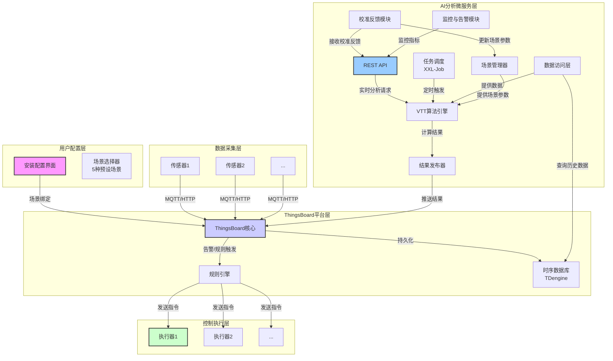
```mermaid
graph TB
    subgraph "用户配置层"
        UI[安装配置界面]
        SCENE_SEL[场景选择器<br/>5种预设场景]
    end
    
    subgraph "数据采集层"
        S1[传感器1]
        S2[传感器2]
        S3[...]
    end
    
    subgraph "ThingsBoard平台层"
        TB[ThingsBoard核心]
        RE[规则引擎]
        DB[时序数据库<br/>TDengine]
    end
    
    subgraph "AI分析微服务层"
        API[REST API]
        SCH[任务调度<br/>XXL-Job]
        SCENE_MGR[场景管理器]
        DAL[数据访问层]
        VTT[VTT算法引擎]
        CAL[校准反馈模块]
        PUB[结果发布器]
        MON[监控与告警模块]
    end
    
    subgraph "控制执行层"
        A1[执行器1]
        A2[执行器2]
        A3[...]
    end
    
    %% 数据流向
    UI -->|场景绑定| TB
    S1 -->|MQTT/HTTP| TB
    S2 -->|MQTT/HTTP| TB
    S3 -->|MQTT/HTTP| TB
    
    TB -->|持久化| DB
    
    API -->|实时分析请求| VTT
    SCH -->|定时触发| VTT
    DAL -->|查询历史数据| DB
    DAL -->|提供数据| VTT
    SCENE_MGR -->|提供场景参数| VTT
    
    VTT -->|计算结果| PUB
    PUB -->|推送结果| TB
    
    TB -->|告警/规则触发| RE
    RE -->|发送指令| A1
    RE -->|发送指令| A2
    RE -->|发送指令| A3
    
    CAL -->|接收校准反馈| API
    CAL -->|更新场景参数| SCENE_MGR
    
    MON -->|监控指标| API
    
    %% 样式
    style UI fill:#f9f,stroke:#333,stroke-width:2px
    style TB fill:#ccf,stroke:#333,stroke-width:2px
    style API fill:#9cf,stroke:#333,stroke-width:2px
    style A1 fill:#cfc,stroke:#333,stroke-width:2px

```

### 3.1.3 技术栈构成

| 组件模块 | 技术选型 | 说明 |
| --- | --- | --- |
| **物联网平台** | ThingsBoard 3.4+ | 开源IoT平台，提供设备管理、规则引擎 |
| **后端框架** | Spring Boot 3.x + Spring Cloud | 微服务生态完善，社区活跃 |
| **任务调度** | XXL-Job 2.4.0 | 分布式任务调度，支持故障转移 |
| **数据访问** | Spring Data JDBC + HikariCP | 轻量级ORM，高性能连接池 |
| **时序数据库** | TDengine 3.x | 国产时序数据库，高性能存储 |
| **VTT算法** | 自定义Java实现 + JJScience | 工程简化版VTT霉菌生长模型 |
| **缓存** | Caffeine 3.x | 内存缓存，减少DB查询 |
| **配置中心** | Spring Cloud Config + Git | 动态配置管理，支持热更新 |
| **监控** | Micrometer + Prometheus + Grafana | 全方位监控，可视化展示 |
| **日志** | Logback + ELK Stack | 结构化日志，集中分析 |
| **安全** | Spring Security + JWT | API安全认证，角色权限控制 |
| **容器化** | Docker + Docker Compose | 开发环境快速部署 |
| **生产编排** | Kubernetes + Helm | 生产环境高可用部署 |

### 3.1.4 核心模块设计

#### 1. 任务调度模块

*   **分布式调度**：基于XXL-Job实现每小时风险分析任务
    
*   **故障转移**：支持多实例部署，任务自动故障转移
    
*   **任务管理**：支持按设备组、优先级调度，任务执行监控
    
*   **弹性伸缩**：根据设备数量动态调整任务执行节点
    

#### 2. 数据访问层

```java
// 抽象数据访问接口
public interface TimeSeriesDataRepository {
    List<SensorDataPoint> findDataPoints(String deviceId, Instant startTime, Instant endTime);
    Map<String, List<SensorDataPoint>> batchFindDataPoints(List<String> deviceIds, Instant startTime, Instant endTime);
}

// TDengine实现（主选）
@Component
@Primary
public class TDengineRepositoryImpl implements TimeSeriesDataRepository {
    // 使用连接池，支持批量查询
    // 查询优化：预编译语句，结果集流式处理
}

// 缓存层（性能优化）
@Component
@ConditionalOnProperty(name = "cache.enabled", havingValue = "true")
public class DataCacheManager {
    // Caffeine内存缓存，缓存最近查询结果
    // 缓存策略：LRU淘汰，TTL过期
}

```

#### 3. 场景管理器

*   **预设场景库**：5种标准场景（墙面、木质家具、高湿区、窗台、设备区）
    
*   **参数版本管理**：支持多版本参数并行，A/B测试
    
*   **动态加载**：运行时加载场景参数，支持热更新
    
*   **回退机制**：场景加载失败时使用默认墙面场景
    

#### 4. VTT算法引擎

*   **工程简化版**：基于VTT模型查表+插值计算
    
*   **材料修正**：根据不同场景的材料等级调整生长速率
    
*   **衰减模型**：当环境不适宜时霉菌指数衰减
    
*   **批量计算**：支持多设备并行计算，性能优化
    

#### 5. 校准反馈模块

*   **现场核查反馈**：接收维护人员现场核查数据
    
*   **偏差分析**：计算预测值与实际值的偏差
    
*   **参数优化**：基于统计结果自动调整场景参数
    
*   **A/B测试**：新参数小范围测试验证效果
    

### 3.1.5 接口设计（精简版）

#### 数据获取接口

```http
GET /api/plugins/telemetry/DEVICE/{deviceId}/values/timeseries
参数：startTs, endTs, keys=temperature,humidity
用途：AI模块查询历史温湿度数据

```

#### 结果反馈接口

```http
POST /api/v1/{ACCESS_TOKEN}/telemetry
数据：{"ts":时间戳,"values":{"moldIndex":3.8,"riskProbability":0.85,"riskLevel":"HIGH"}}
用途：AI模块推送风险分析结果

```

#### 管理接口（可选）

```http
GET /api/scenes/presets                    # 获取预设场景列表
POST /api/devices/{deviceId}/bind-scene    # 设备场景绑定
POST /api/calibration/feedback             # 提交校准反馈

```

### 3.1.6 控制模式实现

#### 模式A：规则引擎控制（推荐）

```javascript
// ThingsBoard规则链配置
// 1. 接收moldIndex遥测数据
// 2. 获取设备场景属性
// 3. 根据场景使用不同阈值
// 4. 查找关联设备
// 5. 发送RPC命令

var sceneId = metadata.sceneId;
var threshold = 3.0; // 默认阈值

if (sceneId === 'wood_furniture') {
    threshold = 2.5; // 木质家具更敏感
} else if (sceneId === 'equipment_area') {
    threshold = 2.0; // 设备区最敏感
}

if (msg.moldIndex > threshold) {
    // 触发告警和设备控制
    return {msg: msg, metadata: metadata, msgType: msgType};
}

```

#### 模式B：设备Profile告警

*   **场景化阈值**：不同场景使用不同告警阈值
    
*   **分级告警**：基于riskProbability决定告警级别
    
*   **关联动作**：告警触发时自动执行设备控制
    

#### 模式C：直接RPC调用

*   **场景化策略**：不同场景采用不同控制策略
    
*   **渐进控制**：分阶段执行，每阶段后评估效果
    
*   **超时重试**：指令发送失败自动重试
    

### 3.1.7 优势特点

1.  **快速上线**：基于成熟开源平台，减少基础功能开发
    
2.  **生态完善**：ThingsBoard社区活跃，功能持续更新
    
3.  **运维简单**：标准化部署和监控方案
    
4.  **成本可控**：开源方案降低许可费用
    
5.  **扩展灵活**：AI模块独立，支持算法快速迭代
    

### 3.1.8 适用场景

*   **中小规模部署**：设备数量在1000个以内
    
*   **快速验证原型**：需要快速搭建验证系统
    
*   **标准化需求**：业务需求相对标准，无需深度定制
    
*   **资源有限团队**：开发运维资源相对有限
    

## 3.2 方案二：基于自研平台的深度定制方案

### 3.2.1 方案概述

完全自主研发物联网平台核心组件，包括设备接入、数据存储、规则引擎等，提供更高的定制灵活性和系统控制权。AI分析模块作为平台核心服务深度集成。

### 3.2.2 核心架构设计

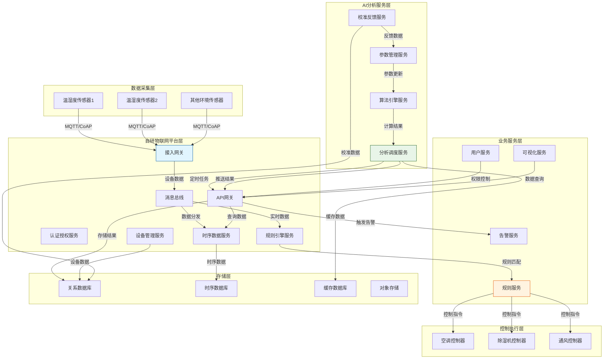
```mermaid
graph TB
    subgraph "数据采集层"
        S1[温湿度传感器1]
        S2[温湿度传感器2]
        S3[其他环境传感器]
    end
    
    subgraph "自研物联网平台层"
        GW[接入网关]
        AUTH[认证授权服务]
        DM[设备管理服务]
        TSDB[时序数据服务]
        RE[规则引擎服务]
        MSG[消息总线]
        API[API网关]
    end
    
    subgraph "AI分析服务层"
        AS[分析调度服务]
        AE[算法引擎服务]
        PM[参数管理服务]
        CM[校准反馈服务]
    end
    
    subgraph "业务服务层"
        RS[规则服务]
        ASVC[告警服务]
        VS[可视化服务]
        US[用户服务]
    end
    
    subgraph "控制执行层"
        AC1[空调控制器]
        AC2[除湿机控制器]
        AC3[通风控制器]
    end
    
    subgraph "存储层"
        SQL[关系数据库]
        TS[时序数据库]
        CACHE[缓存数据库]
        OBJ[对象存储]
    end
    
    %% 数据流
    S1 -->|MQTT/CoAP| GW
    S2 -->|MQTT/CoAP| GW
    S3 -->|MQTT/CoAP| GW
    
    GW -->|设备数据| MSG
    MSG -->|数据分发| TSDB
    MSG -->|实时数据| RE
    
    AS -->|定时任务| API
    API -->|查询数据| TSDB
    AE -->|计算结果| AS
    AS -->|推送结果| API
    API -->|存储结果| SQL
    API -->|触发告警| ASVC
    
    RE -->|规则匹配| RS
    RS -->|控制指令| AC1
    RS -->|控制指令| AC2
    RS -->|控制指令| AC3
    
    CM -->|反馈数据| PM
    PM -->|参数更新| AE
    
    %% 存储
    DM -->|设备数据| SQL
    TSDB -->|时序数据| TS
    AS -->|缓存数据| CACHE
    CM -->|校准数据| SQL
    
    %% 用户访问
    US -->|权限控制| API
    VS -->|数据查询| API
    
    %% 样式
    style GW fill:#e1f5fe,stroke:#01579b
    style AS fill:#e8f5e8,stroke:#1b5e20
    style RS fill:#fff3e0,stroke:#e65100

```

### 3.2.3 平台核心功能规范

#### 设备接入管理

```yaml
功能要求:
  1. 设备注册与鉴权
    - 支持设备ID/密钥认证
    - 支持X.509证书认证
    - 支持设备分组管理
    
  2. 协议支持
    - MQTT 3.1.1/5.0（主选）
    - HTTP/HTTPS REST API
    - CoAP（可选，低功耗设备）
    - Modbus TCP/RTU（可选，工业设备）
    
  3. 数据格式
    - JSON格式遥测数据（标准）
    - 二进制数据支持（高性能）
    - 自定义数据格式插件（扩展性）

```

#### 数据服务设计

```yaml
功能要求:
  1. 时序数据存储
    - 高并发写入支持（10万+点/秒）
    - 高效时间范围查询（毫秒级响应）
    - 数据压缩与归档（Tiered存储）
    
  2. 实时数据流
    - 实时数据分发（pub/sub模式）
    - 数据质量监控（完整性、准确性）
    - 异常数据检测（离群值识别）
    
  3. 数据查询API
    - 时间范围查询（支持聚合）
    - 多设备批量查询（优化性能）
    - 数据导出功能（CSV/JSON格式）

```

#### 规则引擎设计

```yaml
功能要求:
  1. 条件规则
    - 基于数据点的条件判断（数值、状态）
    - 复合条件支持（AND/OR/NOT）
    - 时间窗口条件（滑动窗口、会话窗口）
    
  2. 动作执行
    - 设备控制指令（同步/异步）
    - 告警触发（分级、抑制）
    - Webhook调用（第三方集成）
    
  3. 规则管理
    - 规则可视化配置（拖拽式UI）
    - 规则版本管理（发布/回滚）
    - 规则测试与调试（模拟执行）

```

### 3.2.4 平台API规范

#### 设备管理API

```java
/**
 * 设备管理接口定义
 */
public interface DeviceManagementAPI {
    
    @POST("/api/v1/devices")
    DeviceInfo createDevice(@Body CreateDeviceRequest request);
    
    @GET("/api/v1/devices/{deviceId}")
    DeviceInfo getDevice(@Path("deviceId") String deviceId);
    
    @GET("/api/v1/devices")
    PageResult<DeviceInfo> listDevices(@Query Map<String, Object> filters);
    
    @PUT("/api/v1/devices/{deviceId}")
    DeviceInfo updateDevice(@Path("deviceId") String deviceId, 
                           @Body UpdateDeviceRequest request);
    
    @DELETE("/api/v1/devices/{deviceId}")
    void deleteDevice(@Path("deviceId") String deviceId);
}

@Data
class DeviceInfo {
    private String deviceId;
    private String deviceName;
    private String deviceType;
    private String model;
    private String manufacturer;
    private String location;          // 位置信息
    private Map<String, Object> attributes; // 自定义属性
    private String tenantId;          // 租户ID
    private String status;           // 在线状态
    private Instant lastActiveTime;  // 最后活跃时间
    private Instant createdTime;
    private Instant updatedTime;
}

```

#### 数据查询API

```java
/**
 * 时序数据查询接口
 */
public interface TelemetryDataAPI {
    
    @GET("/api/v1/devices/{deviceId}/telemetry")
    TelemetryDataPage queryDeviceTelemetry(
        @Path("deviceId") String deviceId,
        @Query("startTime") Instant startTime,
        @Query("endTime") Instant endTime,
        @Query("keys") List<String> keys,
        @Query("limit") Integer limit,
        @Query("order") String order
    );
    
    @POST("/api/v1/telemetry/batch-query")
    Map<String, TelemetryDataPage> batchQueryTelemetry(
        @Body BatchTelemetryQueryRequest request
    );
    
    @GET("/api/v1/devices/{deviceId}/telemetry/latest")
    Map<String, TelemetryValue> getLatestTelemetry(
        @Path("deviceId") String deviceId,
        @Query("keys") List<String> keys
    );
}

```

#### 设备控制API

```java
/**
 * 设备控制接口
 */
public interface DeviceControlAPI {
    
    @POST("/api/v1/devices/{deviceId}/commands")
    CommandResult sendCommand(
        @Path("deviceId") String deviceId,
        @Body DeviceCommand command
    );
    
    @GET("/api/v1/commands/{commandId}")
    CommandStatus getCommandStatus(@Path("commandId") String commandId);
    
    @DELETE("/api/v1/commands/{commandId}")
    void cancelCommand(@Path("commandId") String commandId);
}

```

### 3.2.5 AI分析服务深度集成

#### 物联网平台客户端

```java
@Component
@Slf4j
public class IoTCoreClient {
    
    @Value("${iot.platform.base-url}")
    private String baseUrl;
    
    @Autowired
    private RestTemplate restTemplate;
    
    @Autowired
    private MeterRegistry meterRegistry;
    
    /**
     * 查询设备历史数据
     */
    public List<SensorDataPoint> queryHistoricalData(
            String deviceId, 
            Instant startTime, 
            Instant endTime,
            List<String> keys) {
        
        return queryTimer.record(() -> {
            try {
                queryCounter.increment();
                
                String url = String.format("%s/api/v1/devices/%s/telemetry", 
                    baseUrl, deviceId);
                
                UriComponentsBuilder builder = UriComponentsBuilder.fromUriString(url)
                    .queryParam("startTime", startTime.toString())
                    .queryParam("endTime", endTime.toString());
                
                if (keys != null && !keys.isEmpty()) {
                    builder.queryParam("keys", String.join(",", keys));
                }
                
                ResponseEntity<TelemetryDataPage> response = restTemplate.exchange(
                    builder.build().toUri(),
                    HttpMethod.GET,
                    null,
                    TelemetryDataPage.class
                );
                
                // 数据格式转换和返回
                return convertToDataPoints(deviceId, response.getBody().getData());
                
            } catch (Exception e) {
                log.error("查询设备{}数据异常", deviceId, e);
                throw new DataQueryException("IoT平台查询失败", e);
            }
        });
    }
    
    /**
     * 上报分析结果
     */
    public boolean reportAnalysisResult(String deviceId, RiskAnalysisResult result) {
        try {
            String url = String.format("%s/api/v1/devices/%s/telemetry", baseUrl, deviceId);
            
            Map<String, Object> telemetryData = new HashMap<>();
            telemetryData.put("moldIndex", result.getMoldIndex());
            telemetryData.put("riskProbability", result.getMoldRiskProbability());
            telemetryData.put("riskLevel", result.getRiskLevel().toString());
            telemetryData.put("analysisTime", result.getAnalysisTime().toEpochMilli());
            
            TelemetryReportRequest request = new TelemetryReportRequest();
            request.setTimestamp(System.currentTimeMillis());
            request.setValues(telemetryData);
            
            ResponseEntity<Void> response = restTemplate.postForEntity(
                url, request, Void.class);
            
            return response.getStatusCode().is2xxSuccessful();
            
        } catch (Exception e) {
            log.error("上报分析结果失败: deviceId={}", deviceId, e);
            return false;
        }
    }
}

```

#### 分析调度服务

```java
@Service
@Slf4j
public class AnalysisScheduler {
    
    @Autowired
    private IoTCoreClient iotCoreClient;
    
    @Autowired
    private VTTAlgorithmEngine algorithmEngine;
    
    @Autowired
    private SceneParameterManager parameterManager;
    
    /**
     * 每小时执行的风险分析任务
     */
    @Scheduled(cron = "0 0 * * * *") // 每小时整点执行
    @Async("analysisExecutor")
    public void hourlyRiskAnalysis() {
        log.info("开始执行每小时风险分析任务");
        
        Instant endTime = Instant.now();
        Instant startTime = endTime.minus(24, ChronoUnit.HOURS);
        
        // 1. 获取所有需要分析的设备
        List<DeviceAnalysisTask> tasks = deviceSceneService.getActiveAnalysisTasks();
        
        // 2. 分批处理设备（每批20个，避免压力过大）
        int batchSize = 20;
        List<List<DeviceAnalysisTask>> batches = Lists.partition(tasks, batchSize);
        
        for (List<DeviceAnalysisTask> batch : batches) {
            try {
                processBatch(batch, startTime, endTime);
                Thread.sleep(100); // 避免对IoT平台造成过大压力
            } catch (Exception e) {
                log.error("批量处理任务失败", e);
            }
        }
        
        log.info("每小时风险分析任务完成，处理设备数: {}", tasks.size());
    }
    
    /**
     * 处理单个批次
     */
    private void processBatch(List<DeviceAnalysisTask> batch, 
                             Instant startTime, 
                             Instant endTime) {
        
        // 1. 批量查询设备数据（优化性能）
        List<String> deviceIds = batch.stream()
            .map(DeviceAnalysisTask::getDeviceId)
            .collect(Collectors.toList());
        
        Map<String, List<SensorDataPoint>> deviceData = 
            iotCoreClient.batchQueryHistoricalData(deviceIds, startTime, endTime);
        
        // 2. 并行分析每个设备
        List<CompletableFuture<Void>> futures = batch.stream()
            .map(task -> CompletableFuture.runAsync(() -> {
                try {
                    processSingleDevice(task, deviceData.get(task.getDeviceId()), endTime);
                } catch (Exception e) {
                    log.error("处理设备{}分析失败", task.getDeviceId(), e);
                }
            }))
            .collect(Collectors.toList());
        
        // 3. 等待所有分析完成
        CompletableFuture.allOf(futures.toArray(new CompletableFuture[0]))
            .join();
    }
}

```

### 3.2.6 规则服务设计

```java
@Service
public class RuleService {
    
    @Autowired
    private RuleRepository ruleRepository;
    
    @Autowired
    private IoTCoreClient iotCoreClient;
    
    @Autowired
    private DeviceAssociationService deviceAssociationService;
    
    /**
     * 评估控制规则
     */
    public void evaluateControlRules(DeviceAnalysisTask task, 
                                    RiskAnalysisResult result) {
        
        // 1. 获取设备相关的控制规则
        List<ControlRule> rules = ruleRepository.findByDeviceIdAndEnabled(
            task.getDeviceId(), true);
        
        // 2. 按优先级排序
        rules.sort(Comparator.comparingInt(ControlRule::getPriority).reversed());
        
        // 3. 评估每条规则
        for (ControlRule rule : rules) {
            if (evaluateRuleCondition(rule, result)) {
                executeRuleAction(rule, result);
                
                // 高优先级规则执行后，可跳过低优先级规则
                if (rule.isStopOnMatch()) {
                    break;
                }
            }
        }
    }
    
    /**
     * 评估规则条件
     */
    private boolean evaluateRuleCondition(ControlRule rule, 
                                         RiskAnalysisResult result) {
        
        RuleCondition condition = rule.getCondition();
        
        switch (condition.getType()) {
            case RISK_LEVEL:
                return evaluateRiskLevelCondition(condition, result.getRiskLevel());
                
            case MI_VALUE:
                return evaluateMIValueCondition(condition, result.getMoldIndex());
                
            case COMPOSITE:
                return evaluateCompositeCondition(condition, result);
                
            case TIME_BASED:
                return evaluateTimeBasedCondition(condition);
                
            default:
                return false;
        }
    }
}

```

### 3.2.7 优势特点

1.  **完全可控**：从底层到应用层完全自主可控
    
2.  **深度定制**：可根据业务需求深度定制所有功能
    
3.  **性能优化**：针对霉菌预测场景进行专项性能优化
    
4.  **数据主权**：所有数据存储和处理自主掌控
    
5.  **集成灵活**：可灵活集成企业内部其他系统
    

### 3.2.8 适用场景

*   **大规模部署**：设备数量超过1000个，需要高性能支撑
    
*   **特殊需求**：有特殊协议、数据格式或安全要求
    
*   **深度集成**：需要与企业现有系统深度集成
    
*   **长期演进**：系统需要长期演进和深度定制
    
*   **数据敏感**：对数据主权和安全有严格要求
    

## 3.3 双方案架构对比矩阵

| 对比维度 | 方案一（ThingsBoard） | 方案二（自研平台） | 对比说明 |
| --- | --- | --- | --- |
| **开发成本** | 低 | 高 | 方案一利用成熟平台，减少基础开发 |
| **开发周期** | 短（2-3个月） | 长（6-12个月） | 方案一可快速上线验证 |
| **定制灵活性** | 中等 | 高 | 方案二可完全按需定制 |
| **性能表现** | 中等（依赖TB性能） | 高（可专项优化） | 方案二可针对场景深度优化 |
| **扩展性** | 中等（受TB架构限制） | 高（自主设计） | 方案二架构设计更灵活 |
| **运维复杂度** | 低（标准运维） | 高（全栈运维） | 方案一运维更简单 |
| **学习曲线** | 低（文档丰富） | 高（需自研经验） | 方案一学习资源更多 |
| **社区支持** | 强（活跃社区） | 弱（依赖自研） | 方案一有问题可社区求助 |
| **License费用** | 开源免费（社区版） | 自研成本 | 方案一无许可费用 |
| **部署方式** | 标准化容器部署 | 定制化部署 | 方案一部署更标准化 |
| **协议支持** | 标准协议为主 | 可定制协议 | 方案二支持特殊协议 |
| **数据存储** | 标准时序数据库 | 可定制存储方案 | 方案二存储方案更灵活 |
| **规则引擎** | TB规则链（有限制） | 完全自定义规则 | 方案二规则更强大 |
| **安全控制** | 标准安全机制 | 可深度定制安全 | 方案二安全更可控 |
| **监控体系** | 标准监控方案 | 定制监控方案 | 方案二监控更贴合业务 |
| **升级维护** | 跟随TB版本升级 | 自主升级维护 | 方案一升级更省心 |
| **长期成本** | 中（云资源+运维） | 高（研发+运维） | 方案二需要持续投入 |

### 技术组件对比

| 技术组件 | 方案一选型 | 方案二选型 | 差异分析 |
| --- | --- | --- | --- |
| **物联网平台** | ThingsBoard | 自研平台 | 核心差异点 |
| **后端框架** | Spring Boot | Spring Boot | 相同 |
| **时序数据库** | TDengine | TDengine/InfluxDB | 可选相同或不同 |
| **消息队列** | 内置（TB） | Kafka/RabbitMQ | 方案二选择更灵活 |
| **规则引擎** | TB规则链 | Drools/自研引擎 | 方案二更强大 |
| **任务调度** | XXL-Job | XXL-Job/Quartz | 可选相同 |
| **缓存** | Caffeine | Redis/Caffeine | 方案二可分布式缓存 |
| **监控** | Prometheus | Prometheus | 相同 |
| **容器化** | Docker | Docker | 相同 |
| **编排** | Kubernetes | Kubernetes | 相同 |

### 性能指标对比

| 性能指标 | 方案一（预估） | 方案二（目标） | 提升空间 |
| --- | --- | --- | --- |
| **设备接入规模** | 10,000台 | 100,000+台 | 10倍 |
| **数据写入TPS** | 10,000点/秒 | 100,000点/秒 | 10倍 |
| **查询响应时间** | <100ms（简单查询） | <50ms | 2倍提升 |
| **规则执行延迟** | <500ms | <200ms | 2.5倍提升 |
| **分析任务并发** | 100设备/批次 | 500设备/批次 | 5倍提升 |
| **系统可用性** | 99.5% | 99.9% | 更高可用性 |
| **故障恢复时间** | <15分钟 | <5分钟 | 3倍提升 |

### 成本对比分析

| 成本类型 | 方案一（3年总成本） | 方案二（3年总成本） | 差异分析 |
| --- | --- | --- | --- |
| **开发成本** | 50-80人月 | 150-250人月 | 方案二高3倍 |
| **硬件成本** | 中等（标准服务器） | 中等偏高（更高配置） | 方案二略高 |
| **云资源成本** | 中等（按需扩展） | 中等（按需扩展） | 相近 |
| **许可费用** | 0（开源） | 0（自研） | 相同 |
| **运维成本** | 低（标准运维） | 中高（全栈运维） | 方案二高 |
| **培训成本** | 低（资料丰富） | 高（自研系统） | 方案二高 |
| **升级成本** | 低（跟随社区） | 中（自主升级） | 方案一中低 |
| **总拥有成本** | 中 | 高 | 方案一更具成本优势 |

## 3.4 推荐场景与选择指南

### 3.4.1 决策框架

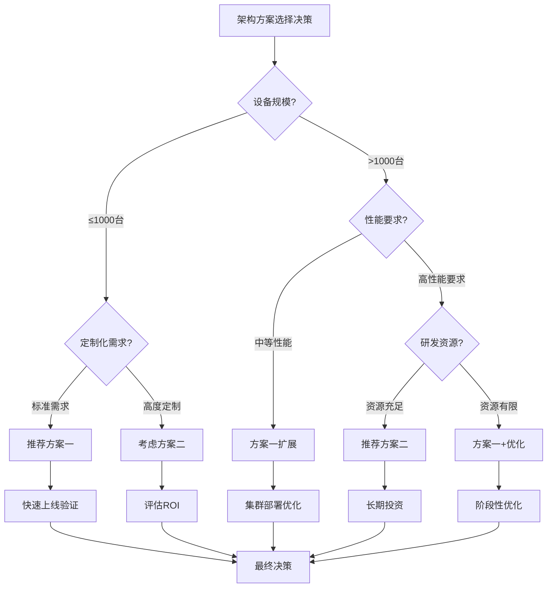
```mermaid
flowchart TD
    Start[架构方案选择决策] --> Q1{设备规模?}
    
    Q1 -->|≤1000台| Q2{定制化需求?}
    Q1 -->|>1000台| Q3{性能要求?}
    
    Q2 -->|标准需求| A[推荐方案一]
    Q2 -->|高度定制| B[考虑方案二]
    
    Q3 -->|高性能要求| Q4{研发资源?}
    Q3 -->|中等性能| C[方案一扩展]
    
    Q4 -->|资源充足| D[推荐方案二]
    Q4 -->|资源有限| E[方案一+优化]
    
    A --> F[快速上线验证]
    B --> G[评估ROI]
    C --> H[集群部署优化]
    D --> I[长期投资]
    E --> J[阶段性优化]
    
    F --> End[最终决策]
    G --> End
    H --> End
    I --> End
    J --> End

```

### 3.4.2 场景化推荐

#### 场景一：中小型企业/初创项目

*   **典型特征**：
    
    *   设备规模：<500台
        
    *   预算有限，需要快速验证
        
    *   技术团队规模小
        
    *   需求相对标准
        
*   **推荐方案**：方案一（ThingsBoard）
    
*   **理由**：
    
    *   快速上线，缩短Time to Market
        
    *   降低初期投资风险
        
    *   利用开源生态，减少开发工作量
        
    *   标准化运维，降低运维门槛
        
*   **实施建议**：
    
    *   从最小可行产品（MVP）开始
        
    *   先验证核心业务逻辑
        
    *   逐步扩展功能和规模
        

#### 场景二：大型企业/成熟业务

*   **典型特征**：
    
    *   设备规模：>5000台
        
    *   有长期发展规划
        
    *   技术团队实力强
        
    *   有特殊定制需求
        
*   **推荐方案**：方案二（自研平台）
    
*   **理由**：
    
    *   完全自主可控，避免供应商锁定
        
    *   可深度定制，满足复杂业务需求
        
    *   性能可专项优化，支撑大规模部署
        
    *   数据完全自主，符合安全合规要求
        
*   **实施建议**：
    
    *   分阶段实施，先核心后扩展
        
    *   建立完善的研发和运维体系
        
    *   考虑与现有系统整合
        

#### 场景三：混合部署场景

*   **典型特征**：
    
    *   多区域、多租户部署
        
    *   不同区域有不同需求
        
    *   需要灵活的技术架构
        
*   **推荐方案**：混合方案
    
*   **实施策略**：
    
    *   **标准化区域**：使用方案一，快速部署
        
    *   **核心/定制区域**：使用方案二，深度定制
        
    *   **统一管理**：通过API网关统一接入和管理
        
*   **技术架构**：
    
    *   统一数据模型和接口规范
        
    *   异构平台数据同步
        
    *   集中监控和运维
        

### 3.4.3 选择评估清单

#### 选择方案一的充分条件（满足3项以上）

*   [ ] 设备规模小于1000台
    
*   [ ] 项目预算有限
    
*   [ ] 需要6个月内上线
    
*   [ ] 团队物联网经验有限
    
*   [ ] 业务需求相对标准
    
*   [ ] 可接受开源方案的限制
    
*   [ ] 运维资源有限
    

#### 选择方案二的充分条件（满足3项以上）

*   [ ] 设备规模大于3000台
    
*   [ ] 有特殊协议或数据格式需求
    
*   [ ] 需要与企业现有系统深度集成
    
*   [ ] 对系统性能有极高要求
    
*   [ ] 数据安全合规要求严格
    
*   [ ] 有长期技术演进规划
    
*   [ ] 具备强大的研发和运维团队
    

#### 混合方案考虑条件

*   [ ] 多区域部署需求差异大
    
*   [ ] 既有标准化需求也有定制需求
    
*   [ ] 需要渐进式技术演进
    
*   [ ] 有现有系统需要整合
    
*   [ ] 资源投入可以分阶段进行
    

### 3.4.4 迁移和演进策略

#### 从方案一到方案二的演进路径

```plaintext
阶段1：方案一验证（0-6个月）
  - 使用ThingsBoard快速搭建系统
  - 验证核心业务逻辑和算法
  - 积累业务数据和用户反馈

阶段2：并行运行（6-12个月）
  - 开始自研平台核心组件开发
  - 新功能在自研平台实现
  - 逐步迁移成熟功能到自研平台
  - 双平台并行，数据双向同步

阶段3：全面切换（12-18个月）
  - 核心功能全部迁移到自研平台
  - 旧平台作为备份或特定场景使用
  - 统一管理和运维体系

```

#### 从方案二到方案一的降级策略

```plaintext
异常情况处理：
  1. 自研平台故障时，临时切换ThingsBoard
  2. 保持数据模型和接口兼容性
  3. 简化功能降级运行
  4. 故障恢复后数据同步回自研平台

降级预案：
  - 预先部署ThingsBoard备用环境
  - 定期数据备份和同步
  - 降级操作流程和手册
  - 定期降级演练

```

### 3.4.5 风险管理与应对

#### 方案一主要风险

1.  **平台限制风险**
    
    *   **表现**：ThingsBoard功能无法满足未来需求
        
    *   **应对**：保持AI模块独立性，便于未来迁移
        
2.  **性能瓶颈风险**
    
    *   **表现**：大规模部署时性能下降
        
    *   **应对**：集群部署、读写分离、缓存优化
        
3.  **社区支持风险**
    
    *   **表现**：社区发展缓慢或停止维护
        
    *   **应对**：参与社区贡献，准备替代方案
        

#### 方案二主要风险

1.  **开发延期风险**
    
    *   **表现**：自研进度不及预期
        
    *   **应对**：敏捷开发，分阶段交付，设置里程碑
        
2.  **技术债务风险**
    
    *   **表现**：快速开发积累技术债务
        
    *   **应对**：代码规范、持续重构、技术评审
        
3.  **运维复杂度风险**
    
    *   **表现**：全栈运维压力大
        
    *   **应对**：自动化运维，SRE团队建设，监控体系
        

### 3.4.6 最终建议

基于对两个方案的全面分析，我们提出以下建议：

#### 对于大多数项目：推荐方案一

**核心理由**：

1.  **性价比最优**：在满足需求的前提下成本最低
    
2.  **风险可控**：基于成熟开源平台，技术风险低
    
3.  **快速验证**：可快速搭建系统验证业务价值
    
4.  **演进灵活**：AI模块独立设计，便于未来演进
    

#### 对于特定场景：考虑方案二

**特定场景包括**：

1.  **超大规模部署**：设备数量超过10000台
    
2.  **特殊行业需求**：有特殊安全、协议或性能要求
    
3.  **战略级项目**：需要完全自主可控的核心系统
    
4.  **已有深厚积累**：团队具备丰富的物联网平台开发经验
    

#### 混合方案：平衡之道

对于复杂的企业环境，可以考虑：

1.  **短期**：方案一快速上线验证
    
2.  **中期**：核心模块逐步自研替换
    
3.  **长期**：形成自主可控的混合架构
    

无论选择哪个方案，**AI分析模块的独立性**都是关键设计原则，这保证了算法的持续迭代和系统的长期演进能力。

# 四、核心模块详细设计

## 4.1 数据采集与存储层设计

### 4.1.1 数据采集架构

#### 传感器数据上报模式

系统支持多种数据上报模式，适应不同场景需求：

1.  **标准上报模式**（推荐）：
    
    ```plaintext
    传感器 → MQTT/HTTP → 物联网平台 → 时序数据库
    
    ```
    *   **频率**：每10分钟上报一次
        
    *   **数据格式**：JSON格式，包含时间戳、温度、湿度
        
    *   **协议**：MQTT 3.1.1/5.0（低功耗场景）或 HTTP/HTTPS（标准场景）
        
2.  **批量上报模式**（网络优化）：
    
    *   传感器本地缓存多个数据点，一次性批量上报
        
    *   减少网络连接次数，适合移动网络或弱网环境
        
3.  **实时流模式**（特殊需求）：
    
    *   高风险状态下增加上报频率（如每分钟一次）
        
    *   支持WebSocket长连接，实现准实时数据传输
        

#### 数据采集协议支持

```yaml
协议栈:
  - 主要协议: MQTT 3.1.1/5.0 (端口: 1883/8883)
  - 备选协议: HTTP/HTTPS REST API (端口: 80/443)
  - 扩展协议: CoAP (可选，低功耗设备)
  
安全机制:
  - 设备认证: 设备ID + 访问令牌(ACCESS_TOKEN)
  - 传输加密: TLS 1.2+ (HTTPS/MQTTS)
  - 数据校验: 数字签名防篡改
  
数据格式:
  - 标准格式: JSON {"ts":时间戳,"values":{"temperature":22.5,"humidity":65}}
  - 压缩格式: GZIP压缩，减少带宽消耗
  - 自定义格式: 支持二进制编码（高性能场景）

```

### 4.1.2 数据存储架构

#### 时序数据存储设计

**核心存储引擎**：

*   **主要选择**：TDengine 3.x（高性能时序数据库）
    
*   **备选选择**：InfluxDB 2.x（成熟生态）
    
*   **存储策略**：三层存储架构
    

**数据分层存储策略**：

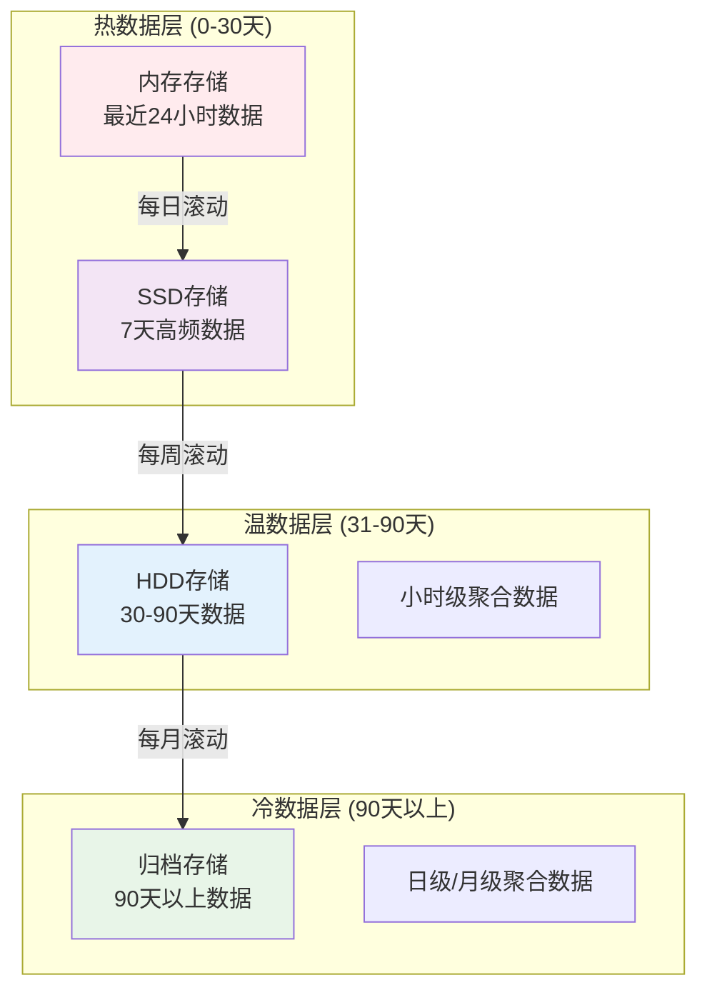
```mermaid
graph TB
    subgraph "热数据层 (0-30天)"
        Memory[内存存储<br/>最近24小时数据]
        SSD[SSD存储<br/>7天高频数据]
    end
    
    subgraph "温数据层 (31-90天)"
        HDD1[HDD存储<br/>30-90天数据]
        Agg1[小时级聚合数据]
    end
    
    subgraph "冷数据层 (90天以上)"
        Archive[归档存储<br/>90天以上数据]
        Agg2[日级/月级聚合数据]
    end
    
    Memory -->|每日滚动| SSD
    SSD -->|每周滚动| HDD1
    HDD1 -->|每月滚动| Archive
    
    style Memory fill:#ffebee
    style SSD fill:#f3e5f5
    style HDD1 fill:#e3f2fd
    style Archive fill:#e8f5e8

```

**数据保留策略**：

*   **原始数据**：保留90天，满足法规和审计要求
    
*   **小时聚合数据**：保留1年，用于趋势分析和月度报告
    
*   **日聚合数据**：保留3年，用于长期趋势分析
    
*   **月聚合数据**：永久保留，用于历史对比和研究
    

#### 业务数据存储设计

**关系型数据库**（MySQL 8.0/PostgreSQL 14）：

```sql
-- 核心业务表结构
CREATE TABLE preset_scenes (
    scene_id VARCHAR(50) PRIMARY KEY,
    scene_name VARCHAR(100),
    description VARCHAR(500),
    base_material_level DECIMAL(3,1),
    low_threshold DECIMAL(3,1),
    medium_threshold DECIMAL(3,1),
    high_threshold DECIMAL(3,1),
    icon_url VARCHAR(200),
    usage_count INT DEFAULT 0,
    accuracy_score DECIMAL(4,3),
    current_version VARCHAR(20),
    is_active BOOLEAN DEFAULT true,
    created_time TIMESTAMP,
    updated_time TIMESTAMP
);

CREATE TABLE device_scene_bindings (
    id BIGINT AUTO_INCREMENT PRIMARY KEY,
    device_id VARCHAR(50) UNIQUE,
    scene_id VARCHAR(50),
    preset_version VARCHAR(20),
    bind_time TIMESTAMP,
    installer VARCHAR(100),
    location_note TEXT,
    created_time TIMESTAMP DEFAULT CURRENT_TIMESTAMP
);

CREATE TABLE calibration_feedbacks (
    id BIGINT AUTO_INCREMENT PRIMARY KEY,
    device_id VARCHAR(50),
    scene_id VARCHAR(50),
    check_time TIMESTAMP,
    mold_found BOOLEAN,
    severity VARCHAR(20),
    predicted_mi DECIMAL(4,2),
    actual_mi DECIMAL(4,2),
    feedback_type VARCHAR(20),
    checker VARCHAR(50),
    comments TEXT,
    created_time TIMESTAMP DEFAULT CURRENT_TIMESTAMP
);

```

#### 缓存层设计

**多级缓存架构**：

1.  **本地内存缓存**（Caffeine）：
    
    *   缓存场景参数、设备绑定关系
        
    *   TTL：5分钟，最大条目：10,000
        
2.  **分布式缓存**（Redis Cluster）：
    
    *   缓存分析结果、设备状态
        
    *   TTL：30分钟，支持集群部署
        
3.  **查询结果缓存**：
    
    *   缓存频繁查询的历史数据
        
    *   智能缓存策略：基于查询模式动态调整
        

### 4.1.3 数据质量保障

#### 数据校验机制

```yaml
校验规则:
  1. 范围校验:
    - 温度: -50℃ ~ 100℃ (合理物理范围)
    - 湿度: 0% ~ 100%
    - 时间戳: 不允许未来时间，允许10分钟时间偏移
    
  2. 连续性校验:
    - 相邻数据点时间间隔: 5-15分钟 (允许±5分钟波动)
    - 数据缺失检测: 连续3个点缺失触发告警
    
  3. 异常值检测:
    - 3σ原则: 超出均值±3个标准差视为异常
    - 突变检测: 相邻点变化超过阈值(温度5℃/分钟，湿度10%/分钟)
    
  4. 一致性校验:
    - 温湿度关系: 特定温度下的饱和湿度检查
    - 物理合理性: 露点温度计算验证

```

#### 数据清洗策略

1.  **缺失值处理**：
    
    *   单个缺失：线性插值
        
    *   连续缺失（≤3个）：样条插值
        
    *   大量缺失（>3个）：标记数据质量警告
        
2.  **异常值处理**：
    
    *   轻度异常（3σ内）：保留但标记
        
    *   重度异常（超过物理范围）：剔除并插值
        
    *   持续性异常：触发传感器健康检查
        
3.  **数据平滑**：
    
    *   移动平均：3点移动平均，减少噪声
        
    *   卡尔曼滤波：重要传感器实时滤波
        

### 4.1.4 数据访问性能优化

#### 查询优化策略

```java
// 数据查询优化示例
public class OptimizedDataQuery {
    
    // 1. 批量查询优化
    public Map<String, List<SensorDataPoint>> batchQueryWithOptimization(
            List<String> deviceIds, 
            Instant startTime, 
            Instant endTime) {
        
        // 分组策略：按数据量和时间范围分组
        Map<Integer, List<String>> groups = deviceIds.stream()
            .collect(Collectors.groupingBy(deviceId -> 
                estimateDataSize(deviceId, startTime, endTime)));
        
        // 并行查询优化
        return groups.entrySet().parallelStream()
            .flatMap(entry -> queryGroup(entry.getValue(), startTime, endTime).entrySet().stream())
            .collect(Collectors.toMap(Map.Entry::getKey, Map.Entry::getValue));
    }
    
    // 2. 预加载策略
    @Cacheable(value = "historicalData", key = "#deviceId + #date")
    public List<SensorDataPoint> preloadDailyData(String deviceId, LocalDate date) {
        // 每天凌晨预加载前一天数据
        return queryHistoricalData(deviceId, 
            date.atStartOfDay().toInstant(ZoneOffset.UTC),
            date.plusDays(1).atStartOfDay().toInstant(ZoneOffset.UTC));
    }
}

```

#### 索引设计

1.  **时序数据库索引**：
    
    *   主键索引：时间戳 + 设备ID
        
    *   二级索引：传感器类型、位置标签
        
2.  **关系数据库索引**：
    

```sql
-- 设备场景绑定表索引
CREATE INDEX idx_device_binding ON device_scene_bindings(device_id, scene_id);
CREATE INDEX idx_scene_usage ON device_scene_bindings(scene_id, bind_time);

-- 校准反馈表索引
CREATE INDEX idx_feedback_scene ON calibration_feedbacks(scene_id, check_time);
CREATE INDEX idx_feedback_device ON calibration_feedbacks(device_id, check_time);

```

### 4.1.5 数据安全与隐私

#### 数据加密策略

1.  **传输加密**：
    
    *   HTTPS/TLS 1.2+ 全程加密
        
    *   MQTT over SSL/TLS（端口8883）
        
2.  **存储加密**：
    
    *   敏感数据（位置信息、安装人员）AES-256加密存储
        
    *   数据库透明数据加密（TDE）
        
3.  **访问控制**：
    
    *   基于角色的数据访问权限
        
    *   数据脱敏：日志和导出数据敏感字段脱敏
        

#### 数据生命周期管理

1.  **数据归档**：
    
    *   自动化归档策略：90天自动归档
        
    *   归档格式：列式存储（Parquet）+ 压缩（Snappy）
        
2.  **数据销毁**：
    
    *   合规性销毁：根据法规要求定期销毁
        
    *   用户请求销毁：支持GDPR数据删除请求
        

## 4.2 AI分析微服务模块架构

### 4.2.1 微服务整体架构

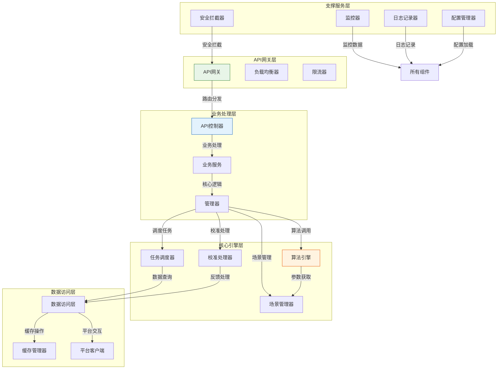
```mermaid
graph TB
    subgraph "API网关层"
        GW[API网关]
        LB[负载均衡器]
        RateLimiter[限流器]
    end
    
    subgraph "业务处理层"
        Controller[API控制器]
        Service[业务服务]
        Manager[管理器]
    end
    
    subgraph "核心引擎层"
        Scheduler[任务调度器]
        Algorithm[算法引擎]
        SceneMgr[场景管理器]
        Calibration[校准处理器]
    end
    
    subgraph "数据访问层"
        Repository[数据访问层]
        Cache[缓存管理器]
        Client[平台客户端]
    end
    
    subgraph "支撑服务层"
        Monitor[监控器]
        Logger[日志记录器]
        Config[配置管理器]
        Security[安全拦截器]
    end
    
    %% 数据流向
    GW -->|路由分发| Controller
    Controller -->|业务处理| Service
    Service -->|核心逻辑| Manager
    
    Manager -->|调度任务| Scheduler
    Manager -->|算法调用| Algorithm
    Manager -->|场景管理| SceneMgr
    Manager -->|校准处理| Calibration
    
    Scheduler -->|数据查询| Repository
    Algorithm -->|参数获取| SceneMgr
    Calibration -->|反馈处理| Repository
    
    Repository -->|缓存操作| Cache
    Repository -->|平台交互| Client
    
    Monitor -->|监控数据| 所有组件
    Logger -->|日志记录| 所有组件
    Config -->|配置加载| 所有组件
    Security -->|安全拦截| GW
    
    %% 样式
    style GW fill:#e8f5e8,stroke:#2e7d32
    style Controller fill:#e3f2fd,stroke:#1565c0
    style Algorithm fill:#fff3e0,stroke:#e65100

```

### 4.2.2 核心组件设计

#### 任务调度器（Scheduler）

**功能职责**：

*   定时触发风险分析任务（每小时整点）
    
*   设备分批处理调度（避免资源峰值）
    
*   任务失败重试和容错处理
    
*   任务优先级和负载均衡
    

**调度策略**：

```yaml
调度配置:
  基础调度:
    - 类型: 固定频率调度
    - 时间: 每小时整点执行
    - 并发控制: 最大10个并行任务
    
  设备分批:
    - 批量大小: 20个设备/批次
    - 批次间隔: 100毫秒
    - 超时设置: 批次处理超时5分钟
    
  重试策略:
    - 最大重试次数: 3次
    - 重试间隔: 指数退避（1s, 2s, 4s）
    - 重试条件: 网络异常、数据异常

```

#### 算法引擎（Algorithm Engine）

**架构设计**：

```java
/**
 * 算法引擎核心接口
 */
public interface AlgorithmEngine {
    
    // 风险计算接口
    RiskAnalysisResult calculateRisk(String deviceId, 
                                     List<SensorDataPoint> dataPoints,
                                     SceneParameter sceneParam);
    
    // 批量计算接口
    Map<String, RiskAnalysisResult> batchCalculate(
            Map<String, List<SensorDataPoint>> deviceData,
            Map<String, SceneParameter> sceneParams);
    
    // 实时计算接口（简化版）
    RiskAnalysisResult realtimeCalculate(String deviceId,
                                         SensorDataPoint currentData,
                                         SceneParameter sceneParam,
                                         Double previousMI);
}

```

**计算流程**：

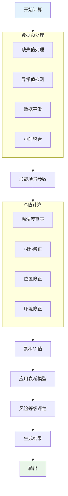
```mermaid
flowchart TD
    A[开始计算] --> B[数据预处理]
    B --> C[加载场景参数]
    C --> D[计算G值序列]
    D --> E[累积MI值]
    E --> F[应用衰减模型]
    F --> G[风险等级评估]
    G --> H[生成结果]
    H --> I[输出]
    
    subgraph B[数据预处理]
        B1[缺失值处理]
        B2[异常值检测]
        B3[数据平滑]
        B4[小时聚合]
    end
    
    subgraph D[G值计算]
        D1[温湿度查表]
        D2[材料修正]
        D3[位置修正]
        D4[环境修正]
    end
    
    style A fill:#e3f2fd
    style I fill:#e8f5e8

```

#### 平台客户端（Platform Client）

**职责**：

*   统一封装与物联网平台的交互
    
*   连接池管理和连接复用
    
*   错误重试和熔断机制
    
*   性能监控和统计
    

**客户端设计**：

```java
@Component
@Slf4j
public class PlatformClient {
    
    // 连接池配置
    @Bean
    public RestTemplate restTemplate() {
        return new RestTemplateBuilder()
            .setConnectTimeout(Duration.ofSeconds(10))
            .setReadTimeout(Duration.ofSeconds(30))
            .setConnectionRequestTimeout(Duration.ofSeconds(5))
            .build();
    }
    
    // 熔断器配置
    @Bean
    public CircuitBreakerFactory circuitBreakerFactory() {
        return new Resilience4JCircuitBreakerFactory();
    }
    
    // 数据查询方法（带重试和熔断）
    @CircuitBreaker(name = "platformQuery", fallbackMethod = "queryFallback")
    @Retryable(value = {PlatformException.class}, maxAttempts = 3)
    public List<SensorDataPoint> queryHistoricalData(String deviceId, 
                                                     Instant startTime, 
                                                     Instant endTime) {
        // 查询逻辑
    }
    
    // 降级方法
    public List<SensorDataPoint> queryFallback(String deviceId, 
                                               Instant startTime, 
                                               Instant endTime,
                                               Throwable t) {
        log.warn("平台查询降级，使用缓存数据: deviceId={}", deviceId);
        return cacheManager.getCachedData(deviceId, startTime, endTime);
    }
}

```

### 4.2.3 服务配置设计

#### 外部化配置

```yaml
# application.yml
mold-ai:
  # 调度配置
  scheduler:
    enabled: true
    cron: "0 0 * * * *"  # 每小时
    batch-size: 20
    parallel-tasks: 10
    
  # 算法配置
  algorithm:
    vtt-model:
      table-path: "classpath:vtt-model.csv"
      interpolation: "bilinear"
    mi-calculation:
      window-days: 7
      decay-factor: 0.95
      
  # 平台连接配置
  platform:
    type: "thingsboard"  # thingsboard 或 custom
    base-url: "${PLATFORM_URL:http://localhost:8080}"
    timeout:
      connect: 10s
      read: 30s
      
  # 缓存配置
  cache:
    enabled: true
    type: "caffeine"
    expire-time: "5m"
    maximum-size: 10000

```

#### 环境配置管理

1.  **多环境支持**：
    
    *   开发环境（dev）：本地开发测试
        
    *   测试环境（test）：集成测试
        
    *   预发环境（staging）：预发布验证
        
    *   生产环境（prod）：线上运行
        
2.  **配置中心集成**：
    
    *   Spring Cloud Config Server
        
    *   支持配置热更新
        
    *   配置版本管理
        

### 4.2.4 并发与性能设计

#### 线程池配置

```java
@Configuration
@EnableAsync
public class ThreadPoolConfig {
    
    @Bean("analysisExecutor")
    public Executor analysisExecutor() {
        ThreadPoolTaskExecutor executor = new ThreadPoolTaskExecutor();
        executor.setCorePoolSize(10);           // 核心线程数
        executor.setMaxPoolSize(50);            // 最大线程数
        executor.setQueueCapacity(100);         // 队列容量
        executor.setKeepAliveSeconds(60);       // 线程空闲时间
        executor.setThreadNamePrefix("analysis-"); // 线程名前缀
        executor.setRejectedExecutionHandler(new ThreadPoolExecutor.CallerRunsPolicy());
        executor.initialize();
        return executor;
    }
    
    @Bean("ioExecutor")
    public Executor ioExecutor() {
        // I/O密集型任务线程池
        return Executors.newFixedThreadPool(20);
    }
}

```

#### 异步处理设计

1.  **异步计算**：风险计算任务异步执行
    
2.  **非阻塞I/O**：使用异步HTTP客户端
    
3.  **事件驱动**：关键操作通过事件通知机制
    

## 4.3 场景化管理子系统

### 4.3.1 预设场景库设计

#### 场景定义标准

系统内置5种标准场景，每种场景包含完整参数体系：

| 场景ID | 场景名称 | 材料等级 | 风险阈值 | 控制策略 | 适用区域 |
| --- | --- | --- | --- | --- | --- |
| `wall` | 标准墙面/天花板 | 3.0 | 低<2.0, 中<3.0, 高≥3.0 | 温和通风 | 客厅、卧室墙面 |
| `wood_furniture` | 木质家具内 | 4.0 | 低<1.5, 中<2.5, 高≥2.5 | 渐进控制 | 衣柜、橱柜内部 |
| `high_humidity` | 高湿功能区 | 3.5 | 低<2.5, 中<3.5, 高≥3.5 | 强力除湿 | 卫生间、厨房 |
| `window_corner` | 窗台/外墙角 | 3.5 | 低<2.2, 中<3.2, 高≥3.2 | 保温通风 | 窗台、外墙角 |
| `equipment_area` | 设备区/管道间 | 4.0 | 低<1.8, 中<2.8, 高≥2.8 | 严格监控 | 空调下、水管旁 |

#### 场景参数结构

```java
@Data
public class PresetScene {
    private String sceneId;           // 场景标识
    private String sceneName;         // 显示名称
    private String description;       // 场景描述
    private Double baseMaterialLevel; // 基准材料等级（1.0-6.0）
    private RiskThreshold threshold;  // 风险阈值配置
    private String icon;              // UI图标URL
    private Integer usageCount;       // 使用次数统计
    private Double accuracyScore;     // 准确率评分（0.0-1.0）
    private String version;           // 参数版本
    private Boolean isActive;         // 是否激活
    private LocalDateTime createdTime;
    private LocalDateTime updatedTime;
    
    // 控制策略参数
    private ControlStrategy controlStrategy;
    private Integer recommendedCheckInterval; // 建议检查间隔（天）
    private List<String> typicalLocations;    // 典型位置示例
}

```

### 4.3.2 设备场景绑定管理

#### 绑定机制设计

1.  **绑定方式**：
    
    *   安装时绑定：安装人员配置
        
    *   自动推荐：基于位置信息智能推荐
        
    *   批量绑定：支持CSV导入导出
        
2.  **绑定验证**：
    
    *   场景ID有效性检查
        
    *   设备类型兼容性检查
        
    *   位置合理性验证
        

#### 绑定接口设计

```java
public interface DeviceSceneService {
    
    /**
     * 绑定设备到场景
     */
    DeviceSceneBinding bindDeviceToScene(String deviceId, 
                                         String sceneId,
                                         BindRequest request);
    
    /**
     * 获取设备场景绑定
     */
    SceneParameter getDeviceScene(String deviceId);
    
    /**
     * 批量查询设备场景
     */
    Map<String, SceneParameter> batchGetDeviceScenes(List<String> deviceIds);
    
    /**
     * 场景使用统计
     */
    SceneUsageStats getSceneUsageStats(String sceneId, 
                                       LocalDate startDate, 
                                       LocalDate endDate);
}

```

### 4.3.3 场景参数版本管理

#### 版本控制机制

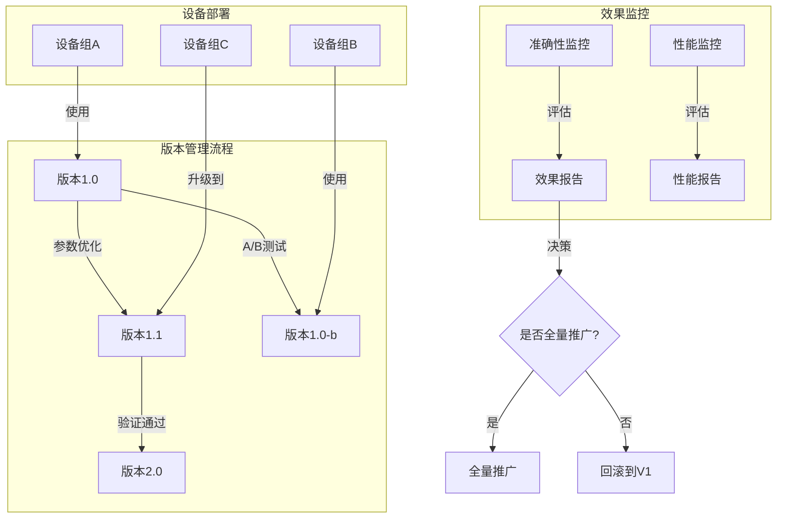
```mermaid
graph TB
    subgraph "版本管理流程"
        V1[版本1.0] -->|参数优化| V2[版本1.1]
        V1 -->|A/B测试| V1B[版本1.0-b]
        V2 -->|验证通过| V3[版本2.0]
    end
    
    subgraph "设备部署"
        D1[设备组A] -->|使用| V1
        D2[设备组B] -->|使用| V1B
        D3[设备组C] -->|升级到| V2
    end
    
    subgraph "效果监控"
        M1[准确性监控] -->|评估| E1[效果报告]
        M2[性能监控] -->|评估| E2[性能报告]
    end
    
    E1 -->|决策| Decision{是否全量推广?}
    Decision -->|是| Rollout[全量推广]
    Decision -->|否| Rollback[回滚到V1]

```

#### A/B测试框架

1.  **测试分组**：
    
    *   按设备ID哈希分组
        
    *   按地理位置分组
        
    *   按安装时间分组
        
2.  **效果评估指标**：
    
    *   预测准确性对比
        
    *   风险检出率对比
        
    *   误报率对比
        
    *   用户满意度对比
        

### 4.3.4 场景智能推荐

#### 推荐算法设计

```java
@Component
public class SceneRecommender {
    
    /**
     * 基于位置信息的场景推荐
     */
    public SceneRecommendation recommendByLocation(LocationInfo location) {
        // 1. 基于房间类型推荐
        String roomType = location.getRoomType();
        ScenePriority priority = getPriorityByRoomType(roomType);
        
        // 2. 基于建筑结构推荐
        BuildingStructure structure = location.getBuildingStructure();
        adjustPriorityByStructure(priority, structure);
        
        // 3. 基于历史数据推荐
        HistoricalData history = getHistoricalData(location.getBuildingId());
        adjustPriorityByHistory(priority, history);
        
        // 4. 返回推荐结果
        return buildRecommendation(priority);
    }
    
    /**
     * 基于相似设备推荐
     */
    public SceneRecommendation recommendBySimilarDevices(String deviceId) {
        // 查找相似设备（相同位置、相似环境）
        List<String> similarDevices = findSimilarDevices(deviceId);
        
        // 统计相似设备的场景分布
        Map<String, Integer> sceneDistribution = 
            calculateSceneDistribution(similarDevices);
        
        // 基于统计结果推荐
        return recommendByDistribution(sceneDistribution);
    }
}

```

#### 推荐优先级规则

```yaml
推荐规则:
  房间类型权重:
    - 卫生间/厨房: high_humidity (权重: 0.8)
    - 卧室/客厅: wall (权重: 0.7)
    - 储藏室/衣柜: wood_furniture (权重: 0.9)
    
  位置特征权重:
    - 靠外墙/窗户: window_corner (权重: +0.3)
    - 空调下方: equipment_area (权重: +0.4)
    - 管道附近: equipment_area (权重: +0.5)
    
  历史数据权重:
    - 历史高风险: 提高设备区权重
    - 频繁波动: 提高高湿区权重
    - 稳定环境: 提高墙面权重

```

## 4.4 规则引擎与智能联动模块

### 4.4.1 规则引擎架构设计

#### 基于ThingsBoard的规则引擎

```javascript
// ThingsBoard规则链配置示例（渐进式控制）
// 节点1：接收风险分析结果
var riskLevel = msg.riskLevel;
var sceneId = metadata.sceneId;
var miValue = msg.moldIndex;

// 节点2：场景化阈值判断
var thresholds = getSceneThresholds(sceneId);
var action = determineAction(miValue, thresholds, riskLevel);

// 节点3：渐进式控制决策
switch (action) {
    case 'stage1':
        // 第一阶段控制：开启通风
        executeStage1Control(metadata.deviceId);
        setTimer('check_effect', 30 * 60 * 1000); // 30分钟后检查
        break;
        
    case 'stage2':
        // 第二阶段控制：开启加热/除湿
        executeStage2Control(metadata.deviceId);
        setTimer('check_effect', 20 * 60 * 1000); // 20分钟后检查
        break;
        
    case 'escalate':
        // 升级处理：通知人工干预
        createEmergencyAlert(metadata.deviceId, miValue, riskLevel);
        break;
        
    default:
        // 无风险或低风险：仅记录
        logRiskData(metadata.deviceId, miValue, riskLevel);
}

```

#### 自研规则引擎设计

```java
@Component
public class RuleEngineService {
    
    @Autowired
    private RuleRepository ruleRepository;
    
    @Autowired
    private ActionExecutor actionExecutor;
    
    /**
     * 评估设备风险并执行规则
     */
    public void evaluateAndExecute(String deviceId, RiskAnalysisResult result) {
        // 1. 加载设备相关规则
        List<ControlRule> rules = ruleRepository.findByDeviceId(deviceId);
        
        // 2. 规则匹配（按优先级排序）
        rules.sort(Comparator.comparingInt(ControlRule::getPriority).reversed());
        
        // 3. 执行匹配的规则
        for (ControlRule rule : rules) {
            if (rule.isEnabled() && matchesRule(rule, result)) {
                executeRuleAction(rule, result);
                
                // 如果规则设置了"匹配后停止"，则跳出循环
                if (rule.isStopOnMatch()) {
                    break;
                }
            }
        }
    }
    
    /**
     * 规则匹配逻辑
     */
    private boolean matchesRule(ControlRule rule, RiskAnalysisResult result) {
        RuleCondition condition = rule.getCondition();
        
        // 多条件组合匹配
        return matchesRiskLevel(condition, result.getRiskLevel()) &&
               matchesMiValue(condition, result.getMoldIndex()) &&
               matchesTimeCondition(condition) &&
               matchesDurationCondition(condition, deviceId);
    }
}

```

### 4.4.2 控制策略设计

#### 渐进式控制策略

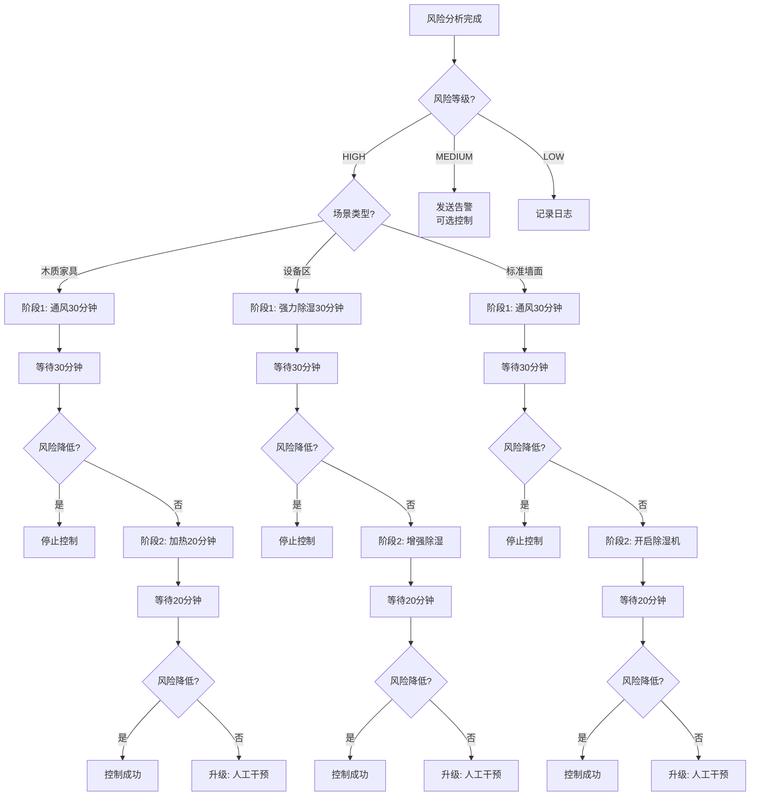
```mermaid
flowchart TD
    Start[风险分析完成] --> CheckRisk{风险等级?}
    
    CheckRisk -->|HIGH| CheckScene{场景类型?}
    CheckRisk -->|MEDIUM| MediumAction[发送告警<br/>可选控制]
    CheckRisk -->|LOW| LowAction[记录日志]
    
    CheckScene -->|木质家具| WoodStage1[阶段1: 通风30分钟]
    CheckScene -->|设备区| EquipStage1[阶段1: 强力除湿30分钟]
    CheckScene -->|标准墙面| WallStage1[阶段1: 通风30分钟]
    
    WoodStage1 --> Wait1[等待30分钟]
    EquipStage1 --> Wait2[等待30分钟]
    WallStage1 --> Wait3[等待30分钟]
    
    Wait1 --> Recheck1{风险降低?}
    Wait2 --> Recheck2{风险降低?}
    Wait3 --> Recheck3{风险降低?}
    
    Recheck1 -->|是| Success1[停止控制]
    Recheck1 -->|否| WoodStage2[阶段2: 加热20分钟]
    
    Recheck2 -->|是| Success2[停止控制]
    Recheck2 -->|否| EquipStage2[阶段2: 增强除湿]
    
    Recheck3 -->|是| Success3[停止控制]
    Recheck3 -->|否| WallStage2[阶段2: 开启除湿机]
    
    WoodStage2 --> Wait4[等待20分钟]
    EquipStage2 --> Wait5[等待20分钟]
    WallStage2 --> Wait6[等待20分钟]
    
    Wait4 --> FinalCheck1{风险降低?}
    Wait5 --> FinalCheck2{风险降低?}
    Wait6 --> FinalCheck3{风险降低?}
    
    FinalCheck1 -->|是| FinalSuccess1[控制成功]
    FinalCheck1 -->|否| Escalate1[升级: 人工干预]
    
    FinalCheck2 -->|是| FinalSuccess2[控制成功]
    FinalCheck2 -->|否| Escalate2[升级: 人工干预]
    
    FinalCheck3 -->|是| FinalSuccess3[控制成功]
    FinalCheck3 -->|否| Escalate3[升级: 人工干预]

```

#### 场景化控制参数

```yaml
控制参数配置:
  木质家具场景:
    阶段1:
      设备: 排风扇
      时长: 30分钟
      功率: 中等
      触发条件: MI ≥ 2.5
      
    阶段2:
      设备: 加热器
      时长: 20分钟
      温度: 26℃
      触发条件: 阶段1后MI仍≥2.5
      
  设备区场景:
    阶段1:
      设备: 除湿机
      时长: 30分钟
      湿度目标: 50%
      触发条件: MI ≥ 2.0
      
    阶段2:
      设备: 增强除湿
      时长: 20分钟
      湿度目标: 45%
      触发条件: 阶段1后MI仍≥2.0

```

### 4.4.3 设备联动设计

#### 设备关联管理

1.  **关联类型**：
    
    *   控制关联：传感器 → 执行器
        
    *   备份关联：主设备 → 备用设备
        
    *   级联关联：设备链式控制
        
2.  **关联发现**：
    
    *   基于位置自动发现
        
    *   基于网络拓扑发现
        
    *   手动配置关联
        

#### 控制指令设计

```java
@Data
public class ControlCommand {
    private String commandId;        // 命令ID（UUID）
    private String deviceId;         // 目标设备ID
    private String method;           // 控制方法（turnOn, setValue等）
    private Map<String, Object> params; // 控制参数
    private Integer timeout;         // 超时时间（秒）
    private Integer priority;        // 优先级（0-99）
    private Instant expireTime;      // 过期时间
    private String reason;           // 控制原因
    private Map<String, String> metadata; // 元数据
}

// 指令执行服务
@Service
public class CommandExecutionService {
    
    /**
     * 发送控制指令（带确认机制）
     */
    public CommandResult sendCommandWithAck(ControlCommand command) {
        // 1. 发送指令
        CommandResult sendResult = platformClient.sendCommand(command);
        
        // 2. 等待确认
        if (sendResult.isAccepted()) {
            return waitForExecution(command.getCommandId(), command.getTimeout());
        }
        
        // 3. 发送失败处理
        return handleSendFailure(command, sendResult);
    }
    
    /**
     * 批量发送指令
     */
    public Map<String, CommandResult> batchSendCommands(
            List<ControlCommand> commands) {
        
        return commands.parallelStream()
            .collect(Collectors.toMap(
                ControlCommand::getDeviceId,
                this::sendCommandWithAck
            ));
    }
}

```

### 4.4.4 控制效果评估

#### 效果评估指标

1.  **环境改善指标**：
    
    *   湿度下降率（%）
        
    *   温度变化（℃）
        
    *   MI值下降幅度
        
2.  **设备效能指标**：
    
    *   设备响应时间
        
    *   指令执行成功率
        
    *   能耗指标（kWh）
        
3.  **业务效果指标**：
    
    *   风险等级改善情况
        
    *   告警减少率
        
    *   用户满意度
        

#### 评估算法

```java
@Component
public class ControlEffectEvaluator {
    
    /**
     * 评估控制效果
     */
    public ControlEffect evaluateEffect(String deviceId, 
                                        ControlCommand command,
                                        RiskAnalysisResult before,
                                        RiskAnalysisResult after) {
        
        ControlEffect effect = new ControlEffect();
        
        // 1. MI值改善评估
        double miImprovement = before.getMoldIndex() - after.getMoldIndex();
        effect.setMiImprovement(miImprovement);
        effect.setMiImprovementRate(miImprovement / before.getMoldIndex() * 100);
        
        // 2. 风险等级改善评估
        effect.setRiskLevelImproved(
            after.getRiskLevel().ordinal() < before.getRiskLevel().ordinal());
        
        // 3. 环境参数改善评估
        EnvironmentData envBefore = getEnvironmentBeforeControl(deviceId, command);
        EnvironmentData envAfter = getEnvironmentAfterControl(deviceId, command);
        effect.setHumidityReduction(envBefore.getHumidity() - envAfter.getHumidity());
        effect.setTemperatureChange(envAfter.getTemperature() - envBefore.getTemperature());
        
        // 4. 综合评分
        effect.setScore(calculateOverallScore(effect));
        
        return effect;
    }
    
    /**
     * 控制策略推荐
     */
    public ControlRecommendation recommendStrategy(String deviceId,
                                                   SceneParameter scene,
                                                   List<ControlEffect> history) {
        
        // 基于历史效果推荐最优策略
        Map<String, Double> strategyScores = new HashMap<>();
        
        for (ControlEffect effect : history) {
            String strategyKey = effect.getControlStrategy();
            double currentScore = strategyScores.getOrDefault(strategyKey, 0.0);
            strategyScores.put(strategyKey, currentScore + effect.getScore());
        }
        
        // 返回评分最高的策略
        return findBestStrategy(strategyScores, scene);
    }
}

```

## 4.5 校准反馈与参数优化机制

### 4.5.1 校准反馈收集系统

#### 反馈数据模型

```java
@Data
public class CalibrationFeedback {
    private String feedbackId;        // 反馈ID（UUID）
    private String deviceId;          // 设备ID
    private String sceneId;           // 场景ID
    private Instant checkTime;        // 检查时间
    private Boolean moldFound;        // 是否发现霉斑
    private MoldSeverity severity;    // 严重程度（NONE, LOW, MEDIUM, HIGH）
    private Double predictedMI;       // 预测的MI值
    private Double actualMI;          // 实际评估的MI值
    private String checker;           // 核查人员
    private String comments;          // 备注
    private List<String> photoUrls;   // 现场照片URL
    private LocationInfo location;    // 检查位置信息
    private EnvironmentalCondition condition; // 环境条件
    
    // 计算偏差
    public Double getMiDeviation() {
        return actualMI - predictedMI;
    }
    
    public Double getAbsoluteDeviation() {
        return Math.abs(getMiDeviation());
    }
    
    // 评估准确性
    public AccuracyLevel getAccuracy() {
        double deviation = getAbsoluteDeviation();
        if (deviation <= 0.5) return AccuracyLevel.HIGH;
        if (deviation <= 1.0) return AccuracyLevel.MEDIUM;
        return AccuracyLevel.LOW;
    }
}

```

#### 反馈收集流程

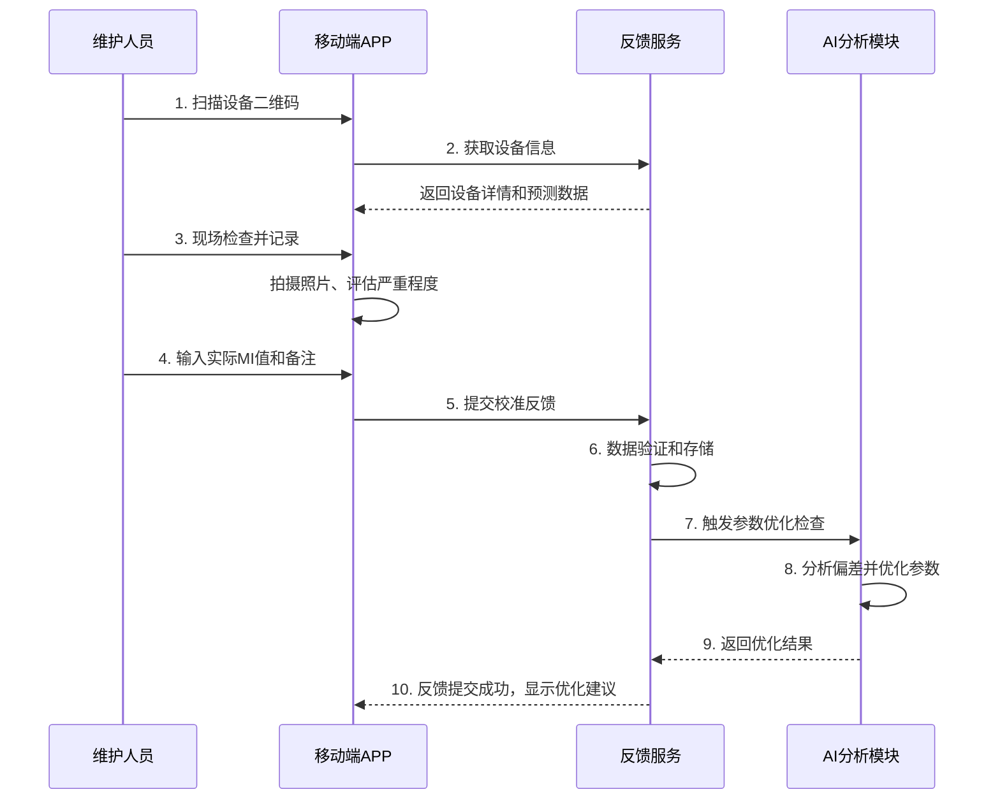
```mermaid
sequenceDiagram
    participant 维护人员
    participant 移动端APP
    participant 反馈服务
    participant AI分析模块
    
    维护人员->>移动端APP: 1. 扫描设备二维码
    移动端APP->>反馈服务: 2. 获取设备信息
    反馈服务-->>移动端APP: 返回设备详情和预测数据
    
    维护人员->>移动端APP: 3. 现场检查并记录
    移动端APP->>移动端APP: 拍摄照片、评估严重程度
    维护人员->>移动端APP: 4. 输入实际MI值和备注
    
    移动端APP->>反馈服务: 5. 提交校准反馈
    反馈服务->>反馈服务: 6. 数据验证和存储
    反馈服务->>AI分析模块: 7. 触发参数优化检查
    
    AI分析模块->>AI分析模块: 8. 分析偏差并优化参数
    AI分析模块-->>反馈服务: 9. 返回优化结果
    
    反馈服务-->>移动端APP: 10. 反馈提交成功，显示优化建议

```

### 4.5.2 参数优化算法

#### 优化流程设计

```java
@Component
@Slf4j
public class ParameterOptimizer {
    
    @Autowired
    private CalibrationRepository calibrationRepository;
    
    @Autowired
    private SceneParameterManager sceneParameterManager;
    
    /**
     * 自动优化场景参数
     */
    public OptimizationResult optimizeSceneParameters(String sceneId) {
        log.info("开始优化场景参数: sceneId={}", sceneId);
        
        // 1. 收集校准反馈数据
        List<CalibrationFeedback> feedbacks = 
            calibrationRepository.findBySceneId(sceneId, 
                LocalDateTime.now().minusMonths(3), 
                LocalDateTime.now());
        
        // 2. 检查样本数量是否足够
        if (feedbacks.size() < MIN_SAMPLES_FOR_OPTIMIZATION) {
            log.warn("样本数量不足，跳过优化: sceneId={}, samples={}", 
                sceneId, feedbacks.size());
            return OptimizationResult.skipped("样本数量不足");
        }
        
        // 3. 计算当前预测偏差
        DeviationStatistics stats = calculateDeviationStatistics(feedbacks);
        
        // 4. 判断是否需要优化
        if (!needsOptimization(stats)) {
            return OptimizationResult.skipped("预测准确，无需优化");
        }
        
        // 5. 计算优化参数
        SceneParameter current = sceneParameterManager.getCurrentParameter(sceneId);
        SceneParameter optimized = calculateOptimizedParameter(current, stats);
        
        // 6. 验证优化效果
        ValidationResult validation = validateOptimization(current, optimized, feedbacks);
        
        if (validation.isValid()) {
            // 7. 保存优化参数
            String newVersion = sceneParameterManager.saveNewVersion(sceneId, optimized);
            
            // 8. 启动A/B测试
            startAbTest(sceneId, current, optimized);
            
            return OptimizationResult.success(current, optimized, stats, newVersion);
        } else {
            return OptimizationResult.failed("优化验证未通过", validation.getReason());
        }
    }
    
    /**
     * 计算优化参数
     */
    private SceneParameter calculateOptimizedParameter(SceneParameter current, 
                                                      DeviationStatistics stats) {
        // 基于偏差统计调整材料等级
        Double currentMaterialLevel = current.getMaterialLevel();
        Double adjustment = calculateMaterialLevelAdjustment(stats);
        Double newMaterialLevel = currentMaterialLevel + adjustment;
        
        // 限制调整范围
        newMaterialLevel = Math.max(1.0, Math.min(6.0, newMaterialLevel));
        
        // 创建新参数版本
        SceneParameter optimized = current.clone();
        optimized.setBaseMaterialLevel(newMaterialLevel);
        optimized.setVersion(generateNewVersion(current.getVersion()));
        optimized.setOptimizationTime(LocalDateTime.now());
        optimized.setOptimizationReason(stats.getSummary());
        
        return optimized;
    }
}

```

#### 偏差统计算法

```java
/**
 * 偏差统计计算
 */
public class DeviationStatistics {
    private String sceneId;
    private int sampleCount;
    private double meanDeviation;           // 平均偏差
    private double meanAbsoluteDeviation;   // 平均绝对偏差
    private double rootMeanSquareError;     // 均方根误差
    private double standardDeviation;       // 标准差
    private Map<AccuracyLevel, Integer> accuracyDistribution; // 准确度分布
    
    /**
     * 判断是否需要优化
     */
    public boolean needsOptimization() {
        // 规则1: 平均绝对偏差超过阈值
        if (meanAbsoluteDeviation > OPTIMIZATION_THRESHOLD) {
            return true;
        }
        
        // 规则2: 高准确度比例过低
        double highAccuracyRate = (double) accuracyDistribution.get(AccuracyLevel.HIGH) / sampleCount;
        if (highAccuracyRate < HIGH_ACCURACY_THRESHOLD) {
            return true;
        }
        
        // 规则3: 偏差存在系统性偏移（均值和零有显著差异）
        if (Math.abs(meanDeviation) > SYSTEMATIC_BIAS_THRESHOLD) {
            return true;
        }
        
        return false;
    }
}

```

### 4.5.3 A/B测试框架

#### 测试分组策略

```java
@Component
public class AbTestManager {
    
    /**
     * A/B测试分配策略
     */
    public AbTestGroup assignToGroup(String deviceId, String sceneId) {
        // 1. 基于设备ID哈希分组（确保一致性）
        int hash = Math.abs(deviceId.hashCode());
        int group = hash % 100; // 0-99
        
        // 2. 分配测试组
        if (group < CONTROL_GROUP_PERCENT) {
            return AbTestGroup.CONTROL;      // 对照组（使用旧参数）
        } else if (group < CONTROL_GROUP_PERCENT + TEST_GROUP_PERCENT) {
            return AbTestGroup.TEST;         // 测试组（使用新参数）
        } else {
            return AbTestGroup.EXCLUDED;     // 排除组（不参与测试）
        }
    }
    
    /**
     * 监控A/B测试效果
     */
    public AbTestResult monitorTest(String sceneId, 
                                    String oldVersion, 
                                    String newVersion,
                                    Duration testDuration) {
        
        // 收集两组设备的校准反馈
        Map<AbTestGroup, List<CalibrationFeedback>> feedbacks = 
            collectFeedbackByGroup(sceneId, oldVersion, newVersion, testDuration);
        
        // 计算各组统计指标
        Map<AbTestGroup, DeviationStatistics> stats = 
            calculateGroupStatistics(feedbacks);
        
        // 统计显著性检验
        StatisticalSignificance significance = 
            calculateSignificance(stats.get(AbTestGroup.CONTROL), 
                                 stats.get(AbTestGroup.TEST));
        
        // 生成测试报告
        return AbTestResult.builder()
            .sceneId(sceneId)
            .oldVersion(oldVersion)
            .newVersion(newVersion)
            .controlStats(stats.get(AbTestGroup.CONTROL))
            .testStats(stats.get(AbTestGroup.TEST))
            .significance(significance)
            .recommendation(generateRecommendation(significance, stats))
            .build();
    }
}

```

#### 测试效果评估

```yaml
评估标准:
  统计显著性:
    - p值 < 0.05: 统计显著
    - p值 < 0.01: 高度显著
    - p值 ≥ 0.05: 不显著
    
  业务显著性:
    - 绝对偏差减少 > 0.3: 业务显著
    - 高准确率提升 > 10%: 业务显著
    
  推荐决策:
    - 统计显著 + 业务显著: 强烈推荐推广
    - 统计显著 + 业务不显著: 谨慎推广
    - 统计不显著: 不建议推广，继续优化

```

### 4.5.4 优化效果追踪

#### 效果追踪指标

1.  **短期效果**（1-7天）：
    
    *   预测偏差立即变化
        
    *   参数稳定性检查
        
2.  **中期效果**（7-30天）：
    
    *   准确率趋势变化
        
    *   不同场景下的表现
        
3.  **长期效果**（30-90天）：
    
    *   业务指标改善（风险检出率、误报率）
        
    *   用户满意度变化
        

#### 优化报告生成

```java
@Component
public class OptimizationReportGenerator {
    
    /**
     * 生成优化效果报告
     */
    public OptimizationReport generateReport(String sceneId, 
                                             String oldVersion, 
                                             String newVersion,
                                             LocalDateTime startTime,
                                             LocalDateTime endTime) {
        
        OptimizationReport report = new OptimizationReport();
        
        // 1. 数据收集
        List<CalibrationFeedback> oldData = 
            calibrationRepository.findBySceneAndVersion(sceneId, oldVersion, startTime, endTime);
        List<CalibrationFeedback> newData = 
            calibrationRepository.findBySceneAndVersion(sceneId, newVersion, startTime, endTime);
        
        // 2. 计算指标对比
        Map<String, ComparisonMetric> metrics = calculateComparisonMetrics(oldData, newData);
        
        // 3. 可视化数据准备
        Map<String, Object> charts = prepareChartsData(oldData, newData);
        
        // 4. 生成结论和建议
        Conclusion conclusion = generateConclusion(metrics);
        List<Recommendation> recommendations = generateRecommendations(metrics, conclusion);
        
        // 5. 组装报告
        report.setSceneId(sceneId);
        report.setOldVersion(oldVersion);
        report.setNewVersion(newVersion);
        report.setPeriod(new Period(startTime, endTime));
        report.setMetrics(metrics);
        report.setCharts(charts);
        report.setConclusion(conclusion);
        report.setRecommendations(recommendations);
        
        return report;
    }
}

```

## 4.6 监控告警与可视化系统

### 4.6.1 监控指标体系

#### 系统级监控指标

```yaml
系统资源监控:
  CPU使用率:
    - 阈值: 警告>80%, 严重>90%
    - 采集频率: 30秒
    - 告警规则: 持续5分钟超过阈值
    
  内存使用率:
    - 阈值: 警告>85%, 严重>95%
    - 采集频率: 30秒
    - 告警规则: 持续3分钟超过阈值
    
  磁盘使用率:
    - 阈值: 警告>80%, 严重>90%
    - 采集频率: 5分钟
    - 告警规则: 持续超过阈值
    
  JVM监控:
    - 堆内存使用率
    - GC频率和时长
    - 线程数

```

#### 业务级监控指标

```java
@Component
public class BusinessMetricsCollector {
    
    @Autowired
    private MeterRegistry meterRegistry;
    
    // 分析任务指标
    private final Counter analysisCounter;
    private final Timer analysisTimer;
    private final Gauge queueSizeGauge;
    
    // 算法准确性指标
    private final DistributionSummary miDeviationSummary;
    private final Gauge sceneAccuracyGauge;
    
    // 设备覆盖率指标
    private final Gauge activeDevicesGauge;
    private final Counter dataQualityCounter;
    
    public BusinessMetricsCollector() {
        // 初始化所有指标
        this.analysisCounter = Counter.builder("mold.analysis.count")
            .description("总分析次数")
            .register(meterRegistry);
            
        this.analysisTimer = Timer.builder("mold.analysis.duration")
            .description("分析耗时分布")
            .publishPercentiles(0.5, 0.9, 0.95, 0.99)
            .register(meterRegistry);
            
        this.miDeviationSummary = DistributionSummary.builder("mold.mi.deviation")
            .description("MI预测偏差分布")
            .publishPercentiles(0.5, 0.9, 0.95)
            .register(meterRegistry);
    }
    
    /**
     * 记录分析指标
     */
    public void recordAnalysisMetrics(String deviceId, 
                                     RiskAnalysisResult result,
                                     long durationMillis) {
        analysisCounter.increment();
        analysisTimer.record(durationMillis, TimeUnit.MILLISECONDS);
        
        // 记录场景相关指标
        Counter.builder("mold.scene.analysis.count")
            .tag("scene", result.getSceneId())
            .tag("riskLevel", result.getRiskLevel().name())
            .register(meterRegistry)
            .increment();
    }
}

```

### 4.6.2 告警系统设计

#### 告警分级策略

```yaml
告警级别定义:
  P1-紧急:
    - 影响: 系统完全不可用或关键功能失效
    - 响应时间: 15分钟内
    - 通知方式: 电话 + 短信 + 邮件
    - 示例: 数据库连接失败、服务完全不可用
    
  P2-严重:
    - 影响: 核心功能降级或性能严重下降
    - 响应时间: 30分钟内
    - 通知方式: 短信 + 邮件
    - 示例: 分析任务大量失败、预测准确性骤降
    
  P3-警告:
    - 影响: 非核心功能异常或性能下降
    - 响应时间: 2小时内
    - 通知方式: 邮件
    - 示例: 单个传感器数据异常、缓存命中率下降
    
  P4-信息:
    - 影响: 不影响系统运行的信息性事件
    - 响应时间: 下一个工作日
    - 通知方式: 邮件（汇总报告）
    - 示例: 设备离线、参数优化完成

```

#### 告警规则配置

```java
@Component
public class AlertRuleManager {
    
    /**
     * 系统告警规则
     */
    @Data
    public static class SystemAlertRule {
        private String ruleId;
        private String name;
        private AlertLevel level;
        private String metricName;      // 监控指标名称
        private String condition;       // 条件表达式，如"value > 80"
        private Duration duration;      // 持续时长条件
        private String messageTemplate; // 告警消息模板
    }
    
    /**
     * 业务告警规则
     */
    @Data
    public static class BusinessAlertRule {
        private String ruleId;
        private String name;
        private AlertLevel level;
        private String sceneId;         // 场景限制（可选）
        private RiskLevel minRiskLevel; // 最小风险等级
        private Double minMiValue;      // 最小MI值
        private Integer minDuration;    // 最短持续时长（分钟）
        private String action;          // 关联动作
    }
    
    /**
     * 检查并触发告警
     */
    public List<Alert> checkAndTriggerAlerts(RiskAnalysisResult result) {
        List<Alert> triggeredAlerts = new ArrayList<>();
        
        // 1. 检查业务告警规则
        for (BusinessAlertRule rule : businessRules) {
            if (matchesBusinessRule(rule, result)) {
                Alert alert = createBusinessAlert(rule, result);
                triggeredAlerts.add(alert);
            }
        }
        
        // 2. 检查数据质量告警
        if (result.getDataPointsCount() < MIN_DATA_POINTS) {
            Alert alert = createDataQualityAlert(result);
            triggeredAlerts.add(alert);
        }
        
        return triggeredAlerts;
    }
}

```

#### 告警通知机制

```java
@Service
public class AlertNotificationService {
    
    @Autowired
    private NotificationChannelManager channelManager;
    
    /**
     * 发送告警通知
     */
    public void sendAlertNotification(Alert alert, List<User> recipients) {
        // 1. 根据告警级别选择通知渠道
        List<NotificationChannel> channels = 
            channelManager.getChannelsByLevel(alert.getLevel());
        
        // 2. 为每个收件人发送通知
        for (User user : recipients) {
            for (NotificationChannel channel : channels) {
                Notification notification = createNotification(alert, user, channel);
                
                try {
                    channel.send(notification);
                    recordNotificationSent(alert, user, channel, true);
                } catch (Exception e) {
                    log.error("发送通知失败: channel={}, user={}", channel.getType(), user.getId(), e);
                    recordNotificationSent(alert, user, channel, false);
                    
                    // 失败后尝试备用渠道
                    tryFallbackChannel(alert, user, channel);
                }
            }
        }
    }
    
    /**
     * 告警升级机制
     */
    public void escalateAlert(Alert alert) {
        // 检查告警是否已确认
        if (!alert.isAcknowledged() && alert.getDuration().toHours() >= 2) {
            // 升级告警级别
            alert.setLevel(alert.getLevel().escalate());
            
            // 通知更高级别人员
            List<User> managers = userService.getManagersByDepartment(alert.getDepartment());
            sendAlertNotification(alert, managers);
        }
    }
}

```

### 4.6.3 可视化系统设计

#### 仪表板架构

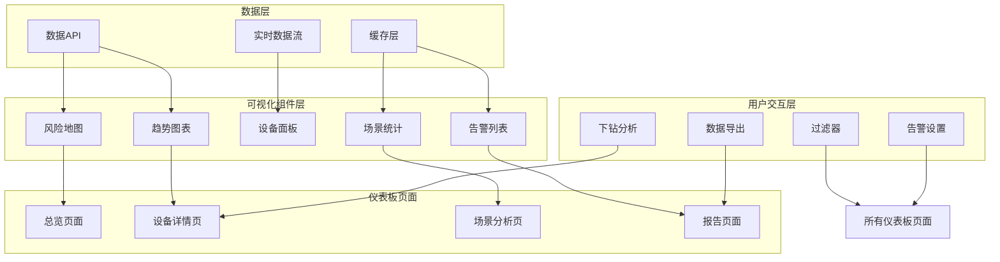
```mermaid
graph TB
    subgraph "数据层"
        API[数据API]
        Cache[缓存层]
        RealTime[实时数据流]
    end
    
    subgraph "可视化组件层"
        RiskMap[风险地图]
        TrendChart[趋势图表]
        DevicePanel[设备面板]
        AlertList[告警列表]
        SceneStats[场景统计]
    end
    
    subgraph "仪表板页面"
        Overview[总览页面]
        DeviceDetail[设备详情页]
        SceneAnalysis[场景分析页]
        ReportPage[报告页面]
    end
    
    subgraph "用户交互层"
        Filter[过滤器]
        DrillDown[下钻分析]
        Export[数据导出]
        AlertSetting[告警设置]
    end
    
    API --> RiskMap
    API --> TrendChart
    RealTime --> DevicePanel
    Cache --> AlertList
    Cache --> SceneStats
    
    RiskMap --> Overview
    TrendChart --> DeviceDetail
    SceneStats --> SceneAnalysis
    AlertList --> ReportPage
    
    Filter --> 所有仪表板页面
    DrillDown --> DeviceDetail
    Export --> ReportPage
    AlertSetting --> 所有仪表板页面

```

#### 关键可视化组件

1.  **风险地图组件**：
    
    *   基于地理位置的设备分布图
        
    *   颜色编码表示风险等级（红/黄/绿）
        
    *   点击设备显示详细信息
        
    *   实时更新风险状态
        
2.  **趋势分析图表**：
    
    *   MI值历史趋势曲线
        
    *   温湿度变化曲线
        
    *   风险等级变化时间线
        
    *   多设备对比视图
        
3.  **场景统计面板**：
    
    *   各场景设备数量分布
        
    *   场景准确性评分对比
        
    *   场景使用趋势分析
        
    *   参数优化效果展示
        
4.  **告警中心**：
    
    *   实时告警列表
        
    *   告警统计图表
        
    *   告警处理工作流
        
    *   历史告警查询
        

#### 报表系统设计

```java
@Component
public class ReportGenerator {
    
    /**
     * 生成日报
     */
    public DailyReport generateDailyReport(LocalDate date) {
        DailyReport report = new DailyReport();
        
        // 1. 汇总数据
        report.setSummary(generateDailySummary(date));
        
        // 2. 风险分布
        report.setRiskDistribution(calculateRiskDistribution(date));
        
        // 3. 告警统计
        report.setAlertStats(collectAlertStats(date));
        
        // 4. 设备状态
        report.setDeviceStatus(getDeviceStatusSnapshot(date));
        
        // 5. 业务洞察
        report.setInsights(generateDailyInsights(date));
        
        // 6. 建议措施
        report.setRecommendations(generateRecommendations(report));
        
        return report;
    }
    
    /**
     * 生成周报/月报
     */
    public PeriodicReport generatePeriodicReport(Period period, ReportType type) {
        PeriodicReport report = new PeriodicReport();
        
        // 趋势分析
        report.setTrends(analyzeTrends(period));
        
        // 对比分析
        report.setComparisons(compareWithPreviousPeriod(period, type));
        
        // 深度分析
        report.setDeepAnalysis(performDeepAnalysis(period));
        
        // KPI达成情况
        report.setKpiStatus(evaluateKpis(period));
        
        return report;
    }
}

```

### 4.6.4 日志与追踪系统

#### 结构化日志设计

```java
@Slf4j
@Component
public class StructuredLogger {
    
    /**
     * 记录业务操作日志
     */
    public void logBusinessOperation(String operation, 
                                     String deviceId, 
                                     Map<String, Object> context) {
        
        Map<String, Object> logData = new HashMap<>();
        logData.put("timestamp", Instant.now().toString());
        logData.put("operation", operation);
        logData.put("deviceId", deviceId);
        logData.put("context", context);
        logData.put("traceId", MDC.get("traceId"));
        logData.put("userId", SecurityContextHolder.getContext().getAuthentication().getName());
        
        log.info(JSON.toJSONString(logData));
    }
    
    /**
     * 记录性能日志
     */
    public void logPerformance(String component, 
                               String operation, 
                               long duration, 
                               boolean success) {
        
        Map<String, Object> perfLog = new HashMap<>();
        perfLog.put("type", "performance");
        perfLog.put("component", component);
        perfLog.put("operation", operation);
        perfLog.put("durationMs", duration);
        perfLog.put("success", success);
        perfLog.put("timestamp", Instant.now().toEpochMilli());
        
        log.debug(JSON.toJSONString(perfLog));
    }
}

```

#### 分布式追踪

1.  **追踪ID生成**：
    
    *   每个请求分配唯一traceId
        
    *   在服务间传递traceId
        
    *   日志中记录traceId便于关联
        
2.  **调用链追踪**：
    
    ```yaml
    追踪信息:
      - 请求路径和方法
      - 服务调用关系
      - 每个步骤耗时
      - 错误信息（如果有）
    
    ```
    
3.  **性能分析**：
    
    *   慢查询识别
        
    *   瓶颈分析
        
    *   调用链优化建议
        

通过以上6个核心模块的详细设计，霉菌风险预测AI分析微服务具备了完整的数据处理、智能分析、场景管理、规则联动、优化学习和监控告警能力，形成一个自洽、可演进、高可用的智能系统。

# 五、接口规范与数据流设计

## 5.1 接口设计原则

### 5.1.1 最小化原则

#### 核心接口精简策略

基于系统架构分析和用户旅程验证，我们将接口数量从原始设计的12个精简为3个核心接口，确保每个接口都有明确且必要的用途：

```yaml
精简前（12个接口） → 精简后（3个核心接口）:
  数据获取: 4个 → 1个（设备历史遥测数据）
  结果反馈: 3个 → 1个（遥测数据上报）
  管理配置: 5个 → 1个（综合管理）

```

#### 字段最小化设计

每个接口字段都经过严格筛选，确保：

1.  **必需性**：每个字段都有明确的下游用途
    
2.  **无冗余**：去除重复或可推导字段
    
3.  **职责单一**：每个字段只承担一个职责
    

#### 示例：风险结果字段精简

```java
// 精简前（冗余设计）
public class RiskResultV1 {
    private String deviceId;           // 可从上下文获得
    private String sceneId;            // 可从设备属性获得
    private Double moldIndex;          // 必需
    private Double riskProbability;    // 必需
    private String riskLevel;          // 必需
    private String controlAdvice;      // 冗余（应由规则引擎决定）
    private Double confidenceScore;    // 可选，非必需
    private Map<String, Object> rawData; // 冗余
}

// 精简后（优化设计）
public class RiskResultV2 {
    private Double moldIndex;          // 用于趋势展示
    private Double riskProbability;    // 用于告警分级
    private String riskLevel;          // 用于规则触发
}

```

### 5.1.2 职责清晰原则

#### 接口职责边界定义

每个接口都有明确的职责边界，避免功能交叉：

| 接口类型 | 提供方 | 消费方 | 核心职责 | 边界约束 |
| --- | --- | --- | --- | --- |
| 数据获取 | 物联网平台 | AI模块 | 提供历史温湿度数据 | 只读、无副作用 |
| 结果反馈 | AI模块 | 物联网平台 | 推送风险分析结果 | 仅输出计算结果 |
| 管理配置 | AI模块 | 管理界面 | 场景、设备、校准管理 | 不影响实时分析 |

#### 系统边界与接口映射

```plaintext
物联网平台职责边界：
  ✓ 设备接入与管理
  ✓ 数据采集与存储
  ✓ 规则引擎执行
  ✓ 设备控制指令
  
AI模块职责边界：
  ✓ 历史数据查询
  ✓ 风险算法计算
  ✓ 结果数据推送
  ✓ 场景参数管理

```

### 5.1.3 稳定性原则

#### 接口向后兼容策略

1.  **版本化管理**：所有接口支持版本号
    
2.  **字段扩展性**：使用Map结构支持扩展字段
    
3.  **默认值处理**：新增字段提供合理默认值
    
4.  **弃用策略**：旧字段保留3个版本周期
    

#### 接口变更管理流程

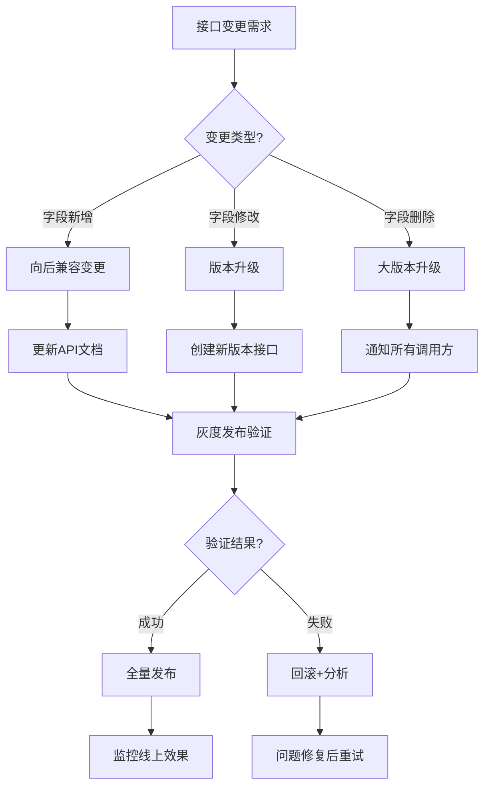
```mermaid
flowchart TD
    A[接口变更需求] --> B{变更类型?}
    
    B -->|字段新增| C[向后兼容变更]
    B -->|字段修改| D[版本升级]
    B -->|字段删除| E[大版本升级]
    
    C --> F[更新API文档]
    D --> G[创建新版本接口]
    E --> H[通知所有调用方]
    
    F --> I[灰度发布验证]
    G --> I
    H --> I
    
    I --> J{验证结果?}
    J -->|成功| K[全量发布]
    J -->|失败| L[回滚+分析]
    
    K --> M[监控线上效果]
    L --> N[问题修复后重试]

```

### 5.1.4 安全性原则

#### 接口安全防护

1.  **认证机制**：
    
    *   设备级认证：ACCESS\_TOKEN
        
    *   用户级认证：JWT Token + 角色权限
        
    *   服务间认证：API Key + 白名单
        
2.  **授权机制**：
    
    *   基于角色的访问控制（RBAC）
        
    *   数据权限隔离（租户/用户/设备）
        
    *   操作权限细分（读/写/执行）
        
3.  **安全审计**：
    
    *   所有接口调用日志记录
        
    *   敏感操作二次确认
        
    *   异常访问行为检测
        

## 5.2 核心接口清单与调用关系

### 5.2.1 核心接口概览

#### 接口分类与用途

| 类别 | 接口名称 | 端点 | 方法 | 用途 | 必需性 |
| --- | --- | --- | --- | --- | --- |
| **数据获取** | 设备历史遥测数据 | `/api/plugins/telemetry/DEVICE/{deviceId}/values/timeseries` | GET | AI查询历史温湿度数据 | ✅ 必需 |
| **结果反馈** | 遥测数据上报 | `/api/v1/{ACCESS_TOKEN}/telemetry` | POST | AI推送风险分析结果 | ✅ 必需 |
| **批量查询** | 批量历史数据 | `/api/plugins/telemetry/devices/values/timeseries` | POST | 批量查询多设备数据 | 🔶 可选 |
| **实时查询** | 设备最新数据 | `/api/v1/devices/{deviceId}/telemetry/latest` | GET | 获取设备最新数据点 | 🔶 可选 |
| **管理接口** | 预设场景管理 | `/api/scenes/presets` | GET/POST/PUT/DELETE | 场景CRUD操作 | 🔶 可选 |
| **管理接口** | 设备场景绑定 | `/api/devices/{deviceId}/scene` | GET/POST | 设备场景绑定管理 | 🔶 可选 |
| **管理接口** | 校准反馈提交 | `/api/calibration/feedback` | POST | 接收现场核查反馈 | 🔶 可选 |

### 5.2.2 接口调用关系图

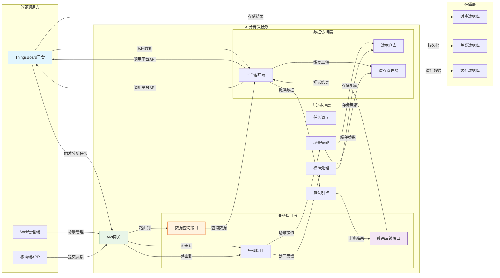
```mermaid
flowchart LR
    subgraph "外部调用方"
        direction LR
        TB[ThingsBoard平台]
        APP[移动端APP]
        WEB[Web管理端]
    end
    
    subgraph "AI分析微服务"
        direction TB
        API[API网关]
        
        subgraph "业务接口层"
            DataAPI[数据查询接口]
            ResultAPI[结果反馈接口]
            ManageAPI[管理接口]
        end
        
        subgraph "内部处理层"
            Scheduler[任务调度]
            Algorithm[算法引擎]
            SceneMgr[场景管理]
            Calibration[校准处理]
        end
        
        subgraph "数据访问层"
            Client[平台客户端]
            Cache[缓存管理器]
            Repository[数据仓库]
        end
    end
    
    subgraph "存储层"
        TSDB[时序数据库]
        RDB[关系数据库]
        Redis[缓存数据库]
    end
    
    %% 数据获取流程
    TB -->|触发分析任务| API
    API -->|路由到| DataAPI
    DataAPI -->|查询数据| Client
    Client -->|调用平台API| TB
    TB -->|返回数据| Client
    Client -->|提供数据| Algorithm
    
    %% 结果反馈流程
    Algorithm -->|计算结果| ResultAPI
    ResultAPI -->|推送结果| Client
    Client -->|调用平台API| TB
    TB -->|存储结果| TSDB
    
    %% 管理配置流程
    WEB -->|场景管理| API
    API -->|路由到| ManageAPI
    ManageAPI -->|场景操作| SceneMgr
    SceneMgr -->|存储配置| Repository
    Repository -->|持久化| RDB
    
    APP -->|提交反馈| API
    API -->|路由到| ManageAPI
    ManageAPI -->|处理反馈| Calibration
    Calibration -->|存储反馈| Repository
    
    %% 缓存访问
    Client -->|缓存查询| Cache
    Cache -->|缓存数据| Redis
    SceneMgr -->|缓存参数| Cache
    
    style TB fill:#e1f5fe,stroke:#01579b
    style API fill:#e8f5e8,stroke:#2e7d32
    style DataAPI fill:#fff3e0,stroke:#e65100
    style ResultAPI fill:#f3e5f5,stroke:#4a148c

```

### 5.2.3 接口依赖关系

#### 强依赖接口（必须实现）

1.  **数据获取接口** → **结果反馈接口**
    
    *   顺序依赖：必须先获取数据才能计算结果
        
    *   数据依赖：查询结果作为计算输入
        
2.  **场景绑定接口** → **算法计算**
    
    *   配置依赖：计算需要场景参数
        
    *   版本依赖：需要指定场景版本
        

#### 弱依赖接口（可选实现）

1.  **批量查询接口** → **性能优化**
    
    *   无功能依赖，仅性能优化
        
    *   可降级为循环调用单设备接口
        
2.  **校准反馈接口** → **参数优化**
    
    *   不影响核心功能，仅影响优化效果
        
    *   可离线处理，非实时依赖
        

### 5.2.4 接口调用模式

#### 模式一：物联网平台主动触发（推荐）

```yaml
调用场景: ThingsBoard定时触发风险分析
调用流程:
  1. ThingsBoard规则链调用AI分析接口
  2. AI模块接收请求并查询历史数据
  3. AI模块计算风险并返回结果
  4. ThingsBoard接收结果并触发规则

优点:
  - AI模块无需维护设备列表
  - ThingsBoard掌握调用时机
  - 架构清晰，职责分明

```

#### 模式二：AI模块主动调度

```yaml
调用场景: AI模块定时主动分析
调用流程:
  1. AI模块定时任务启动
  2. AI模块查询设备列表（需要额外接口）
  3. AI模块逐个查询设备数据并计算
  4. AI模块推送结果到平台

优点:
  - AI模块掌握分析节奏
  - 可批量处理优化性能
  - 不依赖平台调度机制

```

#### 模式选择建议

对于大多数场景，推荐**模式一（平台主动触发）**，原因如下：

1.  **架构更清晰**：平台作为调度中心，AI作为计算服务
    
2.  **权限更安全**：AI模块不需要设备列表访问权限
    
3.  **运维更简单**：故障排查路径清晰
    
4.  **扩展更灵活**：可灵活调整触发策略
    

## 5.3 数据获取接口详细规范

### 5.3.1 设备历史遥测数据接口（核心）

#### 接口定义

```http
GET /api/plugins/telemetry/DEVICE/{deviceId}/values/timeseries

```

#### 请求参数

| 参数名 | 类型 | 必需 | 描述 | 示例 |
| --- | --- | --- | --- | --- |
| `deviceId` | path | ✅ | 设备标识符 | `sensor_001` |
| `startTs` | query | ✅ | 开始时间戳（毫秒） | `1672444800000` |
| `endTs` | query | ✅ | 结束时间戳（毫秒） | `1672531200000` |
| `keys` | query | ✅ | 查询的键名，多个用逗号分隔 | `temperature,humidity` |
| `limit` | query | 🔶 | 返回数据点最大数量 | `144` |
| `order` | query | 🔶 | 排序方式：`ASC`或`DESC` | `ASC` |
| `interval` | query | 🔶 | 聚合间隔（毫秒） | `3600000` |
| `agg` | query | 🔶 | 聚合函数：`AVG`,`MIN`,`MAX`,`COUNT`,`SUM` | `AVG` |

#### 请求示例

```http
GET /api/plugins/telemetry/DEVICE/sensor_001/values/timeseries
?startTs=1672444800000
&endTs=1672531200000
&keys=temperature,humidity
&limit=144
&interval=3600000
&agg=AVG

```

#### 响应格式

```json
{
  "temperature": [
    {
      "ts": 1672444800000,
      "value": 22.5
    },
    {
      "ts": 1672448400000,
      "value": 22.3
    }
    // ... 更多数据点
  ],
  "humidity": [
    {
      "ts": 1672444800000,
      "value": 65.0
    },
    {
      "ts": 1672448400000,
      "value": 66.2
    }
    // ... 更多数据点
  ]
}

```

#### 响应状态码

| 状态码 | 含义 | 处理建议 |
| --- | --- | --- |
| `200 OK` | 成功返回数据 | 正常处理响应数据 |
| `400 Bad Request` | 参数错误 | 检查参数格式和范围 |
| `401 Unauthorized` | 未授权 | 检查ACCESS\_TOKEN |
| `404 Not Found` | 设备不存在 | 检查设备ID是否正确 |
| `429 Too Many Requests` | 请求频率超限 | 降低查询频率或增加间隔 |
| `500 Internal Server Error` | 服务器内部错误 | 重试或联系管理员 |

### 5.3.2 批量历史数据查询接口（可选优化）

#### 接口定义

```http
POST /api/plugins/telemetry/devices/values/timeseries

```

#### 请求体格式

```json
{
  "deviceIds": ["sensor_001", "sensor_002", "sensor_003"],
  "startTs": 1672444800000,
  "endTs": 1672531200000,
  "keys": ["temperature", "humidity"],
  "limit": 144,
  "interval": 3600000,
  "agg": "AVG"
}

```

#### 响应格式

```json
{
  "sensor_001": {
    "temperature": [
      {
        "ts": 1672444800000,
        "value": 22.5
      }
      // ... 数据点
    ],
    "humidity": [
      {
        "ts": 1672444800000,
        "value": 65.0
      }
      // ... 数据点
    ]
  },
  "sensor_002": {
    "temperature": [
      // ... 数据点
    ],
    "humidity": [
      // ... 数据点
    ]
  }
}

```

#### 使用场景

1.  **大规模部署**：设备数量超过100个
    
2.  **批量分析**：需要同时分析多个设备
    
3.  **性能优化**：减少网络往返次数
    

### 5.3.3 设备最新数据点查询接口（可选）

#### 接口定义

```http
GET /api/v1/devices/{deviceId}/telemetry/latest
?keys=temperature,humidity

```

#### 使用场景

1.  **实时分析**：高风险设备的实时监控
    
2.  **控制效果评估**：控制执行后的快速评估
    
3.  **数据完整性检查**：验证设备在线状态
    

### 5.3.4 数据查询性能优化策略

#### 查询参数调优指南

```yaml
最佳实践:
  1. 时间范围选择:
    - 风险分析: 24小时（startTs=当前时间-24h）
    - 趋势分析: 7天（按需使用聚合）
    
  2. 数据量控制:
    - 原始数据: limit=144（24小时×6个点/小时）
    - 聚合数据: interval=3600000（小时聚合）
    
  3. 字段选择:
    - 必需字段: temperature,humidity
    - 避免查询: 不需要的字段

```

#### 错误处理策略

1.  **数据不足处理**：
    
    *   数据点少于24个：使用可用数据计算，标记低置信度
        
    *   数据完全缺失：跳过本次分析，记录异常
        
2.  **数据异常处理**：
    
    *   异常值检测：使用3σ原则识别异常
        
    *   数据插值：缺失点使用线性插值补充
        
3.  **查询失败处理**：
    
    *   重试机制：最多重试3次，指数退避
        
    *   降级策略：使用缓存数据或跳过
        

## 5.4 结果反馈接口详细规范

### 5.4.1 遥测数据上报接口（核心）

#### 接口定义

```http
POST /api/v1/{ACCESS_TOKEN}/telemetry

```

#### 请求头

| 头字段 | 必需 | 值 | 说明 |
| --- | --- | --- | --- |
| `Content-Type` | ✅ | `application/json` | 请求体格式 |
| `X-Request-ID` | 🔶 | UUID | 请求追踪ID |

#### 请求体格式

```json
{
  "ts": 1672531200000,
  "values": {
    "moldIndex": 3.8,
    "riskProbability": 0.85,
    "riskLevel": "HIGH"
  }
}

```

#### 字段详细说明

| 字段 | 类型 | 必需 | 范围 | 描述 | 下游用途 |
| --- | --- | --- | --- | --- | --- |
| `ts` | Long | ✅ | 毫秒时间戳 | 分析时间戳 | 时间序列对齐 |
| `values.moldIndex` | Double | ✅ | 0.0-6.0 | 霉菌生长指数 | 趋势图表展示 |
| `values.riskProbability` | Double | ✅ | 0.0-1.0 | 风险概率 | 告警分级决策 |
| `values.riskLevel` | String | ✅ | `LOW`,`MEDIUM`,`HIGH` | 风险等级 | 规则引擎触发 |
| `values.sceneId` | String | 🔶 | 场景标识 | 分析使用的场景 | 场景化规则匹配 |
| `values.dataPointsCount` | Integer | 🔶 | ≥0 | 使用的数据点数 | 数据质量评估 |

#### 扩展字段（可选）

```json
{
  "ts": 1672531200000,
  "values": {
    "moldIndex": 3.8,
    "riskProbability": 0.85,
    "riskLevel": "HIGH",
    // 扩展字段
    "sceneId": "wood_furniture",
    "dataPointsCount": 144,
    "confidenceScore": 0.92,
    "gValueTrend": "rising",
    "analysisVersion": "v1.2.0"
  }
}

```

### 5.4.2 结果上报策略

#### 上报时机选择

1.  **定时上报**：每小时分析完成后立即上报
    
2.  **变化上报**：风险等级变化时额外上报
    
3.  **批量上报**：多个设备结果批量上报
    

#### 数据一致性保证

```java
@Component
public class ResultReporter {
    
    /**
     * 确保结果上报的可靠性
     */
    @Transactional
    public void reportWithGuarantee(String deviceId, RiskAnalysisResult result) {
        try {
            // 1. 本地持久化
            riskResultRepository.save(result);
            
            // 2. 上报到平台
            boolean success = platformClient.reportTelemetry(deviceId, result);
            
            if (!success) {
                // 3. 失败后加入重试队列
                retryQueue.add(new RetryTask(deviceId, result));
                log.warn("结果上报失败，已加入重试队列: deviceId={}", deviceId);
            } else {
                // 4. 更新上报状态
                result.setReported(true);
                riskResultRepository.save(result);
            }
            
        } catch (Exception e) {
            log.error("结果上报异常: deviceId={}", deviceId, e);
            // 记录异常，监控告警
            monitorService.recordError("result_report", deviceId, e);
        }
    }
}

```

### 5.4.3 错误处理与重试机制

#### 上报失败处理策略

| 失败原因 | 重试策略 | 降级方案 |
| --- | --- | --- |
| 网络超时 | 立即重试，最多3次 | 缓存结果，下次上报 |
| 认证失败 | 获取新Token后重试 | 跳过本次，记录异常 |
| 服务器错误 | 指数退避重试（1s,2s,4s） | 降级到备份服务器 |
| 数据格式错误 | 不重试，记录错误 | 修复数据后手动触发 |

#### 结果去重机制

```java
/**
 * 防止重复上报相同结果
 */
public class DuplicatePrevention {
    
    private final Cache<String, String> lastReportCache;
    
    public boolean shouldReport(String deviceId, RiskAnalysisResult result) {
        String cacheKey = deviceId + "_" + result.getAnalysisTime().toEpochMilli() / 3600000;
        String lastHash = lastReportCache.getIfPresent(cacheKey);
        String currentHash = calculateResultHash(result);
        
        if (currentHash.equals(lastHash)) {
            log.debug("跳过重复上报: deviceId={}, time={}", 
                deviceId, result.getAnalysisTime());
            return false;
        }
        
        lastReportCache.put(cacheKey, currentHash);
        return true;
    }
    
    private String calculateResultHash(RiskAnalysisResult result) {
        // 基于关键字段计算哈希
        return DigestUtils.md5DigestAsHex(
            (result.getMoldIndex() + result.getRiskLevel()).getBytes()
        );
    }
}

```

## 5.5 管理类接口设计

### 5.5.1 预设场景管理接口

#### 获取所有预设场景

```http
GET /api/scenes/presets

```

**响应示例**：

```json
{
  "code": 200,
  "message": "success",
  "data": [
    {
      "sceneId": "wall",
      "sceneName": "标准墙面/天花板",
      "description": "客厅、卧室等普通墙面",
      "baseMaterialLevel": 3.0,
      "lowThreshold": 2.0,
      "mediumThreshold": 3.0,
      "highThreshold": 4.0,
      "icon": "/icons/wall.png",
      "usageCount": 1245,
      "accuracyScore": 0.87,
      "currentVersion": "v1.2",
      "isActive": true
    },
    {
      "sceneId": "wood_furniture",
      "sceneName": "木质家具内",
      "description": "衣柜、橱柜等木制家具内部",
      "baseMaterialLevel": 4.0,
      "lowThreshold": 1.5,
      "mediumThreshold": 2.5,
      "highThreshold": 3.5,
      "icon": "/icons/wood.png",
      "usageCount": 892,
      "accuracyScore": 0.91,
      "currentVersion": "v1.3",
      "isActive": true
    }
  ]
}

```

#### 创建/更新预设场景

```http
POST /api/scenes/presets
PUT /api/scenes/presets/{sceneId}

```

**请求体**：

```json
{
  "sceneId": "custom_scene",
  "sceneName": "自定义场景",
  "description": "用户自定义的特殊场景",
  "baseMaterialLevel": 3.5,
  "lowThreshold": 2.2,
  "mediumThreshold": 3.2,
  "highThreshold": 4.2,
  "icon": "/icons/custom.png",
  "isActive": true
}

```

### 5.5.2 设备场景绑定管理

#### 获取设备场景绑定

```http
GET /api/devices/{deviceId}/scene

```

**响应示例**：

```json
{
  "deviceId": "sensor_001",
  "sceneId": "wood_furniture",
  "sceneName": "木质家具内",
  "bindTime": "2024-01-20T10:30:00Z",
  "installer": "张三",
  "locationNote": "主卧衣柜内部",
  "presetVersion": "v1.3",
  "createdTime": "2024-01-20T10:30:00Z",
  "updatedTime": "2024-01-20T10:30:00Z"
}

```

#### 绑定设备到场景

```http
POST /api/devices/{deviceId}/bind-scene

```

**请求体**：

```json
{
  "sceneId": "wood_furniture",
  "installer": "张三",
  "locationNote": "主卧衣柜内部",
  "force": false
}

```

### 5.5.3 校准反馈提交接口

#### 接口定义

```http
POST /api/calibration/feedback

```

#### 请求体格式

```json
{
  "deviceId": "sensor_001",
  "sceneId": "wood_furniture",
  "checkTime": "2024-01-20T14:30:00Z",
  "moldFound": true,
  "severity": "MEDIUM",
  "predictedMI": 3.2,
  "actualMI": 2.8,
  "checker": "李四",
  "comments": "衣柜角落有轻微霉斑，已清理",
  "photoUrls": [
    "https://storage.example.com/photos/photo1.jpg",
    "https://storage.example.com/photos/photo2.jpg"
  ]
}

```

#### 响应处理

```json
{
  "code": 200,
  "message": "反馈提交成功",
  "data": {
    "feedbackId": "fb_1234567890",
    "deviation": -0.4,
    "accuracy": "MEDIUM",
    "optimizationSuggestion": "材料等级建议调整为3.8",
    "estimatedImprovement": 0.12
  }
}

```

### 5.5.4 统计查询接口

#### 场景使用统计

```http
GET /api/scenes/{sceneId}/statistics
?startDate=2024-01-01
&endDate=2024-01-31

```

**响应示例**：

```json
{
  "sceneId": "wood_furniture",
  "period": {
    "startDate": "2024-01-01",
    "endDate": "2024-01-31"
  },
  "deviceCount": 892,
  "analysisCount": 21408,
  "riskDistribution": {
    "LOW": 15624,
    "MEDIUM": 4320,
    "HIGH": 1464
  },
  "accuracyStats": {
    "totalFeedbacks": 45,
    "highAccuracy": 32,
    "mediumAccuracy": 10,
    "lowAccuracy": 3,
    "overallAccuracy": 0.87
  },
  "optimizationHistory": [
    {
      "version": "v1.2",
      "date": "2024-01-15",
      "materialLevel": 4.0,
      "accuracyImprovement": 0.05
    }
  ]
}

```

### 5.5.5 健康检查接口

#### 服务健康检查

```http
GET /actuator/health

```

**响应示例**：

```json
{
  "status": "UP",
  "components": {
    "database": {
      "status": "UP",
      "details": {
        "database": "MySQL",
        "validationQuery": "isValid()"
      }
    },
    "diskSpace": {
      "status": "UP",
      "details": {
        "total": 536870912000,
        "free": 322122547200,
        "threshold": 10485760
      }
    },
    "platformConnection": {
      "status": "UP",
      "details": {
        "platform": "ThingsBoard",
        "responseTime": "125ms"
      }
    }
  }
}

```

#### 详细健康信息

```http
GET /actuator/health/{component}

```

支持的健康组件：

*   `database`：数据库连接状态
    
*   `redis`：缓存服务状态
    
*   `platform`：物联网平台连接状态
    
*   `scheduler`：任务调度状态
    
*   `algorithm`：算法引擎状态
    

## 5.6 接口调用时序与数据流图

### 5.6.1 核心业务流程时序图

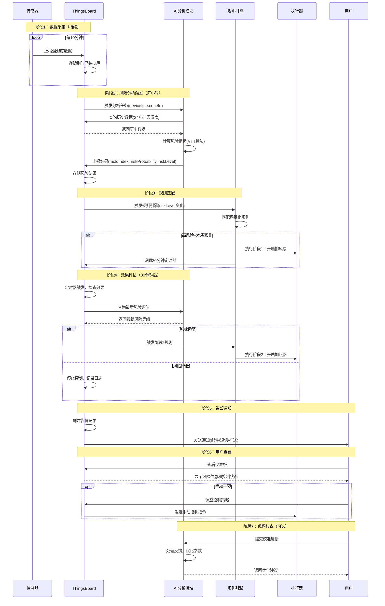
```mermaid
sequenceDiagram
    participant S as 传感器
    participant TB as ThingsBoard
    participant AI as AI分析模块
    participant R as 规则引擎
    participant A as 执行器
    participant U as 用户
    
    %% 阶段1：数据采集
    Note over S,TB: 阶段1：数据采集（持续）
    loop 每10分钟
        S->>TB: 上报温湿度数据
        TB->>TB: 存储到时序数据库
    end
    
    %% 阶段2：风险分析触发
    Note over TB,AI: 阶段2：风险分析触发（每小时）
    TB->>AI: 触发分析任务(deviceId, sceneId)
    AI->>TB: 查询历史数据(24小时温湿度)
    TB-->>AI: 返回历史数据
    AI->>AI: 计算风险指标(VTT算法)
    AI->>TB: 上报结果(moldIndex, riskProbability, riskLevel)
    TB->>TB: 存储风险结果
    
    %% 阶段3：规则匹配与执行
    Note over TB,R: 阶段3：规则匹配
    TB->>R: 触发规则引擎(riskLevel变化)
    R->>R: 匹配场景化规则
    alt 高风险+木质家具
        R->>A: 执行阶段1：开启排风扇
        R->>TB: 设置30分钟定时器
    end
    
    %% 阶段4：效果评估
    Note over TB,AI: 阶段4：效果评估（30分钟后）
    TB->>TB: 定时器触发，检查效果
    TB->>AI: 查询最新风险评估
    AI-->>TB: 返回最新风险等级
    alt 风险仍高
        TB->>R: 触发阶段2规则
        R->>A: 执行阶段2：开启加热器
    else 风险降低
        TB->>TB: 停止控制，记录日志
    end
    
    %% 阶段5：告警通知
    Note over TB,U: 阶段5：告警通知
    TB->>TB: 创建告警记录
    TB->>U: 发送通知(邮件/短信/推送)
    
    %% 阶段6：用户查看
    Note over U,TB: 阶段6：用户查看
    U->>TB: 查看仪表板
    TB-->>U: 显示风险信息和控制状态
    opt 手动干预
        U->>TB: 调整控制策略
        TB->>A: 发送手动控制指令
    end
    
    %% 阶段7：现场核查
    Note over U,AI: 阶段7：现场核查（可选）
    U->>AI: 提交校准反馈
    AI->>AI: 处理反馈，优化参数
    AI-->>U: 返回优化建议

```

### 5.6.2 数据流全景图

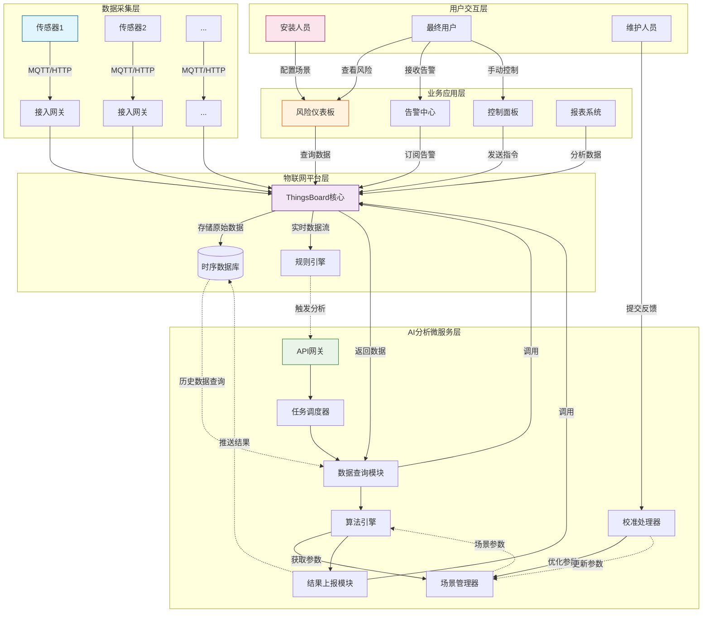
```mermaid
flowchart TD
    subgraph "数据采集层"
        S1[传感器1] -->|MQTT/HTTP| GW1[接入网关]
        S2[传感器2] -->|MQTT/HTTP| GW2[接入网关]
        S3[...] -->|MQTT/HTTP| GW3[...]
    end
    
    subgraph "物联网平台层"
        TB[ThingsBoard核心]
        TSDB[(时序数据库)]
        RE[规则引擎]
        
        GW1 --> TB
        GW2 --> TB
        GW3 --> TB
        
        TB -->|存储原始数据| TSDB
        TB -->|实时数据流| RE
    end
    
    subgraph "AI分析微服务层"
        API[API网关]
        Scheduler[任务调度器]
        Query[数据查询模块]
        Algorithm[算法引擎]
        Report[结果上报模块]
        SceneMgr[场景管理器]
        Calibration[校准处理器]
        
        API --> Scheduler
        Scheduler --> Query
        Query -->|调用| TB
        TB -->|返回数据| Query
        Query --> Algorithm
        Algorithm -->|获取参数| SceneMgr
        Algorithm --> Report
        Report -->|调用| TB
        Calibration -->|优化参数| SceneMgr
    end
    
    subgraph "业务应用层"
        Dashboard[风险仪表板]
        Alert[告警中心]
        Control[控制面板]
        ReportSys[报表系统]
        
        Dashboard -->|查询数据| TB
        Alert -->|订阅告警| TB
        Control -->|发送指令| TB
        ReportSys -->|分析数据| TB
    end
    
    subgraph "用户交互层"
        Installer[安装人员]
        User[最终用户]
        Maintainer[维护人员]
        
        Installer -->|配置场景| Dashboard
        User -->|查看风险| Dashboard
        User -->|接收告警| Alert
        User -->|手动控制| Control
        Maintainer -->|提交反馈| Calibration
    end
    
    %% 关键数据流
    TSDB -.->|历史数据查询| Query
    SceneMgr -.->|场景参数| Algorithm
    RE -.->|触发分析| API
    Report -.->|推送结果| TSDB
    Calibration -.->|更新参数| SceneMgr
    
    %% 样式
    style S1 fill:#e1f5fe,stroke:#01579b
    style TB fill:#f3e5f5,stroke:#4a148c
    style API fill:#e8f5e8,stroke:#2e7d32
    style Dashboard fill:#fff3e0,stroke:#e65100
    style Installer fill:#fce4ec,stroke:#c2185b

```

### 5.6.3 接口调用时序详细视图

#### 数据获取时序（AI → 平台）

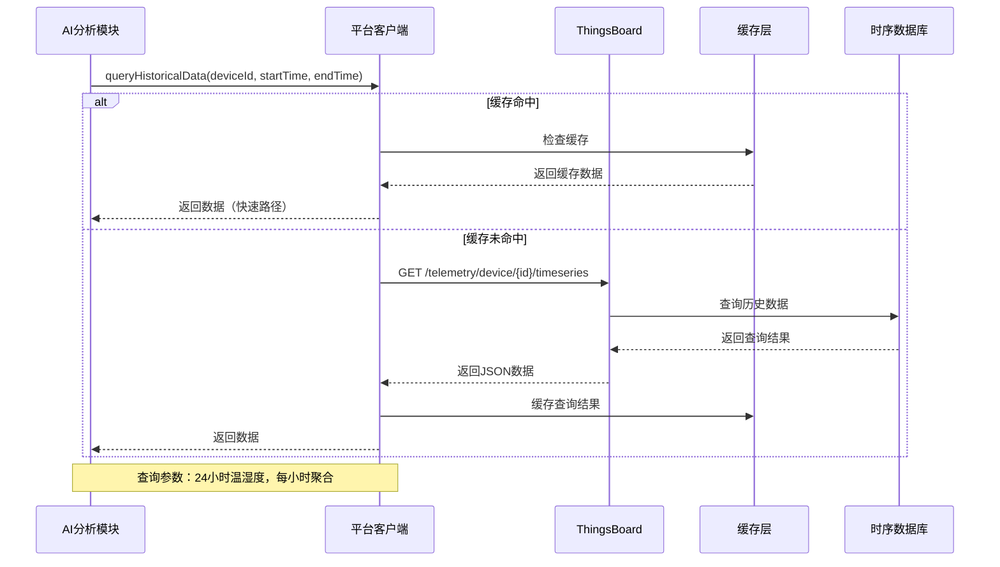
```mermaid
sequenceDiagram
    participant AI as AI分析模块
    participant Client as 平台客户端
    participant TB as ThingsBoard
    participant Cache as 缓存层
    participant TSDB as 时序数据库
    
    AI->>Client: queryHistoricalData(deviceId, startTime, endTime)
    
    alt 缓存命中
        Client->>Cache: 检查缓存
        Cache-->>Client: 返回缓存数据
        Client-->>AI: 返回数据（快速路径）
    else 缓存未命中
        Client->>TB: GET /telemetry/device/{id}/timeseries
        TB->>TSDB: 查询历史数据
        TSDB-->>TB: 返回查询结果
        TB-->>Client: 返回JSON数据
        Client->>Cache: 缓存查询结果
        Client-->>AI: 返回数据
    end
    
    Note over AI,Client: 查询参数：24小时温湿度，每小时聚合

```

#### 结果上报时序（AI → 平台）

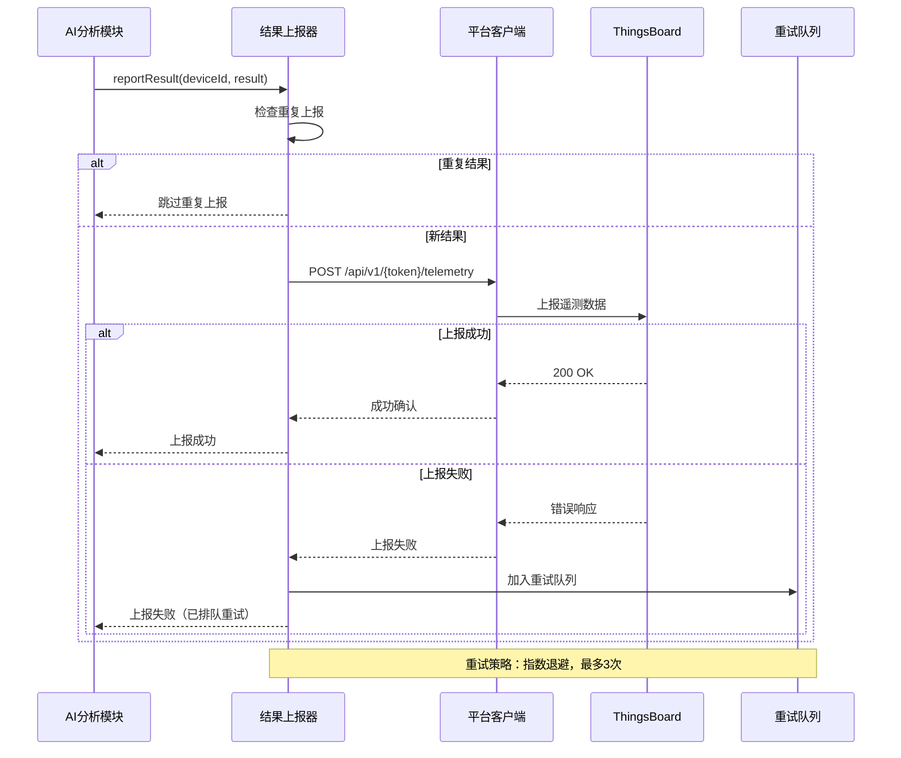
```mermaid
sequenceDiagram
    participant AI as AI分析模块
    participant Reporter as 结果上报器
    participant Client as 平台客户端
    participant TB as ThingsBoard
    participant Queue as 重试队列
    
    AI->>Reporter: reportResult(deviceId, result)
    Reporter->>Reporter: 检查重复上报
    
    alt 重复结果
        Reporter-->>AI: 跳过重复上报
    else 新结果
        Reporter->>Client: POST /api/v1/{token}/telemetry
        Client->>TB: 上报遥测数据
        
        alt 上报成功
            TB-->>Client: 200 OK
            Client-->>Reporter: 成功确认
            Reporter-->>AI: 上报成功
        else 上报失败
            TB-->>Client: 错误响应
            Client-->>Reporter: 上报失败
            Reporter->>Queue: 加入重试队列
            Reporter-->>AI: 上报失败（已排队重试）
        end
    end
    
    Note over Reporter,Queue: 重试策略：指数退避，最多3次

```

### 5.6.4 错误处理与恢复流程

#### 数据获取失败恢复流程

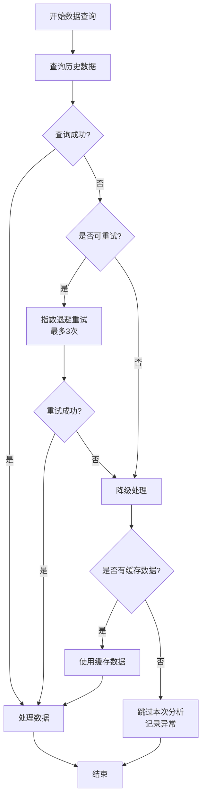
```mermaid
flowchart TD
    Start[开始数据查询] --> Query[查询历史数据]
    Query --> Success{查询成功?}
    
    Success -->|是| Process[处理数据]
    Success -->|否| RetryCheck{是否可重试?}
    
    RetryCheck -->|是| Retry[指数退避重试<br/>最多3次]
    Retry --> RetrySuccess{重试成功?}
    RetrySuccess -->|是| Process
    RetrySuccess -->|否| Fallback[降级处理]
    
    RetryCheck -->|否| Fallback
    
    Fallback --> CacheCheck{是否有缓存数据?}
    CacheCheck -->|是| UseCache[使用缓存数据]
    CacheCheck -->|否| Skip[跳过本次分析<br/>记录异常]
    
    UseCache --> Process
    Skip --> End[结束]
    Process --> End

```

#### 结果上报失败恢复流程

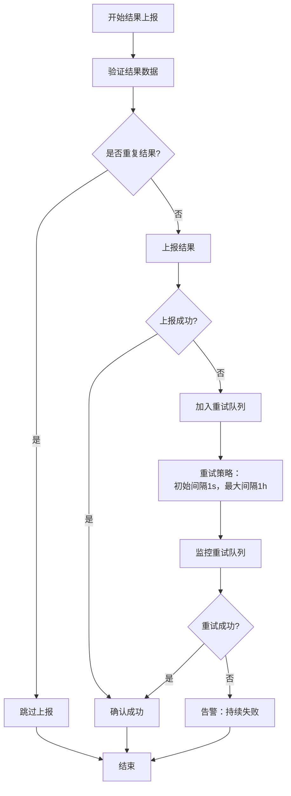
```mermaid
flowchart TD
    Start[开始结果上报] --> Validate[验证结果数据]
    Validate --> DuplicateCheck{是否重复结果?}
    
    DuplicateCheck -->|是| Skip[跳过上报]
    DuplicateCheck -->|否| Report[上报结果]
    
    Report --> Success{上报成功?}
    Success -->|是| Confirm[确认成功]
    Success -->|否| Queue[加入重试队列]
    
    Queue --> RetryPolicy[重试策略：<br/>初始间隔1s，最大间隔1h]
    RetryPolicy --> Monitor[监控重试队列]
    
    Monitor --> RetrySuccess{重试成功?}
    RetrySuccess -->|是| Confirm
    RetrySuccess -->|否| Alert[告警：持续失败]
    
    Skip --> End[结束]
    Confirm --> End
    Alert --> End

```

### 5.6.5 性能优化数据流

#### 批量处理优化流程

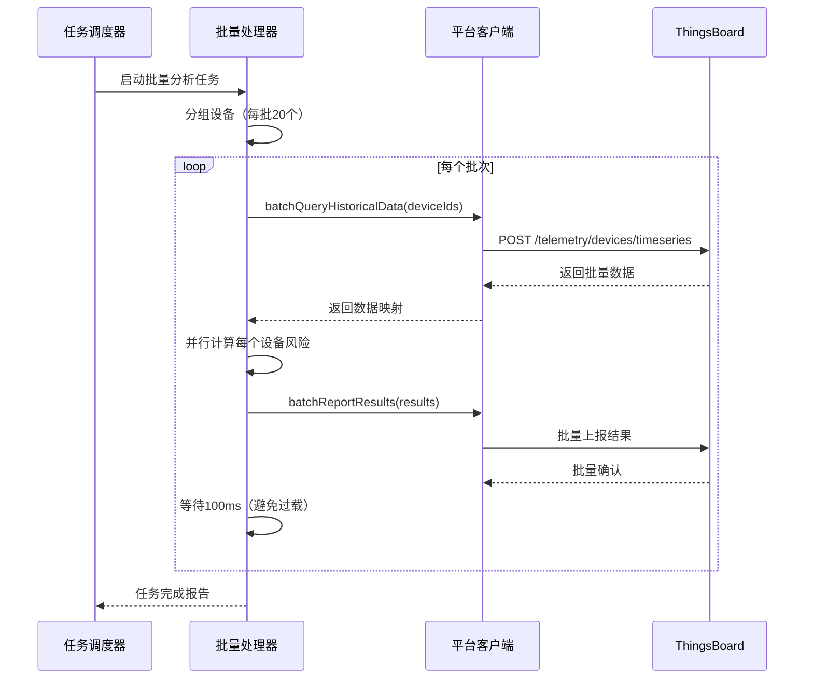
```mermaid
sequenceDiagram
    participant Scheduler as 任务调度器
    participant Batch as 批量处理器
    participant Client as 平台客户端
    participant TB as ThingsBoard
    
    Scheduler->>Batch: 启动批量分析任务
    Batch->>Batch: 分组设备（每批20个）
    
    loop 每个批次
        Batch->>Client: batchQueryHistoricalData(deviceIds)
        Client->>TB: POST /telemetry/devices/timeseries
        TB-->>Client: 返回批量数据
        Client-->>Batch: 返回数据映射
        
        Batch->>Batch: 并行计算每个设备风险
        Batch->>Client: batchReportResults(results)
        Client->>TB: 批量上报结果
        TB-->>Client: 批量确认
        
        Batch->>Batch: 等待100ms（避免过载）
    end
    
    Batch-->>Scheduler: 任务完成报告

```

通过以上详细的接口规范和数据流设计，系统实现了：

1.  **接口最小化**：3个核心接口满足主要业务需求
    
2.  **职责清晰**：各接口边界明确，无功能重叠
    
3.  **数据流透明**：从数据采集到结果应用的完整链路可视化
    
4.  **容错能力强**：完善的错误处理和恢复机制
    
5.  **性能可扩展**：支持批量处理和缓存优化
    

这些设计确保了系统在复杂环境下的稳定运行和高效处理能力。

# 六、算法引擎实现方案

## 6.1 工程简化版VTT算法原理

### 6.1.1 VTT模型基础理论

#### 霉菌生长基本原理

VTT（VTT Technical Research Centre of Finland）霉菌生长模型是基于材料科学和环境工程研究的经验模型，用于预测在不同温湿度条件下建筑材料表面霉菌生长的风险。该模型的核心理论依据是：

1.  **温湿度关键作用**：霉菌生长主要受环境温湿度影响，存在明确的"生长窗口"
    
2.  **材料敏感性差异**：不同材料对霉菌生长的敏感性不同
    
3.  **时间累积效应**：霉菌生长需要时间积累，短时不利条件不会立即导致问题
    

#### 工程简化版设计理念

```mermaid
flowchart TD
    A[原始VTT科研模型] -->|工程化简化| B[工程简化版VTT算法]
    B --> C[核心设计原则]
    
    C --> D[查表替代复杂计算]
    C --> E[材料等级参数化]
    C --> F[7天滑动窗口]
    C --> G[场景化阈值]
    
    D --> H[温湿度查表<br/>双线性插值]
    E --> I[5级材料敏感度<br/>1-6评分体系]
    F --> J[考虑历史累积<br/>支持衰减]
    G --> K[5种预设场景<br/>差异化阈值]

```

#### 算法输入输出定义

```yaml
算法输入:
  必需输入:
    - 温湿度时间序列: 24小时历史数据（每小时一个点）
    - 材料等级: 1.0-6.0，表示材料对霉菌的敏感性
  可选输入:
    - 表面类型修正: 光滑/粗糙表面
    - 位置修正: 墙角/平面位置差异
    
算法输出:
  核心指标:
    - 霉菌指数(MI): 0.0-6.0，表示霉菌生长累积程度
    - 风险概率: 0.0-1.0，表示当前存在霉菌问题的概率
    - 风险等级: LOW/MEDIUM/HIGH，基于场景化阈值
  辅助指标:
    - G值趋势: 近期霉菌生长速率变化
    - 置信度: 算法计算的可靠性评分

```

### 6.1.2 算法计算流程总览

```mermaid
flowchart TD
    Start[开始算法计算] --> DataPrep[数据预处理]
    DataPrep --> SceneLoad[加载场景参数]
    SceneLoad --> GValue[计算每小时G值]
    GValue --> MIAccum[累积MI值]
    MIAccum --> RiskEval[评估风险等级]
    RiskEval --> Output[输出结果]
    
    subgraph DataPrep[数据预处理]
        DP1[接收24小时温湿度数据]
        DP2[检查数据完整性]
        DP3[异常值检测与处理]
        DP4[缺失值插值]
        DP5[每小时数据聚合]
    end
    
    subgraph SceneLoad[加载场景参数]
        SL1[获取设备场景ID]
        SL2[加载预设场景参数]
        SL3[获取材料等级]
        SL4[加载风险阈值]
    end
    
    subgraph GValue[计算每小时G值]
        GV1[查表获取基础G值]
        GV2[应用材料修正]
        GV3[应用位置修正]
        GV4[生成G值序列]
    end
    
    subgraph MIAccum[累积MI值]
        MA1[初始化MI值]
        MA2[7天滑动窗口]
        MA3[正G值累积]
        MA4[负G值衰减]
        MA5[限制范围0-6]
    end
    
    subgraph RiskEval[评估风险等级]
        RE1[获取场景阈值]
        RE2[MI值对比阈值]
        RE3[计算风险概率]
        RE4[确定风险等级]
    end
    
    style Start fill:#e3f2fd
    style Output fill:#e8f5e8

```

### 6.1.3 关键数学模型

#### 基础G值计算公式

```plaintext
G_base = f(T, RH)  # 基于温湿度查表
G_final = G_base × F_material × F_position × F_surface

其中：
  G_base: 基础生长速率（查表获取）
  F_material: 材料修正系数（1.0-3.0）
  F_position: 位置修正系数（0.8-1.2）
  F_surface: 表面修正系数（0.9-1.1）

```

#### MI值累积公式

```plaintext
MI_today = MI_yesterday × decay_factor + Σ(G_hourly)

约束条件：
  1. 当G_hourly > 0时：MI累积增加
  2. 当G_hourly ≤ 0时：MI按衰减系数减少
  3. MI值范围限制：0 ≤ MI ≤ 6
  4. 衰减系数：默认0.95（每日衰减5%）

```

## 6.2 预设场景定义与参数体系

### 6.2.1 五类标准场景定义

| 场景ID | 场景名称 | 典型应用位置 | 材料等级 | 设计逻辑 | 风险敏感性 |
| --- | --- | --- | --- | --- | --- |
| **wall** | 标准墙面/天花板 | 客厅、卧室、办公室的墙体或吊顶 | **3.0** | 覆盖面积最大的标准建材 | 中等 |
| **wood\_furniture** | 木质家具/储物区 | 衣柜、橱柜、木制书柜内部 | **4.0** | 针对敏感度高的木质材料 | 高 |
| **high\_humidity** | 高湿功能区 | 卫生间、厨房、茶水间 | **3.5** | 环境湿度波动大的区域 | 中等偏高 |
| **window\_corner** | 窗户/外墙角 | 窗台下方、建筑外墙内角 | **3.5** | 针对易冷凝的热桥区域 | 中等偏高 |
| **equipment\_area** | 设备区/管道间 | 空调下方、水管附近、机房 | **4.0** | 按最坏情况设置的高风险区域 | 最高 |

### 6.2.2 场景参数详细配置

#### 材料等级体系（1.0-6.0）

```yaml
材料等级定义:
  1.0: 抗霉材料 - 特殊防霉涂层、不锈钢等
  2.0: 低敏感性材料 - 瓷砖、玻璃、金属
  3.0: 中等敏感性材料 - 标准墙面涂料、石膏板
  4.0: 高敏感性材料 - 木材、壁纸、纺织品
  5.0: 极高敏感性材料 - 天然纤维、软木
  6.0: 最易霉材料 - 潮湿木材、有机材料
  
修正系数映射:
  材料等级 -> 修正系数:
    1.0: 0.2
    2.0: 0.5
    3.0: 1.0 (基准)
    4.0: 1.5
    5.0: 2.0
    6.0: 3.0

```

#### 场景化风险阈值配置

```json
{
  "wall": {
    "low_threshold": 2.0,
    "medium_threshold": 3.0,
    "high_threshold": 4.0,
    "description": "标准墙面采用中等敏感阈值"
  },
  "wood_furniture": {
    "low_threshold": 1.5,
    "medium_threshold": 2.5,
    "high_threshold": 3.5,
    "description": "木质家具采用更敏感阈值"
  },
  "high_humidity": {
    "low_threshold": 2.5,
    "medium_threshold": 3.5,
    "high_threshold": 4.5,
    "description": "高湿区域阈值适当提高"
  },
  "window_corner": {
    "low_threshold": 2.2,
    "medium_threshold": 3.2,
    "high_threshold": 4.2,
    "description": "冷桥区域采用中间阈值"
  },
  "equipment_area": {
    "low_threshold": 1.8,
    "medium_threshold": 2.8,
    "high_threshold": 3.8,
    "description": "设备区采用最敏感阈值"
  }
}

```

### 6.2.3 场景参数扩展属性

#### 控制策略参数

```java
@Data
public class SceneControlStrategy {
    // 渐进式控制参数
    private Integer stage1Duration;      // 第一阶段控制时长（分钟）
    private String stage1Action;         // 第一阶段控制动作
    private Integer stage2Duration;      // 第二阶段控制时长
    private String stage2Action;         // 第二阶段控制动作
    private Double escalationThreshold;  // 升级阈值
    
    // 告警策略
    private AlertConfig alertConfig;     // 告警配置
    private Integer alertDelay;          // 告警延迟时间（分钟）
    private List<String> notifyChannels; // 通知渠道
    
    // 维护建议
    private Integer checkInterval;       // 建议检查间隔（天）
    private List<String> maintenanceTips; // 维护提示
}

```

#### 环境修正参数

```yaml
环境修正因子:
  通风条件修正:
    良好通风: 0.8  (降低风险)
    一般通风: 1.0  (基准)
    通风不良: 1.3  (增加风险)
    
  光照条件修正:
    充足光照: 0.9  (抑制霉菌)
    一般光照: 1.0  (基准)
    阴暗环境: 1.2  (促进霉菌)
    
  清洁度修正:
    经常清洁: 0.8  (降低风险)
    一般清洁: 1.0  (基准)
    很少清洁: 1.4  (增加风险)

```

### 6.2.4 场景推荐与选择逻辑

#### 自动场景推荐算法

```mermaid
flowchart TD
    Start[开始场景推荐] --> Location{获取安装位置}
    Location --> RoomType{房间类型?}
    
    RoomType -->|卫生间/厨房| Humidity[推荐: high_humidity]
    RoomType -->|卧室/客厅| Standard[推荐: wall]
    RoomType -->|储藏室/衣柜| Wood[推荐: wood_furniture]
    
    Humidity --> PositionCheck{位置特征?}
    Standard --> PositionCheck
    Wood --> PositionCheck
    
    PositionCheck -->|靠外墙/窗户| Adjust1[调整为: window_corner]
    PositionCheck -->|空调/管道附近| Adjust2[调整为: equipment_area]
    PositionCheck -->|无特殊特征| Keep[保持原推荐]
    
    Adjust1 --> HistoryCheck[历史数据检查]
    Adjust2 --> HistoryCheck
    Keep --> HistoryCheck
    
    HistoryCheck -->|历史高风险| Upgrade[升级材料等级+0.5]
    HistoryCheck -->|历史稳定| Maintain[保持参数]
    
    Upgrade --> Final[最终推荐场景]
    Maintain --> Final

```

## 6.3 G值计算与MI累积算法

### 6.3.1 G值计算核心算法

#### 查表数据结构设计

系统采用双线性插值的查表方法，替代复杂的函数计算，提高性能同时保证精度：

```yaml
查表参数范围:
  温度范围: 0℃ ~ 40℃ (步长: 0.5℃)
  湿度范围: 30% ~ 100% (步长: 1%)
  表格大小: 80×70 = 5600个数据点
  
数据来源:
  - 基于VTT模型实验数据
  - 工程经验数据补充
  - 现场实测数据校准
  
更新机制:
  - 静态表格: 预加载到内存
  - 动态更新: 支持在线更新（需要重启服务）

```

#### 双线性插值算法

```plaintext
已知四个相邻点:
  Q11 = (T1, RH1, G11)
  Q12 = (T1, RH2, G12)
  Q21 = (T2, RH1, G21)
  Q22 = (T2, RH2, G22)

目标点: P = (T, RH)

插值步骤:
  1. 在RH方向线性插值:
     R1 = (RH2 - RH)/(RH2 - RH1) × G11 + (RH - RH1)/(RH2 - RH1) × G12
     R2 = (RH2 - RH)/(RH2 - RH1) × G21 + (RH - RH1)/(RH2 - RH1) × G22
     
  2. 在T方向线性插值:
     G = (T2 - T)/(T2 - T1) × R1 + (T - T1)/(T2 - T1) × R2

```

#### 修正系数应用

```java
/**
 * 计算修正后的G值
 */
public double calculateAdjustedGValue(double temperature, 
                                     double humidity, 
                                     SceneParameter sceneParam) {
    
    // 1. 基础查表
    double baseG = interpolateGValue(temperature, humidity);
    
    // 2. 应用材料修正
    double materialFactor = getMaterialFactor(sceneParam.getMaterialLevel());
    double adjustedG = baseG * materialFactor;
    
    // 3. 应用位置修正（如果有）
    if (sceneParam.getPositionCorrection() != null) {
        adjustedG *= sceneParam.getPositionCorrection();
    }
    
    // 4. 应用表面修正（如果有）
    if (sceneParam.getSurfaceCorrection() != null) {
        adjustedG *= sceneParam.getSurfaceCorrection();
    }
    
    // 5. 应用环境修正（如果有）
    if (sceneParam.getEnvironmentCorrection() != null) {
        adjustedG *= sceneParam.getEnvironmentCorrection();
    }
    
    return adjustedG;
}

```

### 6.3.2 G值序列计算流程

#### 每小时G值计算

```mermaid
flowchart TD
    Start[开始小时计算] --> Data[获取小时数据]
    Data --> Validate{数据有效性检查}
    
    Validate -->|有效| Calc[计算平均温湿度]
    Validate -->|无效| Skip[跳过该小时]
    
    Calc --> Lookup[查表获取基础G值]
    Lookup --> Material[应用材料修正]
    Material --> Position[应用位置修正]
    Position --> Surface[应用表面修正]
    Surface --> Env[应用环境修正]
    Env --> Output[输出最终G值]
    
    Skip --> Zero[设置G值=0]
    Zero --> Record[记录为无效数据点]
    
    Output --> Next[继续下一小时]
    Record --> Next

```

#### 异常情况处理规则

```yaml
异常数据处理:
  1. 数据缺失处理:
    - 单个小时缺失: 使用前后小时线性插值
    - 连续2-3小时缺失: 使用样条插值
    - 超过3小时缺失: 标记数据质量警告
    
  2. 异常值处理:
    - 温度异常: < -20℃ 或 > 60℃ 视为无效
    - 湿度异常: < 0% 或 > 100% 视为无效
    - 突变检测: 相邻小时变化超过阈值视为异常
    
  3. 数据质量控制:
    - 有效数据点比例 < 80%: 标记低置信度
    - 连续无效数据: 触发设备健康检查

```

### 6.3.3 MI值累积算法

#### 7天滑动窗口实现

```java
/**
 * MI值累积计算器
 */
@Component
public class MIAccumulator {
    
    // 衰减系数（当环境不适宜霉菌生长时）
    private static final double DECAY_FACTOR = 0.95;
    
    // 最大MI值限制
    private static final double MAX_MI = 6.0;
    
    /**
     * 计算7天累积MI值
     */
    public double calculateMI(List<Double> hourlyGValues, 
                              Double previousMI, 
                              SceneParameter sceneParam) {
        
        // 1. 初始化MI值
        double mi = (previousMI != null) ? previousMI : 0.0;
        
        // 2. 处理每小时G值
        for (Double gValue : hourlyGValues) {
            if (gValue > 0) {
                // 有利条件：MI增加
                mi += gValue * getGrowthFactor(sceneParam);
            } else {
                // 不利条件：MI衰减
                mi *= DECAY_FACTOR;
                // 确保MI不低于0
                mi = Math.max(mi, 0.0);
            }
        }
        
        // 3. 应用MI值限制
        mi = Math.min(mi, MAX_MI);
        mi = Math.max(mi, 0.0);
        
        return mi;
    }
    
    /**
     * 获取生长因子（基于场景参数）
     */
    private double getGrowthFactor(SceneParameter sceneParam) {
        // 不同场景可能有不同的生长因子
        // 默认返回1.0，可根据场景调整
        return 1.0;
    }
}

```

#### 历史MI值管理策略

```yaml
MI值存储策略:
  短期存储（7天）:
    - 存储每小时计算的MI值
    - 用于实时趋势分析
    - 内存存储，快速访问
    
  中期存储（90天）:
    - 存储每日最大MI值
    - 用于周度/月度分析
    - 数据库存储，支持查询
    
  长期存储（永久）:
    - 存储每日统计摘要
    - 用于年度对比和研究
    - 归档存储，压缩格式

```

#### MI值衰减模型

```plaintext
衰减条件判断:
  1. G值 ≤ 0时触发衰减
  2. 衰减速率: 每日衰减5%（衰减系数0.95）
  3. 衰减下限: MI值不低于0
  
数学模型:
  MI_t = MI_{t-1} × 0.95^N   (当连续N小时G≤0)
  
物理意义:
  - 当环境条件不适宜霉菌生长时，现有霉菌会逐渐死亡
  - 衰减系数基于霉菌孢子存活率实验数据
  - 不同霉菌种类的衰减速率可能不同

```

### 6.3.4 算法性能优化

#### 计算优化策略

1.  **预计算表格**：G值查表预加载到内存
    
2.  **批量处理**：多设备并行计算
    
3.  **缓存机制**：重复计算结果缓存
    
4.  **近似计算**：非关键路径使用近似算法
    

#### 内存优化策略

```java
/**
 * 内存优化设计
 */
public class MemoryOptimizedCalculator {
    
    // 使用原始数据类型减少对象开销

    private double[ ][ ] gValueTable;  // 二维数组替代Map

    
    // 对象池减少GC压力
    private ObjectPool<GValueResult> resultPool;
    
    // 使用flyweight模式共享不变数据
    private Map<String, SceneParameter> sceneCache;
    
    /**
     * 批量计算优化
     */
    public Map<String, Double> batchCalculateMI(
            Map<String, List<Double>> deviceGValues,
            Map<String, Double> previousMIs) {
        
        return deviceGValues.entrySet().parallelStream()
            .collect(Collectors.toConcurrentMap(
                Map.Entry::getKey,
                entry -> calculateSingleMI(
                    entry.getValue(), 
                    previousMIs.get(entry.getKey())
                )
            ));
    }
}

```

## 6.4 风险等级评估模型

### 6.4.1 三级风险评估体系

#### 风险等级定义

```yaml
风险等级体系:
  LOW (低风险):
    - MI值: 低于场景低阈值
    - 颜色标识: 绿色 (#4CAF50)
    - 处理建议: 仅监控，无需干预
    - 告警级别: 信息级
    
  MEDIUM (中风险):
    - MI值: 介于低阈值和中阈值之间
    - 颜色标识: 黄色 (#FFC107)
    - 处理建议: 关注变化，准备干预
    - 告警级别: 警告级
    
  HIGH (高风险):
    - MI值: 达到或超过中阈值
    - 颜色标识: 红色 (#F44336)
    - 处理建议: 立即干预，采取控制措施
    - 告警级别: 紧急级

```

#### 场景化阈值应用

```java
/**
 * 风险等级评估器
 */
@Component
public class RiskLevelEvaluator {
    
    /**
     * 评估风险等级（基于场景化阈值）
     */
    public RiskLevel evaluateRiskLevel(Double miValue, SceneParameter sceneParam) {
        if (miValue == null) {
            return RiskLevel.UNKNOWN;
        }
        
        RiskThreshold threshold = sceneParam.getThreshold();
        
        if (miValue < threshold.getLowThreshold()) {
            return RiskLevel.LOW;
        } else if (miValue < threshold.getMediumThreshold()) {
            return RiskLevel.MEDIUM;
        } else {
            return RiskLevel.HIGH;
        }
    }
    
    /**
     * 计算风险概率
     */
    public Double calculateRiskProbability(Double miValue, RiskLevel riskLevel, 
                                          SceneParameter sceneParam) {
        
        RiskThreshold threshold = sceneParam.getThreshold();
        
        switch (riskLevel) {
            case LOW:
                // 低风险范围线性映射到0-0.3
                return miValue / threshold.getLowThreshold() * 0.3;
                
            case MEDIUM:
                // 中风险范围线性映射到0.3-0.8
                double range = threshold.getMediumThreshold() - threshold.getLowThreshold();
                double position = (miValue - threshold.getLowThreshold()) / range;
                return 0.3 + position * 0.5;
                
            case HIGH:
                // 高风险范围线性映射到0.8-1.0
                double highRange = threshold.getHighThreshold() - threshold.getMediumThreshold();
                if (highRange > 0) {
                    double highPosition = (miValue - threshold.getMediumThreshold()) / highRange;
                    return 0.8 + Math.min(highPosition, 1.0) * 0.2;
                } else {
                    return miValue >= threshold.getMediumThreshold() ? 1.0 : 0.8;
                }
                
            default:
                return 0.0;
        }
    }
}

```

### 6.4.2 风险趋势分析

#### 趋势判断算法

```yaml
趋势分析规则:
  上升趋势判断:
    - 当前MI值 > 前一日MI值 × 1.1
    - 连续3小时G值 > 0.1
    - 风险等级从低/中变为高
    
  下降趋势判断:
    - 当前MI值 < 前一日MI值 × 0.9
    - 连续6小时G值 ≤ 0
    - 风险等级从高变为中/低
    
  稳定趋势判断:
    - MI值波动在±10%范围内
    - 没有明显的上升或下降模式

```

#### 风险变化预警

```java
/**
 * 风险变化检测器
 */
@Component
public class RiskChangeDetector {
    
    /**
     * 检测风险等级变化
     */
    public RiskChange detectRiskChange(String deviceId, 
                                      RiskAnalysisResult current,
                                      RiskAnalysisResult previous) {
        
        if (previous == null) {
            return RiskChange.NEW;  // 首次分析
        }
        
        RiskLevel currentLevel = current.getRiskLevel();
        RiskLevel previousLevel = previous.getRiskLevel();
        
        // 等级变化判断
        if (currentLevel.ordinal() > previousLevel.ordinal()) {
            return RiskChange.ESCALATED;  // 风险升级
        } else if (currentLevel.ordinal() < previousLevel.ordinal()) {
            return RiskChange.DEESCALATED;  // 风险降级
        } else {
            // 同等级内趋势判断
            double changeRate = (current.getMoldIndex() - previous.getMoldIndex()) 
                               / previous.getMoldIndex();
            
            if (Math.abs(changeRate) < 0.05) {
                return RiskChange.STABLE;  // 稳定
            } else if (changeRate > 0.1) {
                return RiskChange.INCREASING;  // 显著上升
            } else if (changeRate < -0.1) {
                return RiskChange.DECREASING;  // 显著下降
            } else {
                return RiskChange.FLUCTUATING;  // 波动
            }
        }
    }
}

```

### 6.4.3 风险评估置信度

#### 置信度计算模型

```yaml
置信度影响因素:
  数据质量: 权重 40%
    - 数据完整性: 有效数据点比例
    - 数据准确性: 异常值比例
    - 时间连续性: 数据间隔均匀性
    
  算法匹配度: 权重 30%
    - 场景参数匹配: 场景选择合理性
    - 历史准确性: 近期预测准确率
    - 模型适用性: 温湿度范围覆盖度
    
  环境稳定性: 权重 30%
    - 环境波动性: 温湿度变化幅度
    - 季节适应性: 季节性模式匹配度
    - 设备稳定性: 传感器工作状态

```

#### 置信度等级定义

```java
/**
 * 置信度评估器
 */
@Component
public class ConfidenceEvaluator {
    
    /**
     * 计算综合置信度
     */
    public ConfidenceLevel evaluateConfidence(RiskAnalysisContext context) {
        double score = 0.0;
        
        // 1. 数据质量评分（0-40分）
        score += evaluateDataQuality(context.getDataQuality()) * 40;
        
        // 2. 算法匹配度评分（0-30分）
        score += evaluateAlgorithmFit(context.getAlgorithmContext()) * 30;
        
        // 3. 环境稳定性评分（0-30分）
        score += evaluateEnvironmentStability(context.getEnvironmentData()) * 30;
        
        // 4. 转换为置信度等级
        if (score >= 90) return ConfidenceLevel.HIGH;
        if (score >= 70) return ConfidenceLevel.MEDIUM;
        if (score >= 50) return ConfidenceLevel.LOW;
        return ConfidenceLevel.VERY_LOW;
    }
}

```

## 6.5 算法校准与优化机制

### 6.5.1 校准反馈数据模型

#### 反馈数据结构

```java
/**
 * 校准反馈数据模型
 */
@Data
public class CalibrationFeedback {
    // 基本信息
    private String feedbackId;
    private String deviceId;
    private String sceneId;
    private Instant checkTime;
    
    // 现场核查结果
    private Boolean moldFound;           // 是否发现霉斑
    private MoldSeverity severity;       // 霉斑严重程度
    private Double actualMI;             // 实际评估的MI值
    private List<String> photoUrls;      // 现场照片
    
    // 预测对比数据
    private Double predictedMI;          // 预测的MI值
    private Instant predictionTime;      // 预测时间
    
    // 环境条件
    private Double actualTemperature;    // 实际温度
    private Double actualHumidity;       // 实际湿度
    private EnvironmentalCondition condition; // 环境条件描述
    
    // 评估信息
    private String checker;              // 核查人员
    private String comments;             // 备注
    private AccuracyLevel accuracy;      // 准确度评估
    
    // 系统管理字段
    private String feedbackVersion;      // 反馈格式版本
    private Instant createdTime;
    private Instant processedTime;       // 处理时间
}

```

#### 准确性评估标准

```yaml
准确性等级定义:
  HIGH (高准确度):
    - 条件: |预测MI - 实际MI| ≤ 0.5
    - 颜色: 绿色
    - 说明: 预测与实际基本一致
    
  MEDIUM (中等准确度):
    - 条件: 0.5 < |预测MI - 实际MI| ≤ 1.0
    - 颜色: 黄色
    - 说明: 预测存在一定偏差
    
  LOW (低准确度):
    - 条件: |预测MI - 实际MI| > 1.0
    - 颜色: 红色
    - 说明: 预测偏差较大
  
  UNKNOWN (无法评估):
    - 条件: 缺乏足够信息
    - 颜色: 灰色
    - 说明: 需要更多数据

```

### 6.5.2 参数优化算法

#### 材料等级优化算法

```mermaid
flowchart TD
    Start[开始参数优化] --> Collect[收集校准反馈]
    Collect --> Filter[过滤无效数据]
    Filter --> Analyze[分析偏差模式]
    
    Analyze --> PatternCheck{偏差模式?}
    
    PatternCheck -->|系统性偏高| AdjustDown[调低材料等级]
    PatternCheck -->|系统性偏低| AdjustUp[调高材料等级]
    PatternCheck -->|随机偏差| Keep[保持当前参数]
    PatternCheck -->|样本不足| Wait[等待更多数据]
    
    AdjustDown --> Calculate1[计算调整幅度]
    AdjustUp --> Calculate2[计算调整幅度]
    
    Calculate1 --> Validate1[验证调整效果]
    Calculate2 --> Validate2[验证调整效果]
    
    Validate1 --> Apply1[应用优化参数]
    Validate2 --> Apply2[应用优化参数]
    
    Keep --> Record1[记录分析结果]
    Wait --> Record2[记录等待原因]
    Apply1 --> Record1
    Apply2 --> Record1

```

#### 优化计算数学模型

```plaintext
优化目标: 最小化预测偏差的均方根误差(RMSE)

优化变量: 材料等级 L (1.0-6.0)

约束条件:
  1. 调整幅度限制: |ΔL| ≤ 0.5 (每次优化)
  2. 边界限制: 1.0 ≤ L ≤ 6.0
  3. 统计显著性: 需要足够样本量(n ≥ 20)

优化算法:
  采用梯度下降法:
    L_new = L_old - α × ∇RMSE(L_old)
    
  其中:
    α: 学习率 (默认0.1)
    ∇RMSE: RMSE对L的梯度

```

### 6.5.3 A/B测试框架

#### 测试分组策略

```java
/**
 * A/B测试管理器
 */
@Component
public class AbTestManager {
    
    /**
     * 分配测试组别
     */
    public AbTestGroup assignTestGroup(String deviceId, String sceneId) {
        // 基于设备ID哈希的确定性分组
        int hash = Math.abs(deviceId.hashCode());
        int groupIndex = hash % 100;  // 0-99
        
        // 分组配置
        if (groupIndex < 10) {
            return AbTestGroup.CONTROL;      // 10% 对照组（旧参数）
        } else if (groupIndex < 30) {
            return AbTestGroup.TEST_A;       // 20% 测试组A（新参数1）
        } else if (groupIndex < 50) {
            return AbTestGroup.TEST_B;       // 20% 测试组B（新参数2）
        } else {
            return AbTestGroup.EXCLUDED;     // 50% 排除组（不参与测试）
        }
    }
    
    /**
     * 获取测试组参数
     */
    public SceneParameter getTestParameter(String sceneId, AbTestGroup group) {
        SceneParameter baseParam = sceneManager.getCurrentParameter(sceneId);
        
        switch (group) {
            case CONTROL:
                return baseParam;  // 对照组使用当前参数
                
            case TEST_A:
                return createTestParameter(baseParam, "optimization_a");
                
            case TEST_B:
                return createTestParameter(baseParam, "optimization_b");
                
            default:
                return baseParam;
        }
    }
}

```

#### 测试效果评估指标

```yaml
评估指标体系:
  主要指标:
    - 平均绝对误差(MAE): 预测偏差的绝对值平均
    - 均方根误差(RMSE): 预测偏差的平方平均的平方根
    - 准确率: 高准确度反馈的比例
    
  次要指标:
    - 风险检出率: 实际高风险被正确预测的比例
    - 误报率: 预测高风险但实际低风险的比例
    - 漏报率: 预测低风险但实际高风险的比例
    
  业务指标:
    - 用户满意度: 基于用户反馈的评分
    - 维护成本: 因误报导致的维护成本
    - 风险控制效果: 提前预警的成功率

```

### 6.5.4 持续优化工作流

```mermaid
sequenceDiagram
    participant Sensor as 传感器
    participant AI as AI分析模块
    participant Platform as 物联网平台
    participant Maintainer as 维护人员
    participant Optimizer as 优化引擎
    
    %% 正常预测流程
    Sensor->>Platform: 上报环境数据
    Platform->>AI: 触发风险分析
    AI->>Platform: 返回预测结果
    Platform->>Maintainer: 高风险告警
    
    %% 现场核查流程
    Maintainer->>Maintainer: 现场检查设备
    Maintainer->>AI: 提交校准反馈
    
    %% 优化处理流程
    AI->>Optimizer: 传递反馈数据
    Optimizer->>Optimizer: 分析预测偏差
    Optimizer->>Optimizer: 检查优化条件
    
    alt 满足优化条件
        Optimizer->>Optimizer: 计算优化参数
        Optimizer->>AI: 更新场景参数
        AI->>Optimizer: 确认更新完成
        Optimizer->>Maintainer: 发送优化报告
    else 不满足优化条件
        Optimizer->>Optimizer: 记录统计信息
        Optimizer->>Maintainer: 发送分析报告
    end
    
    %% 下一轮预测
    Platform->>AI: 触发新的风险分析
    AI->>AI: 使用优化后参数计算
    AI->>Platform: 返回更准确的结果

```

### 6.5.5 优化效果追踪与报告

#### 优化效果追踪指标

```java
/**
 * 优化效果追踪器
 */
@Component
public class OptimizationTracker {
    
    /**
     * 追踪优化效果变化
     */
    public OptimizationEffect trackEffect(String sceneId, 
                                         String oldVersion, 
                                         String newVersion,
                                         Duration trackingPeriod) {
        
        OptimizationEffect effect = new OptimizationEffect();
        
        // 收集新旧版本的数据
        List<CalibrationFeedback> oldFeedbacks = 
            feedbackRepository.findBySceneAndVersion(sceneId, oldVersion, trackingPeriod);
        List<CalibrationFeedback> newFeedbacks = 
            feedbackRepository.findBySceneAndVersion(sceneId, newVersion, trackingPeriod);
        
        // 计算关键指标
        effect.setMaeImprovement(calculateMaeImprovement(oldFeedbacks, newFeedbacks));
        effect.setRmseImprovement(calculateRmseImprovement(oldFeedbacks, newFeedbacks));
        effect.setAccuracyImprovement(calculateAccuracyImprovement(oldFeedbacks, newFeedbacks));
        
        // 业务指标评估
        effect.setBusinessImpact(assessBusinessImpact(oldFeedbacks, newFeedbacks));
        
        // 统计显著性检验
        effect.setStatisticalSignificance(
            performSignificanceTest(oldFeedbacks, newFeedbacks)
        );
        
        return effect;
    }
}

```

#### 优化报告生成

```yaml
优化报告内容结构:
  1. 执行摘要:
    - 优化目标和方法
    - 关键发现和结论
    - 推荐行动
    
  2. 数据概况:
    - 参与优化的设备数量
    - 校准反馈样本量
    - 测试时间范围
    
  3. 技术指标分析:
    - 预测准确性对比
    - 风险检出率变化
    - 误报/漏报率改善
    
  4. 业务影响评估:
    - 维护成本变化
    - 用户满意度变化
    - 风险控制效果
    
  5. 详细数据:
    - 原始数据表格
    - 统计图表
    - 显著性检验结果
    
  6. 后续建议:
    - 参数调整建议
    - 进一步优化方向
    - 监控指标建议

```

通过以上算法引擎实现方案，系统建立了从基础VTT模型到工程化应用，再到持续优化的完整算法体系。该方案不仅提供了准确的霉菌风险预测能力，还具备自我学习和持续改进的能力，能够随着时间的推移不断优化预测准确性。

# 七、数据模型与存储设计

## 7.1 核心领域对象定义

### 7.1.1 基础数据对象

#### 传感器数据点

用于存储温湿度原始数据，是算法计算的基础输入：

```java
@Data
public class SensorDataPoint {
    @NotNull(message = "时间戳不能为空")
    private Instant timestamp;     // 数据采集时间戳
    
    @Min(-50) @Max(100)
    private Double temperature;    // 温度值，单位：℃
    
    @Min(0) @Max(100)
    private Double humidity;       // 相对湿度，单位：%
    
    private String deviceId;       // 设备标识符
    private DataQuality quality;   // 数据质量标记
    private String source;         // 数据来源（sensor_id或manual）
}

```

#### 小时聚合数据

用于存储预处理的聚合数据，提高计算效率：

```java
@Data
public class HourlyAggregatedData {
    private String deviceId;
    private LocalDateTime hourStart;  // 小时的起始时间
    private Double avgTemperature;    // 平均温度
    private Double avgHumidity;       // 平均湿度
    private Double minTemperature;    // 最低温度
    private Double maxTemperature;    // 最高温度
    private Integer dataPointCount;   // 数据点数量
    private DataQuality overallQuality; // 总体质量评估
}

```

### 7.1.2 算法计算对象

#### G值计算结果

存储每小时的霉菌生长速率计算结果：

```java
@Data
public class GValueResult {
    private String deviceId;
    private LocalDateTime hour;        // 对应的小时
    private Double baseGValue;         // 基础G值（查表）
    private Double materialFactor;     // 材料修正系数
    private Double adjustedGValue;     // 调整后G值
    private Double temperature;        // 小时平均温度
    private Double humidity;           // 小时平均湿度
    private Double confidence;         // 计算置信度
}

```

#### MI值计算结果

存储霉菌指数累积计算结果：

```java
@Data
public class MIResult {
    private String deviceId;
    private LocalDateTime calculationTime;  // 计算时间
    private Double miValue;                 // 当前MI值（0-6）
    private Double dailyAccumulation;       // 当日累积值
    private Double weeklyAccumulation;      // 周累积值
    private Trend trend;                    // 变化趋势
    private Double previousMI;              // 前一日MI值
    private Double miChangeRate;            // MI变化率
}

```

### 7.1.3 风险评估对象

#### 风险分析结果

存储完整的风险评估结果：

```java
@Data
public class RiskAnalysisResult {
    // 基础信息
    private String analysisId;        // 分析任务ID
    private String deviceId;          // 设备ID
    private Instant analysisTime;     // 分析时间
    
    // VTT算法输出
    private Double moldIndex;           // MI值，范围0-6
    private Double moldRiskProbability; // 风险概率，范围0.0-1.0
    private RiskLevel riskLevel;        // 风险等级
    
    // 场景信息
    private String sceneId;            // 场景标识
    private String sceneName;          // 场景名称
    private String sceneVersion;       // 场景参数版本
    
    // 分析上下文
    private Integer dataPointsCount;   // 使用的数据点数
    private Integer validHoursCount;   // 有效小时数
    private Double dataCoverageRate;   // 数据覆盖率
    
    // 辅助信息
    private ConfidenceLevel confidence; // 置信度
    private List<String> riskFactors;   // 风险因素列表
    private String analysisRemarks;     // 分析备注
}

```

#### 风险等级定义

```java
public enum RiskLevel {
    LOW("低风险", 1, "#4CAF50"),      // 绿色
    MEDIUM("中风险", 2, "#FFC107"),   // 黄色
    HIGH("高风险", 3, "#F44336");     // 红色
    
    private final String description;
    private final int priority;
    private final String colorCode;
    
    // 构造函数、getter省略
}

```

### 7.1.4 场景管理对象

#### 预设场景定义

存储系统预设的场景参数：

```java
@Data
public class PresetScene {
    private String sceneId;           // 场景标识：wall, wood_furniture等
    private String sceneName;         // 显示名称：标准墙面/天花板
    private String description;       // 场景描述
    private Double baseMaterialLevel; // 基准材料等级（1.0-6.0）
    private RiskThreshold threshold;  // 场景特定阈值配置
    private String icon;              // UI图标URL
    private Integer usageCount;       // 使用次数统计
    private Double accuracyScore;     // 准确率评分（0.0-1.0）
    private String currentVersion;    // 当前参数版本
    private Boolean isActive;         // 是否激活
    private Instant createdTime;
    private Instant updatedTime;
    
    // 控制策略相关
    private ControlStrategy controlStrategy; // 控制策略配置
    private String recommendedAction;       // 建议采取的措施
    private String typicalLocations;        // 典型位置描述
}

```

#### 场景参数（运行时使用）

优化后的场景参数，去除了冗余字段：

```java
@Data
@Builder
public class SceneParameter {
    private String sceneId;           // 场景标识，如"wall", "wood_furniture"
    private String sceneName;         // 场景名称，如"标准墙面"
    private Double materialLevel;     // 材料等级，3.0, 4.0等
    private RiskThreshold threshold;  // 风险阈值配置
    private String version;           // 参数版本
    private Map<String, Object> extendedParams; // 扩展参数
}

```

### 7.1.5 设备管理对象

#### 设备场景绑定

存储设备与场景的绑定关系：

```java
@Data
public class DeviceSceneBinding {
    private String bindingId;        // 绑定记录ID
    private String deviceId;         // 设备ID
    private String sceneId;          // 场景ID
    private String presetVersion;    // 预设参数版本
    private Instant bindTime;        // 绑定时间
    private String installer;        // 安装人员
    private String locationNote;     // 位置备注
    private String installationPhoto; // 安装照片URL
    private Map<String, Object> customAttributes; // 自定义属性
    private Instant createdTime;
    private Instant updatedTime;
}

```

#### 设备关联关系

存储设备之间的控制关联关系：

```java
@Data
public class DeviceAssociation {
    private String sourceDeviceId;   // 源设备（传感器）
    private String targetDeviceId;   // 目标设备（执行器）
    private AssociationType type;    // 关联类型：CONTROL, MONITOR, BACKUP
    private Double controlWeight;    // 控制权重（0-1）
    private Integer priority;        // 优先级
    private String description;      // 关联描述
    private Boolean isActive;        // 是否激活
}

```

### 7.1.6 校准反馈对象

#### 现场核查反馈

存储维护人员提交的现场核查数据：

```java
@Data
public class CalibrationFeedback {
    private String feedbackId;        // 反馈ID（UUID）
    private String deviceId;          // 设备ID
    private String sceneId;           // 场景ID
    private Instant checkTime;        // 检查时间
    private Boolean moldFound;        // 是否发现霉斑
    private MoldSeverity severity;    // 严重程度
    private Double predictedMI;       // 预测的MI值
    private Double actualMI;          // 实际评估值
    private String checker;           // 核查人员
    private String comments;          // 备注
    private List<String> photoUrls;   // 现场照片URL列表
    private EnvironmentalCondition environment; // 环境条件
    private String processingStatus;  // 处理状态
    private Instant createdTime;
    private Instant processedTime;
}

```

#### 校准统计结果

存储场景级别的校准统计：

```java
@Data
public class CalibrationStatistics {
    private String sceneId;           // 场景ID
    private LocalDate statDate;       // 统计日期
    private Integer totalFeedbacks;   // 总反馈数
    private Integer truePositives;    // 真阳性数
    private Integer falsePositives;   // 假阳性数
    private Integer falseNegatives;   // 假阴性数
    private Double accuracy;          // 准确率
    private Double precision;         // 精确率
    private Double recall;            // 召回率
    private Double f1Score;           // F1分数
    private Double mae;               // 平均绝对误差
    private Double rmse;              // 均方根误差
}

```

### 7.1.7 规则与控制对象

#### 控制规则定义

存储智能联动的控制规则：

```java
@Data
@Entity
@Table(name = "control_rules")
public class ControlRule {
    @Id
    @GeneratedValue(strategy = GenerationType.IDENTITY)
    private Long id;
    
    private String ruleName;          // 规则名称
    private String description;       // 规则描述
    private String deviceId;          // 关联设备ID
    private String sceneId;           // 关联场景ID
    
    @Enumerated(EnumType.STRING)
    private ConditionType conditionType; // 条件类型
    
    @Column(columnDefinition = "json")
    @Convert(converter = JsonConditionConverter.class)
    private RuleCondition condition;  // 条件配置（JSON）
    
    @Enumerated(EnumType.STRING)
    private ActionType actionType;    // 动作类型
    
    @Column(columnDefinition = "json")
    @Convert(converter = JsonActionConverter.class)
    private RuleAction action;        // 动作配置（JSON）
    
    private Integer priority;         // 优先级（0-99）
    private Boolean enabled;          // 是否启用
    private Boolean stopOnMatch;      // 匹配后是否停止
    private LocalTime effectiveStart; // 生效开始时间
    private LocalTime effectiveEnd;   // 生效结束时间
    private Instant createdTime;
    private Instant updatedTime;
}

```

#### 控制执行记录

存储设备控制指令的执行记录：

```java
@Data
public class ControlExecutionRecord {
    private String executionId;       // 执行记录ID
    private String deviceId;          // 设备ID
    private String ruleId;            // 触发的规则ID
    private ControlCommand command;   // 执行的指令
    private ExecutionStatus status;   // 执行状态
    private String resultMessage;     // 执行结果消息
    private Instant startTime;        // 开始时间
    private Instant endTime;          // 结束时间
    private Long durationMs;          // 执行时长（毫秒）
    private Map<String, Object> metadata; // 执行元数据
}

```

## 7.2 数据库表结构设计

### 7.2.1 关系型数据库设计

#### 预设场景表（preset\_scenes）

存储系统预设的5种标准场景及其参数：

```sql
CREATE TABLE preset_scenes (
    scene_id VARCHAR(50) PRIMARY KEY,
    scene_name VARCHAR(100) NOT NULL,
    description VARCHAR(500),
    base_material_level DECIMAL(3,1) NOT NULL CHECK (base_material_level BETWEEN 1.0 AND 6.0),
    
    -- 风险阈值配置
    low_threshold DECIMAL(4,2) NOT NULL DEFAULT 2.0,
    medium_threshold DECIMAL(4,2) NOT NULL DEFAULT 3.0,
    high_threshold DECIMAL(4,2) NOT NULL DEFAULT 4.0,
    
    -- UI相关
    icon_url VARCHAR(200),
    color_code VARCHAR(7),
    
    -- 统计信息
    usage_count INT DEFAULT 0,
    accuracy_score DECIMAL(4,3) DEFAULT 0.0,
    calibration_count INT DEFAULT 0,
    
    -- 版本管理
    current_version VARCHAR(20) DEFAULT '1.0',
    is_active BOOLEAN DEFAULT TRUE,
    
    -- 控制策略（JSON格式）
    control_strategy JSON,
    recommended_check_interval INT DEFAULT 30 COMMENT '建议检查间隔（天）',
    
    -- 时间戳
    created_time TIMESTAMP DEFAULT CURRENT_TIMESTAMP,
    updated_time TIMESTAMP DEFAULT CURRENT_TIMESTAMP ON UPDATE CURRENT_TIMESTAMP,
    
    -- 索引
    INDEX idx_scene_active (is_active),
    INDEX idx_scene_usage (usage_count DESC),
    INDEX idx_scene_accuracy (accuracy_score DESC)
) ENGINE=InnoDB DEFAULT CHARSET=utf8mb4 COMMENT='预设场景配置表';

```

#### 设备场景绑定表（device\_scene\_bindings）

存储设备与场景的绑定关系：

```sql
CREATE TABLE device_scene_bindings (
    id BIGINT AUTO_INCREMENT PRIMARY KEY,
    
    -- 设备信息
    device_id VARCHAR(50) NOT NULL,
    device_name VARCHAR(100),
    device_type VARCHAR(50) COMMENT '传感器类型',
    
    -- 场景绑定
    scene_id VARCHAR(50) NOT NULL,
    preset_version VARCHAR(20) NOT NULL DEFAULT '1.0',
    
    -- 安装信息
    bind_time TIMESTAMP NOT NULL DEFAULT CURRENT_TIMESTAMP,
    installer VARCHAR(100),
    installer_contact VARCHAR(100),
    
    -- 位置信息
    location_note TEXT,
    building_name VARCHAR(100),
    room_name VARCHAR(100),
    specific_location VARCHAR(200),
    installation_photo_url VARCHAR(500),
    
    -- 自定义属性
    custom_attributes JSON,
    
    -- 状态管理
    is_active BOOLEAN DEFAULT TRUE,
    last_analysis_time TIMESTAMP NULL,
    last_risk_level VARCHAR(20),
    
    -- 时间戳
    created_time TIMESTAMP DEFAULT CURRENT_TIMESTAMP,
    updated_time TIMESTAMP DEFAULT CURRENT_TIMESTAMP ON UPDATE CURRENT_TIMESTAMP,
    
    -- 索引与约束
    UNIQUE KEY uk_device_id (device_id),
    INDEX idx_scene_id (scene_id),
    INDEX idx_bind_time (bind_time DESC),
    INDEX idx_installer (installer),
    INDEX idx_location (building_name, room_name),
    FOREIGN KEY (scene_id) REFERENCES preset_scenes(scene_id) ON DELETE RESTRICT
) ENGINE=InnoDB DEFAULT CHARSET=utf8mb4 COMMENT='设备场景绑定表';

```

#### 风险计算结果表（risk\_results）

存储AI模块计算的风险结果，用于历史查询和分析：

```sql
CREATE TABLE risk_results (
    id BIGINT AUTO_INCREMENT PRIMARY KEY,
    
    -- 设备与场景信息
    device_id VARCHAR(50) NOT NULL,
    scene_id VARCHAR(50) NOT NULL,
    
    -- 分析时间
    analysis_time TIMESTAMP NOT NULL,
    analysis_date DATE GENERATED ALWAYS AS (DATE(analysis_time)) STORED,
    analysis_hour INT GENERATED ALWAYS AS (HOUR(analysis_time)) STORED,
    
    -- 风险指标
    mold_index DECIMAL(4,2) NOT NULL CHECK (mold_index BETWEEN 0.0 AND 6.0),
    risk_probability DECIMAL(3,2) NOT NULL CHECK (risk_probability BETWEEN 0.0 AND 1.0),
    risk_level VARCHAR(20) NOT NULL,
    
    -- 分析上下文
    data_points_count INT NOT NULL DEFAULT 0,
    valid_hours_count INT NOT NULL DEFAULT 0,
    data_coverage_rate DECIMAL(4,3) COMMENT '数据覆盖率',
    
    -- 场景参数快照
    material_level DECIMAL(3,1),
    low_threshold DECIMAL(4,2),
    medium_threshold DECIMAL(4,2),
    high_threshold DECIMAL(4,2),
    
    -- 置信度与质量
    confidence_score DECIMAL(3,2) DEFAULT 0.0,
    data_quality VARCHAR(20) DEFAULT 'GOOD',
    
    -- 上报状态
    reported_to_platform BOOLEAN DEFAULT FALSE,
    report_time TIMESTAMP NULL,
    
    -- 时间戳
    created_time TIMESTAMP DEFAULT CURRENT_TIMESTAMP,
    
    -- 索引
    INDEX idx_device_time (device_id, analysis_time DESC),
    INDEX idx_scene_time (scene_id, analysis_time DESC),
    INDEX idx_risk_level_time (risk_level, analysis_time),
    INDEX idx_analysis_date (analysis_date),
    INDEX idx_report_status (reported_to_platform, analysis_time),
    
    -- 分区建议（按日期分区）
    PARTITION BY RANGE (TO_DAYS(analysis_time)) (
        PARTITION p202401 VALUES LESS THAN (TO_DAYS('2024-02-01')),
        PARTITION p202402 VALUES LESS THAN (TO_DAYS('2024-03-01')),
        PARTITION p_future VALUES LESS THAN MAXVALUE
    )
) ENGINE=InnoDB DEFAULT CHARSET=utf8mb4 COMMENT='风险计算结果表';

```

#### 校准反馈表（calibration\_feedbacks）

存储现场核查的校准反馈数据：

```sql
CREATE TABLE calibration_feedbacks (
    id BIGINT AUTO_INCREMENT PRIMARY KEY,
    
    -- 反馈基本信息
    feedback_id VARCHAR(36) UNIQUE NOT NULL COMMENT 'UUID',
    device_id VARCHAR(50) NOT NULL,
    scene_id VARCHAR(50) NOT NULL,
    
    -- 检查时间
    check_time TIMESTAMP NOT NULL,
    check_date DATE GENERATED ALWAYS AS (DATE(check_time)) STORED,
    
    -- 现场检查结果
    mold_found BOOLEAN NOT NULL,
    severity VARCHAR(20) NOT NULL COMMENT 'NONE, LOW, MEDIUM, HIGH',
    actual_mi DECIMAL(4,2) CHECK (actual_mi BETWEEN 0.0 AND 6.0),
    severity_score INT COMMENT '严重程度评分（1-10）',
    
    -- 预测对比
    predicted_mi DECIMAL(4,2) NOT NULL,
    mi_deviation DECIMAL(4,2) GENERATED ALWAYS AS (actual_mi - predicted_mi) STORED,
    absolute_deviation DECIMAL(4,2) GENERATED ALWAYS AS (ABS(actual_mi - predicted_mi)) STORED,
    
    -- 反馈类型
    feedback_type VARCHAR(20) NOT NULL COMMENT 'TRUE_POSITIVE, FALSE_POSITIVE, FALSE_NEGATIVE, TRUE_NEGATIVE',
    accuracy_level VARCHAR(20) COMMENT 'HIGH, MEDIUM, LOW',
    
    -- 环境条件
    actual_temperature DECIMAL(4,1),
    actual_humidity DECIMAL(4,1),
    environmental_notes TEXT,
    
    -- 照片证据
    photo_urls JSON COMMENT '照片URL列表',
    
    -- 核查人员
    checker VARCHAR(50) NOT NULL,
    checker_role VARCHAR(50),
    comments TEXT,
    
    -- 处理状态
    processing_status VARCHAR(20) DEFAULT 'PENDING',
    processed_time TIMESTAMP NULL,
    optimization_suggestion TEXT,
    
    -- 时间戳
    created_time TIMESTAMP DEFAULT CURRENT_TIMESTAMP,
    updated_time TIMESTAMP DEFAULT CURRENT_TIMESTAMP ON UPDATE CURRENT_TIMESTAMP,
    
    -- 索引
    INDEX idx_device_check (device_id, check_time DESC),
    INDEX idx_scene_feedback (scene_id, check_time DESC),
    INDEX idx_feedback_type (feedback_type, check_date),
    INDEX idx_accuracy_level (accuracy_level),
    INDEX idx_deviation (absolute_deviation),
    INDEX idx_processing_status (processing_status),
    
    FOREIGN KEY (scene_id) REFERENCES preset_scenes(scene_id) ON DELETE RESTRICT
) ENGINE=InnoDB DEFAULT CHARSET=utf8mb4 COMMENT='校准反馈表';

```

#### 场景反馈统计表（scene\_feedback\_stats）

存储场景级别的校准统计信息，用于参数优化：

```sql
CREATE TABLE scene_feedback_stats (
    id BIGINT AUTO_INCREMENT PRIMARY KEY,
    
    -- 统计维度
    scene_id VARCHAR(50) NOT NULL,
    stat_date DATE NOT NULL,
    parameter_version VARCHAR(20) NOT NULL DEFAULT '1.0',
    
    -- 样本统计
    total_feedbacks INT DEFAULT 0,
    valid_feedbacks INT DEFAULT 0,
    
    -- 分类统计
    true_positives INT DEFAULT 0,
    false_positives INT DEFAULT 0,
    false_negatives INT DEFAULT 0,
    true_negatives INT DEFAULT 0,
    
    -- 准确性指标
    accuracy DECIMAL(5,4) DEFAULT 0.0,
    precision DECIMAL(5,4) DEFAULT 0.0,
    recall DECIMAL(5,4) DEFAULT 0.0,
    f1_score DECIMAL(5,4) DEFAULT 0.0,
    
    -- 偏差指标
    mean_deviation DECIMAL(5,3) DEFAULT 0.0,
    mean_absolute_deviation DECIMAL(5,3) DEFAULT 0.0,
    root_mean_square_error DECIMAL(5,3) DEFAULT 0.0,
    
    -- 分布统计
    high_accuracy_count INT DEFAULT 0,
    medium_accuracy_count INT DEFAULT 0,
    low_accuracy_count INT DEFAULT 0,
    
    -- 时间戳
    created_time TIMESTAMP DEFAULT CURRENT_TIMESTAMP,
    updated_time TIMESTAMP DEFAULT CURRENT_TIMESTAMP ON UPDATE CURRENT_TIMESTAMP,
    
    -- 索引与约束
    UNIQUE KEY uk_scene_date_version (scene_id, stat_date, parameter_version),
    INDEX idx_scene_stats (scene_id, stat_date DESC),
    INDEX idx_accuracy_trend (scene_id, accuracy DESC),
    FOREIGN KEY (scene_id) REFERENCES preset_scenes(scene_id) ON DELETE CASCADE
) ENGINE=InnoDB DEFAULT CHARSET=utf8mb4 COMMENT='场景反馈统计表';

```

#### 控制规则表（control\_rules）

存储智能联动控制规则：

```sql
CREATE TABLE control_rules (
    id BIGINT AUTO_INCREMENT PRIMARY KEY,
    
    -- 规则基本信息
    rule_name VARCHAR(100) NOT NULL,
    description VARCHAR(500),
    
    -- 关联信息
    device_id VARCHAR(50) NOT NULL,
    scene_id VARCHAR(50) NOT NULL,
    
    -- 条件配置
    condition_type VARCHAR(50) NOT NULL COMMENT 'RISK_LEVEL, MI_VALUE, COMPOSITE, TIME_BASED',
    condition_config JSON NOT NULL,
    
    -- 动作配置
    action_type VARCHAR(50) NOT NULL COMMENT 'CONTROL_DEVICE, SEND_NOTIFICATION, EXECUTE_SCRIPT, CALL_WEBHOOK',
    action_config JSON NOT NULL,
    
    -- 规则属性
    priority INT DEFAULT 50 CHECK (priority BETWEEN 0 AND 99),
    enabled BOOLEAN DEFAULT TRUE,
    stop_on_match BOOLEAN DEFAULT FALSE,
    
    -- 生效时间
    effective_start TIME NULL,
    effective_end TIME NULL,
    effective_days VARCHAR(7) DEFAULT '1111111' COMMENT '周一到周日生效日',
    
    -- 统计信息
    execution_count INT DEFAULT 0,
    last_execution_time TIMESTAMP NULL,
    success_count INT DEFAULT 0,
    
    -- 时间戳
    created_time TIMESTAMP DEFAULT CURRENT_TIMESTAMP,
    updated_time TIMESTAMP DEFAULT CURRENT_TIMESTAMP ON UPDATE CURRENT_TIMESTAMP,
    
    -- 索引
    INDEX idx_device_rules (device_id, enabled, priority DESC),
    INDEX idx_scene_rules (scene_id, enabled),
    INDEX idx_rule_enabled (enabled, priority DESC),
    INDEX idx_last_execution (last_execution_time DESC)
) ENGINE=InnoDB DEFAULT CHARSET=utf8mb4 COMMENT='控制规则表';

```

#### 控制执行记录表（control\_execution\_records）

存储控制指令的执行历史：

```sql
CREATE TABLE control_execution_records (
    id BIGINT AUTO_INCREMENT PRIMARY KEY,
    
    -- 执行信息
    execution_id VARCHAR(36) UNIQUE NOT NULL COMMENT 'UUID',
    rule_id BIGINT NOT NULL,
    device_id VARCHAR(50) NOT NULL,
    
    -- 指令信息
    command_type VARCHAR(50) NOT NULL,
    command_params JSON,
    target_device_id VARCHAR(50),
    
    -- 执行状态
    status VARCHAR(20) NOT NULL COMMENT 'PENDING, EXECUTING, SUCCESS, FAILED, TIMEOUT',
    result_message TEXT,
    error_details TEXT,
    
    -- 时间记录
    submit_time TIMESTAMP NOT NULL DEFAULT CURRENT_TIMESTAMP,
    start_time TIMESTAMP NULL,
    end_time TIMESTAMP NULL,
    duration_ms BIGINT GENERATED ALWAYS AS (
        CASE 
            WHEN start_time IS NOT NULL AND end_time IS NOT NULL 
            THEN TIMESTAMPDIFF(MICROSECOND, start_time, end_time) / 1000
            ELSE NULL 
        END
    ) STORED,
    
    -- 重试信息
    retry_count INT DEFAULT 0,
    max_retries INT DEFAULT 3,
    
    -- 时间戳
    created_time TIMESTAMP DEFAULT CURRENT_TIMESTAMP,
    
    -- 索引
    INDEX idx_device_execution (device_id, submit_time DESC),
    INDEX idx_rule_execution (rule_id, submit_time DESC),
    INDEX idx_status_time (status, submit_time),
    INDEX idx_execution_date (DATE(submit_time)),
    INDEX idx_target_device (target_device_id, submit_time DESC),
    
    FOREIGN KEY (rule_id) REFERENCES control_rules(id) ON DELETE CASCADE
) ENGINE=InnoDB DEFAULT CHARSET=utf8mb4 COMMENT='控制执行记录表';

```

### 7.2.2 数据库分表分库策略

#### 水平分表策略

由于风险计算结果数据量可能较大，采用按时间分表策略：

```sql
-- 按月分表示例
CREATE TABLE risk_results_202401 LIKE risk_results;
CREATE TABLE risk_results_202402 LIKE risk_results;

-- 动态表名路由（使用MyBatis或ShardingSphere）
-- 表名模式：risk_results_YYYYMM

```

#### 读写分离策略

```yaml
数据库集群配置:
  写库（主库）: 1个实例
    - 职责: 所有写操作
    - 配置: 高配置，SSD存储
    
  读库（从库）: 2-3个实例
    - 职责: 查询操作，统计分析
    - 配置: 中等配置，支持水平扩展
    - 负载均衡: 轮询或加权分配

```

## 7.3 时序数据存储策略

### 7.3.1 TDengine时序数据库设计

#### 超级表设计（Super Table）

定义传感器数据的统一结构：

```sql
-- 创建传感器数据超级表
CREATE STABLE sensor_data (
    ts TIMESTAMP,
    device_id NCHAR(50),
    temperature FLOAT,
    humidity FLOAT,
    voltage FLOAT,
    rssi SMALLINT,
    data_quality TINYINT
) TAGS (
    location NCHAR(100),
    scene_id NCHAR(50),
    building NCHAR(100),
    room NCHAR(100),
    sensor_type NCHAR(50),
    manufacturer NCHAR(50),
    model NCHAR(50),
    install_date TIMESTAMP
);

-- 创建子表（每个设备自动创建）
-- 系统自动管理，无需手动创建

```

#### 风险结果超级表

存储风险分析结果的时间序列：

```sql
-- 创建风险结果超级表
CREATE STABLE risk_results_ts (
    ts TIMESTAMP,
    device_id NCHAR(50),
    mold_index FLOAT,
    risk_probability FLOAT,
    risk_level TINYINT,
    confidence_score FLOAT,
    data_points_count INT,
    analysis_duration INT,
    scene_version NCHAR(20)
) TAGS (
    scene_id NCHAR(50),
    building NCHAR(100),
    room NCHAR(100),
    risk_category NCHAR(20)
);

```

### 7.3.2 数据分层存储架构

```mermaid
graph TB
    subgraph "热数据层 (0-7天)"
        Memory[内存存储<br/>最近24小时数据]
        TD_Hot[TDengine热存储<br/>7天原始数据]
    end
    
    subgraph "温数据层 (8-90天)"
        TD_Warm[TDengine温存储<br/>90天聚合数据]
        Agg_Hourly[小时级聚合表]
    end
    
    subgraph "冷数据层 (90天以上)"
        Archive_HDFS[HDFS归档<br/>原始数据Parquet格式]
        Archive_MySQL[MySQL归档<br/>日级统计摘要]
        Backup_S3[S3备份<br/>压缩存储]
    end
    
    Memory -->|每24小时| TD_Hot
    TD_Hot -->|每7天滚动| TD_Warm
    TD_Warm -->|每月聚合| Agg_Hourly
    TD_Warm -->|每90天| Archive_HDFS
    Agg_Hourly -->|每年汇总| Archive_MySQL
    
    style Memory fill:#ffebee
    style TD_Hot fill:#f3e5f5
    style TD_Warm fill:#e3f2fd
    style Archive_HDFS fill:#e8f5e8

```

### 7.3.3 时序数据保留策略

```yaml
数据保留策略:
  原始数据:
    - TDengine热存储: 7天（高查询性能）
    - TDengine温存储: 90天（中等查询性能）
    - HDFS归档存储: 3年（低查询性能，高压缩）
    - S3长期备份: 永久（法规要求）
    
  聚合数据:
    - 小时级聚合: 1年（TDengine）
    - 日级聚合: 3年（MySQL）
    - 月级统计: 永久（MySQL）
    
  风险结果数据:
    - 详细结果: 90天（TDengine）
    - 日级摘要: 3年（MySQL）
    - 月级报告: 永久（MySQL + 文件存储）

```

### 7.3.4 时序数据查询优化

#### 预聚合策略

```sql
-- 创建预聚合表（每小时聚合）
CREATE TABLE sensor_data_hourly AS
SELECT 
    _wstart AS hour_start,
    device_id,
    AVG(temperature) AS avg_temperature,
    AVG(humidity) AS avg_humidity,
    MIN(temperature) AS min_temperature,
    MAX(temperature) AS max_temperature,
    COUNT(*) AS data_points_count
FROM sensor_data
INTERVAL(1h)
SLIDING(1h)
GROUP BY device_id;

-- 创建日级聚合表
CREATE TABLE sensor_data_daily AS
SELECT 
    _wstart AS day_start,
    device_id,
    AVG(temperature) AS avg_temperature,
    AVG(humidity) AS avg_humidity,
    MIN(temperature) AS min_temperature,
    MAX(temperature) AS max_temperature,
    COUNT(*) AS hourly_count
FROM sensor_data_hourly
INTERVAL(1d)
SLIDING(1d)
GROUP BY device_id;

```

#### 查询性能优化

```sql
-- 使用时间分区查询
SELECT * FROM sensor_data
WHERE ts >= '2024-01-01 00:00:00'
  AND ts < '2024-01-02 00:00:00'
  AND device_id = 'sensor_001'
PARTITION BY DAY;

-- 使用预聚合查询（性能更优）
SELECT * FROM sensor_data_hourly
WHERE hour_start >= '2024-01-01 00:00:00'
  AND hour_start < '2024-01-02 00:00:00'
  AND device_id = 'sensor_001';

```

## 7.4 缓存策略与性能优化

### 7.4.1 多级缓存架构

```mermaid
graph TB
    subgraph "L1: 本地缓存"
        Caffeine[内存缓存<br/>Caffeine]
        ThreadLocal[线程本地缓存]
        ConcurrentMap[并发Map缓存]
    end
    
    subgraph "L2: 分布式缓存"
        Redis_Cluster[Redis集群<br/>主从+哨兵]
        Redis_Sharding[分片Redis]
    end
    
    subgraph "L3: 应用缓存"
        QueryCache[查询结果缓存]
        SessionCache[会话缓存]
        ConfigCache[配置缓存]
    end
    
    subgraph "数据源"
        MySQL[关系数据库]
        TDengine[时序数据库]
    end
    
    Client --> Caffeine
    Caffeine -->|缓存未命中| Redis_Cluster
    Redis_Cluster -->|缓存未命中| QueryCache
    QueryCache -->|缓存未命中| MySQL
    QueryCache -->|缓存未命中| TDengine
    
    style Caffeine fill:#e8f5e8
    style Redis_Cluster fill:#e3f2fd
    style QueryCache fill:#fff3e0

```

### 7.4.2 缓存配置策略

#### Caffeine本地缓存配置

```yaml
caffeine:
  # 场景参数缓存
  scene-parameters:
    maximum-size: 1000
    expire-after-write: 5m
    refresh-after-write: 1m
    record-stats: true
    
  # 设备绑定缓存
  device-bindings:
    maximum-size: 5000
    expire-after-write: 10m
    refresh-after-write: 2m
    record-stats: true
    
  # 查询结果缓存
  query-results:
    maximum-size: 10000
    expire-after-write: 2m
    soft-values: true  # 使用软引用，内存不足时自动清理
    
  # 算法中间结果缓存
  algorithm-results:
    maximum-size: 2000
    expire-after-access: 30m
    record-stats: true

```

#### Redis分布式缓存配置

```yaml
redis:
  cluster:
    nodes:
      - redis-node1:6379
      - redis-node2:6379
      - redis-node3:6379
    max-redirects: 3
    
  # 缓存配置
  cache-configs:
    # 风险结果缓存
    risk-results:
      ttl: 30m
      max-size: 100000
      use-prefix: true
      
    # 设备状态缓存
    device-status:
      ttl: 5m
      max-size: 50000
      use-prefix: true
      
    # 控制规则缓存
    control-rules:
      ttl: 10m
      max-size: 10000
      use-prefix: true
      
    # 会话缓存
    user-sessions:
      ttl: 30m
      max-size: 10000
      use-prefix: true

```

### 7.4.3 缓存使用模式

#### 读穿透缓存模式（Read-Through）

```java
@Component
public class SceneParameterCache {
    
    @Autowired
    private SceneParameterRepository repository;
    
    @Autowired
    private CacheManager cacheManager;
    
    /**
     * 读穿透缓存模式
     */
    @Cacheable(value = "sceneParameters", key = "#sceneId + '_' + #version")
    public SceneParameter getSceneParameter(String sceneId, String version) {
        // 缓存未命中时，从数据库加载
        SceneParameter param = repository.findBySceneIdAndVersion(sceneId, version);
        
        if (param == null) {
            // 如果数据库也没有，使用默认参数
            param = createDefaultParameter(sceneId);
        }
        
        return param;
    }
    
    /**
     * 写穿透缓存模式
     */
    @CachePut(value = "sceneParameters", key = "#param.sceneId + '_' + #param.version")
    public SceneParameter updateSceneParameter(SceneParameter param) {
        // 先更新数据库
        SceneParameter saved = repository.save(param);
        
        // 缓存会自动更新（@CachePut）
        return saved;
    }
}

```

#### 缓存预热策略

```java
@Component
public class CacheWarmUpService {
    
    @PostConstruct
    @Async
    public void warmUpCaches() {
        log.info("开始缓存预热...");
        
        // 1. 预热场景参数缓存
        warmUpSceneParameters();
        
        // 2. 预热设备绑定缓存（活跃设备）
        warmUpActiveDeviceBindings();
        
        // 3. 预热控制规则缓存
        warmUpControlRules();
        
        // 4. 预热常用查询结果
        warmUpFrequentQueries();
        
        log.info("缓存预热完成");
    }
    
    private void warmUpSceneParameters() {
        List<PresetScene> scenes = sceneRepository.findAllActiveScenes();
        scenes.forEach(scene -> {
            SceneParameter param = sceneParameterService.getSceneParameter(
                scene.getSceneId(), scene.getCurrentVersion());
            // 加载到缓存
        });
    }
}

```

### 7.4.4 查询性能优化

#### 数据库查询优化

```sql
-- 1. 使用覆盖索引
CREATE INDEX idx_risk_results_covering ON risk_results 
    (device_id, analysis_time, risk_level, mold_index)
    INCLUDE (scene_id, data_points_count, confidence_score);

-- 2. 使用分区查询
EXPLAIN PARTITIONS
SELECT * FROM risk_results 
WHERE device_id = 'sensor_001' 
  AND analysis_time >= '2024-01-01'
  AND analysis_time < '2024-02-01'
PARTITION BY MONTH(analysis_time);

-- 3. 使用批处理减少连接次数
SELECT device_id, AVG(mold_index) as avg_mi, COUNT(*) as count
FROM risk_results 
WHERE analysis_time >= DATE_SUB(NOW(), INTERVAL 7 DAY)
GROUP BY device_id
HAVING count >= 24 * 7;  -- 至少7天的完整数据

```

#### 应用层查询优化

```java
@Component
public class QueryOptimizationService {
    
    /**
     * 批量查询优化
     */
    public Map<String, List<SensorDataPoint>> batchQueryHistoricalData(
            List<String> deviceIds, 
            Instant startTime, 
            Instant endTime) {
        
        // 1. 检查缓存
        Map<String, List<SensorDataPoint>> cachedResults = 
            checkCacheForBatch(deviceIds, startTime, endTime);
        
        // 2. 过滤已缓存的设备
        List<String> uncachedDeviceIds = filterUncachedDevices(deviceIds, cachedResults);
        
        if (!uncachedDeviceIds.isEmpty()) {
            // 3. 批量查询数据库
            Map<String, List<SensorDataPoint>> dbResults = 
                batchQueryFromDatabase(uncachedDeviceIds, startTime, endTime);
            
            // 4. 合并结果并更新缓存
            cachedResults.putAll(dbResults);
            updateCacheForBatch(dbResults, startTime, endTime);
        }
        
        return cachedResults;
    }
    
    /**
     * 分页查询优化
     */
    public Page<RiskAnalysisResult> getRiskResultsWithOptimization(
            String deviceId, 
            Instant startTime, 
            Instant endTime,
            Pageable pageable) {
        
        // 使用游标分页代替传统分页
        String cursor = pageable.getSort().getOrderFor("analysis_time").getProperty();
        
        return riskResultRepository.findByDeviceIdAndTimeRange(
            deviceId, 
            startTime, 
            endTime, 
            cursor,
            pageable.getPageSize()
        );
    }
}

```

### 7.4.5 监控与调优

#### 缓存命中率监控

```yaml
监控指标:
  caffeine:
    hit-rate: 
      description: "本地缓存命中率"
      threshold: > 0.8  # 期望命中率80%以上
      
    eviction-count:
      description: "缓存淘汰次数"
      threshold: < 1000/分钟
      
    load-success-rate:
      description: "缓存加载成功率"
      threshold: > 0.95
      
  redis:
    hit-rate:
      description: "Redis缓存命中率"
      threshold: > 0.7
      
    memory-usage:
      description: "Redis内存使用率"
      threshold: < 0.8
      
    connection-pool:
      description: "连接池使用率"
      threshold: < 0.8

```

#### 慢查询分析与优化

```java
@Component
@Aspect
public class QueryPerformanceMonitor {
    
    private static final Logger log = LoggerFactory.getLogger(QueryPerformanceMonitor.class);
    private static final long SLOW_QUERY_THRESHOLD = 1000; // 1秒
    
    @Around("@annotation(org.springframework.data.jpa.repository.Query)")
    public Object monitorQueryPerformance(ProceedingJoinPoint joinPoint) throws Throwable {
        long startTime = System.currentTimeMillis();
        
        try {
            return joinPoint.proceed();
        } finally {
            long duration = System.currentTimeMillis() - startTime;
            
            if (duration > SLOW_QUERY_THRESHOLD) {
                log.warn("慢查询检测: 方法={}, 耗时={}ms, 参数={}", 
                    joinPoint.getSignature().getName(), 
                    duration,
                    Arrays.toString(joinPoint.getArgs()));
                
                // 记录慢查询到监控系统
                recordSlowQuery(joinPoint, duration);
            }
        }
    }
    
    private void recordSlowQuery(ProceedingJoinPoint joinPoint, long duration) {
        // 发送到监控系统（如Prometheus, ELK）
        Map<String, Object> slowQueryInfo = new HashMap<>();
        slowQueryInfo.put("method", joinPoint.getSignature().getName());
        slowQueryInfo.put("duration", duration);
        slowQueryInfo.put("timestamp", Instant.now());
        slowQueryInfo.put("args", joinPoint.getArgs());
        
        metricsCollector.recordSlowQuery(slowQueryInfo);
    }
}

```

通过以上数据模型与存储设计，系统实现了：

1.  **数据模型完整性**：覆盖从原始数据到分析结果的完整业务对象
    
2.  **数据库设计优化**：合理分表分区，支持大规模数据存储
    
3.  **时序数据处理**：专业的时序数据库支持高性能时间序列查询
    
4.  **缓存策略完善**：多级缓存架构保证系统高性能
    
5.  **监控与调优**：全面的性能监控和优化机制
    

这些设计确保了系统能够高效处理大量传感器数据，支持实时的风险分析和快速的查询响应。

# 八、智能联动控制策略

## 8.1 三种控制模式对比

### 8.1.1 控制模式架构概述

系统提供三种互补的控制模式，形成多层次、分场景的智能联动体系：

```mermaid
graph TB
    subgraph "控制模式架构"
        A[模式A: 规则引擎控制]
        B[模式B: 设备Profile告警]
        C[模式C: 直接RPC调用]
        
        subgraph "应用场景映射"
            D[标准配置场景]
            E[特殊设备场景]
            F[紧急控制场景]
        end
        
        subgraph "控制触发机制"
            G[规则链条件判断]
            H[设备属性阈值]
            I[API直接调用]
        end
    end
    
    A -->|适用于| D
    B -->|适用于| E
    C -->|适用于| F
    
    D -->|触发方式| G
    E -->|触发方式| H
    F -->|触发方式| I
    
    style A fill:#e8f5e8,stroke:#2e7d32
    style B fill:#fff3e0,stroke:#e65100
    style C fill:#f3e5f5,stroke:#4a148c

```

### 8.1.2 模式A：规则引擎控制（推荐模式）

#### 核心设计思想

基于ThingsBoard规则链的图形化配置，实现设备间复杂的逻辑联动，将控制逻辑与AI模块解耦。

#### 技术实现

```javascript
// ThingsBoard规则链配置示例（场景化增强版）
// 1. 接收moldIndex遥测数据
// 2. 获取设备场景属性
// 3. 根据场景使用不同的阈值判断条件
// 4. 查找关联设备
// 5. 发送RPC命令

// 示例规则：不同场景使用不同阈值
var sceneId = metadata.sceneId;
var threshold = 3.0; // 默认阈值

if (sceneId === 'wood_furniture') {
    threshold = 2.5; // 木质家具使用更敏感阈值
} else if (sceneId === 'equipment_area') {
    threshold = 2.0; // 设备区使用最敏感阈值
} else if (sceneId === 'high_humidity') {
    threshold = 2.8; // 高湿区域使用中等敏感阈值
}

if (msg.moldIndex > threshold) {
    // 触发告警
    return {msg: msg, metadata: metadata, msgType: msgType};
}

```

#### 核心特征对比

| 特征维度 | 规则引擎控制模式 |
| --- | --- |
| **配置方式** | 图形化规则链配置，支持拖拽 |
| **控制逻辑复杂度** | 支持复杂条件组合和分支逻辑 |
| **维护成本** | 中等，需要规则链管理 |
| **适用场景** | 标准业务逻辑，多设备联动 |
| **执行延迟** | 毫秒级，实时响应 |
| **扩展性** | 高，支持规则动态更新 |
| **推荐使用率** | 80%的标准控制场景 |

### 8.1.3 模式B：设备Profile告警控制

#### 核心设计思想

基于设备Profile模板的自动化告警和预设动作，实现标准化、模板化的控制策略。

#### 技术实现

```javascript
// ThingsBoard告警规则配置（场景化阈值）
{
  "alarmRules": {
    "moldRiskHigh": {
      "condition": {
        "condition": [
          {
            "key": {
              "key": "moldIndex",
              "type": "TIME_SERIES"
            },
            "predicate": {
              "type": "NUMERIC",
              "operation": "GREATER",
              "value": {
                "type": "ATTRIBUTE",
                "key": "sceneThreshold", // 从设备属性获取阈值
                "defaultValue": 3.0
              }
            }
          }
        ]
      },
      "schedule": null,
      "alarmDetails": "霉菌指数超标 - 场景: ${sceneName}",
      "action": {
        "type": "send_command",
        "targetDevice": "${associatedFan}",
        "command": "turnOn",
        "params": {
          "duration": 600,
          "reason": "mold_risk_high"
        }
      }
    }
  }
}

```

#### 核心特征对比

| 特征维度 | 设备Profile告警模式 |
| --- | --- |
| **配置方式** | 设备Profile模板配置，继承属性 |
| **控制逻辑复杂度** | 中等，基于预定义模板 |
| **维护成本** | 低，批量设备统一管理 |
| **适用场景** | 设备类型标准化场景 |
| **执行延迟** | 秒级，周期性检查 |
| **扩展性** | 中等，依赖模板库 |
| **推荐使用率** | 15%的标准化设备场景 |

### 8.1.4 模式C：直接RPC调用控制

#### 核心设计思想

通过API直接发送控制指令，实现紧急或特殊场景下的快速响应，绕过规则引擎的中间处理。

#### 技术实现

```java
@Component
public class DirectRpcController {
    
    @Autowired
    private ThingsBoardClient tbClient;
    
    @Autowired
    private SceneManager sceneManager;
    
    @Scheduled(fixedRate = 300000) // 每5分钟
    public void checkAndControl() {
        List<RiskAnalysisResult> results = // 获取高风险结果
        
        results.forEach(this::controlDeviceByScene);
    }
    
    private void controlDeviceByScene(RiskAnalysisResult result) {
        // 1. 获取设备场景
        SceneParameter sceneParam = sceneManager.getSceneForDevice(result.getDeviceId());
        
        // 2. 根据场景确定控制策略
        ControlStrategy strategy = getControlStrategy(sceneParam.getSceneId(), 
                                                     result.getRiskLevel());
        
        // 3. 查找关联设备
        String fanDeviceId = findAssociatedFan(result.getDeviceId());
        
        // 4. 发送控制指令
        if (strategy.shouldControl()) {
            tbClient.sendRpcCommand(fanDeviceId, "turnOn", 
                Map.of("duration", strategy.getDuration(),
                       "reason", "mold_risk_" + result.getRiskLevel(),
                       "scene", sceneParam.getSceneId()));
        }
    }
}

```

#### 核心特征对比

| 特征维度 | 直接RPC调用模式 |
| --- | --- |
| **配置方式** | 代码硬编码，API调用 |
| **控制逻辑复杂度** | 高，需要编程实现 |
| **维护成本** | 高，需要代码更新和部署 |
| **适用场景** | 紧急响应、特殊逻辑 |
| **执行延迟** | 毫秒级，直接调用 |
| **扩展性** | 低，需要代码修改 |
| **推荐使用率** | 5%的特殊或紧急场景 |

### 8.1.5 综合对比与选择指南

#### 三种模式对比矩阵

```yaml
控制模式对比矩阵:
  模式A（规则引擎）:
    优点: 
      - 可视化配置，无需编码
      - 支持复杂逻辑和分支
      - 动态更新，无需重启
      - 系统集成度高
    
    缺点:
      - 学习曲线较陡
      - 调试相对复杂
      - 性能依赖规则链复杂度
    
    最佳实践:
      - 标准业务逻辑控制
      - 多设备协同联动
      - 需要频繁调整的场景
  
  模式B（设备Profile）:
    优点:
      - 配置简单，模板化
      - 批量管理效率高
      - 维护成本低
    
    缺点:
      - 灵活性有限
      - 复杂逻辑支持不足
      - 模板更新影响范围大
    
    最佳实践:
      - 标准化设备类型
      - 统一控制策略
      - 设备批量部署场景
  
  模式C（直接RPC）:
    优点:
      - 响应最快
      - 逻辑完全可控
      - 不受规则引擎限制
    
    缺点:
      - 维护成本高
      - 扩展性差
      - 需要开发部署
    
    最佳实践:
      - 紧急响应场景
      - 特殊控制逻辑
      - 性能要求极高的场景

```

#### 场景化选择决策树

```mermaid
flowchart TD
    Start[控制模式选择] --> Q1{控制需求复杂度?}
    
    Q1 -->|简单阈值控制| Q2{设备规模?}
    Q1 -->|复杂逻辑控制| ModeA[选择模式A: 规则引擎]
    Q1 -->|特殊紧急控制| ModeC[选择模式C: 直接RPC]
    
    Q2 -->|单设备或小规模| ModeB1[选择模式B: 设备Profile]
    Q2 -->|大规模标准化| ModeB2[选择模式B: 设备Profile]
    Q2 -->|大规模差异化| ModeA2[选择模式A: 规则引擎]
    
    ModeA --> CheckA{需要紧急响应?}
    ModeB1 --> CheckB{需要复杂逻辑?}
    ModeB2 --> CheckB
    
    CheckA -->|是| HybridA[模式A+模式C混合]
    CheckA -->|否| FinalA[纯模式A]
    
    CheckB -->|是| HybridB[模式B+模式A补充]
    CheckB -->|否| FinalB[纯模式B]
    
    ModeC --> FinalC[纯模式C]

```

## 8.2 渐进式控制策略设计

### 8.2.1 渐进式控制核心理念

#### 设计原则

1.  **分阶段响应**：将控制措施分为多个阶段，逐步升级
    
2.  **效果评估**：每个阶段后评估控制效果，决定下一步
    
3.  **场景适配**：不同场景采用不同的控制策略和参数
    
4.  **避免过度控制**：在控制效果和能耗之间取得平衡
    

#### 控制阶段定义

```yaml
渐进控制阶段:
  阶段0: 监控预警
    - 风险等级: LOW
    - 措施: 仅记录日志，发送信息通知
    - 持续时间: 持续监控
    
  阶段1: 温和干预
    - 风险等级: MEDIUM
    - 措施: 发送警告通知，准备控制设备
    - 持续时间: 监控至风险变化
    
  阶段2: 主动控制（第一阶段）
    - 风险等级: HIGH
    - 措施: 启动初级控制设备（如通风）
    - 持续时间: 预设时长（如30分钟）
    
  阶段3: 强化控制（第二阶段）
    - 风险等级: 第一阶段后仍为HIGH
    - 措施: 启动次级控制设备（如加热/除湿）
    - 持续时间: 预设时长（如20分钟）
    
  阶段4: 人工干预升级
    - 风险等级: 第二阶段后仍为HIGH
    - 措施: 通知维护人员现场处理
    - 持续时间: 直至问题解决

```

### 8.2.2 场景化渐进控制策略

#### 木质家具场景控制策略

```yaml
木质家具场景控制策略:
  风险阈值:
    - 低风险: MI < 1.5
    - 中风险: 1.5 ≤ MI < 2.5
    - 高风险: MI ≥ 2.5
  
  阶段控制:
    阶段1（温和干预）:
      触发条件: MI ≥ 2.5
      控制措施: 开启衣柜门，自然通风
      持续时间: 30分钟
      检查间隔: 每10分钟检查一次
    
    阶段2（主动控制）:
      触发条件: 阶段1后MI ≥ 2.3
      控制措施: 开启房间排风扇
      强度: 中等风速
      持续时间: 30分钟
    
    阶段3（强化控制）:
      触发条件: 阶段2后MI ≥ 2.0
      控制措施: 开启房间除湿机
      目标湿度: 50%
      持续时间: 60分钟
    
    阶段4（人工干预）:
      触发条件: 阶段3后MI ≥ 1.8
      控制措施: 通知维护人员现场检查
      响应时间: 4小时内

```

#### 设备区场景控制策略

```yaml
设备区场景控制策略:
  风险阈值:
    - 低风险: MI < 1.8
    - 中风险: 1.8 ≤ MI < 2.8
    - 高风险: MI ≥ 2.8
  
  阶段控制:
    阶段1（温和干预）:
      触发条件: MI ≥ 2.8
      控制措施: 加强设备区通风
      持续时间: 20分钟
    
    阶段2（主动控制）:
      触发条件: 阶段1后MI ≥ 2.5
      控制措施: 开启专用除湿设备
      目标湿度: 45%
      持续时间: 40分钟
    
    阶段3（强化控制）:
      触发条件: 阶段2后MI ≥ 2.2
      控制措施: 启动加热设备辅助除湿
      目标温度: 26℃
      持续时间: 30分钟
    
    阶段4（人工干预）:
      触发条件: 阶段3后MI ≥ 2.0
      控制措施: 紧急维护检查
      响应时间: 2小时内

```

### 8.2.3 渐进控制算法实现

#### 控制决策算法

```java
@Component
public class ProgressiveControlDecider {
    
    /**
     * 根据风险结果和场景决定控制策略
     */
    public ControlDecision makeDecision(RiskAnalysisResult result, 
                                       SceneParameter sceneParam,
                                       ControlHistory history) {
        
        ControlDecision decision = new ControlDecision();
        
        // 1. 基础风险判断
        if (result.getRiskLevel() == RiskLevel.LOW) {
            decision.setStage(ControlStage.MONITORING);
            decision.setAction(ControlAction.LOG_ONLY);
            return decision;
        }
        
        // 2. 获取场景特定控制策略
        SceneControlStrategy strategy = sceneParam.getControlStrategy();
        
        // 3. 考虑历史控制记录
        ControlStage currentStage = determineCurrentStage(history);
        
        // 4. 决定下一阶段
        ControlStage nextStage = determineNextStage(result, strategy, currentStage);
        
        // 5. 构建控制计划
        ControlPlan plan = buildControlPlan(nextStage, strategy, result);
        
        decision.setStage(nextStage);
        decision.setPlan(plan);
        decision.setReason(generateDecisionReason(result, currentStage, nextStage));
        
        return decision;
    }
    
    /**
     * 构建控制计划
     */
    private ControlPlan buildControlPlan(ControlStage stage, 
                                        SceneControlStrategy strategy,
                                        RiskAnalysisResult result) {
        
        ControlPlan plan = new ControlPlan();
        
        switch (stage) {
            case STAGE_1:
                plan.setDuration(strategy.getStage1Duration());
                plan.setDevices(strategy.getStage1Devices());
                plan.setParameters(strategy.getStage1Parameters());
                plan.setCheckInterval(10); // 10分钟检查一次
                break;
                
            case STAGE_2:
                plan.setDuration(strategy.getStage2Duration());
                plan.setDevices(strategy.getStage2Devices());
                plan.setParameters(strategy.getStage2Parameters());
                plan.setCheckInterval(5); // 5分钟检查一次
                break;
                
            case STAGE_3:
                plan.setDuration(strategy.getStage3Duration());
                plan.setDevices(strategy.getStage3Devices());
                plan.setParameters(strategy.getStage3Parameters());
                plan.setCheckInterval(3); // 3分钟检查一次
                break;
                
            case ESCALATION:
                plan.setEmergency(true);
                plan.setNotifyPersons(strategy.getEmergencyContacts());
                plan.setResponseDeadline(strategy.getEmergencyResponseTime());
                break;
        }
        
        // 根据风险等级调整参数
        adjustPlanByRiskLevel(plan, result.getRiskLevel());
        
        return plan;
    }
}

```

#### 效果评估算法

```java
@Component
public class ControlEffectEvaluator {
    
    /**
     * 评估控制效果
     */
    public ControlEffect evaluateEffect(String deviceId, 
                                       ControlExecution execution,
                                       RiskAnalysisResult beforeControl,
                                       RiskAnalysisResult afterControl) {
        
        ControlEffect effect = new ControlEffect();
        
        // 1. MI值改善评估
        double miImprovement = beforeControl.getMoldIndex() - afterControl.getMoldIndex();
        effect.setMiImprovement(miImprovement);
        effect.setMiImprovementRate(calculateImprovementRate(miImprovement, beforeControl.getMoldIndex()));
        
        // 2. 风险等级变化评估
        effect.setRiskLevelChange(evaluateRiskLevelChange(
            beforeControl.getRiskLevel(), 
            afterControl.getRiskLevel()));
        
        // 3. 环境参数改善评估
        EnvironmentImprovement envImprovement = evaluateEnvironmentImprovement(
            deviceId, execution.getStartTime(), execution.getEndTime());
        effect.setEnvironmentImprovement(envImprovement);
        
        // 4. 控制效率评估
        effect.setControlEfficiency(calculateControlEfficiency(
            execution, miImprovement, envImprovement));
        
        // 5. 综合评分
        effect.setOverallScore(calculateOverallScore(effect));
        
        return effect;
    }
    
    /**
     * 决定下一步控制策略
     */
    public NextStepRecommendation recommendNextStep(ControlEffect effect, 
                                                   ControlStage currentStage,
                                                   SceneControlStrategy strategy) {
        
        NextStepRecommendation recommendation = new NextStepRecommendation();
        
        if (effect.getOverallScore() >= 0.8) {
            // 控制效果良好
            if (currentStage.ordinal() > 0) {
                recommendation.setAction(NextAction.REDUCE_OR_STOP);
                recommendation.setReason("控制效果良好，可降低控制强度或停止");
            } else {
                recommendation.setAction(NextAction.MAINTAIN);
                recommendation.setReason("监控状态良好，保持当前监控");
            }
        } else if (effect.getOverallScore() >= 0.5) {
            // 控制效果一般
            recommendation.setAction(NextAction.CONTINUE);
            recommendation.setReason("控制效果一般，继续当前控制措施");
            recommendation.setDurationAdjustment(calculateDurationAdjustment(effect));
        } else {
            // 控制效果差
            if (currentStage.ordinal() < strategy.getMaxStage().ordinal()) {
                recommendation.setAction(NextAction.ESCALATE);
                recommendation.setNextStage(currentStage.next());
                recommendation.setReason("控制效果不佳，升级控制措施");
            } else {
                recommendation.setAction(NextAction.ESCALATE_TO_MANUAL);
                recommendation.setReason("所有自动控制措施效果不佳，需要人工干预");
            }
        }
        
        return recommendation;
    }
}

```

### 8.2.4 渐进控制流程图

```mermaid
flowchart TD
    Start[开始风险分析] --> Analyze[计算风险指标]
    Analyze --> Decision{风险等级判断}
    
    Decision -->|LOW| Monitor[阶段0: 监控预警<br/>仅记录日志]
    Decision -->|MEDIUM| Stage1[阶段1: 温和干预<br/>发送警告通知]
    Decision -->|HIGH| Stage2[阶段2: 主动控制<br/>启动初级控制设备]
    
    Stage2 --> Timer1[等待控制完成]
    Timer1 --> Check1{效果评估}
    
    Check1 -->|效果良好| Reduce1[降低控制强度]
    Check1 -->|效果一般| Continue1[继续当前控制]
    Check1 -->|效果不佳| Stage3[阶段3: 强化控制<br/>启动次级控制设备]
    
    Stage3 --> Timer2[等待控制完成]
    Timer2 --> Check2{效果评估}
    
    Check2 -->|效果良好| Reduce2[降低控制强度]
    Check2 -->|效果一般| Continue2[继续当前控制]
    Check2 -->|效果不佳| Stage4[阶段4: 人工干预<br/>通知维护人员]
    
    Stage4 --> Manual[人工现场处理]
    Manual --> Resolved[问题解决]
    
    Reduce1 --> Monitor
    Reduce2 --> Monitor
    Continue1 --> Timer1
    Continue2 --> Timer2
    Resolved --> Monitor
    
    style Start fill:#e3f2fd
    style Monitor fill:#e8f5e8
    style Stage4 fill:#ffebee
    style Resolved fill:#f3e5f5

```

## 8.3 场景化控制规则配置

### 8.3.1 控制规则数据结构

#### 规则条件定义

```java
@Data
public class RuleCondition {
    // 条件类型
    private ConditionType type;
    
    // 风险等级条件
    private RiskLevel minRiskLevel;
    private RiskLevel maxRiskLevel;
    
    // MI值条件
    private Double minMIValue;
    private Double maxMIValue;
    
    // 时间条件
    private List<DayOfWeek> weekdays;
    private LocalTime startTime;
    private LocalTime endTime;
    
    // 持续时间条件
    private Duration minDuration;
    
    // 环境条件
    private Double minTemperature;
    private Double maxTemperature;
    private Double minHumidity;
    private Double maxHumidity;
    
    // 复合条件
    private List<RuleCondition> subConditions;
    private LogicalOperator operator;
    
    // 场景特定条件
    private String sceneId;
    private String deviceType;
}

```

#### 规则动作定义

```java
@Data
public class RuleAction {
    // 动作类型
    private ActionType type;
    
    // 设备控制动作
    private String targetDeviceType;
    private String controlMethod;
    private Map<String, Object> controlParams;
    private Integer timeout; // 超时时间（秒）
    
    // 通知动作
    private List<String> notifyChannels;
    private String templateId;
    private Map<String, Object> templateVariables;
    private Integer notifyPriority;
    
    // 脚本执行动作
    private String scriptName;
    private Map<String, Object> scriptParams;
    private String scriptLanguage;
    
    // Webhook调用动作
    private String webhookUrl;
    private Map<String, String> headers;
    private String payloadTemplate;
    private Integer retryCount;
    
    // 延迟执行
    private Duration delay;
    private Boolean async;
}

```

### 8.3.2 场景化规则模板库

#### 标准墙面场景规则模板

```yaml
墙面场景控制规则:
  规则1: 高风险通风控制
    条件:
      - 风险等级: HIGH
      - MI值: ≥ 3.0
      - 时间: 全天
      - 场景: wall
    
    动作:
      - 类型: 设备控制
      - 目标设备: 排风扇
      - 方法: turnOn
      - 参数:
          duration: 1800  # 30分钟
          speed: medium
          reason: mold_risk_high
      - 超时: 30秒
    
    属性:
      - 优先级: 70
      - 是否启用: true
      - 匹配后停止: false

  规则2: 中风险预警
    条件:
      - 风险等级: MEDIUM
      - MI值: ≥ 2.0
      - 持续时间: > 2小时
      - 场景: wall
    
    动作:
      - 类型: 通知
      - 渠道: [email, app_push]
      - 模板: mold_risk_medium
      - 变量:
          device: ${deviceName}
          mi_value: ${moldIndex}
          location: ${roomName}
      - 优先级: 50

```

#### 木质家具场景规则模板

```yaml
木质家具场景控制规则:
  规则1: 高风险快速响应
    条件:
      - 风险等级: HIGH
      - MI值: ≥ 2.5
      - 场景: wood_furniture
    
    动作:
      - 类型: 复合动作
      - 子动作:
          - 动作1: 开启衣柜门（如有电动门）
            方法: open
            参数: {angle: 90, duration: 3600}
          
          - 动作2: 开启房间通风
            方法: turnOn
            参数: {device: exhaust_fan, duration: 1800, speed: high}
          
          - 动作3: 发送紧急通知
            渠道: [sms, app_push]
            模板: wood_furniture_emergency
    
    属性:
      - 优先级: 90  # 最高优先级
      - 是否启用: true
      - 匹配后停止: true  # 匹配后不再执行其他规则

```

### 8.3.3 规则可视化配置界面

#### 规则配置器设计

```mermaid
graph TB
    subgraph "规则配置工作区"
        ConditionBuilder[条件构建器]
        ActionBuilder[动作构建器]
        RulePreview[规则预览]
        Validation[规则验证]
    end
    
    subgraph "条件组件库"
        RiskCondition[风险条件组件]
        TimeCondition[时间条件组件]
        EnvironmentCondition[环境条件组件]
        CompositeCondition[复合条件组件]
    end
    
    subgraph "动作组件库"
        DeviceControl[设备控制组件]
        Notification[通知组件]
        ScriptExecution[脚本执行组件]
        Webhook[Webhook组件]
    end
    
    subgraph "规则模板库"
        SceneTemplates[场景模板]
        CommonTemplates[通用模板]
        CustomTemplates[自定义模板]
    end
    
    User[配置人员] --> ConditionBuilder
    User --> ActionBuilder
    
    ConditionBuilder --> RiskCondition
    ConditionBuilder --> TimeCondition
    ConditionBuilder --> EnvironmentCondition
    ConditionBuilder --> CompositeCondition
    
    ActionBuilder --> DeviceControl
    ActionBuilder --> Notification
    ActionBuilder --> ScriptExecution
    ActionBuilder --> Webhook
    
    ConditionBuilder --> RulePreview
    ActionBuilder --> RulePreview
    
    RulePreview --> Validation
    Validation --> Save[保存规则]
    
    SceneTemplates -->|导入| ConditionBuilder
    SceneTemplates -->|导入| ActionBuilder
    
    Save --> RuleRepository[规则存储库]

```

#### 规则配置JSON示例

```json
{
  "rule": {
    "id": "rule_wood_furniture_stage1",
    "name": "木质家具-阶段1控制",
    "description": "木质家具高风险时的第一阶段控制",
    "sceneId": "wood_furniture",
    
    "condition": {
      "type": "COMPOSITE",
      "operator": "AND",
      "subConditions": [
        {
          "type": "RISK_LEVEL",
          "minRiskLevel": "HIGH"
        },
        {
          "type": "MI_VALUE",
          "minMIValue": 2.5
        },
        {
          "type": "TIME",
          "weekdays": ["MONDAY", "TUESDAY", "WEDNESDAY", "THURSDAY", "FRIDAY", "SATURDAY", "SUNDAY"],
          "startTime": "00:00",
          "endTime": "23:59"
        }
      ]
    },
    
    "action": {
      "type": "DEVICE_CONTROL",
      "targetDeviceType": "exhaust_fan",
      "controlMethod": "turnOn",
      "params": {
        "duration": 1800,
        "speed": "medium",
        "power": "normal",
        "reason": "wood_furniture_high_risk"
      },
      "timeout": 30,
      "async": true
    },
    
    "properties": {
      "priority": 70,
      "enabled": true,
      "stopOnMatch": false,
      "effectiveStart": "2024-01-01T00:00:00Z",
      "effectiveEnd": null,
      "tags": ["wood_furniture", "stage1", "ventilation"]
    }
  }
}

```

### 8.3.4 规则冲突检测与解决

#### 冲突检测算法

```java
@Component
public class RuleConflictDetector {
    
    /**
     * 检测规则冲突
     */
    public List<RuleConflict> detectConflicts(List<ControlRule> rules) {
        List<RuleConflict> conflicts = new ArrayList<>();
        
        // 1. 按设备分组
        Map<String, List<ControlRule>> rulesByDevice = groupRulesByDevice(rules);
        
        // 2. 检测每组内的冲突
        for (Map.Entry<String, List<ControlRule>> entry : rulesByDevice.entrySet()) {
            List<ControlRule> deviceRules = entry.getValue();
            
            // 检查条件重叠
            conflicts.addAll(detectConditionOverlap(deviceRules));
            
            // 检查动作冲突
            conflicts.addAll(detectActionConflict(deviceRules));
            
            // 检查优先级配置
            conflicts.addAll(detectPriorityIssue(deviceRules));
        }
        
        return conflicts;
    }
    
    /**
     * 检测条件重叠
     */
    private List<RuleConflict> detectConditionOverlap(List<ControlRule> rules) {
        List<RuleConflict> conflicts = new ArrayList<>();
        
        for (int i = 0; i < rules.size(); i++) {
            for (int j = i + 1; j < rules.size(); j++) {
                ControlRule rule1 = rules.get(i);
                ControlRule rule2 = rules.get(j);
                
                if (doConditionsOverlap(rule1.getCondition(), rule2.getCondition())) {
                    RuleConflict conflict = new RuleConflict();
                    conflict.setType(RuleConflictType.CONDITION_OVERLAP);
                    conflict.setRule1Id(rule1.getId());
                    conflict.setRule2Id(rule2.getId());
                    conflict.setDescription(String.format(
                        "规则 '%s' 和 '%s' 的条件存在重叠，可能导致同时触发",
                        rule1.getName(), rule2.getName()));
                    conflict.setSeverity(RuleConflictSeverity.WARNING);
                    
                    conflicts.add(conflict);
                }
            }
        }
        
        return conflicts;
    }
    
    /**
     * 检测动作冲突
     */
    private List<RuleConflict> detectActionConflict(List<ControlRule> rules) {
        List<RuleConflict> conflicts = new ArrayList<>();
        
        // 检查对同一设备的冲突控制
        Map<String, List<ControlRule>> rulesByTargetDevice = new HashMap<>();
        
        for (ControlRule rule : rules) {
            String targetDevice = extractTargetDevice(rule.getAction());
            if (targetDevice != null) {
                rulesByTargetDevice.computeIfAbsent(targetDevice, k -> new ArrayList<>()).add(rule);
            }
        }
        
        // 检查对同一设备的冲突动作
        for (List<ControlRule> deviceRules : rulesByTargetDevice.values()) {
            if (deviceRules.size() > 1) {
                // 检查是否有互斥的动作
                for (int i = 0; i < deviceRules.size(); i++) {
                    for (int j = i + 1; j < deviceRules.size(); j++) {
                        if (areActionsConflicting(deviceRules.get(i).getAction(), 
                                                  deviceRules.get(j).getAction())) {
                            RuleConflict conflict = new RuleConflict();
                            conflict.setType(RuleConflictType.ACTION_CONFLICT);
                            conflict.setRule1Id(deviceRules.get(i).getId());
                            conflict.setRule2Id(deviceRules.get(j).getId());
                            conflict.setDescription(String.format(
                                "规则 '%s' 和 '%s' 对设备 '%s' 有冲突的控制动作",
                                deviceRules.get(i).getName(), deviceRules.get(j).getName(),
                                extractTargetDevice(deviceRules.get(i).getAction())));
                            conflict.setSeverity(RuleConflictSeverity.ERROR);
                            
                            conflicts.add(conflict);
                        }
                    }
                }
            }
        }
        
        return conflicts;
    }
}

```

#### 冲突解决策略

```yaml
冲突解决策略:
  条件重叠冲突:
    解决方式1: 调整条件范围，避免重叠
    解决方式2: 设置规则的"匹配后停止"属性
    解决方式3: 调整规则优先级，高优先级规则优先执行
    
  动作冲突:
    解决方式1: 合并冲突动作
    解决方式2: 设置动作执行顺序
    解决方式3: 使用互斥锁机制
    
  优先级配置问题:
    解决方式1: 自动重新分配优先级
    解决方式2: 提示用户手动调整
    解决方式3: 使用优先级继承机制
    
  自动解决建议:
    - 低风险冲突: 自动调整并通知
    - 中风险冲突: 提供解决方案建议
    - 高风险冲突: 阻止保存，必须手动解决

```

## 8.4 控制效果评估与反馈

### 8.4.1 控制效果评估指标体系

#### 综合评估指标

```java
@Data
public class ControlEffectMetrics {
    // 风险改善指标
    private Double miImprovement;          // MI值改善量
    private Double miImprovementRate;      // MI值改善率（%）
    private RiskLevelChange riskLevelChange; // 风险等级变化
    
    // 环境改善指标
    private Double humidityReduction;      // 湿度降低量（%）
    private Double temperatureChange;      // 温度变化量（℃）
    private Double dewPointChange;         // 露点温度变化（℃）
    
    // 控制效率指标
    private Double controlResponseTime;    // 控制响应时间（秒）
    private Double energyConsumption;      // 能耗（kWh）
    private Double costEffectiveness;      // 成本效益比
    
    // 业务效果指标
    private Boolean alertReduced;          // 告警是否减少
    private Double userSatisfaction;       // 用户满意度评分
    private Double maintenanceCostChange;  // 维护成本变化
    
    // 综合评分
    private Double overallScore;           // 综合评分（0-100）
    private String effectivenessLevel;     // 效果等级：优秀/良好/一般/差
}

```

#### 评估权重配置

```yaml
评估权重配置:
  风险改善权重: 40%
    - MI值改善率: 20%
    - 风险等级变化: 15%
    - 风险持续时间减少: 5%
  
  环境改善权重: 25%
    - 湿度降低: 15%
    - 温度变化: 5%
    - 环境稳定性改善: 5%
  
  控制效率权重: 20%
    - 响应时间: 8%
    - 能耗效率: 7%
    - 设备利用率: 5%
  
  业务效果权重: 15%
    - 告警减少率: 6%
    - 用户满意度: 5%
    - 维护成本降低: 4%

```

### 8.4.2 控制效果评估算法

#### 综合评估算法

```java
@Component
public class ControlEffectEvaluator {
    
    @Autowired
    private WeightConfiguration weightConfig;
    
    /**
     * 综合评估控制效果
     */
    public ControlEffectEvaluation evaluateComprehensive(
            ControlExecutionRecord execution,
            RiskAnalysisResult before,
            RiskAnalysisResult after,
            EnvironmentData environmentBefore,
            EnvironmentData environmentAfter) {
        
        ControlEffectEvaluation evaluation = new ControlEffectEvaluation();
        
        // 1. 计算各项指标
        RiskImprovementMetrics riskMetrics = calculateRiskImprovement(before, after);
        EnvironmentImprovementMetrics envMetrics = calculateEnvironmentImprovement(
            environmentBefore, environmentAfter);
        ControlEfficiencyMetrics efficiencyMetrics = calculateControlEfficiency(execution);
        BusinessImpactMetrics businessMetrics = calculateBusinessImpact(execution, before, after);
        
        // 2. 应用权重计算综合得分
        double overallScore = calculateWeightedScore(
            riskMetrics, envMetrics, efficiencyMetrics, businessMetrics);
        
        // 3. 确定效果等级
        EffectivenessLevel level = determineEffectivenessLevel(overallScore);
        
        // 4. 生成评估报告
        ControlEffectReport report = generateEvaluationReport(
            execution, riskMetrics, envMetrics, efficiencyMetrics, businessMetrics, 
            overallScore, level);
        
        evaluation.setOverallScore(overallScore);
        evaluation.setEffectivenessLevel(level);
        evaluation.setReport(report);
        evaluation.setRecommendations(generateRecommendations(evaluation));
        
        return evaluation;
    }
    
    /**
     * 计算加权综合得分
     */
    private double calculateWeightedScore(RiskImprovementMetrics riskMetrics,
                                         EnvironmentImprovementMetrics envMetrics,
                                         ControlEfficiencyMetrics efficiencyMetrics,
                                         BusinessImpactMetrics businessMetrics) {
        
        double score = 0.0;
        
        // 风险改善得分（权重40%）
        double riskScore = riskMetrics.getScore();
        score += riskScore * weightConfig.getRiskImprovementWeight();
        
        // 环境改善得分（权重25%）
        double envScore = envMetrics.getScore();
        score += envScore * weightConfig.getEnvironmentImprovementWeight();
        
        // 控制效率得分（权重20%）
        double efficiencyScore = efficiencyMetrics.getScore();
        score += efficiencyScore * weightConfig.getControlEfficiencyWeight();
        
        // 业务效果得分（权重15%）
        double businessScore = businessMetrics.getScore();
        score += businessScore * weightConfig.getBusinessImpactWeight();
        
        return score;
    }
    
    /**
     * 确定效果等级
     */
    private EffectivenessLevel determineEffectivenessLevel(double score) {
        if (score >= 90) {
            return EffectivenessLevel.EXCELLENT;
        } else if (score >= 75) {
            return EffectivenessLevel.GOOD;
        } else if (score >= 60) {
            return EffectivenessLevel.FAIR;
        } else if (score >= 40) {
            return EffectivenessLevel.POOR;
        } else {
            return EffectivenessLevel.INVALID;
        }
    }
}

```

### 8.4.3 控制策略优化反馈机制

#### 反馈数据收集

```java
@Component
public class ControlFeedbackCollector {
    
    /**
     * 收集控制效果反馈数据
     */
    public ControlFeedback collectFeedback(ControlExecutionRecord execution,
                                          ControlEffectEvaluation evaluation,
                                          UserFeedback userFeedback) {
        
        ControlFeedback feedback = new ControlFeedback();
        feedback.setFeedbackId(UUID.randomUUID().toString());
        feedback.setExecutionId(execution.getExecutionId());
        feedback.setDeviceId(execution.getDeviceId());
        feedback.setRuleId(execution.getRuleId());
        
        // 技术指标反馈
        feedback.setTechnicalMetrics(evaluation.getReport().getTechnicalMetrics());
        feedback.setEffectivenessScore(evaluation.getOverallScore());
        feedback.setEffectivenessLevel(evaluation.getEffectivenessLevel());
        
        // 用户主观反馈
        if (userFeedback != null) {
            feedback.setUserSatisfaction(userFeedback.getSatisfactionScore());
            feedback.setUserComments(userFeedback.getComments());
            feedback.setUserSuggestions(userFeedback.getSuggestions());
        }
        
        // 环境反馈
        feedback.setEnvironmentalImpact(assessEnvironmentalImpact(execution));
        
        // 成本反馈
        feedback.setCostAnalysis(calculateCostAnalysis(execution));
        
        // 时间戳
        feedback.setCollectionTime(Instant.now());
        feedback.setProcessed(false);
        
        return feedback;
    }
    
    /**
     * 批量处理反馈数据
     */
    public BatchFeedbackResult processBatchFeedback(List<ControlFeedback> feedbacks) {
        BatchFeedbackResult result = new BatchFeedbackResult();
        
        // 按规则分组
        Map<Long, List<ControlFeedback>> feedbacksByRule = 
            feedbacks.stream().collect(Collectors.groupingBy(ControlFeedback::getRuleId));
        
        // 分析每个规则的反馈
        for (Map.Entry<Long, List<ControlFeedback>> entry : feedbacksByRule.entrySet()) {
            Long ruleId = entry.getKey();
            List<ControlFeedback> ruleFeedbacks = entry.getValue();
            
            RuleFeedbackAnalysis analysis = analyzeRuleFeedback(ruleId, ruleFeedbacks);
            result.addRuleAnalysis(analysis);
            
            // 检查是否需要优化
            if (analysis.needsOptimization()) {
                OptimizationSuggestion suggestion = generateOptimizationSuggestion(analysis);
                result.addOptimizationSuggestion(suggestion);
            }
        }
        
        // 总体分析
        result.setOverallAnalysis(analyzeOverallFeedback(feedbacks));
        
        return result;
    }
}

```

#### 策略优化建议生成

```java
@Component
public class ControlStrategyOptimizer {
    
    /**
     * 基于反馈数据优化控制策略
     */
    public OptimizationResult optimizeControlStrategy(Long ruleId, 
                                                     List<ControlFeedback> feedbacks) {
        
        OptimizationResult result = new OptimizationResult();
        result.setRuleId(ruleId);
        
        // 1. 分析当前策略的问题
        StrategyProblemAnalysis problemAnalysis = analyzeStrategyProblems(feedbacks);
        result.setProblemAnalysis(problemAnalysis);
        
        // 2. 生成优化建议
        List<OptimizationSuggestion> suggestions = generateOptimizationSuggestions(
            ruleId, problemAnalysis);
        result.setSuggestions(suggestions);
        
        // 3. 预测优化效果
        OptimizationEffectPrediction prediction = predictOptimizationEffect(
            suggestions, feedbacks);
        result.setEffectPrediction(prediction);
        
        // 4. 生成优化方案
        OptimizationPlan plan = createOptimizationPlan(ruleId, suggestions, prediction);
        result.setOptimizationPlan(plan);
        
        // 5. 风险评估
        OptimizationRiskAssessment riskAssessment = assessOptimizationRisks(plan);
        result.setRiskAssessment(riskAssessment);
        
        return result;
    }
    
    /**
     * 生成优化建议
     */
    private List<OptimizationSuggestion> generateOptimizationSuggestions(
            Long ruleId, StrategyProblemAnalysis analysis) {
        
        List<OptimizationSuggestion> suggestions = new ArrayList<>();
        
        // 基于问题类型生成建议
        for (ProblemType problem : analysis.getProblemTypes()) {
            switch (problem) {
                case RESPONSE_TOO_SLOW:
                    suggestions.add(createResponseTimeOptimization(ruleId, analysis));
                    break;
                    
                case OVER_CONTROL:
                    suggestions.add(createControlIntensityOptimization(ruleId, analysis));
                    break;
                    
                case UNDER_CONTROL:
                    suggestions.add(createControlThresholdOptimization(ruleId, analysis));
                    break;
                    
                case HIGH_ENERGY_COST:
                    suggestions.add(createEnergyOptimization(ruleId, analysis));
                    break;
                    
                case USER_DISSATISFACTION:
                    suggestions.add(createUserExperienceOptimization(ruleId, analysis));
                    break;
            }
        }
        
        return suggestions;
    }
    
    /**
     * 创建优化方案
     */
    private OptimizationPlan createOptimizationPlan(Long ruleId,
                                                   List<OptimizationSuggestion> suggestions,
                                                   OptimizationEffectPrediction prediction) {
        
        OptimizationPlan plan = new OptimizationPlan();
        plan.setPlanId(UUID.randomUUID().toString());
        plan.setRuleId(ruleId);
        plan.setOptimizationType(determineOptimizationType(suggestions));
        
        // 选择最优建议组合
        List<OptimizationSuggestion> selectedSuggestions = selectBestSuggestions(
            suggestions, prediction);
        plan.setSelectedSuggestions(selectedSuggestions);
        
        // 制定实施步骤
        List<OptimizationStep> steps = createImplementationSteps(selectedSuggestions);
        plan.setImplementationSteps(steps);
        
        // 设置实施时间
        plan.setScheduledTime(calculateOptimalSchedule());
        plan.setEstimatedDuration(estimateDuration(steps));
        
        // 回滚计划
        plan.setRollbackPlan(createRollbackPlan(ruleId));
        
        return plan;
    }
}

```

### 8.4.4 控制效果监控与报告

#### 实时监控仪表板

```mermaid
graph TB
    subgraph "控制效果监控仪表板"
        Summary[总体概览]
        RealTime[实时监控]
        History[历史趋势]
        Alerts[告警中心]
        
        subgraph "总体概览组件"
            S1[控制成功率]
            S2[平均响应时间]
            S3[能耗统计]
            S4[用户满意度]
        end
        
        subgraph "实时监控组件"
            R1[当前执行控制]
            R2[实时效果指标]
            R3[设备状态]
            R4[环境变化]
        end
        
        subgraph "历史趋势组件"
            H1[效果趋势图]
            H2[对比分析]
            H3[优化历史]
            H4[成本分析]
        end
        
        subgraph "告警中心"
            A1[控制失败告警]
            A2[效果不佳告警]
            A3[能耗异常告警]
            A4[用户投诉告警]
        end
    end
    
    Summary --> S1
    Summary --> S2
    Summary --> S3
    Summary --> S4
    
    RealTime --> R1
    RealTime --> R2
    RealTime --> R3
    RealTime --> R4
    
    History --> H1
    History --> H2
    History --> H3
    History --> H4
    
    Alerts --> A1
    Alerts --> A2
    Alerts --> A3
    Alerts --> A4
    
    DataSource[数据源] --> Summary
    DataSource --> RealTime
    DataSource --> History
    DataSource --> Alerts
    
    style Summary fill:#e8f5e8,stroke:#2e7d32
    style RealTime fill:#e3f2fd,stroke:#1565c0
    style History fill:#fff3e0,stroke:#e65100
    style Alerts fill:#ffebee,stroke:#c62828

```

#### 定期报告生成

```yaml
控制效果报告内容:
  执行摘要:
    - 报告周期和时间范围
    - 总体控制效果评分
    - 关键发现和结论
    - 主要建议和行动计划
  
  详细分析:
    1. 控制执行统计:
      - 总控制次数
      - 成功/失败分布
      - 平均响应时间
      - 控制持续时间分布
    
    2. 效果分析:
      - 风险改善效果
      - 环境改善效果
      - 能耗效率分析
      - 用户反馈汇总
    
    3. 问题识别:
      - 主要问题类型
      - 问题发生频率
      - 影响范围评估
      - 根本原因分析
    
    4. 优化建议:
      - 规则优化建议
      - 参数调整建议
      - 流程改进建议
      - 技术升级建议
  
  附录:
    - 原始数据表
    - 详细图表
    - 计算方法说明
    - 术语解释

```

通过以上智能联动控制策略的设计，系统实现了：

1.  **多层次控制模式**：三种控制模式互补，满足不同场景需求
    
2.  **渐进式控制策略**：分阶段、可评估、可调整的智能控制
    
3.  **场景化规则配置**：基于场景的差异化控制策略
    
4.  **闭环效果评估**：完整的控制效果评估和策略优化机制
    

这些设计确保了系统能够智能、高效、可靠地进行霉菌风险控制，同时持续优化控制策略，提高控制效果和用户满意度。

# 九、错误处理与容错机制

## 9.1 异常分类与处理策略

系统异常分为以下类别并采取相应处理策略：

*   **数据异常**：包括传感器数据缺失、异常值、格式错误等。处理策略包括数据清洗、插值补全、异常检测算法过滤，并记录数据质量指标。
    
*   **计算异常**：算法计算过程中的数值异常、收敛失败等。采用默认参数回退、分段计算、异常捕获并记录日志，返回保守估计结果。
    
*   **服务异常**：外部服务调用失败（如ThingsBoard不可用、数据库连接中断）。采用重试机制、服务降级、返回缓存数据。
    
*   **配置异常**：场景参数错误、设备配置不一致。使用默认配置回退、配置验证机制、实时配置检查。
    
*   **业务异常**：风险计算逻辑错误、规则匹配失败。记录详细上下文信息，触发人工审核流程。
    

## 9.2 重试与熔断机制

**重试策略**：

*   指数退避重试：对临时性故障（网络抖动、服务短暂不可用）采用指数退避算法
    
*   最大重试次数限制：防止无限重试消耗资源
    
*   分级重试策略：根据异常类型采取不同重试策略，如数据查询失败重试3次，控制指令发送失败重试5次
    

**熔断机制**：

*   基于Resilience4j实现熔断器，当服务调用失败率超过阈值（如50%）时自动熔断
    
*   熔断窗口期配置：10秒滑动窗口统计失败率，熔断后等待10秒进入半开状态测试恢复
    
*   场景化熔断配置：对关键服务（如VTT算法计算）采用更宽松的熔断阈值，对辅助服务采用更严格的熔断策略
    

## 9.3 场景回退与降级方案

**场景回退机制**：

*   当场景参数获取失败时，自动回退到默认"墙面"场景（materialLevel=3.0）
    
*   设备-场景绑定丢失时，基于设备位置信息智能推荐最可能场景
    
*   参数版本异常时，回退到上一个稳定版本参数
    

**系统降级方案**：

*   **功能降级**：实时分析不可用时，采用简化计算模型或返回最近缓存结果
    
*   **性能降级**：系统负载过高时，降低分析频率（如从每小时改为每2小时）
    
*   **服务降级**：外部依赖服务不可用时，使用本地缓存数据或简化处理流程
    
*   **质量降级**：计算资源不足时，降低算法精度以换取响应速度
    

## 9.4 数据一致性与补偿机制

**数据一致性保证**：

*   事务管理：对关键业务流程（如设备绑定、参数更新）采用分布式事务
    
*   最终一致性：对非关键数据采用异步同步，保证最终一致性
    
*   幂等性设计：所有接口支持重复调用，防止重复处理
    

**补偿机制**：

*   分析结果上报失败补偿：本地持久化存储，定时重试上报
    
*   控制指令执行失败补偿：指令状态跟踪，超时后重新发送或升级处理
    
*   批量处理失败补偿：支持断点续传，记录处理进度
    
*   数据同步补偿：采用增量同步+全量核对机制，定期校验数据一致性
    

# 十、监控、告警与运维体系

## 10.1 监控指标体系设计

**系统级监控指标**：

*   资源使用率：CPU、内存、磁盘、网络IO
    
*   服务健康状态：API响应时间、错误率、吞吐量
    
*   连接池状态：数据库连接、缓存连接、消息队列连接
    

**业务级监控指标**：

*   分析任务统计：每小时分析设备数量、平均分析时长、成功率
    
*   风险分布统计：各风险级别设备数量、趋势变化
    
*   场景使用统计：各预设场景使用频率、分析次数
    
*   算法准确率：预测结果与实际核查对比准确率
    

**自定义指标**：

*   mold\_analysis\_duration：风险分析耗时分布
    
*   mold\_risk\_level\_count：按风险等级统计的设备数量
    
*   mold\_scene\_accuracy：各场景预测准确率
    
*   iot\_platform\_availability：物联网平台可用性
    

## 10.2 告警规则与通知机制

**告警级别定义**：

*   紧急（Critical）：系统不可用、数据严重异常
    
*   重要（Warning）：服务性能下降、业务指标异常
    
*   提示（Info）：配置变更、计划任务执行
    

**关键告警规则**：

*   系统可用性告警：服务健康检查连续失败超过3次
    
*   业务异常告警：高风险设备数量突增超过阈值（如30分钟内增加50%）
    
*   数据质量告警：传感器数据缺失率超过20%，异常值比例过高
    
*   算法准确率告警：场景预测准确率持续低于阈值（如70%）
    

**多渠道通知机制**：

*   即时通讯：钉钉、企业微信机器人通知
    
*   短信电话：紧急告警通过短信和电话通知
    
*   邮件通知：详细告警报告和日报
    
*   平台内通知：系统内消息中心和仪表板告警提示
    

## 10.3 日志与追踪体系

**结构化日志**：

*   采用JSON格式结构化日志，便于解析和分析
    
*   统一日志字段：traceId、spanId、timestamp、level、service、message、context
    
*   分级日志策略：DEBUG（开发环境）、INFO（操作日志）、WARN（警告）、ERROR（错误）
    

**分布式追踪**：

*   基于OpenTelemetry实现分布式追踪
    
*   关键链路追踪：设备数据流、风险分析链路、控制指令执行链路
    
*   采样策略：生产环境采样率10%，开发环境100%
    

**日志聚合与分析**：

*   ELK Stack（Elasticsearch + Logstash + Kibana）日志聚合
    
*   关键日志告警：错误日志实时告警、异常模式检测
    
*   日志保留策略：业务日志保留30天，审计日志保留180天，原始日志保留7天
    

## 10.4 系统健康检查与自愈

**健康检查端点**：

*   /actuator/health：基础健康检查（服务状态、依赖检查）
    
*   /actuator/health/liveness：存活检查（K8s liveness probe）
    
*   /actuator/health/readiness：就绪检查（K8s readiness probe）
    
*   /actuator/health/custom：自定义业务健康检查
    

**自愈机制**：

*   服务自动重启：连续健康检查失败后自动重启容器
    
*   负载自动调整：基于监控指标自动扩缩容
    
*   故障自动转移：主服务故障时自动切换到备用实例
    
*   数据自动修复：检测到数据不一致时自动触发修复任务
    

**运维自动化**：

*   自动化部署：CI/CD流水线自动化部署
    
*   配置自动化：配置变更自动同步到所有实例
    
*   备份自动化：定时自动备份关键数据
    
*   巡检自动化：定期自动执行系统巡检任务
    

# 十一、安全设计与权限控制

## 11.1 身份认证与授权机制

**多因素认证**：

*   用户名密码+动态令牌的双因素认证
    
*   API密钥+IP白名单的机器间认证
    
*   JWT Token的无状态认证，支持角色和权限声明
    

**细粒度权限控制**：

*   基于角色的访问控制（RBAC）：预定义角色（管理员、维护人员、安装人员、只读用户）
    
*   数据级权限：设备数据隔离，用户只能访问所属组织的设备
    
*   操作级权限：基于资源的操作权限控制（读、写、执行、管理）
    

**权限管理功能**：

*   组织-用户-角色多级权限模型
    
*   权限继承与覆盖机制
    
*   权限变更审计与追溯
    
*   临时权限授予与回收
    

## 11.2 数据安全与加密策略

**数据传输加密**：

*   外部接口强制HTTPS/TLS 1.3
    
*   内部服务间通信使用mTLS双向认证
    
*   敏感数据传输额外应用层加密
    

**数据存储加密**：

*   数据库字段级加密：对设备密钥、用户密码等敏感字段加密存储
    
*   文件存储加密：配置文件、备份文件加密存储
    
*   加密密钥管理：使用KMS或HashiCorp Vault管理加密密钥
    

**算法参数保护**：

*   场景参数加密存储，运行时解密
    
*   算法模型文件数字签名，防止篡改
    
*   参数版本校验，确保完整性
    

## 11.3 API安全防护

**API网关安全**：

*   请求速率限制：防止API滥用和DDoS攻击
    
*   请求验证：参数校验、输入净化、防SQL注入
    
*   响应脱敏：敏感数据在响应中脱敏处理
    

**安全监控**：

*   API调用异常检测：异常频率、异常参数、异常时间
    
*   API安全审计：记录所有API调用，包含调用者、时间、参数
    
*   实时威胁检测：基于规则和机器学习检测API攻击
    

**Web安全防护**：

*   CSRF防护：所有状态变更操作要求CSRF Token
    
*   XSS防护：输入输出过滤，Content Security Policy
    
*   CORS配置：严格限制跨域请求来源
    

## 11.4 操作审计与合规性

**完整操作审计**：

*   关键操作记录：用户登录、配置变更、数据导出、设备控制
    
*   操作上下文：操作者、时间、IP地址、操作结果、影响范围
    
*   不可否认性：关键操作数字签名，防止抵赖
    

**审计日志管理**：

*   独立审计日志存储：与业务日志分离，更高安全级别
    
*   防篡改设计：审计日志追加写，定期生成数字摘要
    
*   长期保留：合规要求保留至少180天
    

**合规性保障**：

*   数据隐私合规：遵循个人信息保护相关法规
    
*   行业合规：满足物联网、建筑环境监测等行业标准
    
*   定期合规审查：每季度进行安全合规性审查
    
*   合规报告：生成系统安全合规状态报告
    

# 十二、部署架构与实施路线

## 12.1 容器化部署方案（Docker + K8s）

**Docker容器化**：

*   多阶段构建：减少镜像大小，提高安全性
    
*   非root用户运行：降低安全风险
    
*   健康检查配置：支持容器编排平台健康检查
    
*   资源限制配置：CPU、内存限制，防止资源耗尽
    

**Kubernetes编排**：

*   多副本部署：确保高可用性，支持滚动更新
    
*   资源调度策略：节点亲和性、Pod反亲和性
    
*   自动扩缩容：基于CPU、内存、自定义指标自动扩缩容
    
*   服务网格集成：使用Istio实现服务间通信管理
    

**生产环境部署架构**：

*   多可用区部署：跨多个可用区部署，提高容灾能力
    
*   分级网络隔离：公共网络、内部网络、管理网络隔离
    
*   存储分层设计：热数据SSD存储，冷数据HDD存储
    
*   备份与恢复：定期快照，快速恢复能力
    

## 12.2 环境配置与依赖管理

**多环境配置**：

*   环境分离：开发、测试、预生产、生产环境完全隔离
    
*   配置外部化：环境配置通过ConfigMap、Secret管理
    
*   配置版本化：所有配置变更版本控制，支持回滚
    

**依赖管理**：

*   服务依赖管理：定义服务启动依赖关系，确保正确启动顺序
    
*   健康依赖检查：启动前检查所有依赖服务健康状态
    
*   优雅停机：收到停止信号后完成当前任务再退出
    

**外部依赖**：

*   数据库高可用：主从复制，读写分离
    
*   消息队列集群：确保消息不丢失，支持水平扩展
    
*   缓存集群：Redis集群，数据分片，自动故障转移
    

## 12.3 四阶段实施路线图

**第一阶段：MVP实现（8-12周）**

1.  核心框架搭建：Spring Boot微服务基础框架
    
2.  基础场景库：5个预设场景定义与加载
    
3.  VTT算法核心：工程简化版算法实现
    
4.  ThingsBoard基础对接：数据查询与结果上报
    
5.  基础监控告警：系统健康监控和错误告警
    

**第二阶段：功能完善（12-16周）**

1.  场景管理系统：场景CRUD、版本管理、设备绑定
    
2.  校准反馈机制：现场核查反馈收集与分析
    
3.  规则引擎增强：场景化规则配置与执行
    
4.  性能优化：批量处理、缓存策略、查询优化
    
5.  管理界面：设备管理、场景配置、监控仪表板
    

**第三阶段：生产化（8-12周）**

1.  容器化部署：Docker镜像打包，K8s编排
    
2.  安全加固：认证授权、数据加密、API安全
    
3.  监控告警完善：业务指标监控、智能告警
    
4.  压力测试：多场景并发测试，性能调优
    
5.  文档完善：部署文档、运维手册、用户手册
    

**第四阶段：持续优化（持续）**

1.  算法参数优化：基于反馈数据的自动优化
    
2.  A/B测试框架：场景参数A/B测试与效果评估
    
3.  机器学习集成：用于场景推荐和参数优化
    
4.  多租户支持：不同客户场景库隔离与管理
    
5.  生态扩展：第三方场景库、设备类型扩展
    

## 12.4 回滚与升级策略

**滚动升级策略**：

*   分批次升级：每次升级不超过20%的实例
    
*   健康检查：每批升级后验证服务健康状态
    
*   流量切换：验证无误后逐步切换流量
    

**回滚机制**：

*   快速回滚：15分钟内完成全量回滚
    
*   数据兼容性：确保升级前后数据格式兼容
    
*   回滚验证：回滚后全面验证系统功能
    

**版本管理**：

*   语义化版本：遵循主版本.次版本.修订号规则
    
*   版本兼容性：明确标注版本间兼容性关系
    
*   长期支持版本：关键版本提供长期支持
    

**升级验证**：

*   预发布验证：在预生产环境充分验证后再上生产
    
*   金丝雀发布：小流量验证新版本，逐步扩大范围
    
*   功能开关：新功能通过功能开关控制，随时可关闭
    

# 十三、测试验证与质量保障

## 13.1 单元测试与集成测试策略

**单元测试覆盖**：

*   核心算法单元测试：VTT算法、G值计算、MI累积等数学计算
    
*   业务逻辑单元测试：场景管理、规则匹配、设备控制等业务逻辑
    
*   代码覆盖率要求：核心业务代码覆盖率>80%，整体覆盖率>70%
    
*   边界条件测试：各种边界条件和异常输入测试
    

**集成测试策略**：

*   服务间集成测试：AI服务与物联网平台集成测试
    
*   数据库集成测试：数据访问层测试，包含事务管理
    
*   外部依赖集成测试：与ThingsBoard、消息队列等外部服务集成测试
    
*   端到端集成测试：完整业务流程测试
    

**测试自动化**：

*   CI/CD集成：每次代码提交自动运行测试套件
    
*   测试数据管理：独立的测试数据库，测试后自动清理
    
*   测试环境管理：自动化创建和销毁测试环境
    
*   测试报告生成：自动生成测试覆盖率报告和测试结果报告
    

## 13.2 场景覆盖测试用例

**预设场景测试**：

1.  标准墙面场景测试：验证普通墙面材料下的风险计算准确性
    
2.  木质家具场景测试：验证高敏感材料的风险阈值调整
    
3.  高湿功能区测试：验证湿度波动大区域的计算稳定性
    
4.  窗台外墙角测试：验证易冷凝区域的特殊处理逻辑
    
5.  设备区管道间测试：验证最高风险区域的预警灵敏度
    

**业务流程测试**：

1.  设备安装绑定流程：创建设备、绑定场景、配置关联设备
    
2.  数据采集分析流程：传感器上报、数据存储、定时分析
    
3.  风险响应控制流程：风险判断、规则匹配、设备控制
    
4.  校准反馈流程：现场核查、反馈录入、参数优化
    
5.  告警通知流程：告警创建、通知发送、告警处理
    

**异常场景测试**：

1.  数据异常测试：数据缺失、数据错误、数据延迟
    
2.  服务异常测试：依赖服务不可用、网络中断
    
3.  配置异常测试：错误配置、配置缺失、配置冲突
    
4.  边界条件测试：极端温湿度值、长时间运行、大并发
    

## 13.3 性能测试与压力测试

**性能基准测试**：

*   单次分析耗时：< 2秒（95%分位）
    
*   批量分析能力：1000台设备批量分析耗时 < 5分钟
    
*   并发处理能力：支持100并发分析请求
    
*   内存使用：平均内存使用 < 1GB，峰值 < 2GB
    

**压力测试场景**：

1.  高并发数据上报：模拟1000个传感器同时上报数据
    
2.  批量设备分析：同时触发500台设备风险分析
    
3.  规则引擎压力：模拟大量设备同时触发控制规则
    
4.  数据库压力：高频率查询和写入测试
    

**稳定性测试**：

*   长时间运行测试：连续运行72小时，监控资源泄漏
    
*   故障恢复测试：模拟各种故障，验证系统自愈能力
    
*   负载变化测试：模拟业务高峰和低谷，验证弹性伸缩
    
*   数据一致性测试：验证故障恢复后数据一致性
    

## 13.4 用户验收测试方案

**UAT测试计划**：

*   测试周期：2-3周
    
*   测试环境：独立UAT环境，模拟真实生产环境
    
*   测试数据：脱敏生产数据或模拟真实场景数据
    
*   测试团队：业务用户、运维人员、产品负责人
    

**关键验收场景**：

1.  安装配置验收：安装人员实际操作设备安装和场景配置
    
2.  监控查看验收：最终用户查看风险仪表板和告警信息
    
3.  告警响应验收：验证告警通知的及时性和准确性
    
4.  控制效果验收：验证自动控制策略的实际效果
    
5.  管理功能验收：验证后台管理功能完整性和易用性
    

**验收标准**：

*   功能完整性：所有需求功能完整实现
    
*   性能达标：响应时间和处理能力满足要求
    
*   用户体验：界面友好，操作符合用户习惯
    
*   文档完整：用户手册、运维文档完整准确
    
*   问题解决：所有严重问题必须解决，次要问题有解决计划
    

**验收报告**：

*   测试总结：测试范围、测试结果总体评价
    
*   问题清单：发现的问题、严重程度、解决状态
    
*   性能报告：关键性能指标测试结果
    
*   验收结论：是否通过验收，上线建议
    

# 十四、风险评估与应对措施

## 14.1 技术风险与缓解方案

| 风险项 | 可能性 | 影响程度 | 缓解措施 |
| --- | --- | --- | --- |
| 传感器数据质量问题 | 中 | 高 | 数据清洗算法、异常检测、数据质量监控告警 |
| 算法计算精度不足 | 中 | 高 | 校准反馈机制、参数版本管理、A/B测试验证 |
| 外部服务依赖风险 | 中 | 中 | 熔断机制、服务降级、多活部署 |
| 系统扩展性限制 | 低 | 中 | 微服务架构、水平扩展设计、性能监控 |
| 新技术成熟度风险 | 低 | 低 | 技术验证、备选方案、逐步引入 |

**技术债务管理**：

*   定期代码审查：每周代码审查，识别技术债务
    
*   技术债务跟踪：建立技术债务清单，定期评估和偿还
    
*   架构演进计划：制定架构演进路线图，逐步改进
    

## 14.2 业务风险与应对策略

**业务连续性风险**：

*   应急预案：制定系统故障应急预案，明确RTO/RPO目标
    
*   业务降级方案：定义核心功能和非核心功能，故障时优先保障核心功能
    
*   备份恢复策略：定期备份，定期恢复演练
    

**数据准确性风险**：

*   多重验证机制：关键数据多重验证，异常数据人工复核
    
*   准确性监控：持续监控算法准确性，设置准确性告警阈值
    
*   人工复核流程：高风险预警加入工复核环节
    

**用户接受度风险**：

*   用户培训：完善的用户培训和操作手册
    
*   渐进式推广：先小范围试点，再逐步扩大推广
    
*   用户反馈机制：建立用户反馈渠道，快速响应用户问题
    

## 14.3 运维风险与保障措施

**运维复杂性风险**：

*   运维自动化：部署、监控、备份全面自动化
    
*   标准化运维流程：制定标准运维操作流程
    
*   运维知识库：建立运维知识库，积累运维经验
    

**容量规划风险**：

*   容量监控：实时监控系统容量使用情况
    
*   弹性伸缩：自动扩缩容机制，应对业务波动
    
*   容量规划：定期容量规划，提前扩容
    

**安全合规风险**：

*   安全审计：定期安全审计和漏洞扫描
    
*   合规检查：定期检查系统合规性
    
*   安全培训：运维人员安全意识和技能培训
    

## 14.4 项目风险跟踪矩阵

**风险跟踪机制**：

*   风险登记册：记录所有已识别的风险
    
*   风险责任人：每个风险指定负责人跟踪
    
*   定期风险评估：每周评估风险状态和应对效果
    

**风险应对策略**：

*   规避：调整方案避免风险发生
    
*   转移：通过外包或保险转移风险
    
*   缓解：采取措施降低风险影响
    
*   接受：对低影响风险选择接受并监控
    

**风险沟通机制**：

*   风险报告：定期向项目干系人报告风险状态
    
*   风险升级：重大风险及时升级处理
    
*   经验总结：项目结束后总结风险管理经验
    

# 十五、成功指标与效果评估

## 15.1 系统性能指标

| 指标类别 | 具体指标 | 目标值 | 测量方法 |
| --- | --- | --- | --- |
| 响应性能 | 单设备分析耗时 | < 2秒（P95） | 监控系统记录 |
|  | 批量分析耗时 | < 5分钟（千台设备） | 批量任务监控 |
| 可用性 | 系统可用性 | \> 99.5% | 服务健康检查 |
|  | API可用性 | \> 99.9% | API监控 |
| 容量 | 最大并发分析 | 100并发 | 压力测试 |
|  | 数据存储容量 | 支持亿级数据点 | 容量测试 |
| 稳定性 | MTBF（平均故障间隔） | \> 720小时 | 故障记录统计 |
|  | MTTR（平均修复时间） | < 30分钟 | 故障处理记录 |

## 15.2 业务效果指标

**风险识别效果**：

*   高风险点位识别准确率：> 90%
    
*   预警准确率（减少误报漏报）：> 85%
    
*   预警响应时间：< 5分钟
    
*   高风险发现及时性：平均提前预警时间 > 24小时
    

**控制效果**：

*   自动控制成功率：> 95%
    
*   风险控制有效率（控制后风险降低）：> 80%
    
*   人工干预比例：< 20%
    
*   节能效果（合理控制减少能耗）：降低10-20%
    

**业务影响**：

*   霉菌问题发生率降低：> 50%
    
*   维护成本降低：减少人工巡检成本30%
    
*   设备寿命延长：减少因潮湿损坏，延长寿命20%
    
*   用户满意度：> 4.5/5分
    

## 15.3 用户体验指标

**安装配置体验**：

*   设备安装平均时间：< 15分钟/台
    
*   场景选择平均时间：< 30秒
    
*   安装人员培训时间：< 1小时
    
*   配置错误率：< 5%
    

**使用体验**：

*   界面响应时间：< 1秒
    
*   关键操作成功率：> 99%
    
*   告警信息清晰度：用户理解率 > 95%
    
*   移动端适配性：支持主流移动设备
    

**支持体验**：

*   问题解决平均时间：< 4小时
    
*   用户手册完整性：覆盖95%以上功能
    
*   自助服务可用性：常见问题自助解决率 > 70%
    
*   用户反馈响应率：100%反馈有响应
    

## 15.4 运维效率指标

**运维工作量**：

*   日常巡检时间：< 30分钟/天
    
*   故障处理时间：平均 < 30分钟
    
*   部署发布时间：< 10分钟/次
    
*   配置变更时间：< 5分钟/次
    

**自动化程度**：

*   部署自动化率：> 95%
    
*   监控覆盖率：100%
    
*   备份自动化率：100%
    
*   故障自愈率：> 80%
    

**成本效益**：

*   资源利用率：CPU平均使用率50-70%
    
*   存储成本优化：数据压缩率 > 50%
    
*   人力成本：运维人力需求减少40%
    
*   总拥有成本（TCO）：比传统方案降低30%
    

**持续改进**：

*   问题复现率：< 10%
    
*   改进建议采纳率：> 80%
    
*   技术债务偿还率：每月偿还 > 5%
    
*   知识文档完整性：关键操作100%文档化
    

# 十六、附录与参考资料

## 16.1 术语表

| 术语 | 定义 | 说明 |
| --- | --- | --- |
| VTT模型 | 霉菌生长预测模型 | 基于温度、湿度、时间的霉菌生长预测数学模型 |
| 霉菌指数(MI) | Mold Index | 表示霉菌生长潜力的数值，范围0-6 |
| G值 | 霉菌生长速率 | 每小时霉菌生长速率，用于计算MI值 |
| 风险等级 | Risk Level | 分为低(LOW)、中(MEDIUM)、高(HIGH)三级 |
| 预设场景 | Preset Scene | 预先定义的环境场景，包含材料等级、风险阈值等参数 |
| 场景参数 | Scene Parameter | 特定场景下的算法参数，包括材料等级、修正系数等 |
| 设备绑定 | Device Binding | 将物理设备与逻辑场景关联的过程 |
| 校准反馈 | Calibration Feedback | 现场核查结果与系统预测的对比反馈 |
| 规则引擎 | Rule Engine | 根据条件自动执行动作的业务规则系统 |
| 渐进式控制 | Progressive Control | 分阶段、逐步升级的设备控制策略 |

## 16.2 预设场景详细参数

**标准墙面/天花板场景**：

*   场景ID：wall
    
*   适用位置：客厅、卧室、办公室的墙体或吊顶
    
*   材料等级：3.0（普通建筑材料）
    
*   风险阈值：低风险(MI<2.0)、中风险(2.0≤MI<3.0)、高风险(MI≥3.0)
    
*   控制策略：通风为主，MI≥3.0时开启通风30分钟
    

**木质家具/储物区场景**：

*   场景ID：wood\_furniture
    
*   适用位置：衣柜、橱柜、木制书柜内部
    
*   材料等级：4.0（易霉材料）
    
*   风险阈值：低风险(MI<1.5)、中风险(1.5≤MI<2.5)、高风险(MI≥2.5)
    
*   控制策略：MI≥1.5开启通风，MI≥2.5开启除湿
    

**高湿功能区场景**：

*   场景ID：high\_humidity
    
*   适用位置：卫生间、厨房、茶水间
    
*   材料等级：3.5（耐湿但易霉）
    
*   风险阈值：低风险(MI<2.5)、中风险(2.5≤MI<3.5)、高风险(MI≥3.5)
    
*   控制策略：MI≥2.5开启排风，MI≥3.5开启除湿+排风
    

**窗户/外墙角场景**：

*   场景ID：window\_corner
    
*   适用位置：窗台下方、建筑外墙内角
    
*   材料等级：3.5（冷桥区域）
    
*   风险阈值：低风险(MI<2.2)、中风险(2.2≤MI<3.2)、高风险(MI≥3.2)
    
*   控制策略：MI≥2.2开启通风，MI≥3.2开启加热+通风
    

**设备区/管道间场景**：

*   场景ID：equipment\_area
    
*   适用位置：空调下方、水管附近、设备间
    
*   材料等级：4.0（最高风险）
    
*   风险阈值：低风险(MI<1.8)、中风险(1.8≤MI<2.8)、高风险(MI≥2.8)
    
*   控制策略：MI≥1.8开启强力除湿，MI≥2.8开启除湿+加热
    

## 16.3 API接口完整文档

**核心数据接口**：

```yaml
# 1. 设备历史数据查询
端点：GET /api/plugins/telemetry/DEVICE/{deviceId}/values/timeseries
参数：
  - deviceId: 设备ID（路径参数）
  - startTs: 开始时间戳（毫秒）
  - endTs: 结束时间戳（毫秒）
  - keys: 数据键（如temperature,humidity）
  - limit: 返回数据点数量限制
响应：时间序列数据点数组

# 2. 风险结果上报
端点：POST /api/v1/{ACCESS_TOKEN}/telemetry
参数：
  - ACCESS_TOKEN: 设备访问令牌（路径参数）
  - Body: {
      "ts": 时间戳,
      "values": {
        "moldIndex": 霉菌指数,
        "riskProbability": 风险概率,
        "riskLevel": "HIGH|MEDIUM|LOW"
      }
    }
响应：HTTP 200成功

```

**管理接口**：

```yaml
# 3. 场景管理接口
端点：GET /api/scenes/presets
响应：预设场景列表

端点：POST /api/devices/{deviceId}/bind-scene
参数：
  - deviceId: 设备ID
  - Body: {
      "sceneId": "场景ID",
      "installer": "安装人员",
      "locationNote": "位置备注"
    }
响应：绑定结果

# 4. 校准反馈接口
端点：POST /api/calibration/feedback
参数：
  - Body: {
      "deviceId": "设备ID",
      "sceneId": "场景ID",
      "checkTime": "核查时间",
      "moldFound": true/false,
      "severity": "严重程度",
      "predictedMI": 预测MI值,
      "actualMI": 实际MI值
    }
响应：校准处理结果

```

## 16.4 部署配置示例

**Docker Compose配置片段**：

```yaml
version: '3.8'
services:
  mold-ai-service:
    image: mold-ai-service:2.0.0
    ports:
      - "8080:8080"
    environment:
      - SPRING_PROFILES_ACTIVE=prod
      - IOT_PLATFORM_URL=http://iot-platform:8080
      - DB_HOST=mysql
      - DB_NAME=mold_analysis
    volumes:
      - ./config:/app/config
      - ./logs:/app/logs
    healthcheck:
      test: ["CMD", "curl", "-f", "http://localhost:8080/actuator/health"]
      interval: 30s
      timeout: 10s
      retries: 3

```

**Kubernetes ConfigMap配置**：

```yaml
apiVersion: v1
kind: ConfigMap
metadata:
  name: mold-ai-config
  namespace: iot-system
data:
  application.yml: |
    spring:
      datasource:
        url: jdbc:mysql://mysql:3306/mold_analysis
        username: ${DB_USER}
        password: ${DB_PASSWORD}
    
    mold:
      analysis:
        frequency: "0 0 * * * *"  # 每小时执行
        history-hours: 24          # 使用24小时历史数据
        batch-size: 20            # 批量处理大小
        
      scenes:
        config-path: /app/config/preset-scenes.json
        default-scene: wall       # 默认场景
        
      monitoring:
        enabled: true
        prometheus:
          enabled: true
          endpoint: /actuator/prometheus

```

**环境变量配置**：

```bash
# 数据库配置
DB_HOST=mysql
DB_PORT=3306
DB_NAME=mold_analysis
DB_USER=mold_user
DB_PASSWORD=your_secure_password

# IoT平台配置
IOT_PLATFORM_URL=http://iot-platform:8080
IOT_PLATFORM_TOKEN=your_access_token

# 安全配置
JWT_SECRET=your_jwt_secret_key
ENCRYPTION_KEY=your_encryption_key

# 监控配置
PROMETHEUS_ENABLED=true
GRAFANA_URL=http://grafana:3000

# 业务配置
DEFAULT_SCENE=wall
ANALYSIS_FREQUENCY=hourly
HISTORY_HOURS=24
BATCH_SIZE=20

```
---

**文档版本信息**：

*   文档版本：2.0
    
*   更新日期：2024年1月
    
*   适用版本：霉菌风险预测系统v2.0
    
*   编写团队：架构设计组
    
*   审核状态：已审核
    

**参考资料**：

1.  VTT霉菌生长模型技术文档
    
2.  ThingsBoard官方文档
    
3.  Spring Cloud微服务最佳实践
    
4.  物联网平台安全规范
    
5.  建筑环境监测行业标准