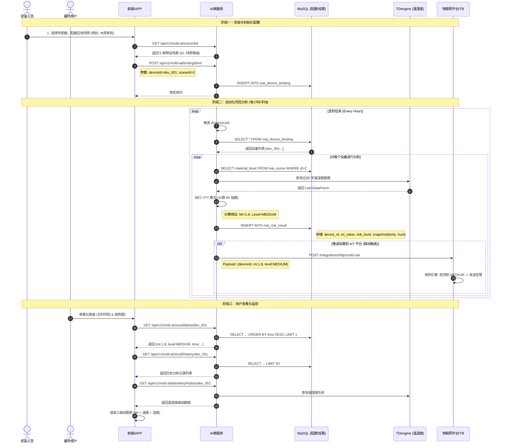

# 霉菌风险预测微服务 (Mold AI Service V2) 接口文档

**一、用户旅程：**

### 1. 用户旅程阶段一：安装与配置 (Installer)

> **文档描述**：安装人员安装传感器 -> 在平台创建设备 -> **选择合适的预设场景** (2.1 角色定义)。

*   **需求**：需要将物理设备 ID 与某种“算法模型”关联起来。
    
*   **当前实现**：
    
    *   **API**: 
        
        *   ✅ **穿透**：前端调用此接口，获取文档定义的 5 种标准场景（如“木质家具”、“高湿区”）。
            
    *   **API**: 
        
        *   ✅ **穿透**：前端提交 `deviceId` (如 009569...) 和 `sceneId` (如 2)。
            
    *   **DB**: 
        
        *   ✅ **落地**：存储了一条记录 `{ device_id: "...", scene_id: "2" }`。
            
    *   **结论**：完美支持。系统不需要知道设备在哪里，只需要知道它属于什么“材质场景”，这符合文档中“场景化”的设计原则。
        

### 2. 用户旅程阶段二：数据采集与分析 (System/AI)

> **文档描述**：基于温湿度数据 -> 结合场景参数 -> **VTT 算法计算** -> 得出 MI 指数与风险等级。

*   **需求**：自动化获取数据并执行核心算法。
    
*   **当前实现**：
    
    *   **Scheduler**: `AnalysisJob` (每小时触发)
        
    *   **DB**: `mai_device_binding` -> 找到设备绑定的 `scene_id` -> 查 `mai_scene` 表获取 `material_level` (材料等级)。
        
    *   **Data Source**: 
        
        *   ✅ **穿透**：通过 `TDengineTelemetryServiceImpl` 查询该设备过去 7 天的 `temperature` 和 `humidity`。
            
    *   **Algorithm**: 
        
        *   ✅ **穿透**：输入 (温湿度序列 + 材料等级 4.0) -> 输出 (MI=1.2, Level=MEDIUM)。
            
    *   **结论**：逻辑闭环完整。
        

### 3. 用户旅程阶段三：结果反馈与联动 (IoT Platform/End User)

> **文档描述**：风险分级响应 -> **高风险自动触发设备控制** (1.3 原则四)；用户查看实时状态与趋势 (2.1 最终用户)。

*   **需求 A：可视化展示**
    
    *   **当前实现**：
        
        *   **API**: `GET /api/v1/mold-ai/result/history`
            
        *   **API**: `GET /api/v1/mold-ai/telemetry/history`
            
        *   **DB**: 
            
            *   ✅ **落地**：表中存储了 `mi_value`, `risk_level` 以及 **快照时的** `**temperature**`**,** `**humidity**`。
                
            *   ✅ **穿透**：前端一个接口就能画出“三曲线同屏”（温度、湿度、霉菌指数），让用户直观看到“因为湿度持续高了 3 天，所以霉菌指数变成了高风险”。
                
    *   **结论**：完全满足仪表盘和趋势图需求。
        
*   **需求 B：设备联动 (控制排风扇)**
    
    *   **当前实现**：
        
        *   **Push Mechanism**: `application.yml` 配置 `push.target-url`。
            
        *   ✅ **穿透**：AI 服务计算出 `risk_level=HIGH` -> **立即推送 JSON** 给物联网平台 -> **AI 服务任务结束**。
            
        *   **文档对齐**：这精准对应了文档 **1.3.1 原则一：职责边界清晰** —— “AI 模块专注于风险计算... 物联网平台负责联动控制”。
            
    *   **结论**：通过“外包”控制权，AI 服务变得更纯粹、更稳定，符合微服务架构最佳实践。
        

### 4. 总结

现在的 `mold-ai-service-v2` 就像一个**专业的“体检医生”**：

1.  **挂号 (配置)**：你告诉医生你是谁（Device ID），是什么体质（Scene/材质）。
    
2.  **检查 (分析)**：医生调取你的体温记录（TDengine），结合专业知识（VTT 算法）进行诊断。
    
3.  **报告 (结果)**：医生出具一份详细的报告（MI 指数、风险等级），并存入档案（MySQL）。
    
4.  **转诊 (推送)**：如果发现病情严重（HIGH Risk），医生直接通过专线通知医院（IoT 平台）安排手术（控制排风扇），而不是医生自己冲过去做手术。
    

**二、时序图**

### 时序图解析

这张图清晰地展示了 `Mold AI Service V2` 在整个业务流程中的核心位置和交互逻辑：

1.  **配置阶段 (接口 2.1)**：
    
    *   **关键动作**：安装人员调用 `scene/list` 获取标准材质，然后通过 `binding/bind` 将设备 ID 与场景 ID 绑定。
        
    *   **意义**：完成了物理世界（设备）与数字模型（算法参数）的连接。
        
2.  **分析阶段 (定时任务)**：
    
    *   **关键动作**：`AnalysisJob` 自动运行，它像一个不需要休息的分析师。
        
    *   **数据流**：从 MySQL 获取配置 -> 从 TDengine 获取原料（数据） -> 在内存中加工（VTT 算法） -> 将成品（结果）存回 MySQL。
        
    *   **联动 (接口 2.3)**：通过 `POST` 请求将结果“推”给 IoT 平台。这是实现**解耦**的关键一步——AI 服务不需要知道后面发生了什么，它只负责广播风险。
        
3.  **展示阶段 (接口 2.2)**：
    
    *   **关键动作**：用户刷新页面。
        
    *   **数据流**：前端分别请求 `result/history`（看风险趋势）和 `telemetry/history`（看环境原因）。
        
    *   **前端融合**：前端将这两组数据在时间轴上对齐，画出那张直观的趋势图，帮助用户理解“为什么这个时间点风险变高了？哦，原来是湿度到了 80%”。
        

**三、数据库表结构与接口梳理文档**

## 1. 数据库设计 (MySQL + TDengine)

### 1.1 MySQL 数据库 (`mold_ai_db_v2`)

负责存储配置信息和分析结果，共 3 张核心表。

#### (1) `mai_scene` - 场景材质配置表

定义 VTT 算法所需的材料参数。

| 字段名 | 类型 | 说明 | 示例 |
| --- | --- | --- | --- |
| `id` | VARCHAR(36) | 主键 (UUID) | 1 |
| `scene_code` | VARCHAR(64) | 场景编码 (唯一) | wood\_furniture |
| `scene_name` | VARCHAR(100) | 场景名称 | 木质家具/储物区 |
| `material_level` | DECIMAL(4,2) | 材料敏感度 (1.0-6.0) | 4.00 (数值越低越敏感) |
| `threshold_low` | DECIMAL(6,4) | 低风险阈值 (MI) | 0.5000 |
| `threshold_high` | DECIMAL(6,4) | 高风险阈值 (MI) | 2.0000 |
| `enabled` | TINYINT(1) | 启用状态 | 1 |

#### (2) `mai_device_binding` - 设备绑定表

建立物理传感器与材料场景的关联。

| 字段名 | 类型 | 说明 | 示例 |
| --- | --- | --- | --- |
| `id` | VARCHAR(36) | 主键 (UUID) | ... |
| `device_id` | VARCHAR(64) | 传感器设备ID | 009569000004097a |
| `scene_id` | VARCHAR(36) | 关联场景ID | 1 |
| `create_time` | DATETIME | 绑定时间 | ... |

#### (3) `mai_risk_result` - 分析结果历史表

存储每次 VTT 计算的结果及当时的温湿度快照。

| 字段名 | 类型 | 说明 | 示例 |
| --- | --- | --- | --- |
| `id` | VARCHAR(36) | 主键 (UUID) | ... |
| `device_id` | VARCHAR(64) | 设备ID | 009569000004097a |
| `scene_id` | VARCHAR(36) | 当次分析用的场景ID | 1 |
| `mi_value` | DECIMAL(10,4) | **霉菌指数 (MI)** | 1.2500 |
| `risk_level` | VARCHAR(20) | **风险等级** | MEDIUM |
| `temperature` | DECIMAL(5,2) | 计算时温度 (°C) | 25.50 |
| `humidity` | DECIMAL(5,2) | 计算时湿度 (%RH) | 68.00 |
| `calculated_time` | DATETIME | 数据采样时间 | 2026-01-19 16:00:00 |
| `create_time` | DATETIME | 记录创建时间 | 2026-01-19 16:05:00 |

### 1.2 TDengine 时序数据库 (`animal_husbandry`)

存储海量的原始传感器数据（只读）。

*   **表名规则**：`dev_{deviceId}` (例如 `dev_009569000004097a`)
    
*   **关键字段**：
    
    *   `ts` (TIMESTAMP): 数据上报时间
        
    *   `raw_data` (JSON): 原始数据包，需包含 `temperature` 和 `humidity`。
        

---

## 2. API 接口清单

所有接口的基础路径为 `/api/v1/mold-ai`。

### 2.1 配置类接口

#### 绑定设备与场景

*   **URL**: `/binding/bind`
    
*   **Method**: `POST`
    
*   **Params**:
    
    *   `deviceId` (String): 传感器 ID
        
    *   `sceneId` (String): 场景 ID
        
*   **Response**: `{"code": 200, "message": "Device bound successfully", ...}`
    
*   **逻辑**: 如果设备已绑定，则更新其场景；如果未绑定，则新增记录。
    

#### 获取场景列表

*   **URL**: `/scene/list`
    
*   **Method**: `GET`
    
*   **Response**: `{"code": 200, "result": [ { "id": "1", "sceneName": "...", ... } ], ...}`
    

### 2.2 分析与查询接口

#### 手动触发分析

*   **URL**: `/analyze/{deviceId}`
    
*   **Method**: `POST`
    
*   **逻辑**:
    
    1.  查 TDengine 获取过去 7 天温湿度。
        
    2.  查 MySQL 获取设备绑定的场景参数。
        
    3.  执行 VTT 算法。
        
    4.  存入 `mai_risk_result` (有防重机制)。
        
    5.  (可选) 推送结果给外部平台。
        

#### 获取最新分析结果

*   **URL**: `/result/latest/{deviceId}`
    
*   **Method**: `GET`
    
*   **Response**: 返回该设备最后一次计算的 MI 值和风险等级。
    

#### 获取历史分析记录

*   **URL**: `/result/history/{deviceId}`
    
*   **Method**: `GET`
    
*   **Params**: `limit` (默认 20)
    
*   **Response**: 分析结果列表，按时间倒序。
    

#### 获取温湿度历史数据 (用于图表)

*   **URL**: `/telemetry/history/{deviceId}`
    
*   **Method**: `GET`
    
*   **Params**:
    
    *   `days` (默认 7): 查询天数
        
    *   `interval` (默认 "30m"): 聚合粒度 (30m, 1h, 15m)
        
*   **Response**: `[ { "timestamp": 170..., "temperature": 25.5, "humidity": 60.0 }, ... ]`
    

### 2.3 外部推送接口 (Webhook)

*   **触发时机**: 每次分析完成后（无论是定时还是手动）。
    
*   **目标 URL**: 可在 `application.yml` 中配置。
    
*   **Payload**:
    

---

## 3. 定时任务 (Scheduler)

*   **逻辑**: `AnalysisJob` 类。
    
*   **频率**: 默认每小时执行一次 (`0 0 * * * ?`)。
    
*   **流程**:
    
    1.  扫描 `mai_device_binding` 表中所有已配置的设备。
        
    2.  逐个调用 `analyze(deviceId)`。
        
    3.  自动跳过同一时间点已计算过重复的计算结果。